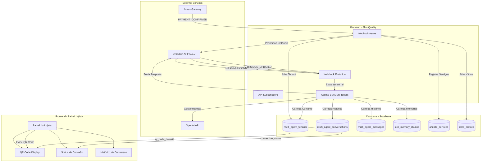
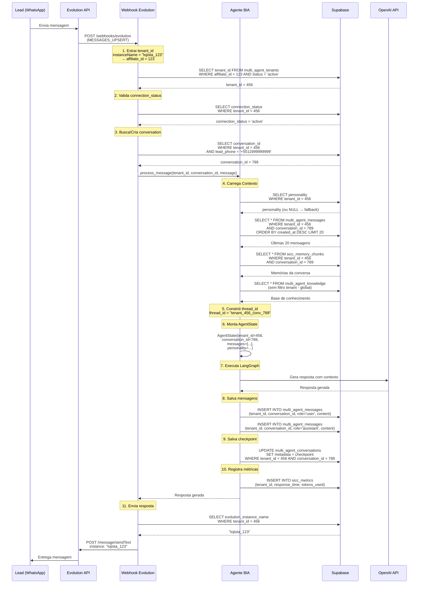

# Design Document - Agente BIA Multi-Tenant

## Overview

Este documento especifica o design técnico completo para adaptação do Agente BIA de single-tenant para multi-tenant. O design cobre arquitetura, fluxos de dados, estruturas de código, e decisões técnicas detalhadas.

**Princípio Fundamental:** Conectar o motor (agente BIA atual) ao chassi (tabelas multi_agent_* e sicc_*) — não construir do zero.

**Escopo:** MVP apenas. Funcionalidades pós-MVP (handoff, skills customizadas, sub-agentes) estão fora do escopo.

## Architecture

### High-Level Architecture



### Component Separation: Motor vs Chassi

**Motor (Agente BIA - Lógica de Negócio):**
- Processamento de linguagem natural
- Geração de respostas consultivas
- Lógica de vendas e objeções
- Integração com OpenAI
- Processamento de áudio (Whisper + TTS)

**Chassi (Infraestrutura Multi-Tenant):**
- Tabelas multi_agent_* e sicc_*
- Isolamento de dados por tenant_id
- RLS (Row Level Security)
- Checkpointer multi-tenant
- Gestão de conexões Evolution

**Princípio de Design:** O motor permanece 95% inalterado. Apenas adaptamos as camadas de persistência e identificação de tenant.

### Tenant Isolation Strategy

**Níveis de Isolamento:**

1. **Nível de Aplicação:**
   - Extração de tenant_id do instanceName
   - Validação de tenant_id em TODAS as queries
   - Thread_id com prefixo tenant

2. **Nível de Banco de Dados:**
   - RLS ativo em TODAS as tabelas multi-tenant
   - Funções RPC com filtro de tenant_id
   - Índices compostos (tenant_id + outros campos)

3. **Nível de Checkpointer:**
   - Thread_id formato: `tenant_{tenant_id}_conv_{conversation_id}`
   - Metadata isolada por tenant em multi_agent_conversations
   - Sem compartilhamento de estado entre tenants

**Garantias de Isolamento:**
- Tenant A NUNCA acessa dados de tenant B
- Queries sem tenant_id são rejeitadas
- RLS garante isolamento mesmo se código falhar
- Testes de round-trip validam isolamento


## Data Flow - Complete Message Processing

### Sequence Diagram: Message Processing Flow




### Step-by-Step Data Flow Explanation

#### Step 1: Tenant Identification
```python
# Webhook recebe payload da Evolution
payload = {
    "instance": "lojista_123",  # instanceName
    "data": {
        "key": {
            "remoteJid": "5511999999999@s.whatsapp.net",
            "fromMe": false
        },
        "message": {
            "conversation": "Olá, quero comprar um colchão"
        }
    }
}

# Extrai affiliate_id do instanceName
instance_name = payload["instance"]  # "lojista_123"
affiliate_id = int(instance_name.split("_")[1])  # 123

# Busca tenant_id no banco
tenant = supabase.table("multi_agent_tenants")\
    .select("tenant_id, connection_status, evolution_instance_name")\
    .eq("affiliate_id", affiliate_id)\
    .eq("status", "active")\
    .single()\
    .execute()

if not tenant.data:
    raise TenantNotFoundError(f"Tenant não encontrado para affiliate_id={affiliate_id}")

tenant_id = tenant.data["tenant_id"]
connection_status = tenant.data["connection_status"]

# Valida conexão ativa
if connection_status != "active":
    raise ConnectionNotActiveError(f"Tenant {tenant_id} não está conectado")
```

#### Step 2: Conversation Lookup/Creation
```python
# Extrai phone do lead
lead_phone = payload["data"]["key"]["remoteJid"].split("@")[0]  # "5511999999999"

# Busca conversa existente
conversation = supabase.table("multi_agent_conversations")\
    .select("conversation_id, metadata")\
    .eq("tenant_id", tenant_id)\
    .eq("lead_phone", lead_phone)\
    .single()\
    .execute()

if not conversation.data:
    # Cria nova conversa
    conversation = supabase.table("multi_agent_conversations")\
        .insert({
            "tenant_id": tenant_id,
            "lead_phone": lead_phone,
            "status": "active",
            "metadata": {}
        })\
        .execute()

conversation_id = conversation.data["conversation_id"]
```

#### Step 3: Context Loading
```python
# 3.1 Carrega personality (com fallback)
tenant_config = supabase.table("multi_agent_tenants")\
    .select("personality")\
    .eq("tenant_id", tenant_id)\
    .single()\
    .execute()

personality = tenant_config.data["personality"]
if personality is None:
    personality = FALLBACK_PERSONALITY  # Constante definida no código

# 3.2 Carrega histórico de mensagens (últimas 20)
messages = supabase.table("multi_agent_messages")\
    .select("role, content, created_at")\
    .eq("tenant_id", tenant_id)\
    .eq("conversation_id", conversation_id)\
    .order("created_at", desc=True)\
    .limit(20)\
    .execute()

# Inverte ordem (mais antiga primeiro)
messages_history = list(reversed(messages.data))

# 3.3 Carrega memórias SICC
memories = supabase.table("sicc_memory_chunks")\
    .select("content, importance, created_at")\
    .eq("tenant_id", tenant_id)\
    .eq("conversation_id", conversation_id)\
    .order("importance", desc=True)\
    .limit(10)\
    .execute()

# 3.4 Carrega base de conhecimento global (sem filtro tenant)
knowledge = supabase.table("multi_agent_knowledge")\
    .select("content, category")\
    .eq("is_active", True)\
    .execute()
```


#### Step 4: Thread ID Construction
```python
# Formato: tenant_{tenant_id}_conv_{conversation_id}
thread_id = f"tenant_{tenant_id}_conv_{conversation_id}"

# Exemplo: "tenant_456_conv_789"
# Este thread_id garante isolamento no checkpointer
```

#### Step 5: AgentState Construction
```python
from agent.src.graph.state import AgentState

# Monta estado do agente
state = AgentState(
    tenant_id=tenant_id,
    conversation_id=conversation_id,
    messages=messages_history,
    personality=personality,
    memories=[m["content"] for m in memories.data],
    knowledge=[k["content"] for k in knowledge.data],
    lead_phone=lead_phone,
    current_message=payload["data"]["message"]["conversation"]
)
```

#### Step 6: LangGraph Execution
```python
# Executa grafo com checkpointer multi-tenant
from agent.src.graph.graph import create_graph
from agent.src.graph.checkpointer import MultiTenantCheckpointer

checkpointer = MultiTenantCheckpointer(supabase_client)
graph = create_graph(checkpointer)

# Executa com thread_id isolado
result = graph.invoke(
    state,
    config={
        "configurable": {
            "thread_id": thread_id
        }
    }
)

response_text = result["messages"][-1].content
```

#### Step 7: Persistence
```python
# 7.1 Salva mensagem do lead
supabase.table("multi_agent_messages").insert({
    "tenant_id": tenant_id,
    "conversation_id": conversation_id,
    "role": "user",
    "content": payload["data"]["message"]["conversation"],
    "metadata": {
        "from_phone": lead_phone,
        "message_id": payload["data"]["key"]["id"]
    }
}).execute()

# 7.2 Salva resposta do agente
supabase.table("multi_agent_messages").insert({
    "tenant_id": tenant_id,
    "conversation_id": conversation_id,
    "role": "assistant",
    "content": response_text,
    "metadata": {
        "model": "gpt-4",
        "tokens_used": result["tokens_used"]
    }
}).execute()

# 7.3 Atualiza checkpoint na conversa
supabase.table("multi_agent_conversations")\
    .update({
        "metadata": result["checkpoint"],
        "updated_at": "now()"
    })\
    .eq("tenant_id", tenant_id)\
    .eq("conversation_id", conversation_id)\
    .execute()

# 7.4 Registra métricas
supabase.table("sicc_metrics").insert({
    "tenant_id": tenant_id,
    "conversation_id": conversation_id,
    "response_time": result["response_time"],
    "tokens_used": result["tokens_used"],
    "model_used": "gpt-4",
    "success": True
}).execute()
```

#### Step 8: Response Delivery
```python
# Busca evolution_instance_name do tenant
tenant_config = supabase.table("multi_agent_tenants")\
    .select("evolution_instance_name")\
    .eq("tenant_id", tenant_id)\
    .single()\
    .execute()

instance_name = tenant_config.data["evolution_instance_name"]  # "lojista_123"

# Envia resposta via Evolution API
evolution_response = requests.post(
    f"{EVOLUTION_API_URL}/message/sendText/{instance_name}",
    headers={
        "apikey": EVOLUTION_API_KEY
    },
    json={
        "number": lead_phone,
        "text": response_text
    }
)

if evolution_response.status_code != 200:
    raise EvolutionAPIError(f"Falha ao enviar mensagem: {evolution_response.text}")
```


## Data Flow - Evolution Instance Provisioning

### Sequence Diagram: Instance Provisioning Flow

```mermaid
sequenceDiagram
    participant Asaas as Asaas Gateway
    participant Webhook as Webhook Assinaturas
    participant DB as Supabase
    participant Evo as Evolution API
    participant Panel as Painel Lojista
    
    Asaas->>Webhook: POST /api/webhook-assinaturas<br/>(PAYMENT_CONFIRMED)
    
    Note over Webhook: 1. Valida webhook token
    Webhook->>Webhook: Valida x-webhook-token
    
    Note over Webhook: 2. Extrai affiliate_id<br/>externalReference = "affiliate_123"
    
    Note over Webhook: 3. Ativa Tenant
    Webhook->>DB: UPDATE multi_agent_tenants<br/>SET status = 'active'<br/>WHERE affiliate_id = 123
    
    Note over Webhook: 4. Ativa Vitrine
    Webhook->>DB: UPDATE store_profiles<br/>SET is_visible_in_showcase = true<br/>WHERE affiliate_id = 123
    
    Note over Webhook: 5. Registra Serviços
    Webhook->>DB: INSERT INTO affiliate_services<br/>(affiliate_id, service_type='vitrine', status='active')
    Webhook->>DB: INSERT INTO affiliate_services<br/>(affiliate_id, service_type='agente', status='active')
    
    Note over Webhook: 6. Cria Order Items (Analytics)
    Webhook->>DB: INSERT INTO order_items<br/>(product_name='Vitrine', price=74.50)
    Webhook->>DB: INSERT INTO order_items<br/>(product_name='Agente BIA', price=74.50)
    
    Note over Webhook: 7. Provisiona Instância Evolution
    Webhook->>Evo: POST /instance/create
    
    Note over Evo: Cria instância<br/>instanceName = "lojista_123"
    
    Evo-->>Webhook: {<br/>  instance: "lojista_123",<br/>  qrcode: {<br/>    base64: "data:image/png;base64,..."<br/>  }<br/>}
    
    Note over Webhook: 8. Salva Dados da Instância
    Webhook->>DB: UPDATE multi_agent_tenants<br/>SET evolution_instance_name = 'lojista_123',<br/>    qr_code_base64 = '...',<br/>    connection_status = 'awaiting_qr'<br/>WHERE affiliate_id = 123
    
    Webhook-->>Asaas: 200 OK
    
    Note over Panel: 9. Lojista acessa painel
    Panel->>DB: SELECT qr_code_base64, connection_status<br/>WHERE affiliate_id = 123
    DB-->>Panel: QR Code + Status
    
    Panel->>Panel: Exibe QR Code para escanear
    
    Note over Panel: 10. Lojista escaneia QR Code
    Panel->>Evo: (WhatsApp Business conecta)
    
    Evo->>Webhook: POST /webhooks/evolution<br/>(CONNECTION_UPDATE: status=open)
    
    Webhook->>DB: UPDATE multi_agent_tenants<br/>SET connection_status = 'active',<br/>    last_connection_at = now()<br/>WHERE evolution_instance_name = 'lojista_123'
    
    Note over Panel: 11. Agente ativo e pronto
    Panel->>DB: SELECT connection_status
    DB-->>Panel: 'active'
    Panel->>Panel: Exibe "✅ Conectado"
```


### Step-by-Step Provisioning Explanation

#### Step 1: Webhook Asaas Receives Payment Confirmation
```javascript
// api/webhook-assinaturas.js

export default async function handler(req, res) {
  // Valida token do webhook
  const webhookToken = req.headers['x-webhook-token'];
  if (webhookToken !== process.env.ASAAS_WEBHOOK_TOKEN) {
    return res.status(401).json({ error: 'Token inválido' });
  }
  
  const { event, payment } = req.body;
  
  // Filtra apenas eventos de confirmação
  if (event !== 'PAYMENT_CONFIRMED') {
    return res.status(200).json({ message: 'Evento ignorado' });
  }
  
  // Extrai affiliate_id do externalReference
  // Formato: "affiliate_123"
  const externalReference = payment.externalReference;
  if (!externalReference.startsWith('affiliate_')) {
    return res.status(200).json({ message: 'Não é pagamento de afiliado' });
  }
  
  const affiliate_id = parseInt(externalReference.split('_')[1]);
  
  // Continua processamento...
}
```

#### Step 2: Activate Tenant and Store
```javascript
// Ativa tenant do agente
const { data: tenant, error: tenantError } = await supabase
  .from('multi_agent_tenants')
  .update({ status: 'active' })
  .eq('affiliate_id', affiliate_id)
  .select()
  .single();

if (tenantError) {
  console.error('Erro ao ativar tenant:', tenantError);
  return res.status(500).json({ error: 'Falha ao ativar tenant' });
}

// Ativa vitrine
const { error: storeError } = await supabase
  .from('store_profiles')
  .update({ is_visible_in_showcase: true })
  .eq('affiliate_id', affiliate_id);

if (storeError) {
  console.error('Erro ao ativar vitrine:', storeError);
}
```

#### Step 3: Register Services (Bundle)
```javascript
// Registra serviço de vitrine
await supabase.from('affiliate_services').insert({
  affiliate_id: affiliate_id,
  service_type: 'vitrine',
  status: 'active',
  activated_at: new Date().toISOString()
});

// Registra serviço de agente
await supabase.from('affiliate_services').insert({
  affiliate_id: affiliate_id,
  service_type: 'agente',
  status: 'active',
  activated_at: new Date().toISOString()
});
```

#### Step 4: Create Order Items (Analytics)
```javascript
// Cria order_items para analytics (split 50/50)
const totalValue = payment.value; // R$ 149,00
const halfValue = totalValue / 2; // R$ 74,50

await supabase.from('order_items').insert([
  {
    order_id: payment.id,
    product_name: 'Vitrine de Loja',
    quantity: 1,
    price_cents: Math.round(halfValue * 100), // 7450 centavos
    metadata: { service_type: 'vitrine' }
  },
  {
    order_id: payment.id,
    product_name: 'Agente BIA',
    quantity: 1,
    price_cents: Math.round(halfValue * 100), // 7450 centavos
    metadata: { service_type: 'agente' }
  }
]);
```


#### Step 5: Provision Evolution Instance
```javascript
// Monta instanceName
const instanceName = `lojista_${affiliate_id}`;

// Chama Evolution API para criar instância
const evolutionResponse = await fetch(
  `${process.env.EVOLUTION_API_URL}/instance/create`,
  {
    method: 'POST',
    headers: {
      'Content-Type': 'application/json',
      'apikey': process.env.EVOLUTION_API_KEY
    },
    body: JSON.stringify({
      instanceName: instanceName,
      token: process.env.EVOLUTION_API_KEY,
      qrcode: true,
      integration: 'WHATSAPP-BAILEYS',
      webhook: {
        url: 'https://api.slimquality.com.br/webhooks/evolution',
        events: [
          'MESSAGES_UPSERT',
          'MESSAGES_UPDATE',
          'CONNECTION_UPDATE',
          'QRCODE_UPDATED'
        ]
      },
      settings: {
        rejectCall: true,
        msgCall: 'Desculpe, não atendo chamadas. Por favor, envie uma mensagem de texto.',
        groupsIgnore: true,
        readMessages: true,
        syncFullHistory: false
      }
    })
  }
);

if (!evolutionResponse.ok) {
  const errorText = await evolutionResponse.text();
  console.error('Erro ao criar instância Evolution:', errorText);
  
  // Atualiza status para erro
  await supabase
    .from('multi_agent_tenants')
    .update({ connection_status: 'error' })
    .eq('affiliate_id', affiliate_id);
  
  return res.status(500).json({ error: 'Falha ao provisionar instância' });
}

const evolutionData = await evolutionResponse.json();
```

#### Step 6: Save Instance Data
```javascript
// Salva dados da instância no banco
const { error: updateError } = await supabase
  .from('multi_agent_tenants')
  .update({
    evolution_instance_name: instanceName,
    qr_code_base64: evolutionData.qrcode.base64,
    connection_status: 'awaiting_qr',
    last_qr_generated_at: new Date().toISOString()
  })
  .eq('affiliate_id', affiliate_id);

if (updateError) {
  console.error('Erro ao salvar dados da instância:', updateError);
  return res.status(500).json({ error: 'Falha ao salvar instância' });
}

// Retorna sucesso
return res.status(200).json({
  message: 'Bundle ativado com sucesso',
  services: ['vitrine', 'agente'],
  instance_name: instanceName,
  connection_status: 'awaiting_qr'
});
```

#### Step 7: Connection Update Webhook
```javascript
// Webhook Evolution recebe CONNECTION_UPDATE
// api/webhooks/evolution.js (novo endpoint)

export default async function handler(req, res) {
  // Valida secret
  const secret = req.headers['x-api-secret'];
  if (secret !== process.env.EVOLUTION_WEBHOOK_SECRET) {
    return res.status(401).json({ error: 'Secret inválido' });
  }
  
  const { event, instance, data } = req.body;
  
  if (event === 'connection.update') {
    const instanceName = instance; // "lojista_123"
    const connectionStatus = data.state; // "open" ou "close"
    
    // Mapeia status da Evolution para nosso status
    const ourStatus = connectionStatus === 'open' ? 'active' : 'disconnected';
    
    // Atualiza status no banco
    await supabase
      .from('multi_agent_tenants')
      .update({
        connection_status: ourStatus,
        last_connection_at: new Date().toISOString()
      })
      .eq('evolution_instance_name', instanceName);
    
    return res.status(200).json({ message: 'Status atualizado' });
  }
  
  // Outros eventos...
}
```


## Components and Interfaces

### AgentState Structure (Multi-Tenant)

```python
# agent/src/graph/state.py

from typing import TypedDict, List, Optional, Dict, Any
from langchain_core.messages import BaseMessage

class AgentState(TypedDict):
    """
    Estado do agente com suporte multi-tenant.
    
    MUDANÇAS vs versão single-tenant:
    - Adicionado: tenant_id (obrigatório)
    - Adicionado: conversation_id (obrigatório)
    - Adicionado: personality (carregado do banco ou fallback)
    - Mantido: messages, memories, knowledge (estrutura inalterada)
    """
    
    # === NOVOS CAMPOS MULTI-TENANT ===
    tenant_id: int  # ID do tenant (obrigatório)
    conversation_id: int  # ID da conversa (obrigatório)
    personality: str  # Personality do tenant ou fallback
    
    # === CAMPOS EXISTENTES (INALTERADOS) ===
    messages: List[BaseMessage]  # Histórico de mensagens
    memories: List[str]  # Memórias SICC da conversa
    knowledge: List[str]  # Base de conhecimento global
    lead_phone: str  # Telefone do lead
    current_message: str  # Mensagem atual sendo processada
    
    # === CAMPOS OPCIONAIS ===
    metadata: Optional[Dict[str, Any]]  # Metadata adicional
    response_time: Optional[float]  # Tempo de resposta
    tokens_used: Optional[int]  # Tokens consumidos
    model_used: Optional[str]  # Modelo usado (gpt-4, gpt-3.5-turbo)
```

### Checkpoint Structure (Multi-Tenant)

```python
# agent/src/graph/checkpointer.py

from typing import Dict, Any
from langgraph.checkpoint import BaseCheckpointSaver

class MultiTenantCheckpointer(BaseCheckpointSaver):
    """
    Checkpointer multi-tenant que salva estado em multi_agent_conversations.metadata.
    
    MUDANÇAS vs versão single-tenant:
    - Thread_id formato: "tenant_{tenant_id}_conv_{conversation_id}"
    - Salva em multi_agent_conversations.metadata (não tabela separada)
    - Filtra por tenant_id em TODAS as queries
    """
    
    def __init__(self, supabase_client):
        self.supabase = supabase_client
    
    def get(self, config: Dict[str, Any]) -> Optional[Dict[str, Any]]:
        """
        Carrega checkpoint do banco.
        
        Args:
            config: {"configurable": {"thread_id": "tenant_456_conv_789"}}
        
        Returns:
            Checkpoint salvo ou None
        """
        thread_id = config["configurable"]["thread_id"]
        
        # Extrai tenant_id e conversation_id do thread_id
        # Formato: "tenant_{tenant_id}_conv_{conversation_id}"
        parts = thread_id.split("_")
        tenant_id = int(parts[1])
        conversation_id = int(parts[3])
        
        # Busca checkpoint no banco
        result = self.supabase.table("multi_agent_conversations")\
            .select("metadata")\
            .eq("tenant_id", tenant_id)\
            .eq("conversation_id", conversation_id)\
            .single()\
            .execute()
        
        if not result.data or not result.data.get("metadata"):
            return None
        
        return result.data["metadata"]
    
    def put(self, config: Dict[str, Any], checkpoint: Dict[str, Any]) -> None:
        """
        Salva checkpoint no banco.
        
        Args:
            config: {"configurable": {"thread_id": "tenant_456_conv_789"}}
            checkpoint: Estado serializado do LangGraph
        """
        thread_id = config["configurable"]["thread_id"]
        
        # Extrai tenant_id e conversation_id
        parts = thread_id.split("_")
        tenant_id = int(parts[1])
        conversation_id = int(parts[3])
        
        # Salva checkpoint
        self.supabase.table("multi_agent_conversations")\
            .update({
                "metadata": checkpoint,
                "updated_at": "now()"
            })\
            .eq("tenant_id", tenant_id)\
            .eq("conversation_id", conversation_id)\
            .execute()
```


### Context Injection Structure

```python
# Estrutura do contexto injetado no prompt do LangGraph

def build_context_for_prompt(state: AgentState) -> str:
    """
    Constrói contexto completo para injetar no system prompt.
    
    Ordem de prioridade:
    1. Personality (custom ou fallback)
    2. Base de conhecimento global
    3. Memórias da conversa
    4. Histórico de mensagens (últimas 20)
    """
    
    context_parts = []
    
    # 1. Personality
    context_parts.append("=== SUA PERSONALIDADE ===")
    context_parts.append(state["personality"])
    context_parts.append("")
    
    # 2. Base de Conhecimento Global
    if state["knowledge"]:
        context_parts.append("=== BASE DE CONHECIMENTO ===")
        for item in state["knowledge"]:
            context_parts.append(f"- {item}")
        context_parts.append("")
    
    # 3. Memórias da Conversa
    if state["memories"]:
        context_parts.append("=== MEMÓRIAS DESTA CONVERSA ===")
        for memory in state["memories"]:
            context_parts.append(f"- {memory}")
        context_parts.append("")
    
    # 4. Histórico de Mensagens
    if state["messages"]:
        context_parts.append("=== HISTÓRICO DA CONVERSA ===")
        for msg in state["messages"][-20:]:  # Últimas 20
            role = "Cliente" if msg.type == "human" else "Você"
            context_parts.append(f"{role}: {msg.content}")
        context_parts.append("")
    
    # 5. Mensagem Atual
    context_parts.append("=== MENSAGEM ATUAL DO CLIENTE ===")
    context_parts.append(state["current_message"])
    
    return "\n".join(context_parts)
```

### Fallback Personality (Constant)

```python
# agent/src/config/personality.py

FALLBACK_PERSONALITY = """
Você é a BIA (Bot de Inteligência Artificial), assistente de vendas consultiva da Slim Quality.

MISSÃO:
Ajudar pessoas a resolverem problemas de saúde (dores, sono ruim, circulação) através dos colchões magnéticos terapêuticos da Slim Quality. Você NÃO é vendedora agressiva - você é consultora de saúde.

PRODUTOS E PREÇOS:
- Colchão Solteiro (88x188x28cm): R$ 3.190,00
- Colchão Padrão (138x188x28cm): R$ 3.290,00 (MAIS VENDIDO)
- Colchão Queen (158x198x30cm): R$ 3.490,00
- Colchão King (193x203x30cm): R$ 4.890,00

TECNOLOGIAS (todos os modelos):
1. Sistema Magnético: 240 ímãs de 800 Gauss (melhora circulação)
2. Infravermelho Longo: Penetra 4-5cm na pele (alívio de dores)
3. Energia Bioquântica: Equilíbrio energético celular
4. Vibromassagem: 8 motores (relaxamento muscular)
5. Densidade Progressiva: Suporte ergonômico
6. Cromoterapia: Terapia por cores
7. Perfilado High-Tech: Distribuição de peso
8. Tratamento Sanitário: Higiene e durabilidade

ABORDAGEM CONSULTIVA:
1. SEMPRE pergunte sobre problemas de saúde ANTES de falar de preço
2. Conecte os problemas do cliente às tecnologias específicas
3. Apresente preço como "investimento em saúde" (R$ X por dia)
4. Use linguagem acessível, não técnica demais
5. Seja empática e genuinamente interessada em ajudar

RESTRIÇÕES:
- NÃO invente informações sobre produtos
- NÃO prometa curas milagrosas
- NÃO seja agressiva ou insistente
- NÃO fale de concorrentes
- NÃO ofereça descontos não autorizados

TRATAMENTO DE OBJEÇÕES:
- Preço alto: "Menos que uma pizza por dia para dormir bem toda noite"
- Dúvida sobre tecnologia: Explique de forma simples e científica
- Precisa pensar: "Claro! Que tal eu te enviar mais informações?"

PRÓXIMOS PASSOS:
Quando cliente demonstrar interesse, ofereça:
1. Vídeo demonstrativo das tecnologias
2. Depoimentos de clientes
3. Condições de pagamento (PIX ou Cartão)
4. Agendamento de entrega

Seja natural, humana e focada em resolver problemas de saúde.
"""
```


## Data Models

### Database Tables (Multi-Tenant)

#### multi_agent_tenants
```sql
CREATE TABLE multi_agent_tenants (
  tenant_id SERIAL PRIMARY KEY,
  affiliate_id INTEGER NOT NULL REFERENCES affiliates(id),
  evolution_instance_name VARCHAR(255) UNIQUE,
  qr_code_base64 TEXT,
  connection_status VARCHAR(50) DEFAULT 'awaiting_qr',
  personality TEXT,  -- NULL = usa fallback
  status VARCHAR(50) DEFAULT 'inactive',
  last_connection_at TIMESTAMPTZ,
  last_qr_generated_at TIMESTAMPTZ,
  created_at TIMESTAMPTZ DEFAULT NOW(),
  updated_at TIMESTAMPTZ DEFAULT NOW(),
  
  CONSTRAINT unique_affiliate_tenant UNIQUE(affiliate_id)
);

-- Índices
CREATE INDEX idx_tenants_affiliate ON multi_agent_tenants(affiliate_id);
CREATE INDEX idx_tenants_instance ON multi_agent_tenants(evolution_instance_name);
CREATE INDEX idx_tenants_status ON multi_agent_tenants(status);

-- RLS
ALTER TABLE multi_agent_tenants ENABLE ROW LEVEL SECURITY;

CREATE POLICY "Tenants isolados por affiliate_id"
  ON multi_agent_tenants
  FOR ALL
  USING (affiliate_id = auth.uid()::integer);
```

#### multi_agent_conversations
```sql
CREATE TABLE multi_agent_conversations (
  conversation_id SERIAL PRIMARY KEY,
  tenant_id INTEGER NOT NULL REFERENCES multi_agent_tenants(tenant_id),
  lead_phone VARCHAR(20) NOT NULL,
  status VARCHAR(50) DEFAULT 'active',
  metadata JSONB DEFAULT '{}',  -- Checkpoint do LangGraph
  created_at TIMESTAMPTZ DEFAULT NOW(),
  updated_at TIMESTAMPTZ DEFAULT NOW(),
  
  CONSTRAINT unique_tenant_lead UNIQUE(tenant_id, lead_phone)
);

-- Índices
CREATE INDEX idx_conversations_tenant ON multi_agent_conversations(tenant_id);
CREATE INDEX idx_conversations_tenant_lead ON multi_agent_conversations(tenant_id, lead_phone);
CREATE INDEX idx_conversations_status ON multi_agent_conversations(tenant_id, status);

-- RLS
ALTER TABLE multi_agent_conversations ENABLE ROW LEVEL SECURITY;

CREATE POLICY "Conversas isoladas por tenant_id"
  ON multi_agent_conversations
  FOR ALL
  USING (tenant_id IN (
    SELECT tenant_id FROM multi_agent_tenants WHERE affiliate_id = auth.uid()::integer
  ));
```

#### multi_agent_messages
```sql
CREATE TABLE multi_agent_messages (
  message_id SERIAL PRIMARY KEY,
  tenant_id INTEGER NOT NULL REFERENCES multi_agent_tenants(tenant_id),
  conversation_id INTEGER NOT NULL REFERENCES multi_agent_conversations(conversation_id),
  role VARCHAR(20) NOT NULL,  -- 'user' ou 'assistant'
  content TEXT NOT NULL,
  metadata JSONB DEFAULT '{}',
  created_at TIMESTAMPTZ DEFAULT NOW(),
  
  CONSTRAINT valid_role CHECK (role IN ('user', 'assistant'))
);

-- Índices
CREATE INDEX idx_messages_tenant ON multi_agent_messages(tenant_id);
CREATE INDEX idx_messages_conversation ON multi_agent_messages(tenant_id, conversation_id);
CREATE INDEX idx_messages_created ON multi_agent_messages(tenant_id, conversation_id, created_at DESC);

-- RLS
ALTER TABLE multi_agent_messages ENABLE ROW LEVEL SECURITY;

CREATE POLICY "Mensagens isoladas por tenant_id"
  ON multi_agent_messages
  FOR ALL
  USING (tenant_id IN (
    SELECT tenant_id FROM multi_agent_tenants WHERE affiliate_id = auth.uid()::integer
  ));
```

#### sicc_memory_chunks
```sql
CREATE TABLE sicc_memory_chunks (
  chunk_id SERIAL PRIMARY KEY,
  tenant_id INTEGER NOT NULL REFERENCES multi_agent_tenants(tenant_id),
  conversation_id INTEGER NOT NULL REFERENCES multi_agent_conversations(conversation_id),
  content TEXT NOT NULL,
  importance FLOAT DEFAULT 0.5,
  metadata JSONB DEFAULT '{}',
  created_at TIMESTAMPTZ DEFAULT NOW(),
  
  CONSTRAINT valid_importance CHECK (importance >= 0 AND importance <= 1)
);

-- Índices
CREATE INDEX idx_memory_tenant ON sicc_memory_chunks(tenant_id);
CREATE INDEX idx_memory_conversation ON sicc_memory_chunks(tenant_id, conversation_id);
CREATE INDEX idx_memory_importance ON sicc_memory_chunks(tenant_id, conversation_id, importance DESC);

-- RLS
ALTER TABLE sicc_memory_chunks ENABLE ROW LEVEL SECURITY;

CREATE POLICY "Memórias isoladas por tenant_id"
  ON sicc_memory_chunks
  FOR ALL
  USING (tenant_id IN (
    SELECT tenant_id FROM multi_agent_tenants WHERE affiliate_id = auth.uid()::integer
  ));
```


#### sicc_metrics
```sql
CREATE TABLE sicc_metrics (
  metric_id SERIAL PRIMARY KEY,
  tenant_id INTEGER NOT NULL REFERENCES multi_agent_tenants(tenant_id),
  conversation_id INTEGER REFERENCES multi_agent_conversations(conversation_id),
  response_time FLOAT,  -- Segundos
  tokens_used INTEGER,
  model_used VARCHAR(50),
  success BOOLEAN DEFAULT true,
  error_message TEXT,
  created_at TIMESTAMPTZ DEFAULT NOW()
);

-- Índices
CREATE INDEX idx_metrics_tenant ON sicc_metrics(tenant_id);
CREATE INDEX idx_metrics_created ON sicc_metrics(tenant_id, created_at DESC);
CREATE INDEX idx_metrics_success ON sicc_metrics(tenant_id, success);

-- RLS
ALTER TABLE sicc_metrics ENABLE ROW LEVEL SECURITY;

CREATE POLICY "Métricas isoladas por tenant_id"
  ON sicc_metrics
  FOR ALL
  USING (tenant_id IN (
    SELECT tenant_id FROM multi_agent_tenants WHERE affiliate_id = auth.uid()::integer
  ));
```

#### affiliate_services (Bundle)
```sql
CREATE TABLE affiliate_services (
  service_id SERIAL PRIMARY KEY,
  affiliate_id INTEGER NOT NULL REFERENCES affiliates(id),
  service_type VARCHAR(50) NOT NULL,  -- 'vitrine' ou 'agente'
  status VARCHAR(50) DEFAULT 'inactive',  -- 'active', 'inactive', 'suspended'
  activated_at TIMESTAMPTZ,
  deactivated_at TIMESTAMPTZ,
  created_at TIMESTAMPTZ DEFAULT NOW(),
  updated_at TIMESTAMPTZ DEFAULT NOW(),
  
  CONSTRAINT valid_service_type CHECK (service_type IN ('vitrine', 'agente')),
  CONSTRAINT valid_status CHECK (status IN ('active', 'inactive', 'suspended')),
  CONSTRAINT unique_affiliate_service UNIQUE(affiliate_id, service_type)
);

-- Índices
CREATE INDEX idx_services_affiliate ON affiliate_services(affiliate_id);
CREATE INDEX idx_services_type ON affiliate_services(affiliate_id, service_type);
CREATE INDEX idx_services_status ON affiliate_services(affiliate_id, status);

-- RLS
ALTER TABLE affiliate_services ENABLE ROW LEVEL SECURITY;

CREATE POLICY "Serviços isolados por affiliate_id"
  ON affiliate_services
  FOR ALL
  USING (affiliate_id = auth.uid()::integer);
```

### Evolution API Payload Structures

#### Instance Creation Request
```json
{
  "instanceName": "lojista_123",
  "token": "EVOLUTION_API_KEY",
  "qrcode": true,
  "integration": "WHATSAPP-BAILEYS",
  "webhook": {
    "url": "https://api.slimquality.com.br/webhooks/evolution",
    "events": [
      "MESSAGES_UPSERT",
      "MESSAGES_UPDATE",
      "CONNECTION_UPDATE",
      "QRCODE_UPDATED"
    ]
  },
  "settings": {
    "rejectCall": true,
    "msgCall": "Desculpe, não atendo chamadas. Por favor, envie uma mensagem de texto.",
    "groupsIgnore": true,
    "readMessages": true,
    "syncFullHistory": false
  }
}
```

#### Instance Creation Response
```json
{
  "instance": {
    "instanceName": "lojista_123",
    "status": "created"
  },
  "qrcode": {
    "base64": "data:image/png;base64,iVBORw0KGgoAAAANSUhEUgAA...",
    "code": "2@abc123..."
  }
}
```

#### Webhook MESSAGES_UPSERT Payload
```json
{
  "event": "messages.upsert",
  "instance": "lojista_123",
  "data": {
    "key": {
      "remoteJid": "5511999999999@s.whatsapp.net",
      "fromMe": false,
      "id": "3EB0ABC123"
    },
    "message": {
      "conversation": "Olá, quero comprar um colchão"
    },
    "messageTimestamp": 1709654321,
    "pushName": "João Silva"
  }
}
```

#### Webhook CONNECTION_UPDATE Payload
```json
{
  "event": "connection.update",
  "instance": "lojista_123",
  "data": {
    "state": "open",  // ou "close"
    "statusReason": "connected"
  }
}
```

#### Send Message Request
```json
{
  "number": "5511999999999",
  "text": "Olá! Sou a BIA, assistente da Slim Quality. Como posso ajudar você hoje?"
}
```


## File-by-File Adaptation Design

### 1. agent/src/api/webhooks.py

**Objetivo:** Receber webhooks da Evolution API e rotear para processamento multi-tenant.

**Mudanças:**

```python
# ANTES (single-tenant)
@app.post("/webhooks/evolution")
async def handle_evolution_webhook(payload: dict):
    # Processava direto sem identificar tenant
    message = payload["data"]["message"]["conversation"]
    response = await process_message(message)
    return {"status": "ok"}

# DEPOIS (multi-tenant)
@app.post("/webhooks/evolution")
async def handle_evolution_webhook(payload: dict):
    """
    Webhook da Evolution API.
    
    MUDANÇAS:
    1. Extrai tenant_id do instanceName
    2. Valida connection_status
    3. Busca/cria conversation_id
    4. Passa tenant_id e conversation_id para processamento
    """
    
    # 1. Extrai tenant_id
    instance_name = payload["instance"]  # "lojista_123"
    affiliate_id = int(instance_name.split("_")[1])
    
    # Busca tenant
    tenant = supabase.table("multi_agent_tenants")\
        .select("tenant_id, connection_status")\
        .eq("affiliate_id", affiliate_id)\
        .eq("status", "active")\
        .single()\
        .execute()
    
    if not tenant.data:
        logger.error(f"Tenant não encontrado: affiliate_id={affiliate_id}")
        return {"status": "error", "message": "Tenant não encontrado"}
    
    tenant_id = tenant.data["tenant_id"]
    connection_status = tenant.data["connection_status"]
    
    # 2. Valida conexão
    if connection_status != "active":
        logger.warning(f"Tenant {tenant_id} não está conectado")
        return {"status": "error", "message": "Conexão não ativa"}
    
    # 3. Ignora mensagens enviadas pelo agente
    if payload["data"]["key"]["fromMe"]:
        return {"status": "ok", "message": "Mensagem própria ignorada"}
    
    # 4. Extrai dados da mensagem
    lead_phone = payload["data"]["key"]["remoteJid"].split("@")[0]
    message_content = payload["data"]["message"].get("conversation", "")
    
    # 5. Busca/cria conversa
    conversation = supabase.table("multi_agent_conversations")\
        .select("conversation_id")\
        .eq("tenant_id", tenant_id)\
        .eq("lead_phone", lead_phone)\
        .single()\
        .execute()
    
    if not conversation.data:
        # Cria nova conversa
        conversation = supabase.table("multi_agent_conversations")\
            .insert({
                "tenant_id": tenant_id,
                "lead_phone": lead_phone,
                "status": "active"
            })\
            .execute()
    
    conversation_id = conversation.data["conversation_id"]
    
    # 6. Processa mensagem (assíncrono)
    await process_message_multi_tenant(
        tenant_id=tenant_id,
        conversation_id=conversation_id,
        lead_phone=lead_phone,
        message=message_content
    )
    
    return {"status": "ok"}
```

**Funções Auxiliares:**

```python
async def process_message_multi_tenant(
    tenant_id: int,
    conversation_id: int,
    lead_phone: str,
    message: str
):
    """
    Processa mensagem com contexto multi-tenant.
    
    NOVO: Carrega contexto do tenant antes de processar.
    """
    
    # Carrega personality
    personality = await load_personality(tenant_id)
    
    # Carrega histórico
    messages_history = await load_messages_history(tenant_id, conversation_id)
    
    # Carrega memórias
    memories = await load_memories(tenant_id, conversation_id)
    
    # Carrega conhecimento global
    knowledge = await load_knowledge()
    
    # Monta estado
    state = AgentState(
        tenant_id=tenant_id,
        conversation_id=conversation_id,
        personality=personality,
        messages=messages_history,
        memories=memories,
        knowledge=knowledge,
        lead_phone=lead_phone,
        current_message=message
    )
    
    # Executa grafo
    thread_id = f"tenant_{tenant_id}_conv_{conversation_id}"
    result = await execute_graph(state, thread_id)
    
    # Salva mensagens
    await save_messages(tenant_id, conversation_id, message, result["response"])
    
    # Envia resposta
    await send_response_evolution(tenant_id, lead_phone, result["response"])
```


### 2. agent/src/graph/state.py

**Objetivo:** Adicionar campos multi-tenant ao AgentState.

**Mudanças:**

```python
# ANTES (single-tenant)
class AgentState(TypedDict):
    messages: List[BaseMessage]
    memories: List[str]
    knowledge: List[str]
    current_message: str

# DEPOIS (multi-tenant)
class AgentState(TypedDict):
    """
    Estado do agente com suporte multi-tenant.
    
    MUDANÇAS:
    - Adicionado: tenant_id (obrigatório)
    - Adicionado: conversation_id (obrigatório)
    - Adicionado: personality (carregado do banco ou fallback)
    - Adicionado: lead_phone (para envio de resposta)
    - Mantido: messages, memories, knowledge (estrutura inalterada)
    """
    
    # === NOVOS CAMPOS MULTI-TENANT ===
    tenant_id: int  # ID do tenant (obrigatório)
    conversation_id: int  # ID da conversa (obrigatório)
    personality: str  # Personality do tenant ou fallback
    lead_phone: str  # Telefone do lead
    
    # === CAMPOS EXISTENTES (INALTERADOS) ===
    messages: List[BaseMessage]  # Histórico de mensagens
    memories: List[str]  # Memórias SICC da conversa
    knowledge: List[str]  # Base de conhecimento global
    current_message: str  # Mensagem atual sendo processada
    
    # === CAMPOS OPCIONAIS ===
    metadata: Optional[Dict[str, Any]]  # Metadata adicional
    response_time: Optional[float]  # Tempo de resposta
    tokens_used: Optional[int]  # Tokens consumidos
    model_used: Optional[str]  # Modelo usado
```

**Impacto:** TODOS os nós do grafo que acessam state precisam ser atualizados para usar tenant_id e conversation_id.

### 3. agent/src/graph/checkpointer.py

**Objetivo:** Adaptar checkpointer para usar thread_id multi-tenant e salvar em multi_agent_conversations.metadata.

**Mudanças:**

```python
# ANTES (single-tenant)
class SingleTenantCheckpointer(BaseCheckpointSaver):
    def get(self, config):
        thread_id = config["configurable"]["thread_id"]
        # Buscava em tabela separada
        return db.table("checkpoints").get(thread_id)
    
    def put(self, config, checkpoint):
        thread_id = config["configurable"]["thread_id"]
        # Salvava em tabela separada
        db.table("checkpoints").upsert(thread_id, checkpoint)

# DEPOIS (multi-tenant)
class MultiTenantCheckpointer(BaseCheckpointSaver):
    """
    Checkpointer multi-tenant.
    
    MUDANÇAS:
    - Thread_id formato: "tenant_{tenant_id}_conv_{conversation_id}"
    - Salva em multi_agent_conversations.metadata (não tabela separada)
    - Filtra por tenant_id em TODAS as queries
    - Extrai tenant_id e conversation_id do thread_id
    """
    
    def __init__(self, supabase_client):
        self.supabase = supabase_client
    
    def get(self, config: Dict[str, Any]) -> Optional[Dict[str, Any]]:
        """
        Carrega checkpoint do banco.
        
        Args:
            config: {"configurable": {"thread_id": "tenant_456_conv_789"}}
        
        Returns:
            Checkpoint salvo ou None
        """
        thread_id = config["configurable"]["thread_id"]
        
        # Extrai tenant_id e conversation_id do thread_id
        # Formato: "tenant_{tenant_id}_conv_{conversation_id}"
        tenant_id, conversation_id = self._parse_thread_id(thread_id)
        
        # Busca checkpoint no banco
        result = self.supabase.table("multi_agent_conversations")\
            .select("metadata")\
            .eq("tenant_id", tenant_id)\
            .eq("conversation_id", conversation_id)\
            .single()\
            .execute()
        
        if not result.data or not result.data.get("metadata"):
            return None
        
        return result.data["metadata"]
    
    def put(self, config: Dict[str, Any], checkpoint: Dict[str, Any]) -> None:
        """
        Salva checkpoint no banco.
        
        Args:
            config: {"configurable": {"thread_id": "tenant_456_conv_789"}}
            checkpoint: Estado serializado do LangGraph
        """
        thread_id = config["configurable"]["thread_id"]
        
        # Extrai tenant_id e conversation_id
        tenant_id, conversation_id = self._parse_thread_id(thread_id)
        
        # Salva checkpoint
        self.supabase.table("multi_agent_conversations")\
            .update({
                "metadata": checkpoint,
                "updated_at": "now()"
            })\
            .eq("tenant_id", tenant_id)\
            .eq("conversation_id", conversation_id)\
            .execute()
    
    def _parse_thread_id(self, thread_id: str) -> Tuple[int, int]:
        """
        Extrai tenant_id e conversation_id do thread_id.
        
        Args:
            thread_id: "tenant_456_conv_789"
        
        Returns:
            (tenant_id, conversation_id)
        
        Raises:
            ValueError: Se formato inválido
        """
        try:
            parts = thread_id.split("_")
            if len(parts) != 4 or parts[0] != "tenant" or parts[2] != "conv":
                raise ValueError(f"Formato inválido: {thread_id}")
            
            tenant_id = int(parts[1])
            conversation_id = int(parts[3])
            
            return tenant_id, conversation_id
        except (IndexError, ValueError) as e:
            raise ValueError(f"Thread_id inválido: {thread_id}") from e
```


### 4. agent/src/services/sicc/memory_service.py

**Objetivo:** Adaptar serviço de memória para usar sicc_memory_chunks com filtro de tenant_id.

**Mudanças:**

```python
# ANTES (single-tenant)
class MemoryService:
    def save_memory(self, conversation_id: int, content: str, importance: float):
        # Salvava sem tenant_id
        self.db.table("memory_chunks").insert({
            "conversation_id": conversation_id,
            "content": content,
            "importance": importance
        })
    
    def get_memories(self, conversation_id: int) -> List[str]:
        # Buscava sem tenant_id
        memories = self.db.table("memory_chunks")\
            .select("content")\
            .eq("conversation_id", conversation_id)\
            .order("importance", desc=True)\
            .limit(10)\
            .execute()
        return [m["content"] for m in memories.data]

# DEPOIS (multi-tenant)
class MemoryService:
    """
    Serviço de memória multi-tenant.
    
    MUDANÇAS:
    - Usa sicc_memory_chunks ao invés de memory_chunks
    - Adiciona tenant_id em TODAS as queries
    - Valida tenant_id antes de executar
    """
    
    def __init__(self, supabase_client):
        self.supabase = supabase_client
    
    def save_memory(
        self,
        tenant_id: int,
        conversation_id: int,
        content: str,
        importance: float
    ) -> None:
        """
        Salva memória com isolamento de tenant.
        
        Args:
            tenant_id: ID do tenant (obrigatório)
            conversation_id: ID da conversa
            content: Conteúdo da memória
            importance: Importância (0.0 a 1.0)
        
        Raises:
            ValueError: Se tenant_id é None
        """
        if tenant_id is None:
            raise ValueError("tenant_id é obrigatório")
        
        self.supabase.table("sicc_memory_chunks").insert({
            "tenant_id": tenant_id,
            "conversation_id": conversation_id,
            "content": content,
            "importance": importance
        }).execute()
    
    def get_memories(
        self,
        tenant_id: int,
        conversation_id: int,
        limit: int = 10
    ) -> List[str]:
        """
        Busca memórias com isolamento de tenant.
        
        Args:
            tenant_id: ID do tenant (obrigatório)
            conversation_id: ID da conversa
            limit: Número máximo de memórias
        
        Returns:
            Lista de conteúdos de memória
        
        Raises:
            ValueError: Se tenant_id é None
        """
        if tenant_id is None:
            raise ValueError("tenant_id é obrigatório")
        
        memories = self.supabase.table("sicc_memory_chunks")\
            .select("content")\
            .eq("tenant_id", tenant_id)\
            .eq("conversation_id", conversation_id)\
            .order("importance", desc=True)\
            .limit(limit)\
            .execute()
        
        return [m["content"] for m in memories.data]
    
    def delete_old_memories(
        self,
        tenant_id: int,
        conversation_id: int,
        days: int = 90
    ) -> int:
        """
        Remove memórias antigas (cleanup).
        
        Args:
            tenant_id: ID do tenant (obrigatório)
            conversation_id: ID da conversa
            days: Dias de retenção
        
        Returns:
            Número de memórias removidas
        """
        if tenant_id is None:
            raise ValueError("tenant_id é obrigatório")
        
        cutoff_date = datetime.now() - timedelta(days=days)
        
        result = self.supabase.table("sicc_memory_chunks")\
            .delete()\
            .eq("tenant_id", tenant_id)\
            .eq("conversation_id", conversation_id)\
            .lt("created_at", cutoff_date.isoformat())\
            .execute()
        
        return len(result.data) if result.data else 0
```


### 5. agent/src/services/sicc/sicc_service.py

**Objetivo:** Adaptar serviço SICC para carregar personality do banco e adicionar tenant_id em todas as operações.

**Mudanças:**

```python
# ANTES (single-tenant)
class SICCService:
    def __init__(self):
        self.personality = HARDCODED_PERSONALITY  # Hardcoded
    
    def process(self, state: AgentState):
        # Usava personality hardcoded
        prompt = self._build_prompt(state, self.personality)
        return self.llm.invoke(prompt)

# DEPOIS (multi-tenant)
class SICCService:
    """
    Serviço SICC multi-tenant.
    
    MUDANÇAS:
    - Carrega personality do banco (com fallback)
    - Adiciona tenant_id em todas as operações
    - Cache de personality por tenant (TTL 5 minutos)
    """
    
    def __init__(self, supabase_client):
        self.supabase = supabase_client
        self.personality_cache = {}  # {tenant_id: (personality, timestamp)}
        self.cache_ttl = 300  # 5 minutos
    
    async def load_personality(self, tenant_id: int) -> str:
        """
        Carrega personality do tenant com cache e fallback.
        
        Args:
            tenant_id: ID do tenant
        
        Returns:
            Personality custom ou fallback
        
        Estratégia:
        1. Verifica cache (TTL 5 minutos)
        2. Se não em cache, busca no banco
        3. Se NULL no banco, usa FALLBACK_PERSONALITY
        4. Salva em cache
        """
        # 1. Verifica cache
        if tenant_id in self.personality_cache:
            personality, timestamp = self.personality_cache[tenant_id]
            if time.time() - timestamp < self.cache_ttl:
                return personality
        
        # 2. Busca no banco
        result = self.supabase.table("multi_agent_tenants")\
            .select("personality")\
            .eq("tenant_id", tenant_id)\
            .single()\
            .execute()
        
        personality = result.data.get("personality")
        
        # 3. Usa fallback se NULL
        if personality is None:
            personality = FALLBACK_PERSONALITY
            logger.info(f"Usando fallback personality para tenant {tenant_id}")
        else:
            logger.info(f"Usando custom personality para tenant {tenant_id}")
        
        # 4. Salva em cache
        self.personality_cache[tenant_id] = (personality, time.time())
        
        return personality
    
    async def process(self, state: AgentState) -> Dict[str, Any]:
        """
        Processa mensagem com contexto multi-tenant.
        
        Args:
            state: Estado do agente (com tenant_id e conversation_id)
        
        Returns:
            Resposta gerada e metadata
        """
        tenant_id = state["tenant_id"]
        conversation_id = state["conversation_id"]
        
        # Carrega personality (já está em state, mas pode recarregar se necessário)
        personality = state["personality"]
        
        # Constrói contexto completo
        context = self._build_context(state)
        
        # Gera resposta
        start_time = time.time()
        response = await self.llm.ainvoke(context)
        response_time = time.time() - start_time
        
        # Registra métricas
        await self._save_metrics(
            tenant_id=tenant_id,
            conversation_id=conversation_id,
            response_time=response_time,
            tokens_used=response.usage.total_tokens,
            model_used=response.model,
            success=True
        )
        
        return {
            "response": response.content,
            "response_time": response_time,
            "tokens_used": response.usage.total_tokens,
            "model_used": response.model
        }
    
    def _build_context(self, state: AgentState) -> str:
        """
        Constrói contexto completo para o prompt.
        
        Ordem:
        1. Personality
        2. Base de conhecimento
        3. Memórias
        4. Histórico de mensagens
        5. Mensagem atual
        """
        parts = []
        
        # 1. Personality
        parts.append("=== SUA PERSONALIDADE ===")
        parts.append(state["personality"])
        parts.append("")
        
        # 2. Base de conhecimento
        if state["knowledge"]:
            parts.append("=== BASE DE CONHECIMENTO ===")
            for item in state["knowledge"]:
                parts.append(f"- {item}")
            parts.append("")
        
        # 3. Memórias
        if state["memories"]:
            parts.append("=== MEMÓRIAS DESTA CONVERSA ===")
            for memory in state["memories"]:
                parts.append(f"- {memory}")
            parts.append("")
        
        # 4. Histórico
        if state["messages"]:
            parts.append("=== HISTÓRICO DA CONVERSA ===")
            for msg in state["messages"][-20:]:  # Últimas 20
                role = "Cliente" if msg.type == "human" else "Você"
                parts.append(f"{role}: {msg.content}")
            parts.append("")
        
        # 5. Mensagem atual
        parts.append("=== MENSAGEM ATUAL DO CLIENTE ===")
        parts.append(state["current_message"])
        
        return "\n".join(parts)
    
    async def _save_metrics(
        self,
        tenant_id: int,
        conversation_id: int,
        response_time: float,
        tokens_used: int,
        model_used: str,
        success: bool,
        error_message: str = None
    ) -> None:
        """
        Salva métricas com isolamento de tenant.
        """
        self.supabase.table("sicc_metrics").insert({
            "tenant_id": tenant_id,
            "conversation_id": conversation_id,
            "response_time": response_time,
            "tokens_used": tokens_used,
            "model_used": model_used,
            "success": success,
            "error_message": error_message
        }).execute()
```


### 6. api/webhook-assinaturas.js

**Objetivo:** Adicionar ativação de vitrine e registro em affiliate_services quando assinatura é confirmada.

**Mudanças:**

```javascript
// ANTES (apenas ativava tenant)
export default async function handler(req, res) {
  const { event, payment } = req.body;
  
  if (event === 'PAYMENT_CONFIRMED') {
    const affiliate_id = extractAffiliateId(payment.externalReference);
    
    // Apenas ativava tenant
    await supabase
      .from('multi_agent_tenants')
      .update({ status: 'active' })
      .eq('affiliate_id', affiliate_id);
    
    return res.status(200).json({ message: 'Tenant ativado' });
  }
}

// DEPOIS (ativa bundle: vitrine + agente)
export default async function handler(req, res) {
  // Valida webhook token
  const webhookToken = req.headers['x-webhook-token'];
  if (webhookToken !== process.env.ASAAS_WEBHOOK_TOKEN) {
    return res.status(401).json({ error: 'Token inválido' });
  }
  
  const { event, payment } = req.body;
  
  // Filtra apenas eventos relevantes
  if (!['PAYMENT_CONFIRMED', 'PAYMENT_OVERDUE'].includes(event)) {
    return res.status(200).json({ message: 'Evento ignorado' });
  }
  
  // Extrai affiliate_id
  const externalReference = payment.externalReference;
  if (!externalReference.startsWith('affiliate_')) {
    return res.status(200).json({ message: 'Não é pagamento de afiliado' });
  }
  
  const affiliate_id = parseInt(externalReference.split('_')[1]);
  
  if (event === 'PAYMENT_CONFIRMED') {
    // === ATIVA BUNDLE (VITRINE + AGENTE) ===
    
    // 1. Ativa tenant do agente
    const { data: tenant, error: tenantError } = await supabase
      .from('multi_agent_tenants')
      .update({ status: 'active' })
      .eq('affiliate_id', affiliate_id)
      .select()
      .single();
    
    if (tenantError) {
      console.error('Erro ao ativar tenant:', tenantError);
      return res.status(500).json({ error: 'Falha ao ativar tenant' });
    }
    
    // 2. Ativa vitrine
    await supabase
      .from('store_profiles')
      .update({ is_visible_in_showcase: true })
      .eq('affiliate_id', affiliate_id);
    
    // 3. Registra serviço de vitrine
    await supabase.from('affiliate_services').upsert({
      affiliate_id: affiliate_id,
      service_type: 'vitrine',
      status: 'active',
      activated_at: new Date().toISOString()
    }, {
      onConflict: 'affiliate_id,service_type'
    });
    
    // 4. Registra serviço de agente
    await supabase.from('affiliate_services').upsert({
      affiliate_id: affiliate_id,
      service_type: 'agente',
      status: 'active',
      activated_at: new Date().toISOString()
    }, {
      onConflict: 'affiliate_id,service_type'
    });
    
    // 5. Cria order_items para analytics (split 50/50)
    const totalValue = payment.value; // R$ 149,00
    const halfValue = totalValue / 2; // R$ 74,50
    
    await supabase.from('order_items').insert([
      {
        order_id: payment.id,
        product_name: 'Vitrine de Loja',
        quantity: 1,
        price_cents: Math.round(halfValue * 100),
        metadata: { service_type: 'vitrine' }
      },
      {
        order_id: payment.id,
        product_name: 'Agente BIA',
        quantity: 1,
        price_cents: Math.round(halfValue * 100),
        metadata: { service_type: 'agente' }
      }
    ]);
    
    // 6. Provisiona instância Evolution
    await provisionEvolutionInstance(affiliate_id, tenant.data.tenant_id);
    
    return res.status(200).json({
      message: 'Bundle ativado com sucesso',
      services: ['vitrine', 'agente']
    });
  }
  
  if (event === 'PAYMENT_OVERDUE') {
    // === DESATIVA BUNDLE ===
    
    // 1. Desativa tenant
    await supabase
      .from('multi_agent_tenants')
      .update({ status: 'suspended' })
      .eq('affiliate_id', affiliate_id);
    
    // 2. Desativa vitrine
    await supabase
      .from('store_profiles')
      .update({ is_visible_in_showcase: false })
      .eq('affiliate_id', affiliate_id);
    
    // 3. Atualiza status dos serviços
    await supabase
      .from('affiliate_services')
      .update({
        status: 'suspended',
        deactivated_at: new Date().toISOString()
      })
      .eq('affiliate_id', affiliate_id)
      .in('service_type', ['vitrine', 'agente']);
    
    return res.status(200).json({
      message: 'Bundle suspenso por inadimplência'
    });
  }
}

// Função auxiliar para provisionar instância
async function provisionEvolutionInstance(affiliate_id, tenant_id) {
  const instanceName = `lojista_${affiliate_id}`;
  
  try {
    const response = await fetch(
      `${process.env.EVOLUTION_API_URL}/instance/create`,
      {
        method: 'POST',
        headers: {
          'Content-Type': 'application/json',
          'apikey': process.env.EVOLUTION_API_KEY
        },
        body: JSON.stringify({
          instanceName: instanceName,
          token: process.env.EVOLUTION_API_KEY,
          qrcode: true,
          integration: 'WHATSAPP-BAILEYS',
          webhook: {
            url: 'https://api.slimquality.com.br/webhooks/evolution',
            events: [
              'MESSAGES_UPSERT',
              'MESSAGES_UPDATE',
              'CONNECTION_UPDATE',
              'QRCODE_UPDATED'
            ]
          },
          settings: {
            rejectCall: true,
            msgCall: 'Desculpe, não atendo chamadas. Envie mensagem de texto.',
            groupsIgnore: true,
            readMessages: true,
            syncFullHistory: false
          }
        })
      }
    );
    
    if (!response.ok) {
      throw new Error(`Evolution API error: ${response.statusText}`);
    }
    
    const data = await response.json();
    
    // Salva dados da instância
    await supabase
      .from('multi_agent_tenants')
      .update({
        evolution_instance_name: instanceName,
        qr_code_base64: data.qrcode.base64,
        connection_status: 'awaiting_qr',
        last_qr_generated_at: new Date().toISOString()
      })
      .eq('tenant_id', tenant_id);
    
    console.log(`Instância ${instanceName} provisionada com sucesso`);
  } catch (error) {
    console.error('Erro ao provisionar instância:', error);
    
    // Atualiza status para erro
    await supabase
      .from('multi_agent_tenants')
      .update({ connection_status: 'error' })
      .eq('tenant_id', tenant_id);
  }
}
```


### 7. api/subscriptions/create-payment.js

**Objetivo:** Adicionar criação de order_items com split 50/50 entre vitrine e agente.

**Mudanças:**

```javascript
// ANTES (apenas criava pagamento)
async function createSubscription(affiliate_id, product_id) {
  const payment = await asaas.createSubscription({
    customer: customer_id,
    billingType: 'CREDIT_CARD',
    value: 149.00,
    externalReference: `affiliate_${affiliate_id}`
  });
  
  return payment;
}

// DEPOIS (cria pagamento + order_items)
async function createSubscription(affiliate_id, product_id) {
  // 1. Cria assinatura no Asaas
  const payment = await asaas.createSubscription({
    customer: customer_id,
    billingType: 'CREDIT_CARD',
    value: 149.00,
    externalReference: `affiliate_${affiliate_id}`,
    description: 'Bundle: Vitrine + Agente BIA'
  });
  
  // 2. Cria order_items para analytics (split 50/50)
  const totalValue = 149.00;
  const halfValue = totalValue / 2; // R$ 74,50
  
  // Cria pedido no banco
  const { data: order, error: orderError } = await supabase
    .from('orders')
    .insert({
      affiliate_id: affiliate_id,
      total_cents: Math.round(totalValue * 100),
      status: 'pending',
      payment_method: 'subscription',
      metadata: {
        asaas_payment_id: payment.id,
        bundle: true
      }
    })
    .select()
    .single();
  
  if (orderError) {
    console.error('Erro ao criar order:', orderError);
    throw new Error('Falha ao criar order');
  }
  
  // Cria order_items (split 50/50)
  await supabase.from('order_items').insert([
    {
      order_id: order.id,
      product_name: 'Vitrine de Loja',
      quantity: 1,
      price_cents: Math.round(halfValue * 100), // 7450 centavos
      metadata: {
        service_type: 'vitrine',
        bundle: true
      }
    },
    {
      order_id: order.id,
      product_name: 'Agente BIA',
      quantity: 1,
      price_cents: Math.round(halfValue * 100), // 7450 centavos
      metadata: {
        service_type: 'agente',
        bundle: true
      }
    }
  ]);
  
  return {
    payment: payment,
    order: order
  };
}
```

**Justificativa:** Order_items com split 50/50 permite analytics separados de vitrine vs agente, mesmo sendo um único pagamento.


## Error Handling

### Error Scenarios and Responses

#### 1. Tenant Not Found
```python
class TenantNotFoundError(Exception):
    """Tenant não encontrado ou inativo."""
    pass

# Tratamento
try:
    tenant = get_tenant(affiliate_id)
except TenantNotFoundError:
    logger.error(f"Tenant não encontrado: affiliate_id={affiliate_id}")
    return {
        "status": "error",
        "code": "TENANT_NOT_FOUND",
        "message": "Tenant não encontrado ou inativo"
    }
```

#### 2. Connection Not Active
```python
class ConnectionNotActiveError(Exception):
    """Conexão WhatsApp não está ativa."""
    pass

# Tratamento
if connection_status != 'active':
    logger.warning(f"Tenant {tenant_id} não está conectado: {connection_status}")
    return {
        "status": "error",
        "code": "CONNECTION_NOT_ACTIVE",
        "message": f"Conexão não ativa: {connection_status}"
    }
```

#### 3. Evolution API Error
```python
class EvolutionAPIError(Exception):
    """Erro na Evolution API."""
    pass

# Tratamento com retry
async def send_message_with_retry(instance_name, phone, text, max_retries=3):
    for attempt in range(max_retries):
        try:
            response = await evolution_api.send_message(instance_name, phone, text)
            return response
        except EvolutionAPIError as e:
            if attempt < max_retries - 1:
                logger.warning(f"Tentativa {attempt + 1} falhou, tentando novamente...")
                await asyncio.sleep(2 ** attempt)  # Exponential backoff
            else:
                logger.error(f"Falha após {max_retries} tentativas: {e}")
                raise
```

#### 4. Personality Load Failure
```python
# SEMPRE usa fallback se personality é NULL ou erro ao carregar
async def load_personality_safe(tenant_id: int) -> str:
    try:
        personality = await load_personality_from_db(tenant_id)
        if personality is None:
            logger.info(f"Personality NULL para tenant {tenant_id}, usando fallback")
            return FALLBACK_PERSONALITY
        return personality
    except Exception as e:
        logger.error(f"Erro ao carregar personality: {e}, usando fallback")
        return FALLBACK_PERSONALITY
```

#### 5. LangGraph Execution Failure
```python
# Fallback response se LangGraph falhar
FALLBACK_RESPONSE = "Desculpe, estou com dificuldades técnicas no momento. Por favor, tente novamente em instantes."

async def execute_graph_safe(state, thread_id):
    try:
        result = await graph.ainvoke(state, config={"configurable": {"thread_id": thread_id}})
        return result
    except Exception as e:
        logger.error(f"Erro ao executar grafo: {e}")
        
        # Registra métrica de falha
        await save_metrics(
            tenant_id=state["tenant_id"],
            conversation_id=state["conversation_id"],
            success=False,
            error_message=str(e)
        )
        
        # Retorna fallback
        return {
            "response": FALLBACK_RESPONSE,
            "error": True
        }
```

#### 6. Database Connection Failure
```python
# Circuit breaker para banco de dados
class DatabaseCircuitBreaker:
    def __init__(self, failure_threshold=5, timeout=60):
        self.failure_count = 0
        self.failure_threshold = failure_threshold
        self.timeout = timeout
        self.last_failure_time = None
        self.state = "closed"  # closed, open, half_open
    
    async def execute(self, func, *args, **kwargs):
        if self.state == "open":
            if time.time() - self.last_failure_time > self.timeout:
                self.state = "half_open"
            else:
                raise DatabaseUnavailableError("Circuit breaker aberto")
        
        try:
            result = await func(*args, **kwargs)
            if self.state == "half_open":
                self.state = "closed"
                self.failure_count = 0
            return result
        except Exception as e:
            self.failure_count += 1
            self.last_failure_time = time.time()
            
            if self.failure_count >= self.failure_threshold:
                self.state = "open"
                logger.error("Circuit breaker aberto após múltiplas falhas")
            
            raise
```

### Error Logging Strategy

```python
# Estrutura de log padronizada
def log_error(
    error_type: str,
    tenant_id: Optional[int],
    conversation_id: Optional[int],
    error: Exception,
    context: Dict[str, Any]
):
    """
    Registra erro com contexto completo.
    
    Args:
        error_type: Tipo do erro (tenant_not_found, evolution_api_error, etc)
        tenant_id: ID do tenant (se disponível)
        conversation_id: ID da conversa (se disponível)
        error: Exceção capturada
        context: Contexto adicional
    """
    log_entry = {
        "timestamp": datetime.now().isoformat(),
        "error_type": error_type,
        "tenant_id": tenant_id,
        "conversation_id": conversation_id,
        "error_message": str(error),
        "error_stack": traceback.format_exc(),
        "context": context
    }
    
    # Log estruturado
    logger.error(json.dumps(log_entry))
    
    # Salva em tabela de logs (se banco disponível)
    try:
        supabase.table("error_logs").insert(log_entry).execute()
    except:
        pass  # Não falhar se não conseguir salvar log
```


## Testing Strategy

### Unit Tests

#### Test 1: Tenant Identification
```python
def test_extract_tenant_id_from_instance_name():
    """Testa extração de tenant_id do instanceName."""
    
    # Caso válido
    instance_name = "lojista_123"
    affiliate_id = extract_affiliate_id(instance_name)
    assert affiliate_id == 123
    
    # Caso inválido
    with pytest.raises(ValueError):
        extract_affiliate_id("invalid_format")
```

#### Test 2: Thread ID Parsing
```python
def test_parse_thread_id():
    """Testa parsing de thread_id multi-tenant."""
    
    checkpointer = MultiTenantCheckpointer(supabase)
    
    # Caso válido
    thread_id = "tenant_456_conv_789"
    tenant_id, conversation_id = checkpointer._parse_thread_id(thread_id)
    assert tenant_id == 456
    assert conversation_id == 789
    
    # Caso inválido
    with pytest.raises(ValueError):
        checkpointer._parse_thread_id("invalid_format")
```

#### Test 3: Personality Fallback
```python
async def test_personality_fallback():
    """Testa fallback de personality quando NULL."""
    
    service = SICCService(supabase)
    
    # Mock: personality NULL no banco
    with patch.object(supabase, 'table') as mock_table:
        mock_table.return_value.select.return_value.eq.return_value.single.return_value.execute.return_value.data = {
            "personality": None
        }
        
        personality = await service.load_personality(tenant_id=123)
        assert personality == FALLBACK_PERSONALITY
```

### Integration Tests

#### Test 4: Complete Message Flow
```python
async def test_complete_message_flow():
    """Testa fluxo completo de mensagem (webhook → resposta)."""
    
    # 1. Setup: Cria tenant de teste
    tenant = await create_test_tenant(affiliate_id=999)
    
    # 2. Simula webhook Evolution
    payload = {
        "instance": "lojista_999",
        "data": {
            "key": {
                "remoteJid": "5511999999999@s.whatsapp.net",
                "fromMe": False
            },
            "message": {
                "conversation": "Olá, quero comprar um colchão"
            }
        }
    }
    
    # 3. Processa webhook
    response = await handle_evolution_webhook(payload)
    
    # 4. Valida resposta
    assert response["status"] == "ok"
    
    # 5. Valida que mensagens foram salvas
    messages = await get_messages(tenant.tenant_id)
    assert len(messages) == 2  # user + assistant
    assert messages[0]["role"] == "user"
    assert messages[1]["role"] == "assistant"
    
    # 6. Valida que checkpoint foi salvo
    checkpoint = await get_checkpoint(tenant.tenant_id, messages[0]["conversation_id"])
    assert checkpoint is not None
    
    # 7. Cleanup
    await delete_test_tenant(tenant.tenant_id)
```

### Isolation Tests (Property-Based)

#### Test 5: Tenant Isolation (Round-Trip Property)
```python
@given(
    tenant_a_id=st.integers(min_value=1, max_value=1000),
    tenant_b_id=st.integers(min_value=1, max_value=1000),
    message=st.text(min_size=1, max_size=100)
)
async def test_tenant_isolation_property(tenant_a_id, tenant_b_id, message):
    """
    Property: Tenant A nunca acessa dados de tenant B.
    
    Para qualquer tenant_a_id e tenant_b_id diferentes,
    e qualquer mensagem:
    - Salvar mensagem para tenant A
    - Buscar mensagens de tenant B
    - Resultado deve ser vazio (não deve retornar mensagens de A)
    """
    assume(tenant_a_id != tenant_b_id)
    
    # Setup
    await create_test_tenant(tenant_a_id)
    await create_test_tenant(tenant_b_id)
    
    # Salva mensagem para tenant A
    await save_message(
        tenant_id=tenant_a_id,
        conversation_id=1,
        role="user",
        content=message
    )
    
    # Busca mensagens de tenant B
    messages_b = await get_messages(tenant_id=tenant_b_id, conversation_id=1)
    
    # Valida isolamento
    assert len(messages_b) == 0, "Tenant B não deve ver mensagens de tenant A"
    
    # Cleanup
    await delete_test_tenant(tenant_a_id)
    await delete_test_tenant(tenant_b_id)
```

#### Test 6: Checkpoint Isolation
```python
async def test_checkpoint_isolation():
    """Testa isolamento de checkpoints entre tenants."""
    
    # Setup: 2 tenants
    tenant_a = await create_test_tenant(affiliate_id=100)
    tenant_b = await create_test_tenant(affiliate_id=200)
    
    # Salva checkpoint para tenant A
    thread_id_a = f"tenant_{tenant_a.tenant_id}_conv_1"
    checkpoint_a = {"state": "checkpoint_a"}
    await checkpointer.put(
        config={"configurable": {"thread_id": thread_id_a}},
        checkpoint=checkpoint_a
    )
    
    # Tenta buscar checkpoint de A usando thread_id de B
    thread_id_b = f"tenant_{tenant_b.tenant_id}_conv_1"
    checkpoint_b = await checkpointer.get(
        config={"configurable": {"thread_id": thread_id_b}}
    )
    
    # Valida isolamento
    assert checkpoint_b is None, "Tenant B não deve acessar checkpoint de tenant A"
    
    # Cleanup
    await delete_test_tenant(tenant_a.tenant_id)
    await delete_test_tenant(tenant_b.tenant_id)
```

### Performance Tests

#### Test 7: Response Time
```python
async def test_response_time_under_5_seconds():
    """Testa que 95% das respostas são < 5 segundos."""
    
    response_times = []
    
    for i in range(100):
        start = time.time()
        await process_message_multi_tenant(
            tenant_id=1,
            conversation_id=1,
            lead_phone="5511999999999",
            message=f"Mensagem de teste {i}"
        )
        response_time = time.time() - start
        response_times.append(response_time)
    
    # Calcula 95th percentile
    p95 = np.percentile(response_times, 95)
    
    assert p95 < 5.0, f"95th percentile ({p95}s) deve ser < 5s"
```

### Load Tests

#### Test 8: Concurrent Tenants
```python
async def test_concurrent_tenants():
    """Testa 100 tenants processando mensagens simultaneamente."""
    
    # Setup: 100 tenants
    tenants = [await create_test_tenant(affiliate_id=i) for i in range(100)]
    
    # Processa mensagens concorrentemente
    tasks = [
        process_message_multi_tenant(
            tenant_id=tenant.tenant_id,
            conversation_id=1,
            lead_phone="5511999999999",
            message="Teste de carga"
        )
        for tenant in tenants
    ]
    
    start = time.time()
    results = await asyncio.gather(*tasks, return_exceptions=True)
    duration = time.time() - start
    
    # Valida que todas as mensagens foram processadas
    errors = [r for r in results if isinstance(r, Exception)]
    assert len(errors) == 0, f"{len(errors)} erros encontrados"
    
    # Valida performance
    assert duration < 30.0, f"Processamento de 100 tenants levou {duration}s (esperado < 30s)"
    
    # Cleanup
    for tenant in tenants:
        await delete_test_tenant(tenant.tenant_id)
```


## Design Decisions and Rationale

### Decision 1: Thread ID Format

**Decision:** Usar formato `tenant_{tenant_id}_conv_{conversation_id}` para thread_id.

**Rationale:**
- Garante isolamento no checkpointer
- Permite extrair tenant_id e conversation_id sem query adicional
- Formato legível e debugável
- Compatível com LangGraph checkpointer

**Alternatives Considered:**
- UUID aleatório: Não permite extrair tenant_id
- Apenas conversation_id: Não garante isolamento entre tenants

### Decision 2: Personality Fallback

**Decision:** Usar fallback hardcoded quando personality é NULL.

**Rationale:**
- MVP não tem interface de configuração de personality
- Fallback garante que agente sempre funciona
- Permite adicionar personality custom no futuro sem quebrar sistema
- Evita erro se personality não for configurada

**Alternatives Considered:**
- Exigir personality obrigatória: Quebraria MVP (não tem interface)
- Usar personality vazia: Agente não funcionaria corretamente

### Decision 3: Checkpoint em metadata

**Decision:** Salvar checkpoint em multi_agent_conversations.metadata ao invés de tabela separada.

**Rationale:**
- Reduz número de queries (1 ao invés de 2)
- Mantém checkpoint junto com conversa (coesão)
- JSONB do PostgreSQL suporta objetos complexos
- Facilita cleanup (deletar conversa = deletar checkpoint)

**Alternatives Considered:**
- Tabela separada: Mais queries, mais complexidade
- Redis: Adiciona dependência externa

### Decision 4: Bundle Activation

**Decision:** Ativar vitrine E agente no mesmo webhook de pagamento.

**Rationale:**
- Simplifica experiência do lojista (1 pagamento = 2 serviços)
- Reduz complexidade de cobrança
- Permite analytics separados via order_items
- Facilita desativação simultânea em caso de inadimplência

**Alternatives Considered:**
- Assinaturas separadas: Mais complexo, mais caro para lojista
- Apenas agente: Não atende requisito de vitrine

### Decision 5: Evolution API Global Key

**Decision:** Usar chave global da Evolution API compartilhada entre todos os tenants.

**Rationale:**
- Evolution API v2.3.7 suporta múltiplas instâncias com mesma chave
- Simplifica configuração (1 variável de ambiente)
- Reduz custo (não precisa de múltiplas contas Evolution)
- Isolamento é garantido por instanceName

**Alternatives Considered:**
- Chave por tenant: Mais complexo, mais caro
- Self-hosted Evolution por tenant: Inviável (custo de infraestrutura)

### Decision 6: RLS + Application-Level Filtering

**Decision:** Usar RLS no banco E validação de tenant_id no código.

**Rationale:**
- Defesa em profundidade (2 camadas de segurança)
- RLS garante isolamento mesmo se código falhar
- Validação no código permite mensagens de erro melhores
- Facilita debugging (logs mostram tenant_id)

**Alternatives Considered:**
- Apenas RLS: Mensagens de erro ruins
- Apenas código: Menos seguro

### Decision 7: Cache de Personality

**Decision:** Cachear personality por 5 minutos em memória.

**Rationale:**
- Reduz queries ao banco (personality raramente muda)
- TTL curto permite atualização rápida se necessário
- Memória é barata (personality é texto pequeno)
- Melhora performance (1 query a cada 5 min vs 1 por mensagem)

**Alternatives Considered:**
- Sem cache: Muitas queries desnecessárias
- Cache permanente: Não permite atualização
- Redis: Adiciona dependência externa

### Decision 8: Async Processing

**Decision:** Processar webhooks de forma assíncrona (não bloquear resposta HTTP).

**Rationale:**
- Evolution API espera resposta rápida (< 200ms)
- Processamento de mensagem pode levar 5 segundos
- Evita timeout do webhook
- Permite retry em caso de falha

**Alternatives Considered:**
- Síncrono: Timeout do webhook
- Queue externa (RabbitMQ): Adiciona complexidade

### Decision 9: Fallback Response

**Decision:** Usar resposta de fallback se LangGraph falhar.

**Rationale:**
- Melhor experiência do usuário (resposta vs silêncio)
- Evita frustração do lead
- Permite retry manual
- Registra erro para debugging

**Alternatives Considered:**
- Sem resposta: Péssima experiência
- Retry automático infinito: Pode causar loop

### Decision 10: Order Items Split 50/50

**Decision:** Criar 2 order_items (vitrine + agente) com 50% do valor cada.

**Rationale:**
- Permite analytics separados (receita vitrine vs agente)
- Facilita relatórios de performance por serviço
- Mantém rastreabilidade de qual serviço gera mais valor
- Não afeta cobrança (1 pagamento único)

**Alternatives Considered:**
- 1 order_item: Não permite analytics separados
- Split diferente (70/30): Arbitrário, sem justificativa


## Implementation Roadmap

### Phase 1: Core Multi-Tenant Infrastructure (Prioridade Máxima)

**Objetivo:** Estabelecer fundação multi-tenant.

**Tasks:**
1. Adaptar AgentState para incluir tenant_id e conversation_id
2. Implementar MultiTenantCheckpointer com thread_id format
3. Criar funções auxiliares de extração de tenant_id
4. Validar RLS em todas as tabelas multi-tenant
5. Implementar testes de isolamento (tenant A vs B)

**Entregável:** Infraestrutura multi-tenant funcionando com isolamento garantido.

**Validação:**
- Testes de isolamento passam (tenant A não acessa dados de B)
- Thread_id parsing funciona corretamente
- RLS bloqueia acesso cross-tenant

### Phase 2: Personality and Context Loading

**Objetivo:** Carregar contexto dinâmico por tenant.

**Tasks:**
1. Implementar load_personality com fallback
2. Implementar cache de personality (TTL 5 min)
3. Adaptar MemoryService para usar sicc_memory_chunks
4. Adaptar SICCService para carregar personality do banco
5. Implementar build_context_for_prompt

**Entregável:** Agente carrega contexto correto por tenant.

**Validação:**
- Personality NULL usa fallback
- Personality custom é carregada corretamente
- Cache funciona (reduz queries)
- Contexto completo é injetado no prompt

### Phase 3: Webhook Evolution Adaptation

**Objetivo:** Receber e processar mensagens multi-tenant.

**Tasks:**
1. Adaptar webhook Evolution para extrair tenant_id
2. Implementar validação de connection_status
3. Implementar busca/criação de conversation
4. Adaptar process_message para multi-tenant
5. Implementar envio de resposta via Evolution API

**Entregável:** Webhook processa mensagens com isolamento de tenant.

**Validação:**
- Tenant_id é extraído corretamente do instanceName
- Connection_status é validado
- Mensagens são salvas com tenant_id
- Respostas são enviadas para instância correta

### Phase 4: Bundle Activation (Webhook Asaas)

**Objetivo:** Ativar vitrine + agente simultaneamente.

**Tasks:**
1. Adaptar webhook Asaas para ativar tenant
2. Implementar ativação de vitrine
3. Implementar registro em affiliate_services
4. Implementar criação de order_items (split 50/50)
5. Implementar provisionamento de instância Evolution

**Entregável:** Bundle ativado automaticamente ao confirmar pagamento.

**Validação:**
- Tenant é ativado
- Vitrine é ativada
- Serviços são registrados
- Order_items são criados
- Instância Evolution é provisionada

### Phase 5: Evolution Instance Provisioning

**Objetivo:** Provisionar instâncias Evolution automaticamente.

**Tasks:**
1. Implementar chamada à Evolution API /instance/create
2. Implementar salvamento de qr_code_base64
3. Implementar tratamento de CONNECTION_UPDATE webhook
4. Implementar exibição de QR code no painel
5. Implementar atualização de connection_status

**Entregável:** Lojista pode conectar WhatsApp via QR code.

**Validação:**
- Instância é criada com sucesso
- QR code é exibido no painel
- Connection_status é atualizado ao conectar
- Mensagens são processadas após conexão

### Phase 6: Error Handling and Fallbacks

**Objetivo:** Tratar erros graciosamente.

**Tasks:**
1. Implementar tratamento de tenant não encontrado
2. Implementar tratamento de conexão não ativa
3. Implementar retry para Evolution API
4. Implementar fallback response para LangGraph
5. Implementar circuit breaker para banco

**Entregável:** Sistema robusto com tratamento de erros.

**Validação:**
- Erros são logados corretamente
- Fallbacks funcionam
- Retry funciona
- Circuit breaker previne cascata de falhas

### Phase 7: Testing and Validation

**Objetivo:** Validar sistema completo.

**Tasks:**
1. Implementar testes unitários (tenant_id, thread_id, personality)
2. Implementar testes de integração (fluxo completo)
3. Implementar testes de isolamento (property-based)
4. Implementar testes de performance (< 5s)
5. Implementar testes de carga (100 tenants)

**Entregável:** Suite de testes completa.

**Validação:**
- Todos os testes passam
- Cobertura > 70%
- Performance dentro do esperado
- Isolamento garantido

### Phase 8: Documentation and Deployment

**Objetivo:** Documentar e fazer deploy.

**Tasks:**
1. Atualizar README com instruções multi-tenant
2. Criar guia de troubleshooting
3. Criar runbook de operações
4. Fazer deploy em staging
5. Validar em staging

**Entregável:** Sistema documentado e deployado.

**Validação:**
- Documentação completa
- Deploy em staging bem-sucedido
- Validação em staging confirmada
- Plano de rollback testado

### Phase 9: Production Deployment

**Objetivo:** Deploy em produção.

**Tasks:**
1. Fazer backup do banco
2. Fazer deploy em produção
3. Validar tenants existentes
4. Monitorar logs por 24h
5. Confirmar funcionamento

**Entregável:** Sistema multi-tenant em produção.

**Validação:**
- Tenants existentes funcionando
- Novos tenants podem ser criados
- Isolamento funcionando
- Performance adequada

### Phase 10: Post-MVP Preparation

**Objetivo:** Preparar para funcionalidades pós-MVP.

**Tasks:**
1. Documentar roadmap pós-MVP
2. Criar issues para handoff, skills, sub-agentes
3. Validar que tabelas pós-MVP existem (vazias)
4. Planejar interface de configuração de personality
5. Planejar analytics por tenant

**Entregável:** Roadmap pós-MVP documentado.

**Validação:**
- Roadmap aprovado
- Issues criadas
- Tabelas validadas
- Planejamento completo


## Validation Checklist

### Pre-Implementation Validation

Antes de iniciar a implementação, validar:

- [ ] Funções RPC com filtro de tenant_id existem no banco
- [ ] RLS está ativo em TODAS as tabelas multi-tenant
- [ ] Testes de RLS confirmam isolamento (tenant A não acessa dados de tenant B)
- [ ] Personality dos 2 tenants existentes está populada com texto de fallback
- [ ] Evolution API v2.3.7 está rodando no EasyPanel
- [ ] EVOLUTION_API_KEY está disponível como variável de ambiente
- [ ] EVOLUTION_WEBHOOK_SECRET está disponível como variável de ambiente
- [ ] Ambiente de teste está configurado separado de produção
- [ ] Plano de rollback está documentado
- [ ] Backup do banco de dados foi realizado

### Post-Implementation Validation

Após implementação, validar:

- [ ] TODOS os testes de isolamento passam (tenant A vs tenant B)
- [ ] TODOS os testes de integração passam (webhook → resposta)
- [ ] TODOS os testes de performance passam (< 5s resposta)
- [ ] NENHUMA tabela legada é referenciada no código novo
- [ ] Cobertura de testes > 70% para código novo
- [ ] Documentação técnica está atualizada
- [ ] Guia de operação está atualizado
- [ ] Guia para lojistas está atualizado
- [ ] Deploy em staging foi bem-sucedido
- [ ] Validação em staging confirmou isolamento e performance

### Acceptance Criteria Validation

Para cada requisito do requirements.md, validar:

**Requirement 1: Identificação e Isolamento de Tenant**
- [ ] Tenant_id é extraído corretamente do instanceName
- [ ] Tenant não encontrado retorna erro 404
- [ ] Connection_status != 'active' retorna erro 403
- [ ] Thread_id usa formato correto
- [ ] RLS garante isolamento
- [ ] Testes de round-trip confirmam isolamento

**Requirement 2: Migração de Tabelas**
- [ ] Código usa multi_agent_conversations (não conversations)
- [ ] Código usa multi_agent_messages (não messages)
- [ ] Código usa sicc_memory_chunks (não memory_chunks)
- [ ] Código usa multi_agent_tenants (não agent_config)
- [ ] Tabelas legadas não são referenciadas

**Requirement 3: Personalidade Dinâmica**
- [ ] Personality é carregada do banco
- [ ] Personality NULL usa fallback
- [ ] Fallback contém missão, produtos, tecnologias
- [ ] Personality é injetada no system prompt
- [ ] Cache de personality funciona (TTL 5 min)

**Requirement 4: Provisionamento Evolution**
- [ ] Instância é criada via POST /instance/create
- [ ] InstanceName usa formato "lojista_{affiliate_id}"
- [ ] Webhook é configurado corretamente
- [ ] QR code é salvo em multi_agent_tenants
- [ ] Connection_status é definido como 'awaiting_qr'
- [ ] Erro na Evolution API é tratado

**Requirement 5: Fluxo de Conexão WhatsApp**
- [ ] QR code é exibido no painel
- [ ] CONNECTION_UPDATE atualiza connection_status
- [ ] Connection_status = 'active' permite mensagens
- [ ] Connection_status != 'active' rejeita mensagens
- [ ] Status é exibido no painel

**Requirement 6: Processamento de Mensagens**
- [ ] Mensagens fromMe são ignoradas
- [ ] Conversation_id é buscado/criado corretamente
- [ ] Histórico é carregado com tenant_id
- [ ] Memórias são carregadas com tenant_id
- [ ] Thread_id é construído corretamente
- [ ] Mensagens são salvas com tenant_id
- [ ] Checkpoint é salvo em metadata
- [ ] Métricas são registradas com tenant_id

**Requirement 7: Bundle de Serviços**
- [ ] Tenant é ativado ao confirmar pagamento
- [ ] Vitrine é ativada ao confirmar pagamento
- [ ] Serviços são registrados em affiliate_services
- [ ] Order_items são criados com split 50/50
- [ ] Serviços são desativados ao vencer pagamento
- [ ] Serviços são reativados ao regularizar

**Requirement 8: Segurança e Isolamento**
- [ ] RLS está ativo em todas as tabelas
- [ ] Tenant_id é validado em todas as queries
- [ ] Queries sem tenant_id são rejeitadas
- [ ] Testes de isolamento passam (SELECT, UPDATE, DELETE)
- [ ] Prepared statements previnem SQL injection
- [ ] Inputs são validados e sanitizados

**Requirement 9: Performance**
- [ ] Resposta < 5 segundos (95th percentile)
- [ ] Índices em tenant_id + conversation_id
- [ ] Context_window limitado a 20 mensagens
- [ ] Cache de personality funciona
- [ ] Connection pooling configurado
- [ ] Webhooks processados assincronamente

**Requirement 10: Tratamento de Erros**
- [ ] Evolution API com retry (máx 3 tentativas)
- [ ] Tenant não encontrado retorna erro 404
- [ ] Connection não ativa retorna erro 403
- [ ] Personality NULL usa fallback
- [ ] LangGraph falha usa fallback response
- [ ] Banco indisponível retorna erro 503
- [ ] Erros são logados com tenant_id

**Requirement 11: Monitoramento**
- [ ] Métricas registradas com tenant_id
- [ ] Response_time, tokens_used, model_used registrados
- [ ] Taxa de conversão calculada por tenant
- [ ] Tempo médio de resposta calculado
- [ ] Taxa de erro calculada
- [ ] Endpoint /metrics exposto

**Requirement 12: Compatibilidade**
- [ ] Lógica de vendas inalterada
- [ ] Processamento de áudio inalterado
- [ ] Integração Evolution inalterada
- [ ] AI Service inalterado
- [ ] Cálculo de comissões inalterado
- [ ] Tabelas legadas intactas
- [ ] Rollback possível

**Requirement 13: Validação Pré-Implementação**
- [ ] Todos os itens do checklist pré-implementação validados


## Appendix A: File Modification Summary

### Complete List of Files to Modify

| Arquivo | Tipo de Mudança | Complexidade | Prioridade |
|---------|----------------|--------------|------------|
| `agent/src/graph/state.py` | Adicionar campos | Baixa | Alta |
| `agent/src/graph/checkpointer.py` | Reescrever classe | Média | Alta |
| `agent/src/api/webhooks.py` | Adicionar lógica | Alta | Alta |
| `agent/src/services/sicc/memory_service.py` | Adicionar filtros | Média | Média |
| `agent/src/services/sicc/sicc_service.py` | Adicionar carregamento | Média | Média |
| `agent/src/config/personality.py` | Criar arquivo novo | Baixa | Média |
| `api/webhook-assinaturas.js` | Adicionar bundle | Alta | Alta |
| `api/subscriptions/create-payment.js` | Adicionar order_items | Baixa | Baixa |
| `api/webhooks/evolution.js` | Criar arquivo novo | Alta | Alta |

### Files That Do NOT Change

- `agent/src/services/ai_service.py` — Geração de resposta (inalterado)
- `agent/src/services/audio_service.py` — Whisper + TTS (inalterado)
- `agent/src/services/evolution_service.py` — Envio/recebimento (inalterado)
- `agent/src/graph/nodes/*.py` — Nós do grafo (inalterados, apenas recebem tenant_id)
- `api/checkout.js` — Vendas de colchões (inalterado)
- `api/affiliates.js` — Gestão de afiliados (inalterado)

### Estimated Lines of Code Changes

| Arquivo | LOC Antes | LOC Depois | Delta | % Mudança |
|---------|-----------|------------|-------|-----------|
| `state.py` | 50 | 80 | +30 | +60% |
| `checkpointer.py` | 100 | 200 | +100 | +100% |
| `webhooks.py` | 200 | 400 | +200 | +100% |
| `memory_service.py` | 150 | 200 | +50 | +33% |
| `sicc_service.py` | 300 | 400 | +100 | +33% |
| `personality.py` | 0 | 100 | +100 | NEW |
| `webhook-assinaturas.js` | 150 | 300 | +150 | +100% |
| `create-payment.js` | 100 | 150 | +50 | +50% |
| `evolution.js` | 0 | 200 | +200 | NEW |
| **TOTAL** | **1050** | **2030** | **+980** | **+93%** |

**Análise:** ~1000 linhas de código novo/modificado. Complexidade moderada.

## Appendix B: Database Schema Reference

### Complete Multi-Tenant Schema

```sql
-- Tenants
CREATE TABLE multi_agent_tenants (
  tenant_id SERIAL PRIMARY KEY,
  affiliate_id INTEGER NOT NULL UNIQUE REFERENCES affiliates(id),
  evolution_instance_name VARCHAR(255) UNIQUE,
  qr_code_base64 TEXT,
  connection_status VARCHAR(50) DEFAULT 'awaiting_qr',
  personality TEXT,
  status VARCHAR(50) DEFAULT 'inactive',
  last_connection_at TIMESTAMPTZ,
  last_qr_generated_at TIMESTAMPTZ,
  created_at TIMESTAMPTZ DEFAULT NOW(),
  updated_at TIMESTAMPTZ DEFAULT NOW()
);

-- Conversations
CREATE TABLE multi_agent_conversations (
  conversation_id SERIAL PRIMARY KEY,
  tenant_id INTEGER NOT NULL REFERENCES multi_agent_tenants(tenant_id),
  lead_phone VARCHAR(20) NOT NULL,
  status VARCHAR(50) DEFAULT 'active',
  metadata JSONB DEFAULT '{}',
  created_at TIMESTAMPTZ DEFAULT NOW(),
  updated_at TIMESTAMPTZ DEFAULT NOW(),
  CONSTRAINT unique_tenant_lead UNIQUE(tenant_id, lead_phone)
);

-- Messages
CREATE TABLE multi_agent_messages (
  message_id SERIAL PRIMARY KEY,
  tenant_id INTEGER NOT NULL REFERENCES multi_agent_tenants(tenant_id),
  conversation_id INTEGER NOT NULL REFERENCES multi_agent_conversations(conversation_id),
  role VARCHAR(20) NOT NULL CHECK (role IN ('user', 'assistant')),
  content TEXT NOT NULL,
  metadata JSONB DEFAULT '{}',
  created_at TIMESTAMPTZ DEFAULT NOW()
);

-- Memory Chunks
CREATE TABLE sicc_memory_chunks (
  chunk_id SERIAL PRIMARY KEY,
  tenant_id INTEGER NOT NULL REFERENCES multi_agent_tenants(tenant_id),
  conversation_id INTEGER NOT NULL REFERENCES multi_agent_conversations(conversation_id),
  content TEXT NOT NULL,
  importance FLOAT DEFAULT 0.5 CHECK (importance >= 0 AND importance <= 1),
  metadata JSONB DEFAULT '{}',
  created_at TIMESTAMPTZ DEFAULT NOW()
);

-- Metrics
CREATE TABLE sicc_metrics (
  metric_id SERIAL PRIMARY KEY,
  tenant_id INTEGER NOT NULL REFERENCES multi_agent_tenants(tenant_id),
  conversation_id INTEGER REFERENCES multi_agent_conversations(conversation_id),
  response_time FLOAT,
  tokens_used INTEGER,
  model_used VARCHAR(50),
  success BOOLEAN DEFAULT true,
  error_message TEXT,
  created_at TIMESTAMPTZ DEFAULT NOW()
);

-- Services (Bundle)
CREATE TABLE affiliate_services (
  service_id SERIAL PRIMARY KEY,
  affiliate_id INTEGER NOT NULL REFERENCES affiliates(id),
  service_type VARCHAR(50) NOT NULL CHECK (service_type IN ('vitrine', 'agente')),
  status VARCHAR(50) DEFAULT 'inactive' CHECK (status IN ('active', 'inactive', 'suspended')),
  activated_at TIMESTAMPTZ,
  deactivated_at TIMESTAMPTZ,
  created_at TIMESTAMPTZ DEFAULT NOW(),
  updated_at TIMESTAMPTZ DEFAULT NOW(),
  CONSTRAINT unique_affiliate_service UNIQUE(affiliate_id, service_type)
);

-- Knowledge Base (Global)
CREATE TABLE multi_agent_knowledge (
  knowledge_id SERIAL PRIMARY KEY,
  content TEXT NOT NULL,
  category VARCHAR(100),
  is_active BOOLEAN DEFAULT true,
  created_at TIMESTAMPTZ DEFAULT NOW(),
  updated_at TIMESTAMPTZ DEFAULT NOW()
);
```

### Index Strategy

```sql
-- Tenants
CREATE INDEX idx_tenants_affiliate ON multi_agent_tenants(affiliate_id);
CREATE INDEX idx_tenants_instance ON multi_agent_tenants(evolution_instance_name);
CREATE INDEX idx_tenants_status ON multi_agent_tenants(status);

-- Conversations
CREATE INDEX idx_conversations_tenant ON multi_agent_conversations(tenant_id);
CREATE INDEX idx_conversations_tenant_lead ON multi_agent_conversations(tenant_id, lead_phone);
CREATE INDEX idx_conversations_status ON multi_agent_conversations(tenant_id, status);

-- Messages
CREATE INDEX idx_messages_tenant ON multi_agent_messages(tenant_id);
CREATE INDEX idx_messages_conversation ON multi_agent_messages(tenant_id, conversation_id);
CREATE INDEX idx_messages_created ON multi_agent_messages(tenant_id, conversation_id, created_at DESC);

-- Memory
CREATE INDEX idx_memory_tenant ON sicc_memory_chunks(tenant_id);
CREATE INDEX idx_memory_conversation ON sicc_memory_chunks(tenant_id, conversation_id);
CREATE INDEX idx_memory_importance ON sicc_memory_chunks(tenant_id, conversation_id, importance DESC);

-- Metrics
CREATE INDEX idx_metrics_tenant ON sicc_metrics(tenant_id);
CREATE INDEX idx_metrics_created ON sicc_metrics(tenant_id, created_at DESC);
CREATE INDEX idx_metrics_success ON sicc_metrics(tenant_id, success);

-- Services
CREATE INDEX idx_services_affiliate ON affiliate_services(affiliate_id);
CREATE INDEX idx_services_type ON affiliate_services(affiliate_id, service_type);
CREATE INDEX idx_services_status ON affiliate_services(affiliate_id, status);
```

## Appendix C: Evolution API Reference

### Key Endpoints

**Create Instance:**
```
POST /instance/create
Headers: apikey: {EVOLUTION_API_KEY}
Body: {instanceName, token, qrcode, integration, webhook, settings}
```

**Send Text Message:**
```
POST /message/sendText/{instanceName}
Headers: apikey: {EVOLUTION_API_KEY}
Body: {number, text}
```

**Get Instance Status:**
```
GET /instance/connectionState/{instanceName}
Headers: apikey: {EVOLUTION_API_KEY}
```

**Delete Instance:**
```
DELETE /instance/delete/{instanceName}
Headers: apikey: {EVOLUTION_API_KEY}
```

### Webhook Events

- `MESSAGES_UPSERT` — Nova mensagem recebida
- `MESSAGES_UPDATE` — Mensagem atualizada (lida, entregue)
- `CONNECTION_UPDATE` — Status de conexão mudou
- `QRCODE_UPDATED` — QR code atualizado

---

**Documento criado:** 03/03/2026  
**Status:** Aguardando revisão do usuário  
**Próximo passo:** Criar tasks.md após aprovação do design  
**Versão:** 1.0
