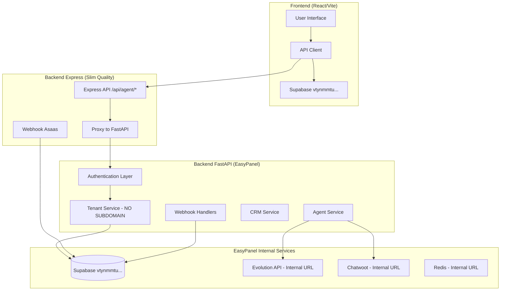
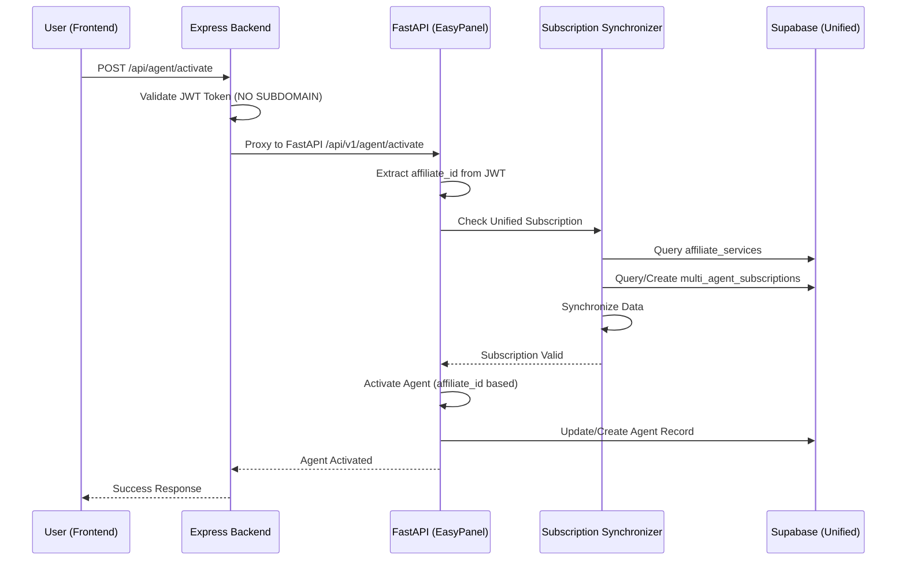

# Design Document

## Overview

O sistema Agente Multi-Tenant é uma plataforma FastAPI + React que permite afiliados criarem e gerenciarem agentes de IA integrados com WhatsApp e Chatwoot. Esta correção aborda falhas críticas identificadas na implantação de produção:

**PROBLEMAS CRÍTICOS IDENTIFICADOS:**
1. **Supabase desunificado** - Frontend usa jtwvqklqxlqfmtpsgfbq ≠ Backend usa vtynmmtuvxreiwcxxlma
2. **FastAPI não deployado** - Roda apenas localhost, não está no EasyPanel
3. **Sistema subdomain quebrado** - Código depende de subdomain que não funciona
4. **Backend Express faltando** - Sistema híbrido Slim Quality + FastAPI não integrado
5. **Credenciais EasyPanel** - URLs internas Redis/Evolution/Chatwoot não descobertas
6. **Tabela vazia** - multi_agent_subscriptions sem dados impede ativação

A arquitetura corrigida utilizará:
- **Backend**: FastAPI deployado no EasyPanel + Backend Express (Slim Quality)
- **Frontend**: React/Vite com Supabase unificado
- **Autenticação**: JWT tokens sem dependência de subdomain
- **Integrações**: URLs internas EasyPanel para Evolution API e Chatwoot
- **Deploy**: EasyPanel para backend, frontend separado

## Architecture

### Corrected System Architecture



### Corrected Data Flow for Agent Activation



## Components and Interfaces

### 0. Infrastructure Unification Manager

**Purpose**: Unify Supabase instances and validate infrastructure prerequisites

**Interface**:
```python
class InfrastructureUnificationManager:
    def unify_supabase_config(self) -> UnificationResult
    def validate_database_schema(self) -> SchemaValidationResult
    def discover_easypanel_credentials(self) -> CredentialDiscoveryResult
    def create_seed_data(self) -> SeedDataResult
```

**Responsibilities**:
- Unify frontend Supabase URL to match backend (vtynmmtuvxreiwcxxlma)
- Validate all required tables exist with proper RLS policies
- Discover internal EasyPanel URLs for Redis, Evolution API, Chatwoot
- Create test data in multi_agent_subscriptions table

### 1. EasyPanel Deployment Manager

**Purpose**: Handle FastAPI deployment to EasyPanel with proper configuration

**Interface**:
```python
class EasyPanelDeploymentManager:
    def create_docker_image(self) -> DockerBuildResult
    def deploy_to_easypanel(self) -> DeploymentResult
    def configure_health_checks(self) -> HealthCheckResult
    def validate_internal_networking(self) -> NetworkValidationResult
```

**Responsibilities**:
- Build optimized Docker image for FastAPI
- Deploy as 'agente-multi-tenant' app in EasyPanel
- Configure health check endpoints
- Validate internal service connectivity

### 2. Tenant Resolution Service (NO SUBDOMAIN)

**Purpose**: Resolve tenant context from JWT without subdomain dependency

**Interface**:
```python
class TenantResolutionService:
    def get_tenant_from_jwt(self, token: str) -> TenantContext
    def resolve_by_affiliate_id(self, affiliate_id: UUID) -> Tenant
    def remove_subdomain_code(self) -> RemovalResult
    def validate_tenant_isolation(self, affiliate_id: UUID) -> IsolationResult
```

**Responsibilities**:
- Extract affiliate_id from JWT token
- Resolve tenant using affiliate_id instead of subdomain
- Remove all subdomain parsing code
- Ensure proper tenant data isolation

### 3. Express Backend Integration Service

**Purpose**: Integrate Express backend (Slim Quality) with FastAPI system

**Interface**:
```python
class ExpressBackendIntegrationService:
    def create_agent_routes(self) -> RouteCreationResult
    def implement_asaas_webhook(self) -> WebhookResult
    def create_subscription_middleware(self) -> MiddlewareResult
    def setup_fastapi_proxy(self) -> ProxyResult
```

**Responsibilities**:
- Create Express routes for /api/agent/* endpoints
- Handle Asaas subscription webhooks
- Implement subscription validation middleware
- Proxy chat requests to FastAPI with tenant context

### 4. Configuration Manager

**Purpose**: Centralize environment configuration and validation for production

**Interface**:
```python
class ConfigurationManager:
    def validate_production_config(self) -> ConfigValidationResult
    def get_cors_origins(self) -> List[str]
    def get_jwt_config(self) -> JWTConfig
    def validate_easypanel_services(self) -> ServiceValidationResult
    def unify_supabase_urls(self) -> SupabaseUnificationResult
```

**Responsibilities**:
- Validate all environment variables on startup
- Ensure frontend uses same Supabase as backend (vtynmmtu...)
- Test connectivity to EasyPanel internal services
- Generate secure defaults for missing configurations

### 5. Subscription Synchronizer

**Purpose**: Unify subscription validation logic between affiliate_services and multi_agent_subscriptions

**Interface**:
```python
class SubscriptionSynchronizer:
    def sync_subscription_data(self, affiliate_id: UUID) -> SyncResult
    def validate_subscription(self, affiliate_id: UUID) -> SubscriptionStatus
    def create_missing_subscription(self, affiliate_id: UUID) -> MultiAgentSubscription
    def check_subscription_consistency(self) -> List[InconsistencyReport]
```

**Responsibilities**:
- Check both affiliate_services and multi_agent_subscriptions tables
- Create missing records in multi_agent_subscriptions
- Maintain data consistency between tables
- Provide unified subscription validation

### 6. Agent Activation Service (JWT-based)

**Purpose**: Handle agent activation requests using JWT-based tenant resolution

**Interface**:
```python
class AgentActivationService:
    def activate_agent(self, affiliate_id: UUID) -> AgentActivationResult
    def deactivate_agent(self, affiliate_id: UUID) -> AgentDeactivationResult
    def get_activation_status(self, affiliate_id: UUID) -> ActivationStatus
    def validate_activation_requirements(self, affiliate_id: UUID) -> ValidationResult
```

**Responsibilities**:
- Use affiliate_id from JWT (NO subdomain dependency)
- Validate subscription before activation
- Create or update agent records
- Initialize default configurations
- Handle activation failures gracefully

### 7. EasyPanel Service Validator

**Purpose**: Validate connectivity and configuration of external services

**Interface**:
```python
class ExternalServiceValidator:
    def validate_evolution_api(self) -> ServiceStatus
    def validate_chatwoot(self) -> ServiceStatus
    def test_whatsapp_connection(self, tenant_id: UUID) -> ConnectionStatus
    def validate_all_services(self) -> Dict[str, ServiceStatus]
```

**Responsibilities**:
- Test API endpoints availability
- Validate authentication credentials
- Check service-specific configurations
- Provide health status for monitoring

### 5. Structured Logger

**Purpose**: Provide comprehensive logging and monitoring

**Interface**:
```python
class StructuredLogger:
    def log_user_action(self, user_id: str, action: str, context: Dict)
    def log_error(self, error: Exception, context: Dict)
    def log_performance(self, operation: str, duration: float, context: Dict)
    def log_security_event(self, event_type: str, context: Dict)
```

**Responsibilities**:
- Generate structured JSON logs
- Include correlation IDs for request tracking
- Log security-relevant events
- Provide performance metrics

## Data Models

### Enhanced Configuration Schema

```python
class ProductionConfig(BaseModel):
    # API Configuration
    api_url: HttpUrl
    cors_origins: List[str]
    
    # Security
    jwt_secret: SecretStr
    jwt_algorithm: str = "HS256"
    
    # External Services
    evolution_api_url: Optional[HttpUrl]
    evolution_api_key: Optional[SecretStr]
    chatwoot_url: Optional[HttpUrl]
    chatwoot_api_key: Optional[SecretStr]
    
    # Database
    supabase_url: HttpUrl
    supabase_service_key: SecretStr
    
    def validate_production_readiness(self) -> List[str]:
        """Return list of configuration issues"""
```

### Unified Subscription Model

```python
class UnifiedSubscription(BaseModel):
    affiliate_id: UUID
    service_type: str = "agente_ia"
    status: SubscriptionStatus
    expires_at: Optional[datetime]
    
    # Source tracking
    affiliate_services_record: Optional[Dict]
    multi_agent_subscription_record: Optional[Dict]
    
    # Consistency flags
    is_consistent: bool
    needs_sync: bool
    sync_actions: List[str]
```

### Agent Activation Record

```python
class AgentActivation(BaseModel):
    id: UUID
    affiliate_id: UUID
    tenant_id: UUID
    status: ActivationStatus
    activated_at: datetime
    configuration: Dict[str, Any]
    
    # External service connections
    whatsapp_connected: bool
    chatwoot_connected: bool
    
    # Metadata
    activation_source: str  # "web_ui", "api", "migration"
    last_health_check: Optional[datetime]
```

## Correctness Properties

*A property is a characteristic or behavior that should hold true across all valid executions of a system-essentially, a formal statement about what the system should do. Properties serve as the bridge between human-readable specifications and machine-verifiable correctness guarantees.*

### Property 1: Production Configuration Validation
*For any* system startup, all environment variables should be validated and production URLs should be used instead of localhost references
**Validates: Requirements 1.1, 1.4**

### Property 2: CORS Configuration Correctness
*For any* cross-origin request from the production frontend, the backend should accept the request with proper CORS headers
**Validates: Requirements 1.2**

### Property 3: JWT Security Standards
*For any* JWT token generation or validation, the system should use secure algorithms and non-default secrets
**Validates: Requirements 1.3, 4.1, 4.2**

### Property 4: External Service Connectivity
*For any* external service configuration (Evolution API, Chatwoot), the system should validate connectivity and log connection status
**Validates: Requirements 1.5, 5.1, 5.2, 5.3**

### Property 5: Agent Activation Endpoint Availability
*For any* agent activation request, the endpoint /api/v1/agent/activate should exist and respond appropriately
**Validates: Requirements 2.1**

### Property 6: Subscription Validation Before Activation
*For any* agent activation attempt, the system should validate subscription status before allowing activation
**Validates: Requirements 2.2**

### Property 7: Agent Record Persistence
*For any* valid subscription, agent activation should create or update the corresponding agent record
**Validates: Requirements 2.3**

### Property 8: Activation Response Consistency
*For any* activation request, the system should return consistent response format with appropriate success or error messages
**Validates: Requirements 2.4, 2.5**

### Property 9: Unified Subscription Data Synchronization
*For any* affiliate subscription validation, the system should check both affiliate_services and multi_agent_subscriptions tables and maintain consistency between them
**Validates: Requirements 3.1, 3.2, 3.3, 3.4, 3.5**

### Property 10: Authentication Error Handling
*For any* authentication failure, the system should return clear error messages and handle token expiration appropriately
**Validates: Requirements 4.4, 4.5**

### Property 11: External Service Fallback Mechanisms
*For any* external service unavailability, the system should provide fallback mechanisms and log detailed error information
**Validates: Requirements 5.4, 5.5**

### Property 12: Structured Logging and Monitoring
*For any* system operation, error, or user action, the system should generate structured logs with timestamps and appropriate context
**Validates: Requirements 6.1, 6.2, 6.3, 6.5**

### Property 13: Data Consistency Maintenance
*For any* system startup or data update, the system should verify and maintain consistency between subscription tables
**Validates: Requirements 7.1, 7.2, 7.3, 7.5**

### Property 14: Frontend Functionality and User Experience
*For any* frontend interaction, the system should handle loading states, display appropriate error messages, and provide success feedback
**Validates: Requirements 8.1, 8.2, 8.3, 8.4**

<function_calls>
<invoke name="prework">
<parameter name="featureName">correcao-sistema-agente-multi-tenant

## Error Handling

### Configuration Errors
- **Missing Environment Variables**: System should fail fast on startup with clear error messages
- **Invalid URLs**: Validate URL format and connectivity during configuration loading
- **Service Unavailability**: Provide graceful degradation when external services are down
- **Authentication Failures**: Return specific error codes for different authentication failure types

### Data Consistency Errors
- **Subscription Conflicts**: Implement conflict resolution logic favoring most recent valid subscription
- **Missing Records**: Automatically create missing records in multi_agent_subscriptions when found in affiliate_services
- **Referential Integrity**: Maintain foreign key relationships during updates and deletions

### External Service Errors
- **API Timeouts**: Implement retry logic with exponential backoff
- **Authentication Failures**: Handle expired tokens and invalid credentials gracefully
- **Rate Limiting**: Respect external service rate limits and implement queuing

### Frontend Error Handling
- **Network Errors**: Display user-friendly messages for connection issues
- **Validation Errors**: Show field-specific validation messages
- **Server Errors**: Provide actionable error messages without exposing sensitive information

## Testing Strategy

### Dual Testing Approach
The system requires both unit tests and property-based tests for comprehensive coverage:

**Unit Tests** focus on:
- Specific configuration validation scenarios
- Error handling edge cases
- Integration points between services
- API endpoint response formats

**Property Tests** focus on:
- Universal properties across all inputs
- Data consistency validation
- Authentication and authorization flows
- External service integration reliability

### Property-Based Testing Configuration
- **Minimum 100 iterations** per property test due to randomization
- Each property test must reference its design document property
- **Tag format**: Feature: correcao-sistema-agente-multi-tenant, Property {number}: {property_text}

### Testing Framework
- **Backend**: pytest with property-based testing using Hypothesis
- **Frontend**: Jest with React Testing Library
- **Integration**: End-to-end tests using Playwright
- **API**: OpenAPI schema validation and contract testing

### Test Coverage Requirements
- **Configuration validation**: Test all environment variable combinations
- **Subscription synchronization**: Test all data consistency scenarios
- **Authentication flows**: Test token generation, validation, and expiration
- **External service integration**: Mock external services for reliable testing
- **Error scenarios**: Test all identified error conditions

### Performance Testing
- **Load testing**: Validate system performance under normal load
- **Stress testing**: Test system behavior at breaking points
- **Database performance**: Validate query performance with realistic data volumes
- **External service timeouts**: Test system behavior when external services are slow