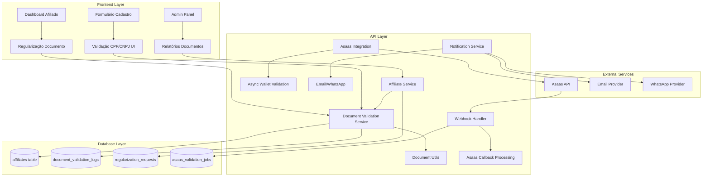

# Design Document - Sistema de Validação por CPF/CNPJ para Afiliados

## Overview

O Sistema de Validação por CPF/CNPJ é uma extensão crítica do sistema de afiliados existente que implementa validação obrigatória de documentos (CPF para pessoa física ou CNPJ para pessoa jurídica) para prevenir fraudes e garantir integridade no pagamento de comissões. O sistema utiliza uma abordagem em fases: validação para novos cadastros, processo de regularização para afiliados existentes, e integração assíncrona com a API Asaas para verificação de titularidade via webhook.

A arquitetura segue os padrões estabelecidos do projeto Slim Quality, mantendo compatibilidade com o sistema de comissões existente, garantindo conformidade com a LGPD, e implementando suspensão via flag is_active ao invés de soft delete.

## Architecture



## Components and Interfaces

### 1. Document Validation Service

**Responsabilidade:** Centralizar toda lógica de validação de CPF e CNPJ

```typescript
interface DocumentValidationService {
  // Validações genéricas
  validateFormat(document: string): ValidationResult;
  validateChecksum(document: string): ValidationResult;
  checkDuplication(document: string, excludeAffiliateId?: string): Promise<boolean>;
  
  // Validação Asaas ASSÍNCRONA
  initiateAsaasValidation(document: string, walletId: string, affiliateId: string): Promise<ValidationJobId>;
  checkAsaasValidationStatus(jobId: string): Promise<AsaasValidationStatus>;
  handleAsaasWebhook(payload: AsaasWebhookPayload): Promise<void>;
  
  // Logs
  logValidation(request: DocumentValidationRequest): Promise<void>;
}

interface ValidationResult {
  isValid: boolean;
  documentType: 'CPF' | 'CNPJ' | 'INVALID';
  error?: string;
  normalizedDocument?: string;
}

interface AsaasValidationStatus {
  status: 'pending' | 'validating' | 'success' | 'failed' | 'timeout';
  isValid?: boolean;
  accountHolder?: string;
  documentType: 'CPF' | 'CNPJ';
  error?: string;
  startedAt: Date;
  completedAt?: Date;
}

interface ValidationJobId {
  id: string;
  expiresAt: Date; // 24h timeout
}
```

### 2. Regularization Service

**Responsabilidade:** Gerenciar processo de regularização de afiliados existentes

```typescript
interface RegularizationService {
  createRegularizationRequest(affiliateId: string): Promise<RegularizationRequest>;
  processRegularization(requestId: string, cpf: string): Promise<void>;
  getRegularizationStatus(affiliateId: string): Promise<RegularizationStatus>;
  sendRegularizationReminder(affiliateId: string): Promise<void>;
  suspendUnregularizedAffiliates(): Promise<SuspensionResult[]>;
}

interface RegularizationRequest {
  id: string;
  affiliateId: string;
  status: 'pending' | 'completed' | 'expired';
  createdAt: Date;
  expiresAt: Date;
  completedAt?: Date;
}
```

### 3. Document Utils

**Responsabilidade:** Utilitários para manipulação e validação de CPF e CNPJ

```typescript
interface DocumentUtils {
  // Detecção automática
  detectType(document: string): 'CPF' | 'CNPJ' | 'INVALID';
  
  // Normalização genérica
  normalize(document: string): string; // Remove formatação
  format(document: string): string; // Auto-detecta e formata
  
  // CPF específico
  formatCPF(cpf: string): string; // XXX.XXX.XXX-XX
  isValidCPF(cpf: string): boolean;
  validateCPFChecksum(cpf: string): boolean;
  
  // CNPJ específico  
  formatCNPJ(cnpj: string): string; // XX.XXX.XXX/XXXX-XX
  isValidCNPJ(cnpj: string): boolean;
  validateCNPJChecksum(cnpj: string): boolean;
  
  // Utilitários comuns
  maskForDisplay(document: string): string; // CPF: XXX.XXX.XXX-** | CNPJ: XX.XXX.XXX/****-**
  hashForStorage(document: string): string; // SHA-256 para LGPD
}
```

### 4. Notification Templates

**Responsabilidade:** Templates para comunicação sobre CPF/CNPJ

```typescript
interface NotificationTemplates {
  regularizationReminder(affiliate: Affiliate): EmailTemplate;
  regularizationUrgent(affiliate: Affiliate, daysLeft: number): EmailTemplate;
  regularizationComplete(affiliate: Affiliate): EmailTemplate;
  documentValidationError(error: string, documentType: 'CPF' | 'CNPJ'): UIMessage;
  suspensionWarning(affiliate: Affiliate): EmailTemplate;
  asaasValidationComplete(affiliate: Affiliate, result: AsaasValidationStatus): EmailTemplate;
}
```

## Data Models

### 1. Extensão da Tabela Affiliates

```sql
-- Alterações na tabela existente
ALTER TABLE affiliates 
  ALTER COLUMN document SET NOT NULL,
  ADD CONSTRAINT affiliates_document_unique UNIQUE (document),
  ADD COLUMN document_type VARCHAR(10) NOT NULL CHECK (document_type IN ('CPF', 'CNPJ')),
  ADD COLUMN document_validated_at TIMESTAMPTZ,
  ADD COLUMN document_validation_source VARCHAR(50) DEFAULT 'manual',
  
  -- Suspensão via flag
  ADD COLUMN is_active BOOLEAN DEFAULT true,
  ADD COLUMN suspended_at TIMESTAMPTZ,
  ADD COLUMN suspension_reason TEXT,
  
  -- Regularização
  ADD COLUMN regularization_deadline TIMESTAMPTZ,
  ADD COLUMN regularization_notified_at TIMESTAMPTZ;

-- Índices para performance
CREATE INDEX idx_affiliates_document_hash ON affiliates USING hash (document);
CREATE INDEX idx_affiliates_document_type ON affiliates(document_type);
CREATE INDEX idx_affiliates_active ON affiliates(is_active) WHERE is_active = true;
CREATE INDEX idx_affiliates_regularization_deadline ON affiliates(regularization_deadline) 
  WHERE regularization_deadline IS NOT NULL;
```

### 2. Nova Tabela: Document Validation Logs

```sql
CREATE TABLE document_validation_logs (
  id UUID PRIMARY KEY DEFAULT gen_random_uuid(),
  affiliate_id UUID REFERENCES affiliates(id),
  document_attempted TEXT NOT NULL,
  document_type VARCHAR(10) NOT NULL CHECK (document_type IN ('CPF', 'CNPJ')),
  validation_type VARCHAR(50) NOT NULL, -- 'format', 'checksum', 'duplication', 'asaas'
  is_valid BOOLEAN NOT NULL,
  error_message TEXT,
  asaas_response JSONB,
  ip_address INET,
  user_agent TEXT,
  created_at TIMESTAMPTZ DEFAULT NOW()
);

CREATE INDEX idx_document_validation_logs_affiliate ON document_validation_logs(affiliate_id);
CREATE INDEX idx_document_validation_logs_created_at ON document_validation_logs(created_at);
CREATE INDEX idx_document_validation_logs_type ON document_validation_logs(document_type);
```

### 3. Nova Tabela: Regularization Requests

```sql
CREATE TABLE regularization_requests (
  id UUID PRIMARY KEY DEFAULT gen_random_uuid(),
  affiliate_id UUID UNIQUE REFERENCES affiliates(id),
  status VARCHAR(20) NOT NULL DEFAULT 'pending' 
    CHECK (status IN ('pending', 'completed', 'expired', 'cancelled')),
  reminder_count INTEGER DEFAULT 0,
  last_reminder_at TIMESTAMPTZ,
  expires_at TIMESTAMPTZ NOT NULL,
  completed_at TIMESTAMPTZ,
  completion_method VARCHAR(50), -- 'self_service', 'admin_manual', 'api'
  notes TEXT,
  created_at TIMESTAMPTZ DEFAULT NOW(),
  updated_at TIMESTAMPTZ DEFAULT NOW()
);

CREATE INDEX idx_regularization_requests_status ON regularization_requests(status);
CREATE INDEX idx_regularization_requests_expires_at ON regularization_requests(expires_at);
```

### 4. Nova Tabela: Asaas Validation Jobs

```sql
CREATE TABLE asaas_validation_jobs (
  id UUID PRIMARY KEY DEFAULT gen_random_uuid(),
  affiliate_id UUID REFERENCES affiliates(id),
  document TEXT NOT NULL,
  document_type VARCHAR(10) NOT NULL,
  wallet_id TEXT NOT NULL,
  status VARCHAR(20) NOT NULL DEFAULT 'pending' 
    CHECK (status IN ('pending', 'validating', 'success', 'failed', 'timeout')),
  asaas_job_id TEXT, -- ID retornado pela Asaas
  is_valid BOOLEAN,
  account_holder TEXT,
  error_message TEXT,
  webhook_payload JSONB,
  expires_at TIMESTAMPTZ NOT NULL DEFAULT NOW() + INTERVAL '24 hours',
  created_at TIMESTAMPTZ DEFAULT NOW(),
  completed_at TIMESTAMPTZ,
  
  CONSTRAINT one_active_job_per_affiliate 
    UNIQUE (affiliate_id) WHERE status IN ('pending', 'validating')
);

CREATE INDEX idx_asaas_jobs_status ON asaas_validation_jobs(status);
CREATE INDEX idx_asaas_jobs_expires ON asaas_validation_jobs(expires_at) 
  WHERE status IN ('pending', 'validating');
CREATE INDEX idx_asaas_jobs_affiliate ON asaas_validation_jobs(affiliate_id);
```

### 5. LGPD Compliance Table

```sql
CREATE TABLE document_data_processing_logs (
  id UUID PRIMARY KEY DEFAULT gen_random_uuid(),
  affiliate_id UUID REFERENCES affiliates(id),
  operation_type VARCHAR(50) NOT NULL, -- 'collect', 'update', 'view', 'anonymize', 'delete'
  legal_basis VARCHAR(100) NOT NULL, -- 'consent', 'legitimate_interest', 'contract'
  purpose TEXT NOT NULL,
  data_subject_consent BOOLEAN DEFAULT FALSE,
  consent_timestamp TIMESTAMPTZ,
  processor_user_id UUID REFERENCES auth.users(id),
  ip_address INET,
  created_at TIMESTAMPTZ DEFAULT NOW()
);
```

*A property is a characteristic or behavior that should hold true across all valid executions of a system-essentially, a formal statement about what the system should do. Properties serve as the bridge between human-readable specifications and machine-verifiable correctness guarantees.*

Agora vou usar a ferramenta prework para analisar os acceptance criteria antes de escrever as propriedades:

### Property 1: CPF Format Validation
*For any* string input, if it does not contain exactly 11 numeric digits (ignoring formatting), the CPF validation should reject it with a format error
**Validates: Requirements 1.2**

### Property 2: CPF Mathematical Validation  
*For any* CPF with correct format, the mathematical validation using official algorithm should correctly identify valid vs invalid check digits
**Validates: Requirements 1.3**

### Property 3: CPF Uniqueness Enforcement
*For any* CPF that already exists in the affiliates table, attempting to register a new affiliate with the same CPF should be rejected with duplication error
**Validates: Requirements 1.5, 2.1, 2.3**

### Property 4: CPF Update Validation
*For any* affiliate attempting to update their CPF, the new CPF should be validated for uniqueness excluding their own current record
**Validates: Requirements 2.2**

### Property 5: Single Active Affiliate Per CPF
*For any* CPF in the system, there should be at most one active affiliate associated with it at any given time
**Validates: Requirements 2.4**

### Property 6: Regularization Deadline Enforcement
*For any* existing affiliate without CPF, they should have exactly 30 days from notification to complete regularization before suspension
**Validates: Requirements 3.4, 3.5**

### Property 7: Asaas Wallet Validation
*For any* combination of CPF and Wallet_ID, the system should validate titularity with Asaas API and reject mismatches
**Validates: Requirements 4.1, 4.2**

### Property 8: Validation Logging Completeness
*For any* CPF validation operation performed, there should be a corresponding log entry with operation details and result
**Validates: Requirements 4.4, 5.5, 7.5**

### Property 9: LGPD Consent Recording
*For any* CPF data collection, there should be explicit consent recorded with timestamp and legal basis
**Validates: Requirements 5.1**

### Property 10: Data Anonymization on Deletion
*For any* affiliate requesting data deletion, their CPF should be anonymized while maintaining hash for duplication control
**Validates: Requirements 5.3**

### Property 11: Real-time Validation Feedback
*For any* CPF input in the UI, invalid formats should trigger immediate error display without requiring form submission
**Validates: Requirements 6.3, 6.5**

### Property 12: Automated Notification Timing
*For any* affiliate without CPF, reminder emails should be sent at exactly 7 days and warning emails at exactly 23 days after initial notification
**Validates: Requirements 8.2, 8.3**

### Property 13: Report Data Accuracy
*For any* generated report about CPF status, the data should accurately reflect the current state of affiliates in the database
**Validates: Requirements 7.1, 7.2, 7.3**

### Property 14: CSV Export Completeness
*For any* report requested for CSV export, all data visible in the report should be present in the exported file
**Validates: Requirements 7.4**

## Error Handling

### 1. Document Validation Errors

```typescript
enum DocumentValidationError {
  INVALID_FORMAT = 'DOCUMENT_INVALID_FORMAT',
  INVALID_CPF_CHECKSUM = 'CPF_INVALID_CHECKSUM',
  INVALID_CNPJ_CHECKSUM = 'CNPJ_INVALID_CHECKSUM',
  ALREADY_EXISTS = 'DOCUMENT_ALREADY_EXISTS',
  ASAAS_MISMATCH = 'DOCUMENT_ASAAS_MISMATCH',
  ASAAS_API_ERROR = 'DOCUMENT_ASAAS_API_ERROR',
  ASAAS_VALIDATION_TIMEOUT = 'ASAAS_VALIDATION_TIMEOUT',
  ASAAS_VALIDATION_PENDING = 'ASAAS_VALIDATION_PENDING'
}

interface DocumentValidationException extends Error {
  code: DocumentValidationError;
  document?: string;
  documentType?: 'CPF' | 'CNPJ';
  affiliateId?: string;
  details?: Record<string, any>;
}
```

### 2. Regularization Process Errors

```typescript
enum RegularizationError {
  DEADLINE_EXPIRED = 'REGULARIZATION_DEADLINE_EXPIRED',
  ALREADY_COMPLETED = 'REGULARIZATION_ALREADY_COMPLETED',
  INVALID_AFFILIATE = 'REGULARIZATION_INVALID_AFFILIATE',
  NOTIFICATION_FAILED = 'REGULARIZATION_NOTIFICATION_FAILED'
}
```

### 3. LGPD Compliance Errors

```typescript
enum LGPDError {
  CONSENT_REQUIRED = 'LGPD_CONSENT_REQUIRED',
  INVALID_LEGAL_BASIS = 'LGPD_INVALID_LEGAL_BASIS',
  ANONYMIZATION_FAILED = 'LGPD_ANONYMIZATION_FAILED',
  AUDIT_LOG_FAILED = 'LGPD_AUDIT_LOG_FAILED'
}
```

### 4. Error Recovery Strategies

- **API Timeouts:** Implementar retry com backoff exponencial para validações Asaas
- **Database Constraints:** Capturar violações de UNIQUE e converter em erros de negócio
- **Notification Failures:** Queue de retry para emails/WhatsApp com dead letter queue
- **Migration Errors:** Rollback automático com logs detalhados para investigação

## Testing Strategy

### Dual Testing Approach

O sistema utilizará uma abordagem dupla de testes para garantir cobertura completa:

**Unit Tests:**
- Validação de algoritmo de CPF com casos específicos
- Formatação e normalização de strings
- Casos edge de integração com Asaas
- Cenários de erro específicos

**Property-Based Tests:**
- Validação de CPF com inputs aleatórios (mínimo 100 iterações)
- Testes de unicidade com múltiplos afiliados
- Validação de processo de regularização
- Conformidade LGPD com diferentes cenários

### Property Test Configuration

Utilizar **fast-check** para TypeScript com as seguintes configurações:
- Mínimo 100 iterações por teste de propriedade
- Seeds fixas para reprodutibilidade
- Shrinking habilitado para encontrar casos mínimos de falha

Cada teste de propriedade deve referenciar sua propriedade do design:
```typescript
// Tag format: Feature: cpf-validation-system, Property 1: CPF Format Validation
```

### Integration Testing

- **Asaas API:** Testes com sandbox para validação de titularidade
- **Database:** Testes de constraints e triggers
- **Email/WhatsApp:** Testes com provedores de teste
- **Frontend:** Testes E2E com Playwright para fluxos completos

### Performance Testing

- **Document Validation:** < 50ms para validação local (CPF ou CNPJ)
- **Asaas Integration:** Job criado em < 200ms, resultado via webhook
- **Webhook Processing:** < 500ms para processar callback Asaas
- **Database Queries:** < 100ms para consultas de duplicação
- **Report Generation:** < 5s para relatórios com até 10.000 registros

### Security Testing

- **Input Sanitization:** Testes de SQL injection e XSS
- **LGPD Compliance:** Auditoria de logs de acesso a dados
- **API Security:** Rate limiting e autenticação
- **Data Encryption:** Validação de hash de CPF para anonimização
## Correctness Properties

*A property is a characteristic or behavior that should hold true across all valid executions of a system-essentially, a formal statement about what the system should do. Properties serve as the bridge between human-readable specifications and machine-verifiable correctness guarantees.*

### Property 1: CPF/CNPJ Format Validation
*For any* string input, if it does not contain exactly 11 numeric digits (CPF) or 14 numeric digits (CNPJ) (ignoring formatting), the document validation should reject it with a format error
**Validates: Requirements 1.2, 1.5**

### Property 2: CPF Mathematical Validation  
*For any* CPF with correct format, the mathematical validation using official algorithm should correctly identify valid vs invalid check digits
**Validates: Requirements 1.3**

### Property 15: CNPJ Mathematical Validation
*For any* CNPJ with correct format (14 digits), the mathematical validation using official algorithm should correctly identify valid vs invalid check digits
**Validates: Requirements 1.5**

### Property 3: Document Uniqueness Enforcement
*For any* document (CPF or CNPJ) that already exists in the affiliates table, attempting to register a new affiliate with the same document should be rejected with duplication error
**Validates: Requirements 1.5, 2.1, 2.3**

### Property 4: Document Update Validation
*For any* affiliate attempting to update their document, the new document should be validated for uniqueness excluding their own current record
**Validates: Requirements 2.2**

### Property 5: Single Active Affiliate Per Document
*For any* document in the system, there should be at most one active affiliate associated with it at any given time
**Validates: Requirements 2.4**

### Property 6: Regularization Deadline Enforcement
*For any* existing affiliate without document, they should have exactly 30 days from notification to complete regularization before suspension via is_active=false
**Validates: Requirements 3.4, 3.5**

### Property 7: Asaas Wallet Validation (Assíncrona)
*For any* combination of document (CPF/CNPJ) and Wallet_ID, the system should initiate asynchronous validation with Asaas API and eventually reject mismatches via webhook callback
**Validates: Requirements 4.1, 4.2, 4.5, 4.6**

### Property 8: Validation Logging Completeness
*For any* document validation operation performed, there should be a corresponding log entry with operation details and result
**Validates: Requirements 4.4, 5.5, 7.5**

### Property 9: LGPD Consent Recording
*For any* document data collection, there should be explicit consent recorded with timestamp and legal basis
**Validates: Requirements 5.1**

### Property 10: Data Anonymization on Deletion
*For any* affiliate requesting data deletion, their document should be anonymized while maintaining hash for duplication control
**Validates: Requirements 5.3**

### Property 11: Real-time Validation Feedback
*For any* document input in the UI, invalid formats should trigger immediate error display without requiring form submission
**Validates: Requirements 6.3, 6.5**

### Property 12: Automated Notification Timing
*For any* affiliate without document, reminder emails should be sent at exactly 7 days and warning emails at exactly 23 days after initial notification
**Validates: Requirements 8.2, 8.3**

### Property 13: Report Data Accuracy
*For any* generated report about document status, the data should accurately reflect the current state of affiliates in the database
**Validates: Requirements 7.1, 7.2, 7.3**

### Property 14: CSV Export Completeness
*For any* report requested for CSV export, all data visible in the report should be present in the exported file
**Validates: Requirements 7.4**