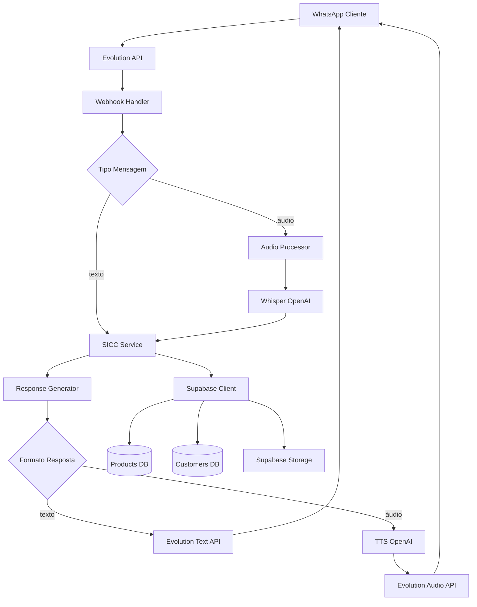
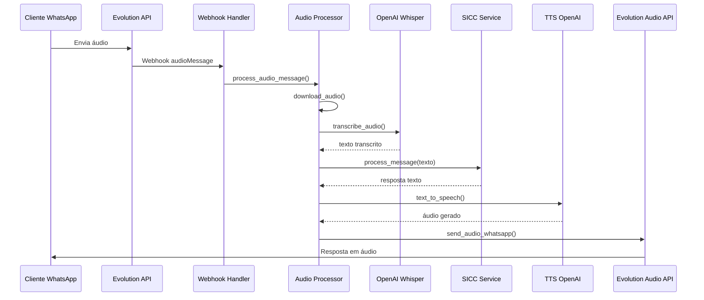

# Design Document - Sprint 5.5

## ⚠️ SISTEMA EM PRODUÇÃO - ATENÇÃO CRÍTICA

**🚨 O sistema Slim Quality está OPERACIONAL em produção**  
**🚨 Agente BIA atende clientes REAIS via WhatsApp**  
**🚨 Qualquer erro pode impactar vendas IMEDIATAMENTE**  
**🚨 TESTE TUDO antes de dar merge/deploy**  
**🚨 Use feature flags se possível**  
**🚨 Tenha rollback pronto**

## 📚 Documentos Steering Obrigatórios

**LEIA E SIGA RIGOROSAMENTE:**

- **`.kiro/steering/funcionalidade-sobre-testes.md`** - Metodologia de testes obrigatória (testes sempre no FINAL de cada bloco, NUNCA intercalar entre tasks)
- **`.kiro/steering/analise-preventiva-obrigatoria.md`** - SEMPRE analisar código/banco ANTES de modificar, verificar impactos em funcionalidades existentes, documentar estado atual vs estado desejado
- **`.kiro/steering/compromisso-honestidade.md`** - Reportar problemas imediatamente, não esconder dificuldades, comunicar riscos identificados

## Overview

⚠️ **DESCOBERTA CRÍTICA:** Sistema já possui página de integrações MCP com Supabase configurada em `dashboard/agente/mcp`. Status atual:
- ✅ Evolution API: Online (120ms latência)
- ✅ Uazapi: Online (85ms latência)  
- ❌ **Supabase: Error (Connection timeout)**
- ⚠️ Redis: Warning (450ms latência alta)

**IMPACTO NO DESIGN:** Análise preventiva DEVE investigar MCP Supabase e determinar arquitetura (MCP vs client direto).

Esta sprint implementa 5 funcionalidades avançadas no Agente BIA através de integrações com OpenAI (Whisper + TTS), Supabase (Storage + Database) e Evolution API. O design prioriza robustez com fallbacks obrigatórios e estratégia de resposta espelhada (áudio↔áudio, texto↔texto).

## Architecture

### Componentes Principais



### Fluxo de Dados - Áudio End-to-End



## Components and Interfaces

### 1. Dynamic Pricing Service

```python
class DynamicPricingService:
    def __init__(self):
        self.cache = {}
        self.cache_ttl = 300  # 5 minutos
        self.use_mcp = False  # Determinado na análise preventiva
        
    async def get_current_prices(self) -> Dict[str, Dict]:
        """Busca preços atuais com cache (MCP ou client direto)"""
        
    async def get_product_price(self, product_type: str) -> Optional[Dict]:
        """Busca preço específico de um produto"""
        
    async def _query_via_mcp(self, query: str) -> Any:
        """Query via MCP Supabase (se disponível)"""
        
    async def _query_via_client(self, query: str) -> Any:
        """Query via client direto (fallback)"""
        
    def _is_cache_valid(self, product_type: str) -> bool:
        """Verifica se cache ainda é válido"""
```

### 2. Customer History Service

```python
class CustomerHistoryService:
    async def check_customer_history(self, phone: str) -> Dict[str, Any]:
        """Verifica histórico do cliente"""
        
    async def get_personalized_greeting(self, phone: str) -> str:
        """Gera saudação personalizada"""
        
    def _format_greeting(self, customer_data: Dict) -> str:
        """Formata saudação baseada nos dados"""
```

### 3. Hybrid Image Service

```python
class HybridImageService:
    async def send_product_visual(self, phone: str, product_type: str):
        """Envia imagem + link do produto"""
        
    async def upload_product_images(self):
        """Upload inicial das imagens para Storage"""
        
    async def update_product_urls(self):
        """Atualiza URLs na tabela products"""
```

### 4. Audio Processing Service

```python
class AudioProcessingService:
    def __init__(self):
        self.whisper_semaphore = Semaphore(5)
        self.tts_semaphore = Semaphore(3)
        
    async def download_audio(self, audio_data: Dict) -> bytes:
        """Baixa áudio do webhook"""
        
    async def transcribe_audio(self, audio_bytes: bytes) -> str:
        """Transcreve áudio via Whisper"""
        
    async def text_to_speech(self, text: str) -> bytes:
        """Converte texto em áudio via TTS"""
        
    async def send_audio_whatsapp(self, phone: str, audio_bytes: bytes):
        """Envia áudio via Evolution API"""
```

### 5. Enhanced Webhook Handler

```python
async def webhook_evolution(request: Request, background_tasks: BackgroundTasks):
    """Handler principal do webhook Evolution"""
    
async def process_text_message(data: Dict):
    """Processa mensagem de texto (existente)"""
    
async def process_audio_message(data: Dict):
    """Processa mensagem de áudio (NOVO)"""
    
async def determine_response_format(user_id: str, message_type: str) -> str:
    """Determina formato de resposta (texto/áudio)"""
```

## Data Models

### Estrutura de Dados - Supabase

#### 1. Atualização Tabela Products

```sql
-- Adicionar colunas para imagens e URLs
ALTER TABLE products 
ADD COLUMN image_url TEXT,
ADD COLUMN product_page_url TEXT;

-- Atualizar produtos existentes
UPDATE products SET 
    image_url = 'https://vtynmmtuvxreiwcxxlma.supabase.co/storage/v1/object/public/products_images/solteiro/main.jpg',
    product_page_url = 'https://slimquality.com.br/produtos/solteiro'
WHERE name = 'Solteiro';

UPDATE products SET 
    image_url = 'https://vtynmmtuvxreiwcxxlma.supabase.co/storage/v1/object/public/products_images/padrao/main.jpg',
    product_page_url = 'https://slimquality.com.br/produtos/padrao'
WHERE name = 'Padrão';

UPDATE products SET 
    image_url = 'https://vtynmmtuvxreiwcxxlma.supabase.co/storage/v1/object/public/products_images/queen/main.jpg',
    product_page_url = 'https://slimquality.com.br/produtos/queen'
WHERE name = 'Queen';

UPDATE products SET 
    image_url = 'https://vtynmmtuvxreiwcxxlma.supabase.co/storage/v1/object/public/products_images/king/main.jpg',
    product_page_url = 'https://slimquality.com.br/produtos/king'
WHERE name = 'King';
```

#### 2. Tabela Customers (verificar se existe)

```sql
-- Verificar estrutura da tabela customers
SELECT column_name, data_type 
FROM information_schema.columns 
WHERE table_name = 'customers' 
AND table_schema = 'public';

-- Se não existir, criar:
CREATE TABLE IF NOT EXISTS customers (
    id UUID PRIMARY KEY DEFAULT gen_random_uuid(),
    phone TEXT UNIQUE NOT NULL,
    name TEXT,
    email TEXT,
    last_purchase_at TIMESTAMPTZ,
    last_product_type TEXT,
    created_at TIMESTAMPTZ DEFAULT NOW(),
    updated_at TIMESTAMPTZ DEFAULT NOW()
);
```

#### 3. Supabase Storage - Bucket Structure

```
products_images/ (PUBLIC bucket)
├── solteiro/
│   ├── main.jpg
│   ├── detail1.jpg
│   └── detail2.jpg
├── padrao/
│   ├── main.jpg
│   ├── detail1.jpg
│   └── detail2.jpg
├── queen/
│   ├── main.jpg
│   ├── detail1.jpg
│   └── detail2.jpg
└── king/
    ├── main.jpg
    ├── detail1.jpg
    └── detail2.jpg
```

### Payloads - Evolution API

#### 1. Webhook Áudio Recebido

```json
{
  "event": "messages.upsert",
  "data": {
    "key": {
      "remoteJid": "5511999999999@s.whatsapp.net",
      "fromMe": false,
      "id": "msg_id_123"
    },
    "messageType": "audioMessage",
    "message": {
      "audioMessage": {
        "url": "https://evolution-api.com/files/audio.ogg",
        "base64": "UklGRnoGAABXQVZFZm10IBAAAAABAAEA...",
        "mimetype": "audio/ogg; codecs=opus",
        "seconds": 15,
        "ptt": true
      }
    }
  }
}
```

#### 2. Envio de Imagem

```json
{
  "number": "5511999999999",
  "options": {
    "delay": 1200,
    "presence": "composing"
  },
  "mediaMessage": {
    "mediatype": "image",
    "media": "https://vtynmmtuvxreiwcxxlma.supabase.co/storage/v1/object/public/products_images/queen/main.jpg",
    "caption": "Aqui está o colchão Queen! 🛏️\n\nDimensões: 158x198x30cm\nPreço: R$ 3.490,00"
  }
}
```

#### 3. Envio de Áudio

```json
{
  "number": "5511999999999",
  "options": {
    "delay": 1200,
    "presence": "recording"
  },
  "audioMessage": {
    "audio": "UklGRnoGAABXQVZFZm10IBAAAAABAAEA...",
    "mimetype": "audio/ogg; codecs=opus",
    "ptt": true
  }
}
```

## Correctness Properties

*A property is a characteristic or behavior that should hold true across all valid executions of a system-essentially, a formal statement about what the system should do. Properties serve as the bridge between human-readable specifications and machine-verifiable correctness guarantees.*

### Property 1: Preços Sempre Atualizados
*For any* consulta de preço, o sistema deve retornar o valor mais atual disponível (cache válido ou banco de dados)
**Validates: Requirements 1.1, 1.3**

### Property 2: Cache Consistency
*For any* produto, se o cache está válido (< 5 minutos), deve retornar o mesmo preço que uma consulta direta ao banco feita no mesmo momento
**Validates: Requirements 1.2, 1.4**

### Property 3: Fallback Reliability
*For any* falha de componente (Supabase, OpenAI, Evolution), o sistema deve continuar funcionando com comportamento alternativo
**Validates: Requirements 10.1, 10.2, 10.3, 10.4, 10.5**

### Property 4: Customer Recognition Accuracy
*For any* número de telefone, se existe na tabela customers, deve usar saudação personalizada; caso contrário, saudação padrão
**Validates: Requirements 2.1, 2.2, 2.3**

### Property 5: Response Format Mirroring
*For any* mensagem recebida, o formato da resposta deve espelhar o formato da entrada (áudio→áudio, texto→texto)
**Validates: Requirements 6.1, 6.2**

### Property 6: Audio Processing Round Trip
*For any* áudio válido, transcrever e depois converter resposta para áudio deve manter a inteligibilidade da comunicação
**Validates: Requirements 4.3, 5.2, 5.4**

### Property 7: Image URL Validity
*For any* produto com image_url definida, a URL deve ser acessível e retornar imagem válida
**Validates: Requirements 3.1, 3.2, 7.4, 7.5**

### Property 8: Rate Limiting Compliance
*For any* período de tempo, o número de requisições simultâneas para OpenAI não deve exceder os limites definidos (5 Whisper, 3 TTS)
**Validates: Requirements 8.1, 8.2, 8.3**

### Property 9: Metrics Completeness
*For any* operação de áudio ou consulta de preço, deve gerar métricas correspondentes para monitoramento
**Validates: Requirements 9.1, 9.2, 9.3, 9.4**

### Property 10: Backward Compatibility
*For any* mensagem de texto existente, o comportamento deve permanecer idêntico ao anterior (sem regressões)
**Validates: Requirements 6.3, 6.4**

## Error Handling

### 1. Hierarquia de Fallbacks

```python
# Ordem de prioridade para cada componente:

# Preços:
1. Cache válido (< 5 min)
2. Consulta direta Supabase
3. Cache expirado (melhor que nada)
4. Preços hardcoded de emergência

# Áudio:
1. Whisper OpenAI
2. Solicitar mensagem de texto
3. Resposta padrão "não entendi"

# TTS:
1. OpenAI TTS HD
2. OpenAI TTS padrão  
3. Resposta em texto
4. Emoji como último recurso

# Imagens:
1. URL Supabase Storage
2. Descrição textual detalhada
3. Descrição básica
4. Apenas nome do produto
```

### 2. Timeout Configuration

```python
TIMEOUTS = {
    'supabase_query': 2.0,      # 2 segundos
    'whisper_transcription': 30.0,  # 30 segundos
    'tts_generation': 20.0,     # 20 segundos
    'evolution_api': 15.0,      # 15 segundos
    'image_upload': 60.0        # 60 segundos
}
```

### 3. Error Recovery Strategies

```python
async def with_fallback(primary_func, fallback_func, error_context: str):
    """Executa função principal com fallback automático"""
    try:
        return await primary_func()
    except Exception as e:
        logger.warning(f"Fallback ativado para {error_context}: {e}")
        await metrics_service.record_fallback(error_context)
        return await fallback_func()
```

## Riscos Identificados

### Riscos Técnicos Críticos

1. **MCP Supabase com "Connection timeout"**
   - **Risco:** Integração existente pode estar quebrada
   - **Mitigação:** Análise obrigatória no Bloco 0 para corrigir ou usar alternativa
   - **Fallback:** Usar supabase_client.py direto

2. **Tabela `customers` pode não existir**
   - **Risco:** Queries falharão se estrutura for diferente
   - **Mitigação:** Verificação obrigatória na análise preventiva
   - **Fallback:** Criar tabela se necessário ou desabilitar funcionalidade

3. **Webhook Evolution pode estar configurado diferente**
   - **Risco:** Eventos de áudio podem não chegar
   - **Mitigação:** Testar webhook atual antes de modificar (Evolution mostra Online)
   - **Fallback:** Manter compatibilidade com formato atual

4. **URLs Evolution API podem ter mudado**
   - **Risco:** Envio de imagem/áudio pode falhar
   - **Mitigação:** Validar endpoints atuais (dashboard mostra 120ms latência)
   - **Fallback:** Usar URLs de backup documentadas

5. **OpenAI API limits podem ser atingidos**
   - **Risco:** Whisper/TTS podem falhar em horário de pico
   - **Mitigação:** Rate limiting rigoroso
   - **Fallback:** Degradação graceful para texto

6. **Supabase Storage pode não ter permissões**
   - **Risco:** Upload de imagens pode falhar
   - **Mitigação:** Testar permissões antes de implementar
   - **Fallback:** URLs externas temporárias

### Riscos de Negócio

1. **Impacto em vendas durante deploy**
   - **Mitigação:** Deploy em horário de menor movimento
   - **Rollback:** Versão anterior pronta em < 5 minutos

2. **Clientes podem não gostar de áudio**
   - **Mitigação:** Manter opção de texto sempre disponível
   - **Monitoramento:** Métricas de satisfação

## Testing Strategy

### Unit Tests
- Testar cada serviço isoladamente com mocks
- Validar lógica de cache e expiração
- Testar formatação de saudações personalizadas
- Validar parsing de webhooks de áudio
- Testar geração de URLs de Storage

### Property-Based Tests
- Gerar mensagens aleatórias e validar espelhamento de formato
- Testar cache com timestamps aleatórios
- Validar rate limiting com cargas variáveis
- Testar fallbacks com falhas simuladas
- Validar URLs geradas para todos os produtos

### Integration Tests
- Fluxo completo: áudio → transcrição → SICC → TTS → resposta
- Integração Supabase: consulta preços + histórico cliente
- Integração Evolution: envio imagem + áudio
- Teste de fallbacks em ambiente controlado
- Validação de métricas end-to-end

### Performance Tests
- Latência de transcrição Whisper (< 30s)
- Tempo de consulta Supabase (< 2s)
- Geração TTS (< 20s)
- Cache hit rate (> 80%)
- Taxa de sucesso geral (> 95%)

### Load Tests
- 10 áudios simultâneos (rate limiting)
- 50 consultas de preço simultâneas
- Stress test de fallbacks
- Recuperação após falhas
- Comportamento sob carga de produção