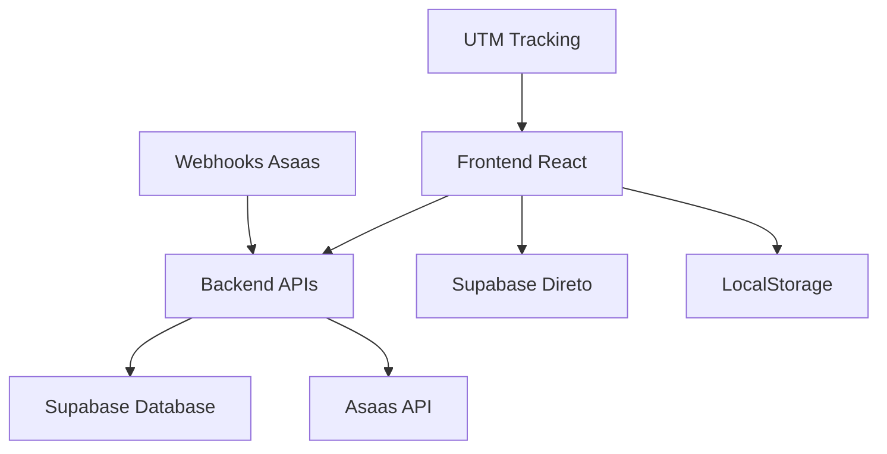

# Design Document: Correção Módulo de Afiliados

## Overview

Este documento detalha o design técnico para correção do módulo de afiliados, transformando o sistema atual (híbrido com mocks) em um sistema totalmente funcional com dados reais e APIs backend implementadas.

## Architecture

### Arquitetura Atual vs. Proposta

**ATUAL:**
```
Frontend (React) → Supabase Direto (algumas páginas)
                 → APIs Inexistentes → Dados Mock (outras páginas)
```

**PROPOSTA:**
```
Frontend (React) → APIs Backend (Python/FastAPI) → Supabase
                 → Supabase Direto (operações simples)
                 → Asaas API (validações e splits)
```

### Fluxo de Dados Revisado



## Components and Interfaces

### 1. Frontend Components (Modificações)

#### 1.1 AfiliadosCadastro.tsx
**Mudanças:**
- Remover campo `walletId`
- Remover modal "Já tem Asaas?"
- Remover campo `referralCode` manual
- Simplificar validação para apenas campos básicos

**Interface Atualizada:**
```typescript
interface CreateAffiliateData {
  name: string;
  email: string;
  phone?: string;
  document?: string;
  // walletId: removido
  // referralCode: removido
}
```

#### 1.2 Configuracoes.tsx (Dashboard Afiliado)
**Mudanças:**
- Adicionar seção "Configuração de Pagamento"
- Implementar modal "Já tem Asaas?" (movido do cadastro)
- Adicionar validação de Wallet ID via API real
- Implementar salvamento de configurações

**Nova Interface:**
```typescript
interface WalletConfiguration {
  hasAsaasAccount: boolean;
  walletId?: string;
  isValidated: boolean;
  validatedAt?: string;
}
```

#### 1.3 Dashboard Components
**Mudanças em Inicio.tsx:**
- Substituir dados mock por chamadas à API `/api/affiliates/dashboard`
- Implementar loading states
- Adicionar tratamento de erro e estados vazios

**Mudanças em Comissoes.tsx:**
- Conectar com API `/api/affiliates/:id/commissions`
- Implementar paginação real
- Adicionar filtros funcionais

**Mudanças em Recebimentos.tsx:**
- Conectar com dados reais de withdrawals
- Implementar histórico de pagamentos real
- Adicionar gráficos com dados reais

### 2. Backend APIs (Novas Implementações)

#### 2.1 agent/src/api/affiliates.py
**Novo arquivo com endpoints:**

```python
from fastapi import APIRouter, Depends, HTTPException
from typing import Optional, List
import httpx
from ..services.affiliate_service import AffiliateService
from ..schemas.affiliate_schemas import *

router = APIRouter(prefix="/api/affiliates", tags=["affiliates"])

@router.get("/dashboard")
async def get_affiliate_dashboard(current_user: User = Depends(get_current_user)):
    """Busca dados completos do dashboard do afiliado"""
    pass

@router.get("/referral-link")
async def get_referral_link(current_user: User = Depends(get_current_user)):
    """Gera link de indicação com UTM tracking"""
    pass

@router.post("/validate-wallet")
async def validate_wallet(wallet_data: WalletValidationRequest):
    """Valida Wallet ID via API Asaas real"""
    pass

@router.get("/{affiliate_id}/commissions")
async def get_affiliate_commissions(
    affiliate_id: str,
    page: int = 1,
    limit: int = 20
):
    """Busca comissões do afiliado com paginação"""
    pass
```

#### 2.2 Services Layer

**agent/src/services/affiliate_service.py:**
```python
class AffiliateService:
    def __init__(self, supabase_client, asaas_client):
        self.supabase = supabase_client
        self.asaas = asaas_client
    
    async def get_dashboard_data(self, user_id: str) -> DashboardData:
        """Busca dados reais do dashboard"""
        pass
    
    async def validate_wallet_real(self, wallet_id: str) -> WalletValidation:
        """Validação real via API Asaas"""
        pass
    
    async def generate_referral_link(self, affiliate_id: str) -> ReferralLink:
        """Gera link com UTM tracking"""
        pass
```

**agent/src/services/asaas_service.py:**
```python
class AsaasService:
    def __init__(self, api_key: str, base_url: str):
        self.api_key = api_key
        self.base_url = base_url
    
    async def validate_wallet(self, wallet_id: str) -> dict:
        """Validação real de Wallet ID"""
        pass
    
    async def create_split(self, payment_id: str, splits: List[Split]) -> dict:
        """Criação de split automático"""
        pass
```

### 3. Database Schema (Ajustes)

#### 3.1 Tabela affiliates (Modificação)
```sql
-- Tornar wallet_id opcional inicialmente
ALTER TABLE affiliates 
ALTER COLUMN wallet_id DROP NOT NULL;

-- Adicionar campos de controle
ALTER TABLE affiliates 
ADD COLUMN wallet_configured_at TIMESTAMPTZ,
ADD COLUMN onboarding_completed BOOLEAN DEFAULT FALSE;
```

#### 3.2 Dados de Teste (Scripts)
```sql
-- Script para popular tabelas vazias
INSERT INTO commissions (affiliate_id, order_id, level, percentage, commission_value_cents, status)
VALUES 
  -- Dados de teste realistas
  (uuid_generate_v4(), uuid_generate_v4(), 1, 15.00, 49350, 'paid'),
  (uuid_generate_v4(), uuid_generate_v4(), 2, 3.00, 9870, 'pending');

INSERT INTO withdrawals (affiliate_id, requested_amount_cents, status)
VALUES
  -- Dados de teste para saques
  (uuid_generate_v4(), 50000, 'completed'),
  (uuid_generate_v4(), 25000, 'pending');
```

## Data Models

### 1. Frontend Interfaces (Atualizadas)

```typescript
// Dados do dashboard (real)
interface DashboardData {
  affiliate: AffiliateData;
  stats: {
    totalClicks: number;
    totalConversions: number;
    totalCommissions: number;
    conversionRate: number;
    avgCommission: number;
    lastConversionAt?: string;
  };
  recentCommissions: Commission[];
  networkSummary: NetworkSummary;
  referralLink: string;
}

// Configuração de Wallet
interface WalletConfig {
  isConfigured: boolean;
  walletId?: string;
  validatedAt?: string;
  asaasAccountName?: string;
}

// UTM Tracking
interface UTMParams {
  source: string;
  medium: string;
  campaign: string;
  term?: string;
  content?: string;
}
```

### 2. Backend Schemas

```python
# Pydantic schemas
class DashboardResponse(BaseModel):
    affiliate: AffiliateData
    stats: AffiliateStats
    recent_commissions: List[Commission]
    network_summary: NetworkSummary
    referral_link: str

class WalletValidationRequest(BaseModel):
    wallet_id: str

class WalletValidationResponse(BaseModel):
    is_valid: bool
    is_active: bool
    account_name: Optional[str]
    error_message: Optional[str]
```

## Correctness Properties

*A property is a characteristic or behavior that should hold true across all valid executions of a system-essentially, a formal statement about what the system should do. Properties serve as the bridge between human-readable specifications and machine-verifiable correctness guarantees.*

### Property-Based Testing Overview

Property-based testing (PBT) validates software correctness by testing universal properties across many generated inputs. Each property is a formal specification that should hold for all valid inputs.

### Core Properties

**Property 1: Cadastro Simplificado**
*For any* valid user data (name, email, phone, document), the registration process should complete successfully without requiring wallet_id or referral_code
**Validates: Requirements 1.1, 1.2, 1.4, 1.5**

**Property 2: Wallet Configuration Post-Registration**
*For any* registered affiliate without wallet_id, accessing /configuracoes should display wallet configuration section with appropriate status
**Validates: Requirements 2.1, 2.2**

**Property 3: Wallet Validation Consistency**
*For any* wallet_id submitted for validation, the system should return consistent results when queried multiple times within cache period
**Validates: Requirements 2.6, 2.7**

**Property 4: Tracking Persistence**
*For any* referral code saved in localStorage, the code should persist across page navigation until conversion or expiration
**Validates: Requirements 3.1, 3.2**

**Property 5: API Data Consistency**
*For any* affiliate dashboard request, the data returned by APIs should match the data stored in Supabase
**Validates: Requirements 4.1, 4.5**

**Property 6: Commission Calculation Accuracy**
*For any* valid order with affiliate attribution, the calculated commission should equal the expected percentage of order value
**Validates: Requirements 6.1, 6.2**

**Property 7: UTM Parameter Preservation**
*For any* referral link generated, all UTM parameters should be preserved and trackable through the conversion funnel
**Validates: Requirements 3.6**

**Property 8: Error Handling Consistency**
*For any* API failure or validation error, the system should provide user-friendly error messages and maintain system stability
**Validates: Requirements 8.1, 8.2, 8.3**

## Error Handling

### 1. Frontend Error Handling

```typescript
// Padrão de error handling para APIs
class AffiliateApiClient {
  async callApi<T>(endpoint: string, options?: RequestInit): Promise<T> {
    try {
      const response = await fetch(endpoint, options);
      
      if (!response.ok) {
        throw new ApiError(response.status, await response.text());
      }
      
      return await response.json();
    } catch (error) {
      if (error instanceof ApiError) {
        throw error;
      }
      
      // Network or other errors
      throw new NetworkError('Erro de conexão. Tente novamente.');
    }
  }
}
```

### 2. Backend Error Handling

```python
# Exception handling middleware
@app.exception_handler(ValidationError)
async def validation_exception_handler(request: Request, exc: ValidationError):
    return JSONResponse(
        status_code=400,
        content={
            "error": "Dados inválidos",
            "details": exc.errors(),
            "timestamp": datetime.utcnow().isoformat()
        }
    )

@app.exception_handler(AsaasAPIError)
async def asaas_exception_handler(request: Request, exc: AsaasAPIError):
    return JSONResponse(
        status_code=502,
        content={
            "error": "Erro na validação da carteira",
            "message": "Verifique se a Wallet ID está correta",
            "timestamp": datetime.utcnow().isoformat()
        }
    )
```

### 3. Fallback Strategies

```typescript
// Fallback para quando APIs estão indisponíveis
const useDashboardData = () => {
  const [data, setData] = useState<DashboardData | null>(null);
  const [loading, setLoading] = useState(true);
  const [error, setError] = useState<string | null>(null);
  
  useEffect(() => {
    const fetchData = async () => {
      try {
        // Tentar API primeiro
        const apiData = await affiliateApi.getDashboard();
        setData(apiData);
      } catch (apiError) {
        try {
          // Fallback para Supabase direto
          const fallbackData = await supabaseFallback.getDashboard();
          setData(fallbackData);
        } catch (fallbackError) {
          setError('Não foi possível carregar os dados');
        }
      } finally {
        setLoading(false);
      }
    };
    
    fetchData();
  }, []);
  
  return { data, loading, error };
};
```

## Testing Strategy

### Dual Testing Approach

**Unit Tests:**
- Validação de componentes individuais
- Testes de funções utilitárias
- Mocking de APIs externas
- Testes de edge cases específicos

**Property-Based Tests:**
- Validação de propriedades universais
- Testes com dados gerados automaticamente
- Verificação de invariantes do sistema
- Testes de integração end-to-end

### Testing Tools and Frameworks

**Frontend (TypeScript/React):**
- **Unit Tests:** Jest + React Testing Library
- **Property Tests:** fast-check
- **Integration Tests:** Cypress ou Playwright
- **API Mocking:** MSW (Mock Service Worker)

**Backend (Python/FastAPI):**
- **Unit Tests:** pytest + pytest-asyncio
- **Property Tests:** hypothesis
- **Integration Tests:** httpx + TestClient
- **Database Tests:** pytest-postgresql

**Property Testing Configuration:**
```typescript
// fast-check configuration
const fcConfig = {
  numRuns: 100,
  seed: 42,
  path: "0:0:0", // for reproducible failures
  endOnFailure: true
};
```

```python
# hypothesis configuration
from hypothesis import settings, Verbosity

@settings(
    max_examples=100,
    deadline=5000,  # 5 seconds per test
    verbosity=Verbosity.verbose
)
```

### Test Configuration

**Property Tests (minimum 100 iterations each):**
```typescript
// Exemplo de property test
describe('Affiliate Registration Property Tests', () => {
  test('Property 1: Simplified Registration', async () => {
    await fc.assert(
      fc.asyncProperty(
        fc.record({
          name: fc.string({ minLength: 3, maxLength: 100 }),
          email: fc.emailAddress(),
          phone: fc.option(fc.string()),
          document: fc.option(fc.string())
        }),
        async (userData) => {
          const result = await registerAffiliate(userData);
          
          // Property: Registration should succeed without wallet_id
          expect(result.success).toBe(true);
          expect(result.affiliate.walletId).toBeUndefined();
          expect(result.affiliate.status).toBe('pending');
        }
      ),
      { numRuns: 100 }
    );
  });
});
```

**Unit Tests:**
```typescript
// Exemplo de unit test
describe('Wallet Configuration Component', () => {
  test('should display unconfigured state when no wallet_id', () => {
    render(<WalletConfiguration affiliate={{ walletId: null }} />);
    
    expect(screen.getByText('Não configurada')).toBeInTheDocument();
    expect(screen.getByText('Configurar')).toBeInTheDocument();
  });
  
  test('should display configured state when wallet_id exists', () => {
    render(<WalletConfiguration affiliate={{ 
      walletId: 'wal_123', 
      walletValidatedAt: '2026-01-04' 
    }} />);
    
    expect(screen.getByText('Configurada')).toBeInTheDocument();
    expect(screen.getByText('wal_123')).toBeInTheDocument();
  });
});
```

### Integration Tests

```python
# Backend integration tests
@pytest.mark.asyncio
async def test_affiliate_dashboard_integration():
    """Testa integração completa do dashboard"""
    # Setup: criar afiliado de teste
    affiliate = await create_test_affiliate()
    
    # Setup: criar dados de teste
    await create_test_commissions(affiliate.id)
    await create_test_clicks(affiliate.id)
    
    # Test: buscar dashboard
    response = await client.get(f"/api/affiliates/dashboard", 
                              headers=auth_headers(affiliate.user_id))
    
    # Assertions
    assert response.status_code == 200
    data = response.json()
    assert data["affiliate"]["id"] == affiliate.id
    assert len(data["recent_commissions"]) > 0
    assert data["stats"]["totalClicks"] > 0
```