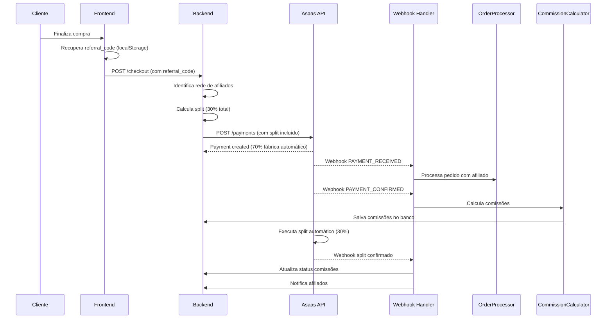
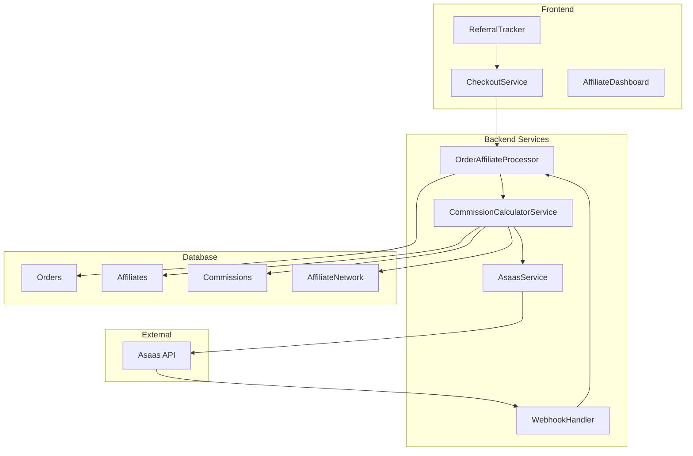

# Design Document

## Overview

Este documento detalha o design técnico para correção crítica do sistema de pagamentos e afiliados da Slim Quality. O sistema atual possui toda a estrutura implementada mas não funcional devido a problemas na integração com Asaas, processamento de webhooks e rastreamento de afiliados.

### Problema Atual
- Split sendo enviado separadamente após criação do pagamento (incorreto)
- Lógica de split incluindo 70% para fábrica (desnecessário)
- Wallet IDs em formato UUID ao invés de formato Asaas
- Webhooks incompletos (apenas eventos básicos)
- ReferralTracker não implementado no frontend
- OrderAffiliateProcessor nunca executado
- Dados 100% mockados no dashboard

### Solução Proposta
Correção focada em 4 pontos críticos:
1. Split correto na criação do pagamento
2. Webhook handler funcional
3. Rastreamento de afiliados ativo
4. Ativação de todos os componentes

## Architecture

### Fluxo Correto de Pagamento com Split



### Arquitetura de Componentes



## Components and Interfaces

### 1. ReferralTracker (Frontend)

**Localização:** `src/utils/referral-tracker.ts`

**Responsabilidade:** Capturar, armazenar e recuperar códigos de referência de afiliados.

**Interface:**
```typescript
export class ReferralTracker {
  /**
   * Captura código de referência da URL (?ref=CODIGO)
   * Salva em localStorage com TTL de 30 dias
   */
  static captureReferralCode(): void;
  
  /**
   * Recupera código de referência válido do localStorage
   * @returns Código de referência ou null se expirado/inexistente
   */
  static getReferralCode(): string | null;
  
  /**
   * Remove código de referência após conversão
   */
  static clearReferralCode(): void;
  
  /**
   * Verifica se código ainda é válido (não expirado)
   */
  static isReferralCodeValid(): boolean;
}
```

**Implementação:**
```typescript
export class ReferralTracker {
  private static readonly STORAGE_KEY = 'referral_code';
  private static readonly EXPIRES_KEY = 'referral_expires';
  private static readonly TTL_DAYS = 30;

  static captureReferralCode(): void {
    const urlParams = new URLSearchParams(window.location.search);
    const refCode = urlParams.get('ref');
    
    if (refCode && refCode.trim()) {
      const expiresAt = Date.now() + (this.TTL_DAYS * 24 * 60 * 60 * 1000);
      localStorage.setItem(this.STORAGE_KEY, refCode.trim());
      localStorage.setItem(this.EXPIRES_KEY, expiresAt.toString());
      
      console.log(`Referral code captured: ${refCode}`);
    }
  }

  static getReferralCode(): string | null {
    const code = localStorage.getItem(this.STORAGE_KEY);
    const expires = localStorage.getItem(this.EXPIRES_KEY);
    
    if (!code || !expires) return null;
    
    if (Date.now() > parseInt(expires)) {
      this.clearReferralCode();
      return null;
    }
    
    return code;
  }

  static clearReferralCode(): void {
    localStorage.removeItem(this.STORAGE_KEY);
    localStorage.removeItem(this.EXPIRES_KEY);
  }

  static isReferralCodeValid(): boolean {
    return this.getReferralCode() !== null;
  }
}
```

### 2. CheckoutService (Backend)

**Localização:** `src/services/checkout.service.ts`

**Responsabilidade:** Processar checkout com split correto incluído na criação do pagamento.

**Interface:**
```typescript
interface CheckoutRequest {
  productId: string;
  quantity: number;
  customerData: CustomerData;
  paymentMethod: 'PIX' | 'CREDIT_CARD';
  referralCode?: string;
}

interface SplitCalculation {
  splits: AsaasSplit[];
  totalSplitPercentage: number;
  affiliateNetwork: AffiliateNetwork;
}

export class CheckoutService {
  /**
   * Processa checkout completo com split automático
   */
  async processCheckout(request: CheckoutRequest): Promise<CheckoutResult>;
  
  /**
   * Calcula split baseado na rede de afiliados
   */
  private calculateSplit(affiliateNetwork: AffiliateNetwork): SplitCalculation;
  
  /**
   * Valida todas as Wallet IDs antes de enviar
   */
  private async validateWalletIds(splits: AsaasSplit[]): Promise<boolean>;
}
```

**Lógica de Cálculo de Split:**
```typescript
private calculateSplit(affiliateNetwork: AffiliateNetwork): SplitCalculation {
  const splits: AsaasSplit[] = [];
  
  if (!affiliateNetwork.n1) {
    // SEM AFILIADO: 15% cada para gestores
    splits.push(
      { walletId: ASAAS_WALLET_RENUM, percentualValue: 15 },
      { walletId: ASAAS_WALLET_JB, percentualValue: 15 }
    );
  } else if (!affiliateNetwork.n2) {
    // APENAS N1: 15% + 7.5% + 7.5%
    splits.push(
      { walletId: affiliateNetwork.n1.walletId, percentualValue: 15 },
      { walletId: ASAAS_WALLET_RENUM, percentualValue: 7.5 },
      { walletId: ASAAS_WALLET_JB, percentualValue: 7.5 }
    );
  } else if (!affiliateNetwork.n3) {
    // N1+N2: 15% + 3% + 6% + 6%
    splits.push(
      { walletId: affiliateNetwork.n1.walletId, percentualValue: 15 },
      { walletId: affiliateNetwork.n2.walletId, percentualValue: 3 },
      { walletId: ASAAS_WALLET_RENUM, percentualValue: 6 },
      { walletId: ASAAS_WALLET_JB, percentualValue: 6 }
    );
  } else {
    // REDE COMPLETA: 15% + 3% + 2% + 5% + 5%
    splits.push(
      { walletId: affiliateNetwork.n1.walletId, percentualValue: 15 },
      { walletId: affiliateNetwork.n2.walletId, percentualValue: 3 },
      { walletId: affiliateNetwork.n3.walletId, percentualValue: 2 },
      { walletId: ASAAS_WALLET_RENUM, percentualValue: 5 },
      { walletId: ASAAS_WALLET_JB, percentualValue: 5 }
    );
  }
  
  const totalSplitPercentage = splits.reduce((sum, split) => sum + split.percentualValue, 0);
  
  // Validação crítica: deve ser exatamente 30%
  if (totalSplitPercentage !== 30) {
    throw new Error(`Split calculation error: total is ${totalSplitPercentage}%, expected 30%`);
  }
  
  return { splits, totalSplitPercentage, affiliateNetwork };
}
```

### 3. WebhookHandler (Backend)

**Localização:** `src/api/webhook/asaas.ts`

**Responsabilidade:** Processar webhooks do Asaas e disparar ações automáticas.

**Interface:**
```typescript
interface AsaasWebhookPayload {
  event: string;
  payment: AsaasPayment;
  dateCreated: string;
}

export class AsaasWebhookHandler {
  /**
   * Endpoint principal para receber webhooks
   */
  async handleWebhook(payload: AsaasWebhookPayload, signature: string): Promise<void>;
  
  /**
   * Valida assinatura do webhook
   */
  private validateSignature(payload: string, signature: string): boolean;
  
  /**
   * Processa evento PAYMENT_RECEIVED
   */
  private async handlePaymentReceived(payment: AsaasPayment): Promise<void>;
  
  /**
   * Processa evento PAYMENT_CONFIRMED
   */
  private async handlePaymentConfirmed(payment: AsaasPayment): Promise<void>;
  
  /**
   * Processa erros de split
   */
  private async handleSplitError(payment: AsaasPayment, event: string): Promise<void>;
}
```

**Eventos Suportados:**
```typescript
const SUPPORTED_EVENTS = {
  PAYMENT_RECEIVED: 'handlePaymentReceived',
  PAYMENT_CONFIRMED: 'handlePaymentConfirmed',
  PAYMENT_SPLIT_CANCELLED: 'handleSplitError',
  PAYMENT_SPLIT_DIVERGENCE_BLOCK: 'handleSplitError',
  PAYMENT_OVERDUE: 'handlePaymentOverdue',
  PAYMENT_REFUNDED: 'handlePaymentRefunded'
} as const;
```

### 4. OrderAffiliateProcessor (Backend)

**Localização:** `src/services/sales/order-affiliate-processor.ts`

**Responsabilidade:** Processar pedidos com afiliados e disparar cálculo de comissões.

**Interface Corrigida:**
```typescript
export class OrderAffiliateProcessor {
  /**
   * Processa pedido com afiliado (chamado pelo webhook)
   */
  async processOrderWithAffiliate(orderId: string): Promise<ProcessingResult>;
  
  /**
   * Identifica rede de afiliados baseada no referral_code
   */
  private async buildAffiliateNetwork(referralCode: string): Promise<AffiliateNetwork>;
  
  /**
   * Registra logs detalhados para auditoria
   */
  private async logProcessing(orderId: string, result: ProcessingResult): Promise<void>;
}
```

### 5. CommissionCalculatorService (Backend)

**Localização:** `src/services/affiliates/commission-calculator.service.ts`

**Responsabilidade:** Calcular comissões multinível com redistribuição.

**Interface Corrigida:**
```typescript
export class CommissionCalculatorService {
  /**
   * Calcula comissões para um pedido específico
   */
  async calculateCommissions(orderId: string): Promise<CommissionResult>;
  
  /**
   * Aplica regras de redistribuição quando rede incompleta
   */
  private applyRedistributionRules(network: AffiliateNetwork, baseCommissions: CommissionBreakdown): CommissionBreakdown;
  
  /**
   * Salva comissões calculadas no banco
   */
  private async saveCommissions(orderId: string, commissions: CommissionBreakdown): Promise<void>;
}
```

## Data Models

### Affiliate Network Structure

```typescript
interface AffiliateNetwork {
  n1?: {
    id: string;
    walletId: string;
    referralCode: string;
    status: 'active' | 'pending' | 'inactive';
  };
  n2?: {
    id: string;
    walletId: string;
    referralCode: string;
    status: 'active' | 'pending' | 'inactive';
  };
  n3?: {
    id: string;
    walletId: string;
    referralCode: string;
    status: 'active' | 'pending' | 'inactive';
  };
}
```

### Commission Breakdown

```typescript
interface CommissionBreakdown {
  orderId: string;
  totalAmount: number;
  splitPercentage: number; // Sempre 30%
  commissions: {
    n1: number;
    n2: number;
    n3: number;
    renum: number;
    jb: number;
  };
  redistributionApplied: boolean;
  calculatedAt: Date;
}
```

### Asaas Split Format

```typescript
interface AsaasSplit {
  walletId: string; // Formato: wal_xxxxx
  percentualValue: number; // Percentual do valor total
}

interface AsaasPaymentRequest {
  customer: string;
  billingType: 'PIX' | 'CREDIT_CARD';
  value: number;
  dueDate: string;
  description: string;
  split: AsaasSplit[]; // CRÍTICO: Incluir na criação
}
```

## Error Handling

### Validation Errors

```typescript
class WalletValidationError extends Error {
  constructor(walletId: string, reason: string) {
    super(`Invalid wallet ID ${walletId}: ${reason}`);
    this.name = 'WalletValidationError';
  }
}

class SplitCalculationError extends Error {
  constructor(expected: number, actual: number) {
    super(`Split calculation error: expected ${expected}%, got ${actual}%`);
    this.name = 'SplitCalculationError';
  }
}

class AffiliateNetworkError extends Error {
  constructor(referralCode: string, reason: string) {
    super(`Affiliate network error for ${referralCode}: ${reason}`);
    this.name = 'AffiliateNetworkError';
  }
}
```

### Error Recovery Strategies

1. **Wallet ID Validation Failure:**
   - Manter afiliado como "pending"
   - Notificar administrador
   - Processar venda sem split de afiliado

2. **Split Calculation Error:**
   - Registrar erro detalhado
   - Usar fallback (sem afiliado)
   - Alertar para correção manual

3. **Webhook Processing Failure:**
   - Implementar retry automático (3 tentativas)
   - Registrar em fila de reprocessamento
   - Alertar após falhas consecutivas

4. **Commission Calculation Error:**
   - Registrar erro com contexto completo
   - Marcar comissão para revisão manual
   - Notificar administradores

## Testing Strategy

### Unit Tests

**Componentes a testar:**
- ReferralTracker: Captura, armazenamento e recuperação de códigos
- CheckoutService: Cálculo de split e validação de Wallet IDs
- CommissionCalculatorService: Cálculos de comissão e redistribuição
- WebhookHandler: Processamento de eventos e validação de assinatura

**Cenários de teste:**
- Split sem afiliado (15% + 15%)
- Split com N1 apenas (15% + 7.5% + 7.5%)
- Split com N1+N2 (15% + 3% + 6% + 6%)
- Split com rede completa (15% + 3% + 2% + 5% + 5%)
- Wallet IDs inválidas
- Códigos de referência expirados
- Webhooks com assinatura inválida

### Integration Tests

**Fluxos a testar:**
- Fluxo completo: Captura referral → Checkout → Webhook → Comissão
- Integração com Asaas API (sandbox)
- Processamento de webhooks reais
- Cálculo e salvamento de comissões

## Correctness Properties

*A property is a characteristic or behavior that should hold true across all valid executions of a system-essentially, a formal statement about what the system should do. Properties serve as the bridge between human-readable specifications and machine-verifiable correctness guarantees.*

### Property-Based Testing Overview

Property-based testing (PBT) validates software correctness by testing universal properties across many generated inputs. Each property is a formal specification that should hold for all valid inputs.

### Core Principles

1. **Universal Quantification**: Every property must contain an explicit "for all" statement
2. **Requirements Traceability**: Each property must reference the requirements it validates
3. **Executable Specifications**: Properties must be implementable as automated tests
4. **Comprehensive Coverage**: Properties should cover all testable acceptance criteria

### Correctness Properties

**Property 1: Split Total Consistency**
*For any* valid affiliate network configuration, the calculated split percentages should sum to exactly 30% of the payment value
**Validates: Requirements 1.3, 4.5, 8.2**

**Property 2: Split Creation Integration**
*For any* payment with affiliates, the split configuration should be included in the payment creation request, not sent separately
**Validates: Requirements 1.1**

**Property 3: Factory Split Exclusion**
*For any* calculated split, there should be no 70% allocation for the factory (handled automatically by Asaas API Key)
**Validates: Requirements 1.2**

**Property 4: Wallet ID Format Validation**
*For any* wallet ID used in the system, it should match the format wal_[a-zA-Z0-9]{20} before being sent to Asaas
**Validates: Requirements 1.4, 8.1**

**Property 5: Webhook Authentication**
*For any* received webhook, the authentication token should be validated before processing the payload
**Validates: Requirements 2.1**

**Property 6: Webhook Retry Mechanism**
*For any* webhook processing failure, the system should implement automatic retry up to 3 attempts
**Validates: Requirements 2.6**

**Property 7: Referral Code Capture**
*For any* URL with ?ref=CODIGO parameter, the referral code should be captured and stored in localStorage with 30-day TTL
**Validates: Requirements 3.1, 3.2**

**Property 8: Referral Code Persistence**
*For any* captured referral code within TTL, it should be retrievable during checkout and associated with the order
**Validates: Requirements 3.3, 3.4**

**Property 9: Referral Code Cleanup**
*For any* confirmed conversion, the referral code should be cleared from localStorage after successful processing
**Validates: Requirements 3.5**

**Property 10: Affiliate Status Activation**
*For any* affiliate with pending status and valid wallet ID, activation should change status to "active" and trigger welcome notification
**Validates: Requirements 5.1, 5.5**

**Property 11: Wallet ID Format Conversion**
*For any* UUID format wallet ID, the system should convert it to proper Asaas wal_xxxxx format during correction
**Validates: Requirements 5.2**

**Property 12: External Wallet Validation**
*For any* wallet ID, the system should verify its existence and status via Asaas API before using in splits
**Validates: Requirements 5.3**

**Property 13: Order Processing Chain**
*For any* confirmed payment webhook, the system should trigger OrderAffiliateProcessor which should execute CommissionCalculatorService
**Validates: Requirements 6.1, 6.2**

**Property 14: Commission Calculation Logging**
*For any* commission calculation, detailed logs should be created for audit purposes including all calculation steps
**Validates: Requirements 6.3, 10.1, 10.2**

**Property 15: Error Handling Consistency**
*For any* processing error, the system should implement proper error handling, logging, and transaction rejection
**Validates: Requirements 6.4, 8.5**

**Property 16: Status Update Consistency**
*For any* completed processing, commission statuses should be updated to reflect the current state
**Validates: Requirements 6.5**

**Property 17: Webhook Security Configuration**
*For any* webhook configuration, a secure authentication token should be used for all event types
**Validates: Requirements 7.7**

**Property 18: Affiliate Status Verification**
*For any* affiliate used in split calculations, the system should verify the affiliate has "active" status
**Validates: Requirements 8.3**

**Property 19: Network Loop Prevention**
*For any* constructed affiliate network, there should be no circular references (A→B→A patterns)
**Validates: Requirements 8.4**

**Property 20: Split Execution Confirmation**
*For any* executed split, confirmation of deposits should be logged for audit and reconciliation
**Validates: Requirements 10.4**

**Property 21: Error Context Logging**
*For any* system error, complete context including input parameters, system state, and error details should be logged
**Validates: Requirements 10.3**

## Error Handling

### Critical Error Scenarios

#### 1. Wallet ID Validation Failures
```typescript
// Scenario: Invalid wallet format or non-existent wallet
try {
  await this.validateWalletId(walletId);
} catch (error) {
  if (error instanceof WalletValidationError) {
    // Keep affiliate as pending, notify admin
    await this.notifyAdminWalletError(affiliateId, walletId, error.message);
    // Process sale without affiliate split
    return this.processSaleWithoutAffiliate(orderData);
  }
  throw error;
}
```

#### 2. Split Calculation Errors
```typescript
// Scenario: Split percentages don't sum to 30%
const totalSplit = splits.reduce((sum, split) => sum + split.percentualValue, 0);
if (totalSplit !== 30) {
  const error = new SplitCalculationError(30, totalSplit);
  await this.logCriticalError('SPLIT_CALCULATION_ERROR', {
    orderId,
    expectedTotal: 30,
    actualTotal: totalSplit,
    splits,
    affiliateNetwork
  });
  
  // Fallback: Process without affiliate
  return this.processSaleWithoutAffiliate(orderData);
}
```

#### 3. Webhook Processing Failures
```typescript
// Scenario: Webhook signature validation fails or processing errors
export class WebhookRetryHandler {
  private static readonly MAX_RETRIES = 3;
  private static readonly RETRY_DELAYS = [1000, 5000, 15000]; // ms
  
  async processWithRetry(payload: AsaasWebhookPayload): Promise<void> {
    for (let attempt = 0; attempt < this.MAX_RETRIES; attempt++) {
      try {
        await this.processWebhook(payload);
        return; // Success
      } catch (error) {
        if (attempt === this.MAX_RETRIES - 1) {
          // Final attempt failed
          await this.logFailedWebhook(payload, error);
          await this.notifyAdminWebhookFailure(payload, error);
          throw error;
        }
        
        // Wait before retry
        await this.delay(this.RETRY_DELAYS[attempt]);
      }
    }
  }
}
```

#### 4. Commission Calculation Failures
```typescript
// Scenario: Error during commission calculation
try {
  const commissions = await this.calculateCommissions(orderId);
  await this.saveCommissions(orderId, commissions);
} catch (error) {
  // Mark for manual review
  await this.markCommissionForReview(orderId, {
    error: error.message,
    context: { orderId, affiliateNetwork },
    timestamp: new Date(),
    requiresManualIntervention: true
  });
  
  // Alert administrators
  await this.alertAdministrators('COMMISSION_CALCULATION_FAILED', {
    orderId,
    error: error.message
  });
}
```

### Error Recovery Strategies

1. **Graceful Degradation**: Process sales without affiliate splits when affiliate system fails
2. **Automatic Retry**: Implement exponential backoff for transient failures
3. **Manual Review Queue**: Queue failed operations for manual intervention
4. **Real-time Alerts**: Notify administrators of critical failures immediately
5. **Audit Trail**: Maintain complete logs of all errors and recovery actions

## Testing Strategy

### Dual Testing Approach

The system requires both unit tests and property-based tests for comprehensive coverage:

- **Unit tests**: Verify specific examples, edge cases, and error conditions
- **Property tests**: Verify universal properties across all inputs
- Both are complementary and necessary for comprehensive coverage

### Unit Testing Focus

**Specific Examples to Test:**
- Split calculation for each scenario (no affiliate, N1 only, N1+N2, complete network)
- Webhook processing for each event type
- Referral code capture and expiration scenarios
- Error handling for invalid wallet IDs
- Commission calculation edge cases

**Integration Points:**
- Asaas API integration (using sandbox)
- Database operations for commission storage
- Webhook endpoint security validation
- Frontend-backend referral code flow

**Error Conditions:**
- Invalid webhook signatures
- Malformed affiliate networks
- Expired referral codes
- Network timeout scenarios

### Property-Based Testing Configuration

**Framework**: Use fast-check for TypeScript/JavaScript property-based testing

**Test Configuration:**
- Minimum 100 iterations per property test
- Each property test must reference its design document property
- Tag format: **Feature: correcao-sistema-pagamentos, Property {number}: {property_text}**

**Example Property Test:**
```typescript
import fc from 'fast-check';

describe('Split Calculation Properties', () => {
  it('Property 1: Split Total Consistency', () => {
    fc.assert(fc.property(
      affiliateNetworkArbitrary(),
      (network) => {
        const splits = calculateSplit(network);
        const total = splits.reduce((sum, split) => sum + split.percentualValue, 0);
        return total === 30;
      }
    ), { numRuns: 100 });
  });
  
  // Tag: Feature: correcao-sistema-pagamentos, Property 1: Split Total Consistency
});
```

**Custom Arbitraries for Testing:**
```typescript
// Generate valid affiliate networks
const affiliateNetworkArbitrary = () => fc.record({
  n1: fc.option(affiliateArbitrary()),
  n2: fc.option(affiliateArbitrary()),
  n3: fc.option(affiliateArbitrary())
});

// Generate valid wallet IDs
const walletIdArbitrary = () => fc.string({ minLength: 20, maxLength: 20 })
  .map(s => `wal_${s.replace(/[^a-zA-Z0-9]/g, 'a')}`);

// Generate valid referral codes
const referralCodeArbitrary = () => fc.string({ minLength: 6, maxLength: 12 })
  .filter(s => /^[A-Z0-9]+$/.test(s));
```

### Test Coverage Requirements

**Minimum Coverage Targets:**
- Unit test coverage: > 85%
- Property test coverage: All 21 properties implemented
- Integration test coverage: All critical paths tested
- Error scenario coverage: All error handlers tested

**Critical Test Scenarios:**
1. Complete affiliate network (N1+N2+N3) with valid wallets
2. Partial networks (N1 only, N1+N2) with redistribution
3. No affiliate scenario with manager-only splits
4. Invalid wallet ID handling and fallback
5. Webhook processing for all supported events
6. Referral code lifecycle (capture → store → retrieve → clear)
7. Commission calculation with audit logging
8. Error recovery and retry mechanisms

### Performance Testing

**Load Testing Scenarios:**
- Concurrent webhook processing (100+ simultaneous webhooks)
- High-volume referral code capture (1000+ codes/minute)
- Bulk commission calculations (500+ orders/batch)
- Database performance under load

**Performance Targets:**
- Webhook processing: < 500ms per webhook
- Split calculation: < 100ms per calculation
- Referral code operations: < 50ms per operation
- Commission calculation: < 200ms per order

### Security Testing

**Security Test Cases:**
- Webhook signature validation with invalid signatures
- SQL injection attempts in referral codes
- XSS attempts in affiliate data
- Rate limiting on webhook endpoints
- Authentication bypass attempts

**Security Requirements:**
- All webhook signatures must be validated
- All user inputs must be sanitized
- All database queries must use parameterized statements
- All API endpoints must implement rate limiting
- All sensitive operations must be logged