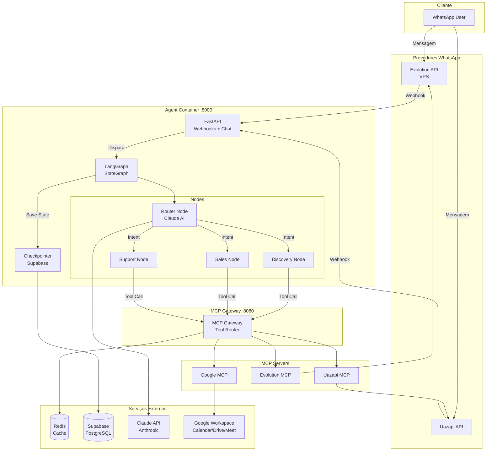

# Sprint 2: Backend Agente - Design Técnico

## 🏗️ Arquitetura Geral



## 📁 Estrutura de Arquivos

```
agent/
├── src/
│   ├── main.py                    # Entry point FastAPI
│   ├── config.py                  # Configurações e env vars
│   │
│   ├── graph/
│   │   ├── __init__.py
│   │   ├── state.py               # AgentState TypedDict
│   │   ├── builder.py             # Monta StateGraph
│   │   ├── checkpointer.py        # Supabase Checkpointer
│   │   │
│   │   ├── nodes/
│   │   │   ├── __init__.py
│   │   │   ├── router.py          # Router Node (Claude)
│   │   │   ├── discovery.py       # Discovery Node
│   │   │   ├── sales.py           # Sales Node
│   │   │   └── support.py         # Support Node
│   │   │
│   │   └── edges.py               # Conditional edges
│   │
│   ├── api/
│   │   ├── __init__.py
│   │   ├── main.py                # FastAPI app
│   │   ├── webhooks.py            # POST /api/webhooks/whatsapp
│   │   ├── chat.py                # POST /api/chat
│   │   └── health.py              # GET /health
│   │
│   ├── services/
│   │   ├── __init__.py
│   │   ├── mcp_gateway.py         # MCP Gateway client
│   │   ├── supabase_client.py     # Supabase wrapper
│   │   └── claude_client.py       # Claude API wrapper
│   │
│   └── models/
│       ├── __init__.py
│       ├── webhook.py             # Pydantic models webhooks
│       └── chat.py                # Pydantic models chat
│
├── mcp-servers/
│   ├── whatsapp-uazapi/
│   │   ├── server.py              # MCP Server Uazapi
│   │   ├── requirements.txt
│   │   └── README.md
│   │
│   ├── whatsapp-evolution/
│   │   ├── server.py              # MCP Server Evolution
│   │   ├── requirements.txt
│   │   └── README.md
│   │
│   └── google/
│       ├── server.py              # MCP Server Google
│       ├── requirements.txt
│       └── README.md
│
├── migrations/                     # (vazio - Sprint 3)
├── tests/
│   ├── test_graph.py
│   ├── test_api.py
│   └── test_mcp.py
│
├── Dockerfile
├── docker-compose.yml
├── requirements.txt
├── .env.example
└── README.md
```

## 🔧 Componentes Principais

### 1. LangGraph StateGraph

#### 1.1 Estado Global (`state.py`)

```python
from typing import TypedDict, List, Dict, Any, Optional
from langchain_core.messages import BaseMessage

class AgentState(TypedDict):
    """Estado global da conversação"""
    messages: List[BaseMessage]           # Histórico de mensagens
    lead_id: Optional[str]                # ID do lead (phone number)
    context: Dict[str, Any]               # Contexto adicional
    current_intent: str                   # discovery | sales | support
    next_action: str                      # Próxima ação a executar
    lead_data: Dict[str, Any]             # Dados capturados do lead
    products_recommended: List[Dict]      # Produtos recomendados
```

**Decisões de Design:**
- `messages`: Lista de `BaseMessage` (LangChain) para compatibilidade
- `lead_id`: Phone number como identificador único
- `context`: Flexível para adicionar dados futuros
- `lead_data`: Estrutura para nome, email, telefone, problema_saude

#### 1.2 Router Node (`nodes/router.py`)

```python
from langchain_anthropic import ChatAnthropic
from langchain_core.messages import SystemMessage, HumanMessage

async def router_node(state: AgentState) -> AgentState:
    """
    Analisa última mensagem e detecta intenção
    """
    llm = ChatAnthropic(model="claude-3-5-sonnet-20241022")
    
    system_prompt = """
    Você é um classificador de intenções para vendas de colchões.
    Classifique a mensagem em uma das categorias:
    - discovery: Lead novo, qualificação inicial
    - sales: Interesse em comprar, negociação
    - support: Dúvidas, suporte pós-venda
    
    Retorne apenas: discovery, sales ou support
    """
    
    last_message = state["messages"][-1]
    
    response = await llm.ainvoke([
        SystemMessage(content=system_prompt),
        HumanMessage(content=last_message.content)
    ])
    
    intent = response.content.strip().lower()
    
    return {
        **state,
        "current_intent": intent,
        "next_action": f"{intent}_node"
    }
```

**Decisões de Design:**
- Claude 3.5 Sonnet (melhor custo-benefício)
- Prompt simples e direto (3 categorias)
- Async para performance
- Retorna intent + next_action

#### 1.3 Discovery Node (`nodes/discovery.py`)

```python
async def discovery_node(state: AgentState) -> AgentState:
    """
    Qualifica lead e captura dados
    """
    llm = ChatAnthropic(model="claude-3-5-sonnet-20241022")
    
    system_prompt = """
    Você é BIA, assistente de vendas da Slim Quality.
    Seu objetivo: qualificar o lead capturando:
    - Nome completo
    - Email
    - Telefone
    - Problema de saúde (dor nas costas, insônia, etc)
    
    Seja amigável e natural. Faça UMA pergunta por vez.
    """
    
    response = await llm.ainvoke([
        SystemMessage(content=system_prompt),
        *state["messages"]
    ])
    
    # Extrair dados estruturados (regex ou LLM structured output)
    lead_data = extract_lead_data(state["messages"])
    
    return {
        **state,
        "messages": state["messages"] + [response],
        "lead_data": {**state.get("lead_data", {}), **lead_data}
    }
```

**Decisões de Design:**
- Captura incremental (não força todos dados de uma vez)
- Extração via regex ou structured output (a definir)
- Mantém conversação natural

#### 1.4 Sales Node (`nodes/sales.py`)

```python
from src.services.supabase_client import get_products

async def sales_node(state: AgentState) -> AgentState:
    """
    Recomenda produtos e negocia
    """
    # Consultar produtos Supabase (SEM MCP)
    products = await get_products(
        filters={
            "problem": state["lead_data"].get("problema_saude"),
            "price_range": "medium"  # Lógica a definir
        }
    )
    
    llm = ChatAnthropic(model="claude-3-5-sonnet-20241022")
    
    system_prompt = f"""
    Você é BIA, vendedora de colchões Slim Quality.
    
    Produtos disponíveis:
    {format_products(products)}
    
    Recomende o melhor produto baseado no perfil do lead.
    Negocie condições de pagamento se necessário.
    """
    
    response = await llm.ainvoke([
        SystemMessage(content=system_prompt),
        *state["messages"]
    ])
    
    return {
        **state,
        "messages": state["messages"] + [response],
        "products_recommended": products[:3]  # Top 3
    }
```

**Decisões de Design:**
- **SEM MCP para Supabase** (acesso direto via `supabase-py`)
- Lógica de recomendação simples (Sprint 2)
- Top 3 produtos recomendados

#### 1.5 Support Node (`nodes/support.py`)

```python
async def support_node(state: AgentState) -> AgentState:
    """
    Responde dúvidas e suporte
    """
    llm = ChatAnthropic(model="claude-3-5-sonnet-20241022")
    
    system_prompt = """
    Você é BIA, suporte da Slim Quality.
    
    Responda dúvidas sobre:
    - Garantia (10 anos)
    - Frete (grátis Brasil)
    - Troca (100 noites teste)
    - Pagamento (até 12x sem juros)
    
    Se não souber, transfira para humano.
    """
    
    response = await llm.ainvoke([
        SystemMessage(content=system_prompt),
        *state["messages"]
    ])
    
    # Detectar se precisa transferir
    needs_human = detect_human_transfer(response.content)
    
    if needs_human:
        # Chamar MCP tool para notificar humano
        await mcp_gateway.execute_tool("notify_human", {
            "lead_id": state["lead_id"],
            "reason": "Dúvida complexa"
        })
    
    return {
        **state,
        "messages": state["messages"] + [response]
    }
```

#### 1.6 Checkpointer Supabase (`checkpointer.py`)

```python
from langgraph.checkpoint import BaseCheckpointSaver

class SupabaseCheckpointer(BaseCheckpointSaver):
    """
    Salva state no Supabase table: conversations
    """
    
    def __init__(self, supabase_client):
        self.supabase = supabase_client
    
    async def aget(self, config):
        """Recupera state por lead_id"""
        lead_id = config["configurable"]["lead_id"]
        
        result = await self.supabase.table("conversations") \
            .select("state") \
            .eq("lead_id", lead_id) \
            .order("created_at", desc=True) \
            .limit(1) \
            .execute()
        
        if result.data:
            return result.data[0]["state"]
        return None
    
    async def aput(self, config, state):
        """Salva state"""
        lead_id = config["configurable"]["lead_id"]
        
        await self.supabase.table("conversations").insert({
            "lead_id": lead_id,
            "state": state,
            "updated_at": "now()"
        }).execute()
```

**Decisões de Design:**
- Herda de `BaseCheckpointSaver` (LangGraph)
- Tabela `conversations` (schema Sprint 3)
- Async para performance

#### 1.7 Builder (`builder.py`)

```python
from langgraph.graph import StateGraph, END

def build_graph() -> StateGraph:
    """Monta StateGraph completo"""
    
    workflow = StateGraph(AgentState)
    
    # Adicionar nodes
    workflow.add_node("router", router_node)
    workflow.add_node("discovery", discovery_node)
    workflow.add_node("sales", sales_node)
    workflow.add_node("support", support_node)
    
    # Entry point
    workflow.set_entry_point("router")
    
    # Conditional edges
    workflow.add_conditional_edges(
        "router",
        route_intent,  # Função de roteamento
        {
            "discovery": "discovery",
            "sales": "sales",
            "support": "support"
        }
    )
    
    # Todos nodes voltam para END
    workflow.add_edge("discovery", END)
    workflow.add_edge("sales", END)
    workflow.add_edge("support", END)
    
    # Compile com checkpointer
    checkpointer = SupabaseCheckpointer(supabase_client)
    return workflow.compile(checkpointer=checkpointer)
```

### 2. FastAPI Endpoints

#### 2.1 Webhook WhatsApp (`api/webhooks.py`)

```python
from fastapi import APIRouter, BackgroundTasks
from src.models.webhook import WhatsAppWebhook
from src.graph.builder import build_graph

router = APIRouter()
graph = build_graph()

@router.post("/api/webhooks/whatsapp")
async def whatsapp_webhook(
    webhook: WhatsAppWebhook,
    background_tasks: BackgroundTasks
):
    """
    Recebe webhook de Evolution ou Uazapi
    """
    # Processar em background
    background_tasks.add_task(
        process_message,
        lead_id=webhook.from_number,
        message=webhook.body
    )
    
    return {"status": "ok"}

async def process_message(lead_id: str, message: str):
    """Processa mensagem via StateGraph"""
    config = {"configurable": {"lead_id": lead_id}}
    
    await graph.ainvoke(
        {
            "messages": [HumanMessage(content=message)],
            "lead_id": lead_id
        },
        config=config
    )
```

**Decisões de Design:**
- Background task para não bloquear webhook
- Retorna 200 OK imediatamente
- Config com lead_id para checkpointer

#### 2.2 Chat Endpoint (`api/chat.py`)

```python
@router.post("/api/chat")
async def chat(request: ChatRequest):
    """Endpoint genérico para testar agente"""
    config = {"configurable": {"lead_id": request.lead_id}}
    
    result = await graph.ainvoke(
        {
            "messages": [HumanMessage(content=request.message)],
            "lead_id": request.lead_id
        },
        config=config
    )
    
    return {
        "response": result["messages"][-1].content,
        "intent": result["current_intent"]
    }
```

#### 2.3 Health Check (`api/health.py`)

```python
@router.get("/health")
async def health_check():
    """Verifica serviços"""
    checks = {
        "redis": await check_redis(),
        "supabase": await check_supabase(),
        "claude": await check_claude()
    }
    
    if all(checks.values()):
        return {"status": "healthy", "checks": checks}
    else:
        raise HTTPException(status_code=503, detail=checks)
```

### 3. MCP Gateway

#### 3.1 Gateway Client (`services/mcp_gateway.py`)

```python
import httpx

class MCPGateway:
    """Cliente para MCP Gateway"""
    
    def __init__(self, base_url="http://mcp-gateway:8080"):
        self.base_url = base_url
        self.client = httpx.AsyncClient()
    
    async def discover_tools(self) -> List[Dict]:
        """Descobre tools disponíveis"""
        response = await self.client.get(f"{self.base_url}/tools")
        return response.json()
    
    async def execute_tool(self, tool_name: str, params: Dict) -> Any:
        """Executa tool remoto"""
        response = await self.client.post(
            f"{self.base_url}/execute",
            json={"tool": tool_name, "params": params}
        )
        
        if response.status_code == 429:
            raise RateLimitError("Rate limit exceeded")
        
        return response.json()
```

**Decisões de Design:**
- HTTP client async (httpx)
- Rate limit handling
- Descoberta automática de tools

### 4. MCP Servers

#### 4.1 Uazapi MCP (`mcp-servers/whatsapp-uazapi/server.py`)

```python
from mcp.server import Server
import httpx

mcp = Server("whatsapp-uazapi")

@mcp.tool()
async def send_message(phone: str, message: str) -> str:
    """Envia mensagem via Uazapi"""
    url = f"{UAZAPI_URL}/instances/{INSTANCE_ID}/messages"
    
    async with httpx.AsyncClient() as client:
        response = await client.post(
            url,
            headers={"Authorization": f"Bearer {API_KEY}"},
            json={
                "phone": phone,
                "message": message
            }
        )
    
    return response.json()["message_id"]

@mcp.tool()
async def get_messages(limit: int = 50) -> List[dict]:
    """Busca últimas mensagens"""
    url = f"{UAZAPI_URL}/instances/{INSTANCE_ID}/messages"
    
    async with httpx.AsyncClient() as client:
        response = await client.get(
            url,
            headers={"Authorization": f"Bearer {API_KEY}"},
            params={"limit": limit}
        )
    
    return response.json()["messages"]
```

#### 4.2 Evolution MCP (`mcp-servers/whatsapp-evolution/server.py`)

```python
@mcp.tool()
async def send_message_evolution(phone: str, message: str) -> str:
    """Envia mensagem via Evolution (VPS)"""
    url = f"{EVOLUTION_URL}/message/sendText/{INSTANCE}"
    
    async with httpx.AsyncClient() as client:
        response = await client.post(
            url,
            headers={"apikey": API_KEY},
            json={
                "number": phone,
                "text": message
            }
        )
    
    return response.json()["key"]["id"]

@mcp.tool()
async def get_instance_status() -> dict:
    """Verifica status da instância"""
    url = f"{EVOLUTION_URL}/instance/connectionState/{INSTANCE}"
    
    async with httpx.AsyncClient() as client:
        response = await client.get(
            url,
            headers={"apikey": API_KEY}
        )
    
    return response.json()
```

**Decisões de Design:**
- URL fixa (VPS): `https://slimquality-evolution-api.wpjtfd.easypanel.host`
- Instância: "Slim Quality" (já existe)
- API Key: variável de ambiente

#### 4.3 Google MCP (`mcp-servers/google/server.py`)

```python
from google.oauth2.credentials import Credentials
from googleapiclient.discovery import build

@mcp.tool()
async def create_event(
    summary: str,
    start: str,
    end: str,
    attendee: str
) -> str:
    """Cria evento no Calendar"""
    creds = Credentials.from_authorized_user_info(GOOGLE_CREDS)
    service = build('calendar', 'v3', credentials=creds)
    
    event = {
        'summary': summary,
        'start': {'dateTime': start, 'timeZone': 'America/Sao_Paulo'},
        'end': {'dateTime': end, 'timeZone': 'America/Sao_Paulo'},
        'attendees': [{'email': attendee}],
    }
    
    result = service.events().insert(
        calendarId='primary',
        body=event
    ).execute()
    
    return result['id']

@mcp.tool()
async def create_meeting(
    summary: str,
    start: str,
    duration_min: int
) -> dict:
    """Cria evento + link Google Meet"""
    creds = Credentials.from_authorized_user_info(GOOGLE_CREDS)
    service = build('calendar', 'v3', credentials=creds)
    
    end = calculate_end_time(start, duration_min)
    
    event = {
        'summary': summary,
        'start': {'dateTime': start, 'timeZone': 'America/Sao_Paulo'},
        'end': {'dateTime': end, 'timeZone': 'America/Sao_Paulo'},
        'conferenceData': {
            'createRequest': {'requestId': f"meet-{uuid4()}"}
        }
    }
    
    result = service.events().insert(
        calendarId='primary',
        body=event,
        conferenceDataVersion=1
    ).execute()
    
    return {
        "event_id": result['id'],
        "meet_link": result['conferenceData']['entryPoints'][0]['uri']
    }

@mcp.tool()
async def upload_file(file_path: str, folder_id: str = None) -> str:
    """Upload arquivo no Drive"""
    creds = Credentials.from_authorized_user_info(GOOGLE_CREDS)
    service = build('drive', 'v3', credentials=creds)
    
    file_metadata = {'name': os.path.basename(file_path)}
    if folder_id:
        file_metadata['parents'] = [folder_id]
    
    media = MediaFileUpload(file_path)
    file = service.files().create(
        body=file_metadata,
        media_body=media,
        fields='id, webViewLink'
    ).execute()
    
    return file['webViewLink']
```

## 🗄️ Schema Banco de Dados

### Tabela: `conversations`

```sql
CREATE TABLE conversations (
    id UUID PRIMARY KEY DEFAULT gen_random_uuid(),
    lead_id TEXT NOT NULL,  -- Phone number
    state JSONB NOT NULL,   -- AgentState serializado
    created_at TIMESTAMPTZ DEFAULT now(),
    updated_at TIMESTAMPTZ DEFAULT now()
);

CREATE INDEX idx_conversations_lead_id ON conversations(lead_id);
CREATE INDEX idx_conversations_updated_at ON conversations(updated_at DESC);
```

**Decisões de Design:**
- `lead_id`: TEXT (phone number como string)
- `state`: JSONB (flexível para mudanças futuras)
- Índices para performance

## 🐳 Docker Compose

```yaml
version: '3.8'

services:
  agent:
    build: .
    ports:
      - "8000:8000"
    environment:
      - CLAUDE_API_KEY=${CLAUDE_API_KEY}
      - SUPABASE_URL=${SUPABASE_URL}
      - SUPABASE_SERVICE_KEY=${SUPABASE_SERVICE_KEY}
      - REDIS_URL=redis://redis:6379
      - MCP_GATEWAY_URL=http://mcp-gateway:8080
    depends_on:
      - redis
      - mcp-gateway
    volumes:
      - ./src:/app/src
    command: uvicorn src.main:app --host 0.0.0.0 --port 8000 --reload

  redis:
    image: redis:7-alpine
    ports:
      - "6379:6379"

  mcp-gateway:
    build: ./mcp-servers
    ports:
      - "8080:8080"
    environment:
      - UAZAPI_URL=${UAZAPI_URL}
      - UAZAPI_INSTANCE_ID=${UAZAPI_INSTANCE_ID}
      - UAZAPI_API_KEY=${UAZAPI_API_KEY}
      - EVOLUTION_URL=${EVOLUTION_URL}
      - EVOLUTION_API_KEY=${EVOLUTION_API_KEY}
      - EVOLUTION_INSTANCE=${EVOLUTION_INSTANCE}
      - GOOGLE_CLIENT_ID=${GOOGLE_CLIENT_ID}
      - GOOGLE_CLIENT_SECRET=${GOOGLE_CLIENT_SECRET}
      - GOOGLE_CREDENTIALS_JSON=${GOOGLE_CREDENTIALS_JSON}
    volumes:
      - ./mcp-servers:/app
```

## 🔐 Variáveis de Ambiente

```bash
# Claude AI
CLAUDE_API_KEY=sk-ant-...

# Supabase
SUPABASE_URL=https://xxx.supabase.co
SUPABASE_SERVICE_KEY=eyJhbGc...

# Uazapi
UAZAPI_URL=https://api.uazapi.com
UAZAPI_INSTANCE_ID=instance_xxx
UAZAPI_API_KEY=xxx

# Evolution (VPS)
EVOLUTION_URL=https://slimquality-evolution-api.wpjtfd.easypanel.host
EVOLUTION_API_KEY=xxx  # Pegar do Easypanel
EVOLUTION_INSTANCE=Slim Quality

# Google Workspace
GOOGLE_CLIENT_ID=xxx.apps.googleusercontent.com
GOOGLE_CLIENT_SECRET=xxx
GOOGLE_CREDENTIALS_JSON={"token": "..."}

# Redis
REDIS_URL=redis://localhost:6379
```

## ⚠️ Decisões Arquiteturais Importantes

> [!IMPORTANT]
> **Supabase Produtos: Acesso Direto (SEM MCP)**
> - Sales Node acessa Supabase via `supabase-py` diretamente
> - Menos overhead, menos dependências
> - MCP opcional para Sprint 3 se necessário

> [!WARNING]
> **Evolution API: URL Fixa**
> - URL não editável: `https://slimquality-evolution-api.wpjtfd.easypanel.host`
> - Instância "Slim Quality" já existe na VPS
> - Cliente só configura API Key (Sprint 5 UI)

> [!NOTE]
> **Google OAuth: Credenciais JSON Temporárias**
> - Sprint 2: usar credenciais JSON diretas
> - Sprint 5: implementar OAuth flow completo na UI
> - Token salvo encrypted no Supabase

## 🧪 Estratégia de Testes

### Testes Unitários

```python
# tests/test_graph.py
async def test_router_node_discovery():
    state = {"messages": [HumanMessage("Olá, quero comprar colchão")]}
    result = await router_node(state)
    assert result["current_intent"] == "discovery"

async def test_checkpointer_save_load():
    checkpointer = SupabaseCheckpointer(supabase_client)
    state = {"lead_id": "5511999999999", "messages": [...]}
    
    await checkpointer.aput(config, state)
    loaded = await checkpointer.aget(config)
    
    assert loaded["lead_id"] == state["lead_id"]
```

### Testes de Integração

```python
# tests/test_api.py
async def test_webhook_whatsapp():
    response = await client.post("/api/webhooks/whatsapp", json={
        "from": "5511999999999",
        "body": "Olá"
    })
    assert response.status_code == 200

async def test_mcp_gateway_discover():
    gateway = MCPGateway()
    tools = await gateway.discover_tools()
    assert len(tools) >= 8
    assert "send_message" in [t["name"] for t in tools]
```

### Testes Manuais (Postman/curl)

```bash
# 1. Health Check
curl http://localhost:8000/health

# 2. Chat Endpoint
curl -X POST http://localhost:8000/api/chat \
  -H "Content-Type: application/json" \
  -d '{"lead_id": "5511999999999", "message": "Olá"}'

# 3. Webhook Simulado
curl -X POST http://localhost:8000/api/webhooks/whatsapp \
  -H "Content-Type: application/json" \
  -d '{"from": "5511999999999", "body": "Quero comprar colchão"}'
```

## 📊 Métricas de Sucesso

- ✅ Docker Compose sobe 3 containers sem erros
- ✅ Health check retorna 200
- ✅ Webhook processa mensagem em < 2s
- ✅ StateGraph persiste estado no Supabase
- ✅ MCP Gateway descobre 8+ tools
- ✅ Envio WhatsApp funciona (Uazapi + Evolution)
- ✅ Google Calendar cria evento com Meet link
