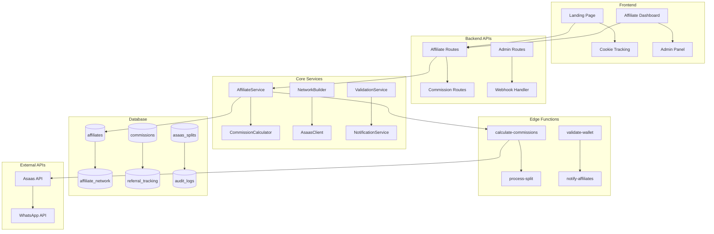

# Design Document - Sprint 4: Sistema de Afiliados Multinível

## Overview

Este documento detalha o design técnico para implementação do sistema de afiliados multinível do Slim Quality. O sistema permite cadastro de afiliados, construção de árvore genealógica de 3 níveis, rastreamento de conversões e cálculo automático de comissões com split no Asaas.

**Arquitetura:** Backend-as-a-Service (Supabase) + Edge Functions + Node.js APIs
**Complexidade:** 🔴🔴🔴 MUITO ALTA (sistema crítico do negócio)
**Impacto:** CRÍTICO - Erros têm consequências financeiras diretas

## Architecture

### Visão Geral da Arquitetura



### Fluxo de Dados Crítico

**1. Cadastro de Afiliado:**
```
Frontend → AffiliateService → AsaasClient → Database → NotificationService
```

**2. Rastreamento de Conversão:**
```
Landing Page → Cookie → Order Creation → ReferralTracker → Database
```

**3. Cálculo de Comissões:**
```
Webhook → CommissionCalculator → NetworkBuilder → AsaasSplit → Database
```

## Components and Interfaces

### 1. Database Schema

#### Tabela: `affiliates`
```sql
CREATE TABLE affiliates (
  id UUID PRIMARY KEY DEFAULT gen_random_uuid(),
  user_id UUID REFERENCES auth.users(id),
  
  -- Dados pessoais
  name TEXT NOT NULL,
  email TEXT NOT NULL UNIQUE,
  phone TEXT,
  document TEXT, -- CPF/CNPJ
  
  -- Dados de afiliado
  referral_code TEXT NOT NULL UNIQUE, -- ABC123
  wallet_id TEXT NOT NULL, -- wal_xxxxx
  wallet_validated_at TIMESTAMPTZ,
  
  -- Status e controle
  status affiliate_status DEFAULT 'pending',
  approved_by UUID REFERENCES auth.users(id),
  approved_at TIMESTAMPTZ,
  
  -- Métricas (desnormalizadas para performance)
  total_clicks INTEGER DEFAULT 0,
  total_conversions INTEGER DEFAULT 0,
  total_commissions DECIMAL(10,2) DEFAULT 0,
  
  -- Timestamps
  created_at TIMESTAMPTZ DEFAULT NOW(),
  updated_at TIMESTAMPTZ DEFAULT NOW(),
  deleted_at TIMESTAMPTZ
);

-- Enum para status
CREATE TYPE affiliate_status AS ENUM (
  'pending',    -- Aguardando aprovação
  'active',     -- Ativo e pode receber comissões
  'inactive',   -- Inativo temporariamente
  'suspended',  -- Suspenso por violação
  'rejected'    -- Cadastro rejeitado
);

-- Índices críticos
CREATE INDEX idx_affiliates_referral_code ON affiliates(referral_code) WHERE deleted_at IS NULL;
CREATE INDEX idx_affiliates_wallet_id ON affiliates(wallet_id) WHERE deleted_at IS NULL;
CREATE INDEX idx_affiliates_status ON affiliates(status) WHERE deleted_at IS NULL;
CREATE INDEX idx_affiliates_user_id ON affiliates(user_id) WHERE deleted_at IS NULL;

-- Constraints
ALTER TABLE affiliates ADD CONSTRAINT chk_wallet_format 
  CHECK (wallet_id ~ '^wal_[a-zA-Z0-9]{20}$');
ALTER TABLE affiliates ADD CONSTRAINT chk_referral_format 
  CHECK (referral_code ~ '^[A-Z0-9]{6}$');
```

#### Tabela: `affiliate_network` (Árvore Genealógica)
```sql
CREATE TABLE affiliate_network (
  id UUID PRIMARY KEY DEFAULT gen_random_uuid(),
  affiliate_id UUID NOT NULL REFERENCES affiliates(id),
  parent_id UUID REFERENCES affiliates(id), -- NULL = raiz
  
  -- Níveis pré-calculados para performance
  level INTEGER NOT NULL DEFAULT 1, -- 1, 2, 3
  path TEXT NOT NULL, -- "root.abc123.def456" para queries rápidas
  
  -- Timestamps
  created_at TIMESTAMPTZ DEFAULT NOW(),
  updated_at TIMESTAMPTZ DEFAULT NOW(),
  
  -- Constraint para evitar loops
  CONSTRAINT chk_no_self_reference CHECK (affiliate_id != parent_id),
  CONSTRAINT chk_valid_level CHECK (level BETWEEN 1 AND 3)
);

-- Índices para queries de árvore
CREATE INDEX idx_network_affiliate ON affiliate_network(affiliate_id);
CREATE INDEX idx_network_parent ON affiliate_network(parent_id);
CREATE INDEX idx_network_path ON affiliate_network USING gin(path gin_trgm_ops);
CREATE INDEX idx_network_level ON affiliate_network(level);

-- Função para detectar loops
CREATE OR REPLACE FUNCTION check_network_loop()
RETURNS TRIGGER AS $$
BEGIN
  -- Verificar se criaria um loop
  IF EXISTS (
    WITH RECURSIVE network_path AS (
      SELECT affiliate_id, parent_id, 1 as depth
      FROM affiliate_network 
      WHERE affiliate_id = NEW.parent_id
      
      UNION ALL
      
      SELECT an.affiliate_id, an.parent_id, np.depth + 1
      FROM affiliate_network an
      JOIN network_path np ON an.affiliate_id = np.parent_id
      WHERE np.depth < 10 -- Limite para evitar loop infinito
    )
    SELECT 1 FROM network_path WHERE affiliate_id = NEW.affiliate_id
  ) THEN
    RAISE EXCEPTION 'Loop detected in affiliate network';
  END IF;
  
  RETURN NEW;
END;
$$ LANGUAGE plpgsql;

CREATE TRIGGER prevent_network_loops
  BEFORE INSERT OR UPDATE ON affiliate_network
  FOR EACH ROW EXECUTE FUNCTION check_network_loop();
```

#### Tabela: `referral_codes`
```sql
CREATE TABLE referral_codes (
  id UUID PRIMARY KEY DEFAULT gen_random_uuid(),
  affiliate_id UUID NOT NULL REFERENCES affiliates(id),
  code TEXT NOT NULL UNIQUE,
  
  -- Configurações
  is_active BOOLEAN DEFAULT true,
  expires_at TIMESTAMPTZ,
  max_uses INTEGER, -- NULL = ilimitado
  current_uses INTEGER DEFAULT 0,
  
  -- Timestamps
  created_at TIMESTAMPTZ DEFAULT NOW(),
  updated_at TIMESTAMPTZ DEFAULT NOW()
);

CREATE INDEX idx_referral_codes_code ON referral_codes(code) WHERE is_active = true;
CREATE INDEX idx_referral_codes_affiliate ON referral_codes(affiliate_id);
```

#### Tabela: `referral_clicks`
```sql
CREATE TABLE referral_clicks (
  id UUID PRIMARY KEY DEFAULT gen_random_uuid(),
  referral_code TEXT NOT NULL,
  affiliate_id UUID NOT NULL REFERENCES affiliates(id),
  
  -- Dados do clique
  ip_address INET,
  user_agent TEXT,
  referer TEXT,
  utm_source TEXT,
  utm_medium TEXT,
  utm_campaign TEXT,
  
  -- Geolocalização (opcional)
  country TEXT,
  city TEXT,
  
  -- Timestamps
  clicked_at TIMESTAMPTZ DEFAULT NOW()
);

-- Índices para analytics
CREATE INDEX idx_clicks_affiliate ON referral_clicks(affiliate_id);
CREATE INDEX idx_clicks_code ON referral_clicks(referral_code);
CREATE INDEX idx_clicks_date ON referral_clicks(clicked_at);
CREATE INDEX idx_clicks_ip ON referral_clicks(ip_address, clicked_at);
```

#### Tabela: `referral_conversions`
```sql
CREATE TABLE referral_conversions (
  id UUID PRIMARY KEY DEFAULT gen_random_uuid(),
  order_id UUID NOT NULL REFERENCES orders(id),
  affiliate_id UUID NOT NULL REFERENCES affiliates(id),
  referral_code TEXT NOT NULL,
  
  -- Dados da conversão
  order_value DECIMAL(10,2) NOT NULL,
  commission_percentage DECIMAL(5,2) NOT NULL, -- 15.00 para N1
  commission_value DECIMAL(10,2) NOT NULL,
  
  -- Rastreamento
  click_id UUID REFERENCES referral_clicks(id),
  conversion_time_hours INTEGER, -- Tempo entre clique e conversão
  
  -- Status
  status conversion_status DEFAULT 'pending',
  processed_at TIMESTAMPTZ,
  
  -- Timestamps
  created_at TIMESTAMPTZ DEFAULT NOW(),
  updated_at TIMESTAMPTZ DEFAULT NOW()
);

CREATE TYPE conversion_status AS ENUM (
  'pending',     -- Aguardando processamento
  'processed',   -- Comissão calculada
  'paid',        -- Comissão paga
  'cancelled'    -- Pedido cancelado
);

CREATE INDEX idx_conversions_order ON referral_conversions(order_id);
CREATE INDEX idx_conversions_affiliate ON referral_conversions(affiliate_id);
CREATE INDEX idx_conversions_status ON referral_conversions(status);
```

#### Tabela: `commissions`
```sql
CREATE TABLE commissions (
  id UUID PRIMARY KEY DEFAULT gen_random_uuid(),
  order_id UUID NOT NULL REFERENCES orders(id),
  affiliate_id UUID NOT NULL REFERENCES affiliates(id),
  
  -- Dados da comissão
  level INTEGER NOT NULL, -- 1, 2, 3
  percentage DECIMAL(5,2) NOT NULL, -- 15.00, 3.00, 2.00
  base_value DECIMAL(10,2) NOT NULL, -- Valor do pedido
  commission_value DECIMAL(10,2) NOT NULL, -- Valor calculado
  
  -- Redistribuição (se aplicável)
  original_percentage DECIMAL(5,2), -- Percentual original antes da redistribuição
  redistribution_applied BOOLEAN DEFAULT false,
  
  -- Status e controle
  status commission_status DEFAULT 'calculated',
  asaas_split_id TEXT, -- ID do split no Asaas
  paid_at TIMESTAMPTZ,
  
  -- Auditoria
  calculated_by UUID REFERENCES auth.users(id),
  calculation_details JSONB, -- Detalhes do cálculo para auditoria
  
  -- Timestamps
  created_at TIMESTAMPTZ DEFAULT NOW(),
  updated_at TIMESTAMPTZ DEFAULT NOW()
);

CREATE TYPE commission_status AS ENUM (
  'calculated',  -- Calculada mas não paga
  'pending',     -- Enviada para Asaas
  'paid',        -- Paga com sucesso
  'failed',      -- Falha no pagamento
  'cancelled'    -- Cancelada
);

-- Índices críticos
CREATE INDEX idx_commissions_order ON commissions(order_id);
CREATE INDEX idx_commissions_affiliate ON commissions(affiliate_id);
CREATE INDEX idx_commissions_status ON commissions(status);
CREATE INDEX idx_commissions_level ON commissions(level);
CREATE INDEX idx_commissions_paid_at ON commissions(paid_at) WHERE paid_at IS NOT NULL;

-- Constraint para evitar duplicatas
CREATE UNIQUE INDEX idx_commissions_unique 
  ON commissions(order_id, affiliate_id, level) 
  WHERE status != 'cancelled';
```

#### Tabela: `commission_splits`
```sql
CREATE TABLE commission_splits (
  id UUID PRIMARY KEY DEFAULT gen_random_uuid(),
  order_id UUID NOT NULL REFERENCES orders(id),
  
  -- Distribuição calculada
  total_order_value DECIMAL(10,2) NOT NULL,
  factory_percentage DECIMAL(5,2) DEFAULT 70.00,
  factory_value DECIMAL(10,2) NOT NULL,
  commission_percentage DECIMAL(5,2) DEFAULT 30.00,
  commission_value DECIMAL(10,2) NOT NULL,
  
  -- Detalhamento das comissões
  n1_affiliate_id UUID REFERENCES affiliates(id),
  n1_percentage DECIMAL(5,2),
  n1_value DECIMAL(10,2),
  
  n2_affiliate_id UUID REFERENCES affiliates(id),
  n2_percentage DECIMAL(5,2),
  n2_value DECIMAL(10,2),
  
  n3_affiliate_id UUID REFERENCES affiliates(id),
  n3_percentage DECIMAL(5,2),
  n3_value DECIMAL(10,2),
  
  -- Gestores
  renum_percentage DECIMAL(5,2) NOT NULL,
  renum_value DECIMAL(10,2) NOT NULL,
  jb_percentage DECIMAL(5,2) NOT NULL,
  jb_value DECIMAL(10,2) NOT NULL,
  
  -- Redistribuição
  redistribution_applied BOOLEAN DEFAULT false,
  redistribution_details JSONB,
  
  -- Status do split
  status split_status DEFAULT 'calculated',
  asaas_split_id TEXT UNIQUE,
  asaas_response JSONB,
  
  -- Timestamps
  created_at TIMESTAMPTZ DEFAULT NOW(),
  updated_at TIMESTAMPTZ DEFAULT NOW()
);

CREATE TYPE split_status AS ENUM (
  'calculated',  -- Calculado mas não enviado
  'sent',        -- Enviado para Asaas
  'confirmed',   -- Confirmado pelo Asaas
  'failed',      -- Falha no Asaas
  'cancelled'    -- Cancelado
);

CREATE INDEX idx_splits_order ON commission_splits(order_id);
CREATE INDEX idx_splits_status ON commission_splits(status);
CREATE INDEX idx_splits_asaas_id ON commission_splits(asaas_split_id) WHERE asaas_split_id IS NOT NULL;
```

#### Tabela: `asaas_wallets` (Cache de validação)
```sql
CREATE TABLE asaas_wallets (
  id UUID PRIMARY KEY DEFAULT gen_random_uuid(),
  wallet_id TEXT NOT NULL UNIQUE,
  
  -- Dados do Asaas
  name TEXT,
  email TEXT,
  status TEXT, -- ACTIVE, INACTIVE, etc.
  account_type TEXT,
  
  -- Cache e validação
  last_validated_at TIMESTAMPTZ NOT NULL DEFAULT NOW(),
  validation_response JSONB,
  is_valid BOOLEAN NOT NULL DEFAULT true,
  
  -- Timestamps
  created_at TIMESTAMPTZ DEFAULT NOW(),
  updated_at TIMESTAMPTZ DEFAULT NOW()
);

CREATE INDEX idx_wallets_id ON asaas_wallets(wallet_id);
CREATE INDEX idx_wallets_validated ON asaas_wallets(last_validated_at);
CREATE INDEX idx_wallets_valid ON asaas_wallets(is_valid);
```

#### Tabela: `commission_logs` (Auditoria)
```sql
CREATE TABLE commission_logs (
  id UUID PRIMARY KEY DEFAULT gen_random_uuid(),
  order_id UUID NOT NULL REFERENCES orders(id),
  
  -- Contexto da operação
  operation_type log_operation_type NOT NULL,
  operation_details JSONB NOT NULL,
  
  -- Dados antes/depois
  before_state JSONB,
  after_state JSONB,
  
  -- Usuário e sistema
  user_id UUID REFERENCES auth.users(id),
  ip_address INET,
  user_agent TEXT,
  
  -- Timestamps
  created_at TIMESTAMPTZ DEFAULT NOW()
);

CREATE TYPE log_operation_type AS ENUM (
  'commission_calculated',
  'redistribution_applied',
  'split_sent',
  'split_confirmed',
  'commission_paid',
  'commission_failed',
  'manual_adjustment'
);

CREATE INDEX idx_logs_order ON commission_logs(order_id);
CREATE INDEX idx_logs_operation ON commission_logs(operation_type);
CREATE INDEX idx_logs_created ON commission_logs(created_at);
```

### 2. Core Services

#### AffiliateService
```typescript
interface AffiliateService {
  // Cadastro e validação
  async createAffiliate(data: CreateAffiliateRequest): Promise<Affiliate>;
  async validateWalletId(walletId: string): Promise<WalletValidation>;
  async generateReferralCode(): Promise<string>;
  
  // Gestão de rede
  async buildNetwork(affiliateId: string, parentCode?: string): Promise<void>;
  async getNetworkTree(affiliateId: string): Promise<NetworkTree>;
  async validateNetworkIntegrity(affiliateId: string): Promise<boolean>;
  
  // Consultas
  async getAffiliateByCode(code: string): Promise<Affiliate | null>;
  async getAffiliateStats(affiliateId: string): Promise<AffiliateStats>;
  async getMyNetwork(affiliateId: string): Promise<Affiliate[]>;
}

interface CreateAffiliateRequest {
  name: string;
  email: string;
  phone?: string;
  document?: string;
  walletId: string;
  referralCode?: string; // Código de quem indicou
}

interface WalletValidation {
  isValid: boolean;
  isActive: boolean;
  name?: string;
  error?: string;
}

interface NetworkTree {
  affiliate: Affiliate;
  children: NetworkTree[];
  level: number;
  path: string;
}
```

#### CommissionCalculator
```typescript
interface CommissionCalculator {
  // Cálculo principal
  async calculateCommissions(orderId: string): Promise<CommissionResult>;
  async applyRedistribution(split: CommissionSplit): Promise<CommissionSplit>;
  async validateCalculation(split: CommissionSplit): Promise<ValidationResult>;
  
  // Utilitários
  async getNetworkForOrder(orderId: string): Promise<AffiliateNetwork>;
  async calculateRedistribution(availablePercentage: number): Promise<RedistributionResult>;
}

interface CommissionResult {
  orderId: string;
  totalValue: number;
  
  // Distribuição
  factory: { percentage: number; value: number };
  n1?: { affiliateId: string; percentage: number; value: number };
  n2?: { affiliateId: string; percentage: number; value: number };
  n3?: { affiliateId: string; percentage: number; value: number };
  renum: { percentage: number; value: number };
  jb: { percentage: number; value: number };
  
  // Controle
  redistributionApplied: boolean;
  totalPercentage: number; // Deve ser sempre 100%
}

interface RedistributionResult {
  renumBonus: number;
  jbBonus: number;
  details: {
    availablePercentage: number;
    distributionMethod: string;
  };
}
```

#### AsaasClient (Extensão do Sprint 3)
```typescript
interface AsaasClient {
  // Validação de carteiras
  async validateWallet(walletId: string): Promise<WalletInfo>;
  async getWalletInfo(walletId: string): Promise<WalletInfo>;
  
  // Split de pagamentos
  async createSplit(paymentId: string, splits: SplitItem[]): Promise<SplitResponse>;
  async getSplitStatus(splitId: string): Promise<SplitStatus>;
  async cancelSplit(splitId: string): Promise<void>;
  
  // Utilitários
  async validateSplitIntegrity(splits: SplitItem[]): Promise<boolean>;
}

interface SplitItem {
  walletId: string;
  fixedValue: number;
  description?: string;
}

interface SplitResponse {
  id: string;
  status: 'PENDING' | 'CONFIRMED' | 'FAILED';
  splits: SplitItem[];
  totalValue: number;
  createdAt: string;
}
```

### 3. Edge Functions (Supabase)

#### calculate-commissions
```typescript
// supabase/functions/calculate-commissions/index.ts
import { serve } from 'https://deno.land/std@0.168.0/http/server.ts';
import { createClient } from 'https://esm.sh/@supabase/supabase-js@2';

interface CalculateCommissionsRequest {
  orderId: string;
  orderValue: number;
  affiliateId?: string; // N1 se houver
}

serve(async (req) => {
  try {
    const { orderId, orderValue, affiliateId } = await req.json();
    
    // 1. Buscar rede genealógica
    const network = await getAffiliateNetwork(affiliateId);
    
    // 2. Calcular comissões
    const commissions = await calculateCommissionValues(orderValue, network);
    
    // 3. Aplicar redistribuição
    const finalSplit = await applyRedistribution(commissions);
    
    // 4. Validar integridade (soma = 100%)
    await validateSplitIntegrity(finalSplit);
    
    // 5. Salvar no banco
    await saveCommissionSplit(orderId, finalSplit);
    
    // 6. Disparar split no Asaas
    await triggerAsaasSplit(orderId, finalSplit);
    
    return new Response(JSON.stringify({ success: true, split: finalSplit }));
    
  } catch (error) {
    console.error('Error calculating commissions:', error);
    return new Response(JSON.stringify({ error: error.message }), { status: 500 });
  }
});
```

#### validate-wallet
```typescript
// supabase/functions/validate-wallet/index.ts
serve(async (req) => {
  try {
    const { walletId } = await req.json();
    
    // 1. Verificar cache
    const cached = await getCachedWalletValidation(walletId);
    if (cached && !isExpired(cached)) {
      return new Response(JSON.stringify(cached));
    }
    
    // 2. Validar via API Asaas
    const validation = await validateWalletWithAsaas(walletId);
    
    // 3. Atualizar cache
    await updateWalletCache(walletId, validation);
    
    return new Response(JSON.stringify(validation));
    
  } catch (error) {
    return new Response(JSON.stringify({ 
      isValid: false, 
      error: error.message 
    }), { status: 400 });
  }
});
```

### 4. API Routes

#### Affiliate Routes
```typescript
// src/api/routes/affiliates.ts
router.post('/register', async (req, res) => {
  // 1. Validar dados de entrada
  const validation = CreateAffiliateSchema.safeParse(req.body);
  if (!validation.success) {
    return res.status(400).json({ errors: validation.error.issues });
  }
  
  // 2. Validar Wallet ID
  const walletValidation = await affiliateService.validateWalletId(validation.data.walletId);
  if (!walletValidation.isValid) {
    return res.status(400).json({ error: 'Invalid Wallet ID' });
  }
  
  // 3. Criar afiliado
  const affiliate = await affiliateService.createAffiliate(validation.data);
  
  res.status(201).json(affiliate);
});

router.get('/dashboard', requireAuth, async (req, res) => {
  const affiliateId = req.user.affiliateId;
  
  const [stats, network, commissions] = await Promise.all([
    affiliateService.getAffiliateStats(affiliateId),
    affiliateService.getMyNetwork(affiliateId),
    commissionService.getMyCommissions(affiliateId)
  ]);
  
  res.json({ stats, network, commissions });
});

router.get('/referral-link', requireAuth, async (req, res) => {
  const affiliate = await affiliateService.getById(req.user.affiliateId);
  const link = `${process.env.FRONTEND_URL}?ref=${affiliate.referralCode}`;
  
  res.json({ link, qrCode: generateQRCode(link) });
});
```

#### Commission Routes
```typescript
// src/api/routes/commissions.ts
router.get('/my-commissions', requireAuth, async (req, res) => {
  const { page = 1, limit = 20, status } = req.query;
  
  const commissions = await commissionService.getCommissions({
    affiliateId: req.user.affiliateId,
    status,
    pagination: { page: Number(page), limit: Number(limit) }
  });
  
  res.json(commissions);
});

router.get('/stats', requireAuth, async (req, res) => {
  const stats = await commissionService.getStats(req.user.affiliateId);
  res.json(stats);
});
```

#### Admin Routes
```typescript
// src/api/routes/admin/affiliates.ts
router.get('/affiliates', requireRole('admin'), async (req, res) => {
  const { page = 1, limit = 50, status, search } = req.query;
  
  const affiliates = await affiliateService.getAll({
    status,
    search,
    pagination: { page: Number(page), limit: Number(limit) }
  });
  
  res.json(affiliates);
});

router.put('/affiliates/:id/status', requireRole('admin'), async (req, res) => {
  const { status } = req.body;
  const affiliate = await affiliateService.updateStatus(req.params.id, status, req.user.id);
  res.json(affiliate);
});

router.get('/affiliates/:id/network', requireRole('admin'), async (req, res) => {
  const network = await affiliateService.getNetworkTree(req.params.id);
  res.json(network);
});
```

## Data Models

### TypeScript Types

```typescript
// src/types/affiliate.types.ts
export interface Affiliate {
  id: string;
  userId: string;
  name: string;
  email: string;
  phone?: string;
  document?: string;
  referralCode: string;
  walletId: string;
  walletValidatedAt?: string;
  status: AffiliateStatus;
  approvedBy?: string;
  approvedAt?: string;
  totalClicks: number;
  totalConversions: number;
  totalCommissions: number;
  createdAt: string;
  updatedAt: string;
}

export type AffiliateStatus = 'pending' | 'active' | 'inactive' | 'suspended' | 'rejected';

export interface AffiliateNetwork {
  id: string;
  affiliateId: string;
  parentId?: string;
  level: number;
  path: string;
  createdAt: string;
}

export interface Commission {
  id: string;
  orderId: string;
  affiliateId: string;
  level: number;
  percentage: number;
  baseValue: number;
  commissionValue: number;
  originalPercentage?: number;
  redistributionApplied: boolean;
  status: CommissionStatus;
  asaasSplitId?: string;
  paidAt?: string;
  calculatedBy?: string;
  calculationDetails?: any;
  createdAt: string;
}

export type CommissionStatus = 'calculated' | 'pending' | 'paid' | 'failed' | 'cancelled';

export interface CommissionSplit {
  id: string;
  orderId: string;
  totalOrderValue: number;
  factoryPercentage: number;
  factoryValue: number;
  commissionPercentage: number;
  commissionValue: number;
  
  n1AffiliateId?: string;
  n1Percentage?: number;
  n1Value?: number;
  
  n2AffiliateId?: string;
  n2Percentage?: number;
  n2Value?: number;
  
  n3AffiliateId?: string;
  n3Percentage?: number;
  n3Value?: number;
  
  renumPercentage: number;
  renumValue: number;
  jbPercentage: number;
  jbValue: number;
  
  redistributionApplied: boolean;
  redistributionDetails?: any;
  
  status: SplitStatus;
  asaasSplitId?: string;
  asaasResponse?: any;
  createdAt: string;
}

export type SplitStatus = 'calculated' | 'sent' | 'confirmed' | 'failed' | 'cancelled';
```

### Validation Schemas (Zod)

```typescript
// src/utils/validators/affiliate.validators.ts
import { z } from 'zod';

export const CreateAffiliateSchema = z.object({
  name: z.string().min(3).max(100),
  email: z.string().email(),
  phone: z.string().regex(/^\+?[1-9]\d{1,14}$/).optional(),
  document: z.string().regex(/^\d{11}$|^\d{14}$/).optional(), // CPF ou CNPJ
  walletId: z.string().regex(/^wal_[a-zA-Z0-9]{20}$/),
  referralCode: z.string().regex(/^[A-Z0-9]{6}$/).optional()
});

export const UpdateAffiliateStatusSchema = z.object({
  status: z.enum(['pending', 'active', 'inactive', 'suspended', 'rejected']),
  reason: z.string().min(10).max(500).optional()
});

export const CommissionQuerySchema = z.object({
  page: z.coerce.number().min(1).default(1),
  limit: z.coerce.number().min(1).max(100).default(20),
  status: z.enum(['calculated', 'pending', 'paid', 'failed', 'cancelled']).optional(),
  startDate: z.string().datetime().optional(),
  endDate: z.string().datetime().optional()
});
```

## Error Handling

### Error Types

```typescript
// src/utils/errors/affiliate.errors.ts
export class AffiliateError extends Error {
  constructor(message: string, public code: string, public statusCode: number = 400) {
    super(message);
    this.name = 'AffiliateError';
  }
}

export class WalletValidationError extends AffiliateError {
  constructor(walletId: string, reason: string) {
    super(`Wallet ID ${walletId} is invalid: ${reason}`, 'WALLET_INVALID', 400);
  }
}

export class NetworkLoopError extends AffiliateError {
  constructor(affiliateId: string, parentId: string) {
    super(`Network loop detected: ${affiliateId} -> ${parentId}`, 'NETWORK_LOOP', 400);
  }
}

export class CommissionCalculationError extends AffiliateError {
  constructor(orderId: string, reason: string) {
    super(`Commission calculation failed for order ${orderId}: ${reason}`, 'CALCULATION_ERROR', 500);
  }
}

export class SplitIntegrityError extends AffiliateError {
  constructor(expected: number, actual: number) {
    super(`Split integrity check failed: expected ${expected}%, got ${actual}%`, 'SPLIT_INTEGRITY', 500);
  }
}
```

### Error Handler Middleware

```typescript
// src/middlewares/error.middleware.ts
export const affiliateErrorHandler = (error: Error, req: Request, res: Response, next: NextFunction) => {
  if (error instanceof AffiliateError) {
    Logger.error('AffiliateError', error.message, error, {
      code: error.code,
      statusCode: error.statusCode,
      userId: req.user?.id,
      ip: req.ip
    });
    
    return res.status(error.statusCode).json({
      error: error.message,
      code: error.code,
      timestamp: new Date().toISOString()
    });
  }
  
  // Log erro não tratado
  Logger.error('UnhandledError', 'Unhandled error in affiliate system', error, {
    userId: req.user?.id,
    ip: req.ip,
    url: req.url,
    method: req.method
  });
  
  res.status(500).json({
    error: 'Internal server error',
    code: 'INTERNAL_ERROR',
    timestamp: new Date().toISOString()
  });
};
```

## Testing Strategy

### Unit Tests

```typescript
// tests/unit/commission-calculator.test.ts
describe('CommissionCalculator', () => {
  let calculator: CommissionCalculator;
  
  beforeEach(() => {
    calculator = new CommissionCalculator();
  });
  
  describe('calculateCommissions', () => {
    it('deve calcular corretamente com rede completa (N1+N2+N3)', async () => {
      // Arrange
      const orderId = 'order_123';
      const orderValue = 3290.00;
      const network = {
        n1: { id: 'aff_1', walletId: 'wal_abc123' },
        n2: { id: 'aff_2', walletId: 'wal_def456' },
        n3: { id: 'aff_3', walletId: 'wal_ghi789' }
      };
      
      // Act
      const result = await calculator.calculateCommissions(orderId);
      
      // Assert
      expect(result.n1.value).toBe(493.50); // 15%
      expect(result.n2.value).toBe(98.70);  // 3%
      expect(result.n3.value).toBe(65.80);  // 2%
      expect(result.renum.value).toBe(164.50); // 5%
      expect(result.jb.value).toBe(164.50);    // 5%
      expect(result.totalPercentage).toBe(100);
      expect(result.redistributionApplied).toBe(false);
    });
    
    it('deve aplicar redistribuição quando apenas N1 existe', async () => {
      // Arrange
      const network = {
        n1: { id: 'aff_1', walletId: 'wal_abc123' },
        n2: null,
        n3: null
      };
      
      // Act
      const result = await calculator.calculateCommissions('order_123');
      
      // Assert
      expect(result.n1.value).toBe(493.50);    // 15%
      expect(result.n2).toBeUndefined();
      expect(result.n3).toBeUndefined();
      expect(result.renum.value).toBe(246.75); // 5% + 2.5%
      expect(result.jb.value).toBe(246.75);    // 5% + 2.5%
      expect(result.redistributionApplied).toBe(true);
    });
    
    it('deve lançar erro quando soma não é 100%', async () => {
      // Arrange
      const invalidSplit = { /* dados inválidos */ };
      
      // Act & Assert
      await expect(calculator.validateCalculation(invalidSplit))
        .rejects.toThrow(SplitIntegrityError);
    });
  });
  
  describe('applyRedistribution', () => {
    it('deve redistribuir 5% igualmente entre Renum e JB', async () => {
      // Arrange
      const availablePercentage = 5.0; // N2 + N3 não existem
      
      // Act
      const result = await calculator.calculateRedistribution(availablePercentage);
      
      // Assert
      expect(result.renumBonus).toBe(2.5);
      expect(result.jbBonus).toBe(2.5);
    });
  });
});
```

### Integration Tests

```typescript
// tests/integration/affiliate-registration.test.ts
describe('Affiliate Registration Flow', () => {
  it('deve cadastrar afiliado com Wallet ID válida', async () => {
    // Arrange
    const affiliateData = {
      name: 'João Silva',
      email: 'joao@example.com',
      walletId: 'wal_valid123456789012'
    };
    
    // Mock Asaas API
    nock('https://api.asaas.com')
      .get('/v3/wallets/wal_valid123456789012')
      .reply(200, { id: 'wal_valid123456789012', status: 'ACTIVE' });
    
    // Act
    const response = await request(app)
      .post('/api/affiliates/register')
      .send(affiliateData)
      .expect(201);
    
    // Assert
    expect(response.body).toHaveProperty('id');
    expect(response.body.referralCode).toMatch(/^[A-Z0-9]{6}$/);
    expect(response.body.status).toBe('pending');
    
    // Verificar no banco
    const affiliate = await supabase
      .from('affiliates')
      .select('*')
      .eq('id', response.body.id)
      .single();
    
    expect(affiliate.data).toBeTruthy();
  });
  
  it('deve rejeitar Wallet ID inválida', async () => {
    // Arrange
    nock('https://api.asaas.com')
      .get('/v3/wallets/wal_invalid')
      .reply(404);
    
    // Act & Assert
    await request(app)
      .post('/api/affiliates/register')
      .send({
        name: 'João Silva',
        email: 'joao@example.com',
        walletId: 'wal_invalid'
      })
      .expect(400);
  });
});
```

### E2E Tests

```typescript
// tests/e2e/commission-flow.test.ts
describe('Complete Commission Flow', () => {
  it('deve processar comissão completa do clique ao pagamento', async () => {
    // 1. Cadastrar afiliados (N1, N2, N3)
    const n3 = await createAffiliate({ name: 'N3' });
    const n2 = await createAffiliate({ name: 'N2', referralCode: n3.referralCode });
    const n1 = await createAffiliate({ name: 'N1', referralCode: n2.referralCode });
    
    // 2. Simular clique no link
    await request(app)
      .get(`/?ref=${n1.referralCode}`)
      .expect(200);
    
    // 3. Criar pedido
    const order = await createOrder({ value: 3290.00 });
    
    // 4. Simular webhook de pagamento confirmado
    await request(app)
      .post('/api/webhooks/asaas')
      .send({
        event: 'PAYMENT_CONFIRMED',
        payment: { id: order.asaasPaymentId }
      })
      .expect(200);
    
    // 5. Verificar comissões calculadas
    const commissions = await getCommissionsByOrder(order.id);
    expect(commissions).toHaveLength(3); // N1, N2, N3
    
    // 6. Verificar split enviado para Asaas
    const split = await getCommissionSplit(order.id);
    expect(split.status).toBe('confirmed');
    expect(split.asaasSplitId).toBeTruthy();
  });
});
```

## Performance Considerations

### Database Optimization

1. **Índices Estratégicos:**
   - `affiliate_network.path` com GIN para queries de árvore
   - `commissions(order_id, affiliate_id, level)` único para evitar duplicatas
   - `referral_clicks(affiliate_id, clicked_at)` para analytics

2. **Desnormalização Controlada:**
   - Campos `total_*` em `affiliates` para dashboard rápido
   - Campo `path` em `affiliate_network` para queries hierárquicas

3. **Particionamento:**
   - `referral_clicks` por mês (dados históricos)
   - `commission_logs` por trimestre

### Caching Strategy

```typescript
// src/services/cache/affiliate.cache.ts
export class AffiliateCacheService {
  private redis = new Redis(process.env.REDIS_URL);
  
  async cacheWalletValidation(walletId: string, validation: WalletValidation, ttl = 300) {
    await this.redis.setex(`wallet:${walletId}`, ttl, JSON.stringify(validation));
  }
  
  async getCachedWalletValidation(walletId: string): Promise<WalletValidation | null> {
    const cached = await this.redis.get(`wallet:${walletId}`);
    return cached ? JSON.parse(cached) : null;
  }
  
  async cacheNetworkTree(affiliateId: string, tree: NetworkTree, ttl = 3600) {
    await this.redis.setex(`network:${affiliateId}`, ttl, JSON.stringify(tree));
  }
  
  async invalidateAffiliateCache(affiliateId: string) {
    const keys = await this.redis.keys(`*:${affiliateId}*`);
    if (keys.length > 0) {
      await this.redis.del(...keys);
    }
  }
}
```

### Async Processing

```typescript
// src/services/queue/commission.queue.ts
import Bull from 'bull';

export const commissionQueue = new Bull('commission processing', process.env.REDIS_URL);

// Processar cálculo de comissões de forma assíncrona
commissionQueue.process('calculate', async (job) => {
  const { orderId } = job.data;
  
  try {
    await commissionCalculator.calculateCommissions(orderId);
    Logger.info('CommissionQueue', 'Commission calculated successfully', { orderId });
  } catch (error) {
    Logger.error('CommissionQueue', 'Commission calculation failed', error, { orderId });
    throw error; // Para retry automático
  }
});

// Configurar retry e backoff
commissionQueue.process('calculate', {
  attempts: 3,
  backoff: {
    type: 'exponential',
    delay: 2000
  }
});
```

Este design técnico fornece a base sólida para implementar o sistema de afiliados mais crítico do projeto, com foco em integridade financeira, performance e auditabilidade completa.