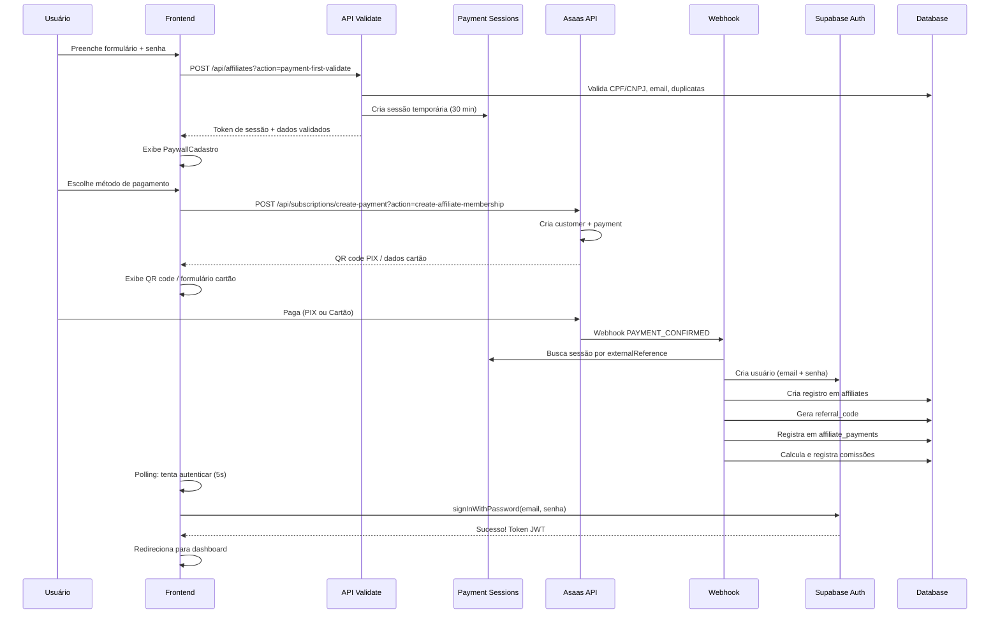

# Design Document - Payment First + Tratamento de Afiliados Existentes

## Overview

Este documento especifica o design técnico para implementação de duas frentes paralelas:

**FRENTE A:** Tratamento dos 30 afiliados já cadastrados no sistema
**FRENTE B:** Implementação do fluxo Payment First para novos cadastros

### Contexto

O sistema Slim Quality possui 30 afiliados cadastrados:
- 11 afiliados com `wallet_id` configurado (prontos para ativar)
- 19 afiliados sem `wallet_id` (precisam configurar até 31/03/2026)
- 4 afiliados de teste (devem ser deletados)

### Objetivos

**FRENTE A - Afiliados Existentes:**
1. Deletar afiliados de teste
2. Liberar acesso total para afiliados com wallet_id
3. Notificar afiliados sem wallet_id sobre prazo de 31/03/2026
4. Bloquear automaticamente afiliados que não configurarem wallet_id

**FRENTE B - Payment First:**
1. Implementar fluxo de pagamento antes do cadastro
2. Criar conta Supabase Auth apenas após confirmação de pagamento
3. Manter senha em memória no frontend (nunca enviar antes do pagamento)
4. Webhook cria conta + registro de afiliado após pagamento confirmado

### Escopo

**Incluído nesta spec:**
- ✅ Deleção de afiliados de teste
- ✅ Atualização de status de afiliados com wallet_id
- ✅ Sistema de notificações automáticas (Supabase Scheduled Jobs)
- ✅ Bloqueio automático em 31/03/2026
- ✅ Novo fluxo de cadastro com Payment First
- ✅ Validação prévia sem criação de conta
- ✅ Webhook para criação de conta após pagamento
- ✅ Polling de confirmação no frontend

**Não incluído (futuro):**
- ❌ Painel admin para gerenciar afiliados bloqueados
- ❌ Sistema de recuperação de conta bloqueada
- ❌ Notificações por SMS/WhatsApp


## Architecture

### System Context

**Frontend:** React/Vite + TypeScript
**Backend:** Vercel Serverless Functions (JavaScript/ESM)
**Database:** Supabase PostgreSQL
**Payment Gateway:** Asaas API
**Notifications:** Sistema existente (tabela notifications + email)
**Scheduled Jobs:** Supabase pg_cron


### Architectural Decisions

**AD-1: Supabase Scheduled Jobs para Notificações**
- Decisão: Usar pg_cron do Supabase para notificações automáticas
- Razão: Nativo do Supabase, não requer infraestrutura adicional
- Impacto: Jobs executam no horário UTC, precisa converter de BRT
- Nota: Jobs são criados via SQL e executam automaticamente

**AD-2: Não Alterar Schema da Tabela Affiliates**
- Decisão: Não adicionar novos campos em `affiliates` para controle de notificações
- Razão: Evitar complexidade desnecessária, usar apenas campos existentes
- Impacto: Lógica de notificação baseada em `wallet_id IS NULL` e `status = 'active'`

**AD-3: Sessão Temporária para Payment First**
- Decisão: Criar sessão temporária (UUID + dados) que expira em 30 minutos
- Razão: Validar dados antes do pagamento sem criar conta
- Impacto: Requer tabela temporária ou cache Redis-like
- Nota: Usar tabela `payment_sessions` com TTL automático

**AD-4: Senha em Memória no Frontend**
- Decisão: Senha permanece apenas em state do React, nunca em localStorage ou API
- Razão: Segurança - senha só vai para backend após pagamento confirmado (via webhook)
- Impacto: Se usuário fechar aba antes do pagamento, perde a senha
- Nota: Webhook recebe senha do externalReference (criptografada)

**AD-5: Webhook Cria Conta Supabase**
- Decisão: Webhook é responsável por criar usuário no Supabase Auth
- Razão: Garantir que conta só existe após pagamento confirmado
- Impacto: Webhook precisa ter permissões de service_role do Supabase
- Nota: Usar `supabase.auth.admin.createUser()` no webhook

**AD-6: Prefixo `affiliate_pre_` para Pagamentos Pré-Cadastro**
- Decisão: Usar prefixo diferente no externalReference para distinguir de afiliados ativos
- Razão: Evitar conflitos com sistema existente de comissionamento
- Impacto: Webhook precisa rotear corretamente baseado no prefixo

**AD-7: Polling de Confirmação no Frontend**
- Decisão: Frontend faz polling a cada 5s tentando autenticar com email + senha
- Razão: Detectar quando webhook criou a conta e liberar acesso
- Impacto: Timeout de 15 minutos, após isso oferece gerar novo QR code
- Nota: Não usar WebSockets para simplificar


## FRENTE A - Tratamento de Afiliados Existentes

### A1. Deleção de Afiliados de Teste

#### Afiliados a Deletar

```sql
-- Identificar afiliados de teste
SELECT id, email, name, created_at 
FROM affiliates 
WHERE email IN (
  'n1teste@example.com',
  'n2teste@example.com', 
  'n3teste@example.com',
  'logistates@example.com'
)
AND deleted_at IS NULL;
```

#### Verificar Dependências

```sql
-- Verificar comissões
SELECT COUNT(*) FROM commissions WHERE affiliate_id IN (
  SELECT id FROM affiliates WHERE email LIKE '%teste@example.com'
);

-- Verificar pagamentos
SELECT COUNT(*) FROM affiliate_payments WHERE affiliate_id IN (
  SELECT id FROM affiliates WHERE email LIKE '%teste@example.com'
);

-- Verificar rede genealógica
SELECT COUNT(*) FROM affiliate_network WHERE 
  affiliate_id IN (SELECT id FROM affiliates WHERE email LIKE '%teste@example.com')
  OR parent_id IN (SELECT id FROM affiliates WHERE email LIKE '%teste@example.com');
```

#### Script de Deleção

```sql
-- Delete em cascata (respeitando foreign keys)
BEGIN;

-- 1. Deletar comissões
DELETE FROM commissions WHERE affiliate_id IN (
  SELECT id FROM affiliates WHERE email LIKE '%teste@example.com'
);

-- 2. Deletar pagamentos
DELETE FROM affiliate_payments WHERE affiliate_id IN (
  SELECT id FROM affiliates WHERE email LIKE '%teste@example.com'
);

-- 3. Deletar rede genealógica
DELETE FROM affiliate_network WHERE 
  affiliate_id IN (SELECT id FROM affiliates WHERE email LIKE '%teste@example.com')
  OR parent_id IN (SELECT id FROM affiliates WHERE email LIKE '%teste@example.com');

-- 4. Deletar perfis de loja (se existirem)
DELETE FROM store_profiles WHERE affiliate_id IN (
  SELECT id FROM affiliates WHERE email LIKE '%teste@example.com'
);

-- 5. Deletar afiliados
DELETE FROM affiliates WHERE email LIKE '%teste@example.com';

COMMIT;
```


### A2. Liberar Acesso Total - Afiliados com Wallet ID

#### Query de Verificação (ANTES)

```sql
-- Verificar afiliados com wallet_id
SELECT 
  id,
  email,
  name,
  wallet_id,
  status,
  payment_status,
  created_at
FROM affiliates
WHERE wallet_id IS NOT NULL
  AND deleted_at IS NULL
ORDER BY created_at;
```

#### Script de Atualização

```sql
-- Atualizar status de afiliados com wallet_id
UPDATE affiliates
SET 
  status = 'active',
  payment_status = 'active',
  updated_at = NOW()
WHERE wallet_id IS NOT NULL
  AND deleted_at IS NULL
  AND (status != 'active' OR payment_status != 'active');
```

#### Query de Verificação (DEPOIS)

```sql
-- Confirmar atualização
SELECT 
  id,
  email,
  name,
  wallet_id,
  status,
  payment_status,
  updated_at
FROM affiliates
WHERE wallet_id IS NOT NULL
  AND deleted_at IS NULL
ORDER BY created_at;

-- Deve retornar todos com status = 'active' e payment_status = 'active'
```

### A3. Sistema de Notificações Automáticas

#### Tabela de Sessões de Pagamento (para Payment First)

```sql
CREATE TABLE IF NOT EXISTS payment_sessions (
  id UUID PRIMARY KEY DEFAULT gen_random_uuid(),
  session_token UUID UNIQUE NOT NULL DEFAULT gen_random_uuid(),
  email TEXT NOT NULL,
  name TEXT NOT NULL,
  phone TEXT NOT NULL,
  document TEXT NOT NULL,
  affiliate_type TEXT NOT NULL CHECK (affiliate_type IN ('individual', 'logista')),
  referral_code TEXT,
  password_hash TEXT NOT NULL, -- senha criptografada
  expires_at TIMESTAMPTZ NOT NULL DEFAULT (NOW() + INTERVAL '30 minutes'),
  created_at TIMESTAMPTZ NOT NULL DEFAULT NOW()
);

CREATE INDEX idx_payment_sessions_token ON payment_sessions(session_token);
CREATE INDEX idx_payment_sessions_expires ON payment_sessions(expires_at);

-- Função para limpar sessões expiradas (executar diariamente)
CREATE OR REPLACE FUNCTION cleanup_expired_sessions()
RETURNS void AS $$
BEGIN
  DELETE FROM payment_sessions WHERE expires_at < NOW();
END;
$$ LANGUAGE plpgsql;

COMMENT ON TABLE payment_sessions IS 'Sessões temporárias para Payment First (expiram em 30 minutos)';
```

#### Scheduled Jobs (pg_cron)

**Importante:** Horários em UTC (BRT = UTC - 3h)

```sql
-- Habilitar extensão pg_cron (se não estiver habilitada)
CREATE EXTENSION IF NOT EXISTS pg_cron;

-- Job 1: Lembrete 7 dias antes (24/03/2026 09:00 BRT = 12:00 UTC)
SELECT cron.schedule(
  'notify-wallet-7days',
  '0 12 24 3 *', -- 24 de março às 12:00 UTC
  $$
  INSERT INTO notifications (affiliate_id, type, title, message, created_at)
  SELECT 
    id,
    'wallet_reminder',
    'Configure sua Wallet Asaas - 7 dias restantes',
    'Você tem 7 dias para configurar sua Wallet ID do Asaas. Após 31/03/2026, sua conta será bloqueada automaticamente. Configure agora em Configurações > Financeiro.',
    NOW()
  FROM affiliates
  WHERE wallet_id IS NULL
    AND status = 'active'
    AND deleted_at IS NULL;
  $$
);

-- Job 2: Lembrete 3 dias antes (28/03/2026 09:00 BRT = 12:00 UTC)
SELECT cron.schedule(
  'notify-wallet-3days',
  '0 12 28 3 *', -- 28 de março às 12:00 UTC
  $$
  INSERT INTO notifications (affiliate_id, type, title, message, created_at)
  SELECT 
    id,
    'wallet_reminder_urgent',
    '⚠️ URGENTE: Configure sua Wallet Asaas - 3 dias restantes',
    'ATENÇÃO: Restam apenas 3 dias para configurar sua Wallet ID do Asaas. Após 31/03/2026, sua conta será bloqueada e você perderá acesso ao sistema. Configure AGORA em Configurações > Financeiro.',
    NOW()
  FROM affiliates
  WHERE wallet_id IS NULL
    AND status = 'active'
    AND deleted_at IS NULL;
  $$
);

-- Job 3: Lembrete final 1 dia antes (30/03/2026 09:00 BRT = 12:00 UTC)
SELECT cron.schedule(
  'notify-wallet-1day',
  '0 12 30 3 *', -- 30 de março às 12:00 UTC
  $$
  INSERT INTO notifications (affiliate_id, type, title, message, created_at)
  SELECT 
    id,
    'wallet_reminder_final',
    '🚨 ÚLTIMO AVISO: Configure sua Wallet Asaas - 1 dia restante',
    'ÚLTIMO AVISO: Amanhã (31/03/2026) sua conta será bloqueada automaticamente se você não configurar sua Wallet ID do Asaas. Esta é sua última chance! Configure AGORA em Configurações > Financeiro.',
    NOW()
  FROM affiliates
  WHERE wallet_id IS NULL
    AND status = 'active'
    AND deleted_at IS NULL;
  $$
);

-- Job 4: Bloqueio automático (31/03/2026 00:00 BRT = 03:00 UTC)
SELECT cron.schedule(
  'block-affiliates-no-wallet',
  '0 3 31 3 *', -- 31 de março às 03:00 UTC (00:00 BRT)
  $$
  UPDATE affiliates 
  SET 
    payment_status = 'suspended',
    updated_at = NOW()
  WHERE wallet_id IS NULL 
    AND status = 'active'
    AND deleted_at IS NULL;
    
  -- Notificar afiliados bloqueados
  INSERT INTO notifications (affiliate_id, type, title, message, created_at)
  SELECT 
    id,
    'account_suspended',
    '❌ Conta Bloqueada - Wallet não configurada',
    'Sua conta foi bloqueada automaticamente por não ter configurado a Wallet ID do Asaas até 31/03/2026. Para desbloquear, configure sua Wallet em Configurações > Financeiro.',
    NOW()
  FROM affiliates
  WHERE wallet_id IS NULL
    AND payment_status = 'suspended'
    AND deleted_at IS NULL;
  $$
);

-- Job 5: Verificação diária de desbloqueio (todo dia às 03:05 UTC)
SELECT cron.schedule(
  'unblock-affiliates-with-wallet',
  '5 3 * * *', -- Todo dia às 03:05 UTC (00:05 BRT)
  $$
  UPDATE affiliates 
  SET 
    payment_status = 'active',
    updated_at = NOW()
  WHERE wallet_id IS NOT NULL 
    AND payment_status = 'suspended' 
    AND status = 'active'
    AND deleted_at IS NULL;
    
  -- Notificar afiliados desbloqueados
  INSERT INTO notifications (affiliate_id, type, title, message, created_at)
  SELECT 
    id,
    'account_reactivated',
    '✅ Conta Reativada - Wallet configurada',
    'Sua conta foi reativada automaticamente após configuração da Wallet ID do Asaas. Bem-vindo de volta!',
    NOW()
  FROM affiliates
  WHERE wallet_id IS NOT NULL
    AND payment_status = 'active'
    AND status = 'active'
    AND deleted_at IS NULL
    AND updated_at > NOW() - INTERVAL '1 minute'; -- Apenas os que foram atualizados agora
  $$
);
```

#### Verificar Jobs Criados

```sql
-- Listar jobs agendados
SELECT * FROM cron.job ORDER BY jobname;

-- Verificar execuções
SELECT * FROM cron.job_run_details ORDER BY start_time DESC LIMIT 10;

-- Deletar job (se necessário)
SELECT cron.unschedule('notify-wallet-7days');
```


## FRENTE B - Payment First no Cadastro

### Fluxo Completo



### B1. Database - Tabela de Sessões Temporárias

**CORREÇÃO 2:** Tabela movida da Phase A3 para Phase B1 (pertence à Frente B)

#### Tabela payment_sessions

**CORREÇÃO 3:** Estrutura atualizada - adicionado campo `referral_code`, removido campo `product_id`

```sql
CREATE TABLE IF NOT EXISTS payment_sessions (
  id UUID PRIMARY KEY DEFAULT gen_random_uuid(),
  session_token UUID UNIQUE NOT NULL DEFAULT gen_random_uuid(),
  email TEXT NOT NULL,
  name TEXT NOT NULL,
  phone TEXT NOT NULL,
  document TEXT NOT NULL,
  document_type VARCHAR(10) NOT NULL CHECK (document_type IN ('CPF', 'CNPJ')),
  password_hash TEXT NOT NULL, -- senha criptografada (bcrypt)
  affiliate_type VARCHAR(20) NOT NULL CHECK (affiliate_type IN ('individual', 'logista')),
  referred_by UUID REFERENCES affiliates(id), -- ID do afiliado que indicou (se houver)
  referral_code TEXT, -- ADICIONADO: código de indicação fornecido no cadastro
  -- product_id UUID REMOVIDO: não é necessário para sessão temporária
  expires_at TIMESTAMPTZ NOT NULL DEFAULT (NOW() + INTERVAL '30 minutes'),
  created_at TIMESTAMPTZ DEFAULT NOW(),
  updated_at TIMESTAMPTZ DEFAULT NOW()
);

CREATE INDEX idx_payment_sessions_token ON payment_sessions(session_token);
CREATE INDEX idx_payment_sessions_expires ON payment_sessions(expires_at);
CREATE INDEX idx_payment_sessions_email ON payment_sessions(email);

-- Função para limpar sessões expiradas (executar diariamente)
CREATE OR REPLACE FUNCTION cleanup_expired_sessions()
RETURNS void AS $$
BEGIN
  DELETE FROM payment_sessions WHERE expires_at < NOW();
END;
$$ LANGUAGE plpgsql;

COMMENT ON TABLE payment_sessions IS 'Sessões temporárias para Payment First (expiram em 30 minutos)';
COMMENT ON COLUMN payment_sessions.password_hash IS 'Senha criptografada com bcrypt - será usada pelo webhook para criar usuário';
COMMENT ON COLUMN payment_sessions.referral_code IS 'Código de indicação fornecido no cadastro (não o ID do afiliado)';
```

### B2. Backend - Validação Prévia

#### API: `api/affiliates.js` (ATUALIZAR EXISTENTE)

**Nova action:** `payment-first-validate`

```javascript
// api/affiliates.js

async function handlePaymentFirstValidate(req, res, supabase) {
  if (req.method !== 'POST') {
    return res.status(405).json({ error: 'Method not allowed' });
  }

  const { email, name, phone, document, affiliate_type, referral_code, password } = req.body;

  // Validação de campos obrigatórios
  if (!email || !name || !phone || !document || !affiliate_type || !password) {
    return res.status(400).json({ 
      error: 'Campos obrigatórios faltando',
      required: ['email', 'name', 'phone', 'document', 'affiliate_type', 'password']
    });
  }

  // Validar tipo de afiliado
  if (!['individual', 'logista'].includes(affiliate_type)) {
    return res.status(400).json({ error: 'Tipo de afiliado inválido' });
  }

  // Validar CPF/CNPJ (reutilizar lógica existente)
  const isValidDocument = affiliate_type === 'individual' 
    ? validateCPF(document) 
    : validateCNPJ(document);
    
  if (!isValidDocument) {
    return res.status(400).json({ 
      error: affiliate_type === 'individual' ? 'CPF inválido' : 'CNPJ inválido' 
    });
  }

  // Verificar duplicatas de email
  const { data: existingEmail } = await supabase
    .from('affiliates')
    .select('id')
    .eq('email', email)
    .is('deleted_at', null)
    .single();

  if (existingEmail) {
    return res.status(409).json({ error: 'Email já cadastrado' });
  }

  // Verificar duplicatas de document
  const { data: existingDocument } = await supabase
    .from('affiliates')
    .select('id')
    .eq('document', document)
    .is('deleted_at', null)
    .single();

  if (existingDocument) {
    return res.status(409).json({ 
      error: affiliate_type === 'individual' ? 'CPF já cadastrado' : 'CNPJ já cadastrado' 
    });
  }

  // Validar referral_code (se fornecido)
  let parent_id = null;
  if (referral_code) {
    const { data: parent } = await supabase
      .from('affiliates')
      .select('id')
      .eq('referral_code', referral_code)
      .eq('status', 'active')
      .is('deleted_at', null)
      .single();

    if (!parent) {
      return res.status(404).json({ error: 'Código de indicação inválido' });
    }
    parent_id = parent.id;
  }

  // Criptografar senha (bcrypt)
  const bcrypt = require('bcryptjs');
  const password_hash = await bcrypt.hash(password, 10);

  // Criar sessão temporária
  const { data: session, error: sessionError } = await supabase
    .from('payment_sessions')
    .insert({
      email,
      name,
      phone,
      document,
      affiliate_type,
      referral_code: referral_code || null,
      password_hash,
      expires_at: new Date(Date.now() + 30 * 60 * 1000).toISOString() // 30 minutos
    })
    .select('session_token')
    .single();

  if (sessionError) {
    console.error('Erro ao criar sessão:', sessionError);
    return res.status(500).json({ error: 'Erro ao criar sessão temporária' });
  }

  return res.status(200).json({
    success: true,
    session_token: session.session_token,
    message: 'Dados validados com sucesso',
    data: {
      email,
      name,
      phone,
      document,
      affiliate_type,
      referral_code: referral_code || null,
      parent_id
    }
  });
}
```


### B3. Backend - Criação de Pagamento

#### API: `api/subscriptions/create-payment.js` (ATUALIZAR EXISTENTE)

**Nova action:** `create-affiliate-membership`

```javascript
// api/subscriptions/create-payment.js

async function handleCreateAffiliateMembership(req, res, supabase) {
  if (req.method !== 'POST') {
    return res.status(405).json({ error: 'Method not allowed' });
  }

  const { session_token, payment_method } = req.body;

  if (!session_token || !payment_method) {
    return res.status(400).json({ 
      error: 'Campos obrigatórios faltando',
      required: ['session_token', 'payment_method']
    });
  }

  // Buscar sessão temporária
  const { data: session, error: sessionError } = await supabase
    .from('payment_sessions')
    .select('*')
    .eq('session_token', session_token)
    .gt('expires_at', new Date().toISOString())
    .single();

  if (sessionError || !session) {
    return res.status(404).json({ error: 'Sessão inválida ou expirada' });
  }

  // Buscar produto de adesão
  const { data: product, error: productError } = await supabase
    .from('products')
    .select('id, name, entry_fee_cents, eligible_affiliate_type')
    .eq('category', 'adesao_afiliado')
    .eq('eligible_affiliate_type', session.affiliate_type)
    .eq('is_active', true)
    .single();

  if (productError || !product) {
    return res.status(404).json({ 
      error: `Produto de adesão não encontrado para tipo ${session.affiliate_type}` 
    });
  }

  const amount = product.entry_fee_cents / 100; // Converter para reais

  // Criar customer no Asaas (se não existir)
  let asaas_customer_id;
  try {
    const customerResponse = await fetch('https://api.asaas.com/v3/customers', {
      method: 'POST',
      headers: {
        'access_token': process.env.ASAAS_API_KEY,
        'Content-Type': 'application/json'
      },
      body: JSON.stringify({
        name: session.name,
        email: session.email,
        phone: session.phone,
        cpfCnpj: session.document,
        notificationDisabled: false
      })
    });

    const customerData = await customerResponse.json();
    
    if (!customerResponse.ok) {
      // Se customer já existe, buscar pelo CPF/CNPJ
      if (customerData.errors?.[0]?.code === 'already_exists') {
        const searchResponse = await fetch(
          `https://api.asaas.com/v3/customers?cpfCnpj=${session.document}`,
          {
            headers: { 'access_token': process.env.ASAAS_API_KEY }
          }
        );
        const searchData = await searchResponse.json();
        asaas_customer_id = searchData.data[0]?.id;
      } else {
        throw new Error(customerData.errors?.[0]?.description || 'Erro ao criar customer');
      }
    } else {
      asaas_customer_id = customerData.id;
    }
  } catch (error) {
    console.error('Erro ao criar customer Asaas:', error);
    return res.status(500).json({ error: 'Erro ao criar customer no Asaas' });
  }

  // Criar pagamento no Asaas
  const externalReference = `affiliate_pre_${session_token}`;
  
  try {
    const paymentResponse = await fetch('https://api.asaas.com/v3/payments', {
      method: 'POST',
      headers: {
        'access_token': process.env.ASAAS_API_KEY,
        'Content-Type': 'application/json'
      },
      body: JSON.stringify({
        customer: asaas_customer_id,
        billingType: payment_method === 'pix' ? 'PIX' : 'CREDIT_CARD',
        value: amount,
        dueDate: new Date().toISOString().split('T')[0], // Hoje
        description: `Taxa de Adesão - ${product.name}`,
        externalReference,
        // Split será calculado no webhook após confirmação
      })
    });

    const paymentData = await paymentResponse.json();

    if (!paymentResponse.ok) {
      throw new Error(paymentData.errors?.[0]?.description || 'Erro ao criar pagamento');
    }

    // Retornar dados do pagamento
    return res.status(200).json({
      success: true,
      payment_id: paymentData.id,
      payment_method,
      amount,
      qr_code: payment_method === 'pix' ? paymentData.pixQrCode : null,
      qr_code_image: payment_method === 'pix' ? paymentData.pixQrCodeImage : null,
      invoice_url: paymentData.invoiceUrl,
      external_reference: externalReference
    });

  } catch (error) {
    console.error('Erro ao criar pagamento Asaas:', error);
    return res.status(500).json({ error: 'Erro ao criar pagamento no Asaas' });
  }
}
```


### B4. Backend - Webhook Handler

#### API: `api/webhook-assinaturas.js` (ATUALIZAR EXISTENTE)

**Adicionar handler para `affiliate_pre_` prefix:**

```javascript
// api/webhook-assinaturas.js

export default async function handler(req, res) {
  if (req.method !== 'POST') {
    return res.status(405).json({ error: 'Method not allowed' });
  }

  // Validar token do webhook
  const webhookToken = req.headers['asaas-access-token'];
  if (webhookToken !== process.env.ASAAS_WEBHOOK_TOKEN) {
    return res.status(401).json({ error: 'Unauthorized' });
  }

  const { event, payment } = req.body;

  // Verificar se é pagamento de pré-cadastro
  if (payment.externalReference?.startsWith('affiliate_pre_')) {
    return handlePreRegistrationPayment(req, res, event, payment);
  }

  // ... resto do código existente para afiliados ativos
}

async function handlePreRegistrationPayment(req, res, event, payment) {
  const supabase = createClient(
    process.env.SUPABASE_URL,
    process.env.SUPABASE_SERVICE_KEY
  );

  // Apenas processar pagamentos confirmados
  if (event !== 'PAYMENT_CONFIRMED' && event !== 'PAYMENT_RECEIVED') {
    return res.status(200).json({ 
      message: 'Evento ignorado para pré-cadastro',
      event 
    });
  }

  // Extrair session_token do externalReference
  const session_token = payment.externalReference.replace('affiliate_pre_', '');

  // Buscar sessão temporária
  const { data: session, error: sessionError } = await supabase
    .from('payment_sessions')
    .select('*')
    .eq('session_token', session_token)
    .single();

  if (sessionError || !session) {
    console.error('Sessão não encontrada:', session_token);
    return res.status(404).json({ error: 'Sessão não encontrada' });
  }

  try {
    // 1. Criar usuário no Supabase Auth
    // CORREÇÃO 1: Usar password_hash diretamente da tabela payment_sessions
    // Padrão idêntico ao sistema Comademig (subscription-payment-flow)
    const { data: authUser, error: authError } = await supabase.auth.admin.createUser({
      email: session.email,
      password: session.password_hash, // Hash recuperado da tabela payment_sessions
      email_confirm: true, // Confirmar email automaticamente (sem envio de email)
      user_metadata: {
        name: session.name,
        phone: session.phone
      }
    });

    if (authError) {
      throw new Error(`Erro ao criar usuário: ${authError.message}`);
    }

    // 2. Gerar referral_code único
    const referral_code = await generateUniqueReferralCode(supabase);

    // 3. Criar registro em affiliates
    const { data: affiliate, error: affiliateError } = await supabase
      .from('affiliates')
      .insert({
        user_id: authUser.user.id,
        email: session.email,
        name: session.name,
        phone: session.phone,
        document: session.document,
        affiliate_type: session.affiliate_type,
        referral_code,
        status: 'active',
        payment_status: 'active',
        asaas_customer_id: payment.customer,
        wallet_id: null // Será configurado depois
      })
      .select('id')
      .single();

    if (affiliateError) {
      throw new Error(`Erro ao criar afiliado: ${affiliateError.message}`);
    }

    // 4. Criar rede genealógica (se houver referral_code)
    if (session.referral_code) {
      const { data: parent } = await supabase
        .from('affiliates')
        .select('id')
        .eq('referral_code', session.referral_code)
        .single();

      if (parent) {
        await supabase.from('affiliate_network').insert({
          affiliate_id: affiliate.id,
          parent_id: parent.id,
          level: 1 // Será calculado corretamente depois
        });
      }
    }

    // 5. Registrar pagamento em affiliate_payments
    await supabase.from('affiliate_payments').insert({
      affiliate_id: affiliate.id,
      payment_type: 'membership_fee',
      amount_cents: payment.value * 100,
      status: 'paid',
      asaas_payment_id: payment.id,
      due_date: payment.dueDate,
      paid_at: new Date().toISOString()
    });

    // 6. Calcular e registrar comissões
    await calculateAndSaveCommissions(supabase, affiliate.id, payment.value * 100, 'membership_fee');

    // 7. Deletar sessão temporária
    await supabase
      .from('payment_sessions')
      .delete()
      .eq('session_token', session_token);

    // 8. Enviar notificação de boas-vindas
    await supabase.from('notifications').insert({
      affiliate_id: affiliate.id,
      type: 'welcome',
      title: 'Bem-vindo ao Slim Quality!',
      message: 'Seu cadastro foi concluído com sucesso. Configure sua Wallet Asaas para começar a receber comissões.',
      created_at: new Date().toISOString()
    });

    return res.status(200).json({
      success: true,
      message: 'Afiliado criado com sucesso',
      affiliate_id: affiliate.id
    });

  } catch (error) {
    console.error('Erro ao processar pagamento de pré-cadastro:', error);
    return res.status(500).json({ 
      error: 'Erro ao processar pagamento',
      details: error.message 
    });
  }
}

// Função auxiliar para gerar referral_code único
async function generateUniqueReferralCode(supabase) {
  const characters = 'ABCDEFGHIJKLMNOPQRSTUVWXYZ0123456789';
  let code;
  let exists = true;

  while (exists) {
    code = '';
    for (let i = 0; i < 8; i++) {
      code += characters.charAt(Math.floor(Math.random() * characters.length));
    }

    const { data } = await supabase
      .from('affiliates')
      .select('id')
      .eq('referral_code', code)
      .single();

    exists = !!data;
  }

  return code;
}

// Função auxiliar para calcular comissões (reutilizar lógica existente)
async function calculateAndSaveCommissions(supabase, affiliate_id, amount_cents, payment_type) {
  // Buscar rede genealógica
  const { data: network } = await supabase
    .from('affiliate_network')
    .select('parent_id, level')
    .eq('affiliate_id', affiliate_id)
    .order('level', { ascending: true });

  const amount = amount_cents / 100;

  // Comissões: 10% Slim + N1(15%) + N2(3%) + N3(2%) + Renum/JB (restante 50/50)
  const commissions = {
    slim: amount * 0.10,
    n1: amount * 0.15,
    n2: amount * 0.03,
    n3: amount * 0.02,
    renum: 0,
    jb: 0
  };

  // Calcular redistribuição
  let available = amount * 0.20; // 20% para N1+N2+N3
  let used = 0;

  if (network && network.length > 0) {
    // N1 existe
    used += commissions.n1;
    if (network.length > 1) {
      // N2 existe
      used += commissions.n2;
      if (network.length > 2) {
        // N3 existe
        used += commissions.n3;
      }
    }
  }

  const remaining = available - used;
  commissions.renum += remaining / 2;
  commissions.jb += remaining / 2;

  // Salvar comissões
  const commissionsToSave = [];

  if (network && network.length > 0) {
    commissionsToSave.push({
      affiliate_id: network[0].parent_id,
      order_id: null,
      payment_id: affiliate_id, // Referência ao pagamento
      level: 1,
      amount_cents: Math.round(commissions.n1 * 100),
      status: 'pending'
    });

    if (network.length > 1) {
      commissionsToSave.push({
        affiliate_id: network[1].parent_id,
        order_id: null,
        payment_id: affiliate_id,
        level: 2,
        amount_cents: Math.round(commissions.n2 * 100),
        status: 'pending'
      });
    }

    if (network.length > 2) {
      commissionsToSave.push({
        affiliate_id: network[2].parent_id,
        order_id: null,
        payment_id: affiliate_id,
        level: 3,
        amount_cents: Math.round(commissions.n3 * 100),
        status: 'pending'
      });
    }
  }

  if (commissionsToSave.length > 0) {
    await supabase.from('commissions').insert(commissionsToSave);
  }

  // Registrar comissões de gestores (Renum e JB)
  // TODO: Implementar quando houver tabela de gestores
}
```


### B5. Frontend - Atualização do Cadastro

#### Componente: `AfiliadosCadastro.tsx` (ATUALIZAR EXISTENTE)

**Localização:** `src/pages/afiliados/AfiliadosCadastro.tsx`

**Mudanças necessárias:**

```typescript
// src/pages/afiliados/AfiliadosCadastro.tsx

import { useState } from 'react';
import { useNavigate } from 'react-router-dom';
import { PaywallCadastro } from '@/components/PaywallCadastro';
import { affiliateService } from '@/services/frontend/affiliate.service';

export function AfiliadosCadastro() {
  const [formData, setFormData] = useState({
    email: '',
    name: '',
    phone: '',
    document: '',
    affiliate_type: 'individual',
    referral_code: '',
    password: '',
    confirmPassword: ''
  });
  
  const [sessionToken, setSessionToken] = useState<string | null>(null);
  const [showPaywall, setShowPaywall] = useState(false);
  const [loading, setLoading] = useState(false);
  const [error, setError] = useState<string | null>(null);

  const handleSubmit = async (e: React.FormEvent) => {
    e.preventDefault();
    setLoading(true);
    setError(null);

    // Validar senhas
    if (formData.password !== formData.confirmPassword) {
      setError('As senhas não coincidem');
      setLoading(false);
      return;
    }

    if (formData.password.length < 8) {
      setError('A senha deve ter no mínimo 8 caracteres');
      setLoading(false);
      return;
    }

    try {
      // Chamar validação prévia (NÃO cria conta ainda)
      const response = await affiliateService.paymentFirstValidate({
        email: formData.email,
        name: formData.name,
        phone: formData.phone,
        document: formData.document,
        affiliate_type: formData.affiliate_type,
        referral_code: formData.referral_code || null,
        password: formData.password
      });

      if (response.success) {
        // Armazenar token de sessão
        setSessionToken(response.session_token);
        
        // Exibir paywall
        setShowPaywall(true);
      }
    } catch (err: any) {
      setError(err.message || 'Erro ao validar dados');
    } finally {
      setLoading(false);
    }
  };

  // Se paywall está ativo, renderizar PaywallCadastro
  if (showPaywall && sessionToken) {
    return (
      <PaywallCadastro
        sessionToken={sessionToken}
        affiliateType={formData.affiliate_type}
        email={formData.email}
        password={formData.password}
        onBack={() => {
          setShowPaywall(false);
          setSessionToken(null);
        }}
      />
    );
  }

  // Renderizar formulário normal
  return (
    <div className="min-h-screen bg-background">
      <div className="container mx-auto px-4 py-8">
        <div className="max-w-2xl mx-auto">
          <Card>
            <CardHeader>
              <CardTitle>Cadastro de Afiliado</CardTitle>
            </CardHeader>
            <CardContent>
              <form onSubmit={handleSubmit} className="space-y-4">
                {/* Campos do formulário */}
                {/* ... (manter campos existentes) */}
                
                {/* Adicionar campos de senha */}
                <div>
                  <label className="text-sm font-medium">Senha</label>
                  <Input
                    type="password"
                    value={formData.password}
                    onChange={(e) => setFormData({ ...formData, password: e.target.value })}
                    required
                    minLength={8}
                  />
                  <p className="text-xs text-muted-foreground mt-1">
                    Mínimo 8 caracteres
                  </p>
                </div>

                <div>
                  <label className="text-sm font-medium">Confirmar Senha</label>
                  <Input
                    type="password"
                    value={formData.confirmPassword}
                    onChange={(e) => setFormData({ ...formData, confirmPassword: e.target.value })}
                    required
                    minLength={8}
                  />
                </div>

                {error && (
                  <div className="p-3 bg-destructive/10 text-destructive rounded-md text-sm">
                    {error}
                  </div>
                )}

                <Button type="submit" disabled={loading} className="w-full">
                  {loading ? 'Validando...' : 'Continuar para Pagamento'}
                </Button>
              </form>
            </CardContent>
          </Card>
        </div>
      </div>
    </div>
  );
}
```


### B6. Frontend - Componente Paywall

#### Componente: `PaywallCadastro.tsx` (CRIAR NOVO)

**Localização:** `src/components/PaywallCadastro.tsx`

```typescript
// src/components/PaywallCadastro.tsx

import { useState, useEffect } from 'react';
import { useNavigate } from 'react-router-dom';
import { Card, CardHeader, CardTitle, CardContent } from '@/components/ui/card';
import { Button } from '@/components/ui/button';
import { Loader2, CheckCircle2, XCircle, ArrowLeft } from 'lucide-react';
import { subscriptionService } from '@/services/frontend/subscription.service';
import { supabase } from '@/lib/supabase';

interface PaywallCadastroProps {
  sessionToken: string;
  affiliateType: 'individual' | 'logista';
  email: string;
  password: string;
  onBack: () => void;
}

export function PaywallCadastro({ 
  sessionToken, 
  affiliateType, 
  email, 
  password,
  onBack 
}: PaywallCadastroProps) {
  const navigate = useNavigate();
  
  const [loading, setLoading] = useState(true);
  const [product, setProduct] = useState<any>(null);
  const [paymentData, setPaymentData] = useState<any>(null);
  const [paymentMethod, setPaymentMethod] = useState<'pix' | 'credit_card'>('pix');
  const [polling, setPolling] = useState(false);
  const [pollingAttempts, setPollingAttempts] = useState(0);
  const [error, setError] = useState<string | null>(null);

  // Buscar produto de adesão
  useEffect(() => {
    async function fetchProduct() {
      try {
        const { data, error } = await supabase
          .from('products')
          .select('*')
          .eq('category', 'adesao_afiliado')
          .eq('eligible_affiliate_type', affiliateType)
          .eq('is_active', true)
          .single();

        if (error) throw error;
        setProduct(data);
      } catch (err: any) {
        setError('Erro ao buscar produto de adesão');
        console.error(err);
      } finally {
        setLoading(false);
      }
    }

    fetchProduct();
  }, [affiliateType]);

  // Criar pagamento
  const handleCreatePayment = async () => {
    setLoading(true);
    setError(null);

    try {
      const response = await subscriptionService.createAffiliateMembership({
        session_token: sessionToken,
        payment_method: paymentMethod
      });

      if (response.success) {
        setPaymentData(response);
        
        // Iniciar polling após 5 segundos
        setTimeout(() => {
          startPolling();
        }, 5000);
      }
    } catch (err: any) {
      setError(err.message || 'Erro ao criar pagamento');
    } finally {
      setLoading(false);
    }
  };

  // Polling para verificar se conta foi criada
  const startPolling = () => {
    setPolling(true);
    
    const interval = setInterval(async () => {
      try {
        // Tentar autenticar com email + senha
        const { data, error } = await supabase.auth.signInWithPassword({
          email,
          password
        });

        if (data.user) {
          // Conta criada! Redirecionar para dashboard
          clearInterval(interval);
          setPolling(false);
          navigate('/afiliados/dashboard');
        }
      } catch (err) {
        // Conta ainda não existe, continuar polling
      }

      setPollingAttempts(prev => prev + 1);

      // Timeout após 15 minutos (180 tentativas de 5s)
      if (pollingAttempts >= 180) {
        clearInterval(interval);
        setPolling(false);
        setError('Tempo esgotado. Gere um novo QR code ou tente novamente.');
      }
    }, 5000); // Polling a cada 5 segundos
  };

  if (loading && !product) {
    return (
      <div className="min-h-screen bg-background flex items-center justify-center">
        <Loader2 className="h-8 w-8 animate-spin text-primary" />
      </div>
    );
  }

  if (error && !paymentData) {
    return (
      <div className="min-h-screen bg-background flex items-center justify-center">
        <Card className="max-w-md">
          <CardHeader>
            <CardTitle className="flex items-center gap-2 text-destructive">
              <XCircle className="h-5 w-5" />
              Erro
            </CardTitle>
          </CardHeader>
          <CardContent>
            <p className="text-sm text-muted-foreground mb-4">{error}</p>
            <Button onClick={onBack} variant="outline" className="w-full">
              <ArrowLeft className="h-4 w-4 mr-2" />
              Voltar
            </Button>
          </CardContent>
        </Card>
      </div>
    );
  }

  // Tela de pagamento
  if (!paymentData) {
    return (
      <div className="min-h-screen bg-background">
        <div className="container mx-auto px-4 py-8">
          <div className="max-w-2xl mx-auto">
            <Card>
              <CardHeader>
                <CardTitle>Pagamento da Taxa de Adesão</CardTitle>
              </CardHeader>
              <CardContent className="space-y-6">
                {/* Informações do produto */}
                <div className="p-4 bg-muted rounded-lg">
                  <h3 className="font-semibold mb-2">{product?.name}</h3>
                  <p className="text-2xl font-bold text-primary">
                    R$ {(product?.entry_fee_cents / 100).toFixed(2)}
                  </p>
                  <p className="text-sm text-muted-foreground mt-2">
                    Taxa única de adesão
                  </p>
                </div>

                {/* Método de pagamento */}
                <div>
                  <label className="text-sm font-medium mb-2 block">
                    Método de Pagamento
                  </label>
                  <div className="grid grid-cols-2 gap-4">
                    <Button
                      variant={paymentMethod === 'pix' ? 'default' : 'outline'}
                      onClick={() => setPaymentMethod('pix')}
                      className="h-auto py-4"
                    >
                      <div className="text-center">
                        <div className="font-semibold">PIX</div>
                        <div className="text-xs">Aprovação imediata</div>
                      </div>
                    </Button>
                    <Button
                      variant={paymentMethod === 'credit_card' ? 'default' : 'outline'}
                      onClick={() => setPaymentMethod('credit_card')}
                      className="h-auto py-4"
                    >
                      <div className="text-center">
                        <div className="font-semibold">Cartão</div>
                        <div className="text-xs">Crédito ou débito</div>
                      </div>
                    </Button>
                  </div>
                </div>

                {/* Botões */}
                <div className="flex gap-3">
                  <Button 
                    variant="outline" 
                    onClick={onBack}
                    disabled={loading}
                  >
                    <ArrowLeft className="h-4 w-4 mr-2" />
                    Voltar
                  </Button>
                  <Button 
                    onClick={handleCreatePayment}
                    disabled={loading}
                    className="flex-1"
                  >
                    {loading ? (
                      <>
                        <Loader2 className="h-4 w-4 mr-2 animate-spin" />
                        Gerando pagamento...
                      </>
                    ) : (
                      'Continuar'
                    )}
                  </Button>
                </div>
              </CardContent>
            </Card>
          </div>
        </div>
      </div>
    );
  }

  // Tela de aguardando pagamento
  return (
    <div className="min-h-screen bg-background">
      <div className="container mx-auto px-4 py-8">
        <div className="max-w-2xl mx-auto">
          <Card>
            <CardHeader>
              <CardTitle className="flex items-center gap-2">
                {polling ? (
                  <>
                    <Loader2 className="h-5 w-5 animate-spin text-primary" />
                    Aguardando Confirmação
                  </>
                ) : (
                  'Pagamento Gerado'
                )}
              </CardTitle>
            </CardHeader>
            <CardContent className="space-y-6">
              {/* QR Code PIX */}
              {paymentMethod === 'pix' && paymentData.qr_code_image && (
                <div className="text-center">
                  
                  <p className="text-sm text-muted-foreground mt-4">
                    Escaneie o QR Code acima com o app do seu banco
                  </p>
                  
                  {/* Copiar código PIX */}
                  <div className="mt-4">
                    <Button
                      variant="outline"
                      onClick={() => {
                        navigator.clipboard.writeText(paymentData.qr_code);
                        // TODO: Mostrar toast de sucesso
                      }}
                    >
                      Copiar Código PIX
                    </Button>
                  </div>
                </div>
              )}

              {/* Link para cartão */}
              {paymentMethod === 'credit_card' && paymentData.invoice_url && (
                <div className="text-center">
                  <p className="text-sm text-muted-foreground mb-4">
                    Clique no botão abaixo para pagar com cartão
                  </p>
                  <Button
                    onClick={() => window.open(paymentData.invoice_url, '_blank')}
                  >
                    Pagar com Cartão
                  </Button>
                </div>
              )}

              {/* Status de polling */}
              {polling && (
                <div className="p-4 bg-primary/10 rounded-lg text-center">
                  <Loader2 className="h-6 w-6 animate-spin text-primary mx-auto mb-2" />
                  <p className="text-sm font-medium">
                    Verificando pagamento...
                  </p>
                  <p className="text-xs text-muted-foreground mt-1">
                    Você será redirecionado automaticamente após a confirmação
                  </p>
                </div>
              )}

              {/* Erro */}
              {error && (
                <div className="p-4 bg-destructive/10 text-destructive rounded-lg text-sm">
                  {error}
                </div>
              )}

              {/* Botão de voltar */}
              {!polling && (
                <Button 
                  variant="outline" 
                  onClick={onBack}
                  className="w-full"
                >
                  <ArrowLeft className="h-4 w-4 mr-2" />
                  Voltar
                </Button>
              )}
            </CardContent>
          </Card>
        </div>
      </div>
    </div>
  );
}
```


### B7. Services - Frontend

#### Service: `affiliate.service.ts` (ATUALIZAR EXISTENTE)

**Localização:** `src/services/frontend/affiliate.service.ts`

**Adicionar método:**

```typescript
// src/services/frontend/affiliate.service.ts

class AffiliateService {
  // ... métodos existentes

  async paymentFirstValidate(data: {
    email: string;
    name: string;
    phone: string;
    document: string;
    affiliate_type: 'individual' | 'logista';
    referral_code: string | null;
    password: string;
  }) {
    const response = await fetch('/api/affiliates?action=payment-first-validate', {
      method: 'POST',
      headers: {
        'Content-Type': 'application/json'
      },
      body: JSON.stringify(data)
    });

    const result = await response.json();

    if (!response.ok) {
      throw new Error(result.error || 'Erro ao validar dados');
    }

    return result;
  }
}

export const affiliateService = new AffiliateService();
```

#### Service: `subscription.service.ts` (ATUALIZAR EXISTENTE)

**Localização:** `src/services/frontend/subscription.service.ts`

**Adicionar método:**

```typescript
// src/services/frontend/subscription.service.ts

class SubscriptionService {
  // ... métodos existentes

  async createAffiliateMembership(data: {
    session_token: string;
    payment_method: 'pix' | 'credit_card';
  }) {
    const response = await fetch(
      '/api/subscriptions/create-payment?action=create-affiliate-membership',
      {
        method: 'POST',
        headers: {
          'Content-Type': 'application/json'
        },
        body: JSON.stringify(data)
      }
    );

    const result = await response.json();

    if (!response.ok) {
      throw new Error(result.error || 'Erro ao criar pagamento');
    }

    return result;
  }
}

export const subscriptionService = new SubscriptionService();
```


## Correctness Properties

### Property 1: Session Expiration

*For any* sessão temporária criada, ela deve expirar automaticamente após 30 minutos.

**Validates: Requirements B3.1, B3.2**

### Property 2: Account Creation Only After Payment

*For any* novo afiliado, a conta Supabase Auth só deve ser criada após confirmação de pagamento via webhook.

**Validates: Requirements B1.1, B4.1**

### Property 3: Password Security

*For any* senha fornecida no cadastro, ela deve permanecer apenas em memória no frontend até o webhook criar a conta.

**Validates: Requirements B1.2, B5.1**

### Property 4: Automatic Blocking

*For any* afiliado sem wallet_id, ele deve ser bloqueado automaticamente em 31/03/2026 às 00:00 BRT.

**Validates: Requirements A3.4**

### Property 5: Notification Schedule

*For any* afiliado sem wallet_id, ele deve receber notificações nos dias 24/03, 28/03 e 30/03/2026.

**Validates: Requirements A3.1, A3.2, A3.3**


## Error Handling

### Payment Errors

#### 1. Sessão Expirada

**Scenario:** Usuário demora mais de 30 minutos para pagar

**Handling:**
- Exibir mensagem de sessão expirada
- Oferecer botão para voltar e tentar novamente
- Limpar dados do formulário (exceto email)
- Registrar em logs

#### 2. Pagamento Recusado

**Scenario:** Cartão recusado ou PIX não pago

**Handling:**
- Exibir mensagem clara do motivo
- Permitir gerar novo QR code
- Oferecer método alternativo
- Não criar conta até pagamento confirmado

#### 3. Webhook Falhou

**Scenario:** Webhook não foi recebido ou falhou ao processar

**Handling:**
- Retry automático (3 tentativas)
- Polling continua tentando autenticar
- Após timeout, exibir opção de contato com suporte
- Logs detalhados para debug

### Validation Errors

#### 1. CPF/CNPJ Duplicado

**Scenario:** Documento já cadastrado

**Handling:**
- Exibir mensagem clara
- Sugerir recuperação de senha
- Não permitir prosseguir
- Registrar tentativa em logs

#### 2. Email Duplicado

**Scenario:** Email já cadastrado

**Handling:**
- Exibir mensagem clara
- Sugerir login ou recuperação de senha
- Não permitir prosseguir
- Registrar tentativa em logs


## Testing Strategy

### Unit Testing

**Library:** Vitest

**Tests to Implement:**

#### 1. Session Creation

```typescript
describe('Payment First Validation', () => {
  test('deve criar sessão temporária com dados válidos', async () => {
    const data = {
      email: 'test@example.com',
      name: 'Test User',
      phone: '11999999999',
      document: '12345678900',
      affiliate_type: 'individual',
      referral_code: null,
      password: 'senha123'
    };

    const response = await affiliateService.paymentFirstValidate(data);
    
    expect(response.success).toBe(true);
    expect(response.session_token).toBeDefined();
  });

  test('deve rejeitar CPF inválido', async () => {
    const data = {
      email: 'test@example.com',
      name: 'Test User',
      phone: '11999999999',
      document: '00000000000', // CPF inválido
      affiliate_type: 'individual',
      referral_code: null,
      password: 'senha123'
    };

    await expect(
      affiliateService.paymentFirstValidate(data)
    ).rejects.toThrow('CPF inválido');
  });
});
```

#### 2. Webhook Processing

```typescript
describe('Webhook Handler', () => {
  test('deve criar conta após pagamento confirmado', async () => {
    const session = await createTestSession();
    const payment = createTestPayment(session.session_token);

    const response = await processWebhook('PAYMENT_CONFIRMED', payment);

    expect(response.success).toBe(true);
    expect(response.affiliate_id).toBeDefined();

    // Verificar se conta foi criada
    const { data: affiliate } = await supabase
      .from('affiliates')
      .select('*')
      .eq('email', session.email)
      .single();

    expect(affiliate).toBeDefined();
    expect(affiliate.status).toBe('active');
  });
});
```

### Integration Testing

**Tests to Implement:**

#### 1. Fluxo Completo Payment First

```typescript
describe('Payment First Flow', () => {
  test('fluxo completo de cadastro com pagamento', async () => {
    // 1. Validar dados
    const validation = await affiliateService.paymentFirstValidate({
      email: 'newuser@example.com',
      name: 'New User',
      phone: '11999999999',
      document: '12345678900',
      affiliate_type: 'individual',
      referral_code: null,
      password: 'senha123'
    });

    expect(validation.success).toBe(true);

    // 2. Criar pagamento
    const payment = await subscriptionService.createAffiliateMembership({
      session_token: validation.session_token,
      payment_method: 'pix'
    });

    expect(payment.success).toBe(true);
    expect(payment.qr_code).toBeDefined();

    // 3. Simular webhook
    await processWebhook('PAYMENT_CONFIRMED', {
      id: payment.payment_id,
      externalReference: `affiliate_pre_${validation.session_token}`,
      value: 100,
      customer: 'cus_test',
      dueDate: new Date().toISOString().split('T')[0]
    });

    // 4. Verificar se conta foi criada
    const { data: user } = await supabase.auth.signInWithPassword({
      email: 'newuser@example.com',
      password: 'senha123'
    });

    expect(user).toBeDefined();
  });
});
```


## Implementation Plan

### FRENTE A - Afiliados Existentes (Priority: CRITICAL)

#### Phase A1: Deleção de Afiliados de Teste

**Tasks:**
1. Verificar dependências em outras tabelas
2. Executar script de deleção em cascata
3. Confirmar deleção com queries de verificação

**Deliverables:**
- ✅ 4 afiliados de teste deletados
- ✅ Dependências removidas
- ✅ Logs de auditoria

**Estimated Time:** 1 hora

#### Phase A2: Liberar Acesso Total

**Tasks:**
1. Executar query de verificação (ANTES)
2. Atualizar status de 11 afiliados com wallet_id
3. Executar query de verificação (DEPOIS)
4. Confirmar que todos estão com status = 'active' e payment_status = 'active'

**Deliverables:**
- ✅ 11 afiliados com acesso total liberado
- ✅ Relatório de verificação

**Estimated Time:** 30 minutos

#### Phase A3: Sistema de Notificações

**Tasks:**
1. Criar tabela `payment_sessions`
2. Criar função `cleanup_expired_sessions()`
3. Habilitar extensão pg_cron
4. Criar 5 scheduled jobs (notificações + bloqueio + desbloqueio)
5. Verificar jobs criados
6. Testar execução manual (se possível)

**Deliverables:**
- ✅ Tabela criada
- ✅ Jobs agendados
- ✅ Sistema de notificações funcionando

**Estimated Time:** 2 horas

**Total FRENTE A:** 3.5 horas

---

### FRENTE B - Payment First (Priority: HIGH)

#### Phase B1: Database

**Tasks:**
1. Criar tabela `payment_sessions`
2. Criar função `cleanup_expired_sessions()`
3. Criar índices necessários

**Deliverables:**
- ✅ Tabela criada
- ✅ Função criada
- ✅ Índices criados

**Estimated Time:** 1 hora

#### Phase B2: Backend - Validação Prévia

**Tasks:**
1. Atualizar `api/affiliates.js`
2. Implementar action `payment-first-validate`
3. Implementar validações (CPF/CNPJ, email, document)
4. Implementar criação de sessão temporária
5. Testar endpoint

**Deliverables:**
- ✅ Endpoint funcionando
- ✅ Validações implementadas
- ✅ Sessões temporárias criadas

**Estimated Time:** 3 horas

#### Phase B3: Backend - Criação de Pagamento

**Tasks:**
1. Atualizar `api/subscriptions/create-payment.js`
2. Implementar action `create-affiliate-membership`
3. Implementar integração com Asaas (customer + payment)
4. Testar endpoint

**Deliverables:**
- ✅ Endpoint funcionando
- ✅ Integração Asaas funcionando
- ✅ QR code PIX gerado

**Estimated Time:** 3 horas

#### Phase B4: Backend - Webhook Handler

**Tasks:**
1. Atualizar `api/webhook-assinaturas.js`
2. Implementar handler para `affiliate_pre_` prefix
3. Implementar criação de usuário Supabase Auth
4. Implementar criação de registro em affiliates
5. Implementar geração de referral_code
6. Implementar cálculo de comissões
7. Testar webhook

**Deliverables:**
- ✅ Webhook funcionando
- ✅ Contas criadas após pagamento
- ✅ Comissões calculadas

**Estimated Time:** 4 horas

#### Phase B5: Frontend - Atualização do Cadastro

**Tasks:**
1. Atualizar `AfiliadosCadastro.tsx`
2. Adicionar campos de senha
3. Implementar validação prévia
4. Implementar exibição de paywall
5. Testar fluxo

**Deliverables:**
- ✅ Formulário atualizado
- ✅ Validação funcionando
- ✅ Paywall exibido

**Estimated Time:** 2 horas

#### Phase B6: Frontend - Componente Paywall

**Tasks:**
1. Criar `PaywallCadastro.tsx`
2. Implementar busca de produto
3. Implementar criação de pagamento
4. Implementar exibição de QR code
5. Implementar polling de confirmação
6. Testar componente

**Deliverables:**
- ✅ Componente funcionando
- ✅ QR code exibido
- ✅ Polling funcionando
- ✅ Redirecionamento automático

**Estimated Time:** 4 horas

#### Phase B7: Services - Frontend

**Tasks:**
1. Atualizar `affiliate.service.ts`
2. Adicionar método `paymentFirstValidate`
3. Atualizar `subscription.service.ts`
4. Adicionar método `createAffiliateMembership`
5. Testar services

**Deliverables:**
- ✅ Services atualizados
- ✅ Métodos funcionando

**Estimated Time:** 1 hora

#### Phase B8: Testing & Validation

**Tasks:**
1. Testes unitários (validação, webhook)
2. Testes de integração (fluxo completo)
3. Testes E2E (cadastro → pagamento → login)
4. Validar comissionamento

**Deliverables:**
- ✅ Testes passando
- ✅ Cobertura > 70%
- ✅ Fluxo completo validado

**Estimated Time:** 4 horas

**Total FRENTE B:** 22 horas

---

### Total Geral: 25.5 horas


## Security Considerations

### Password Security

- Senha permanece em memória no frontend (state do React)
- Senha nunca vai para localStorage ou sessionStorage
- Senha é criptografada com bcrypt antes de armazenar na sessão temporária
- Webhook usa senha criptografada para criar conta Supabase
- Sessão temporária expira em 30 minutos

### Session Security

- Session token é UUID v4 (aleatório e único)
- Sessão expira automaticamente após 30 minutos
- Sessão é deletada após criação da conta
- Função de limpeza remove sessões expiradas diariamente

### Payment Security

- Validar assinatura de webhooks Asaas
- Usar HTTPS para todas as transações
- Não armazenar dados de cartão
- Validar valores antes de processar
- Logs de auditoria para todas as transações

### Access Control

- Apenas webhook pode criar contas via service_role
- Validação de duplicatas antes de criar sessão
- Rate limiting em endpoints de validação
- Logs de tentativas de cadastro


## Deployment Strategy

### Deployment Order

**FRENTE A (Afiliados Existentes):**
1. **Database First:** Executar scripts SQL via Supabase Power
2. **Verification:** Confirmar com queries de verificação
3. **Monitoring:** Acompanhar execução dos jobs agendados

**FRENTE B (Payment First):**
1. **Database First:** Deploy migrations (payment_sessions)
2. **Backend Second:** Deploy APIs atualizadas
3. **Webhook Third:** Deploy webhook handler atualizado
4. **Frontend Fourth:** Deploy componentes atualizados
5. **Verification:** Testar fluxo completo em produção

### Rollback Plan

**FRENTE A:**
- Reverter status de afiliados se necessário
- Desabilitar jobs agendados temporariamente
- Processar notificações manualmente

**FRENTE B:**
- Reverter deploy do frontend
- Desabilitar webhook handler para `affiliate_pre_`
- Manter fluxo antigo de cadastro ativo
- Backend é backward compatible

### Monitoring

- Logs de execução dos jobs agendados
- Logs de criação de sessões temporárias
- Logs de webhooks processados
- Métricas de conversão (validação → pagamento → conta criada)
- Alertas para falhas em webhooks


## Dependencies

### External Services

- **Asaas API:** Criação de customers e payments
- **Supabase Auth:** Criação de usuários via service_role
- **Supabase pg_cron:** Execução de jobs agendados

### Internal Dependencies

- Sistema de notificações existente
- Sistema de comissões existente (`commission-calculator.service.ts`)
- Módulo de produtos (categoria `adesao_afiliado`)
- Validação de CPF/CNPJ (`document-utils.ts`)

### Environment Variables

```bash
# Asaas
ASAAS_API_KEY=sua-chave-asaas
ASAAS_WEBHOOK_TOKEN=token-do-webhook

# Supabase
SUPABASE_URL=sua-url-supabase
SUPABASE_ANON_KEY=chave-publica
SUPABASE_SERVICE_KEY=chave-privada

# Wallets (para comissionamento)
ASAAS_WALLET_SLIM=wal_xxxxx
ASAAS_WALLET_RENUM=wal_xxxxx
ASAAS_WALLET_JB=wal_xxxxx
```


## Documentation

### API Documentation

#### POST /api/affiliates?action=payment-first-validate

**Request:**
```json
{
  "email": "user@example.com",
  "name": "User Name",
  "phone": "11999999999",
  "document": "12345678900",
  "affiliate_type": "individual",
  "referral_code": "ABC123",
  "password": "senha123"
}
```

**Response:**
```json
{
  "success": true,
  "session_token": "uuid-v4",
  "message": "Dados validados com sucesso",
  "data": {
    "email": "user@example.com",
    "name": "User Name",
    "phone": "11999999999",
    "document": "12345678900",
    "affiliate_type": "individual",
    "referral_code": "ABC123",
    "parent_id": "uuid-parent"
  }
}
```

#### POST /api/subscriptions/create-payment?action=create-affiliate-membership

**Request:**
```json
{
  "session_token": "uuid-v4",
  "payment_method": "pix"
}
```

**Response:**
```json
{
  "success": true,
  "payment_id": "pay_xxxxx",
  "payment_method": "pix",
  "amount": 100.00,
  "qr_code": "codigo-pix",
  "qr_code_image": "data:image/png;base64,...",
  "invoice_url": "https://...",
  "external_reference": "affiliate_pre_uuid-v4"
}
```

### Database Schema

#### payment_sessions

| Column | Type | Description |
|--------|------|-------------|
| id | UUID | Primary key |
| session_token | UUID | Token único da sessão |
| email | TEXT | Email do afiliado |
| name | TEXT | Nome do afiliado |
| phone | TEXT | Telefone do afiliado |
| document | TEXT | CPF/CNPJ do afiliado |
| affiliate_type | TEXT | Tipo (individual/logista) |
| referral_code | TEXT | Código de indicação (opcional) |
| password_hash | TEXT | Senha criptografada |
| expires_at | TIMESTAMPTZ | Data de expiração (30 min) |
| created_at | TIMESTAMPTZ | Data de criação |


## Glossary

- **Payment First:** Fluxo onde pagamento é feito antes da criação da conta
- **Session Token:** Token temporário que identifica uma sessão de cadastro
- **Polling:** Verificação periódica (a cada 5s) se conta foi criada
- **Scheduled Jobs:** Jobs agendados via pg_cron do Supabase
- **Service Role:** Permissão administrativa do Supabase para criar usuários
- **External Reference:** Identificador único usado no Asaas para rastrear pagamentos
- **Webhook:** Notificação automática enviada pelo Asaas quando pagamento é confirmado


## Conclusion

Esta spec define a implementação completa de duas frentes paralelas:

**FRENTE A** resolve o problema dos 30 afiliados já cadastrados, garantindo que:
- Afiliados de teste sejam removidos
- Afiliados com wallet_id tenham acesso total
- Afiliados sem wallet_id sejam notificados e bloqueados automaticamente

**FRENTE B** implementa o fluxo Payment First para novos cadastros, garantindo que:
- Dados sejam validados antes do pagamento
- Conta só seja criada após confirmação de pagamento
- Senha permaneça segura em memória até o webhook
- Usuário seja redirecionado automaticamente após pagamento

Ambas as frentes seguem os padrões do projeto (AGENTS.md, design-system.md) e integram-se perfeitamente com os sistemas existentes (Asaas, Supabase, notificações, comissões).

