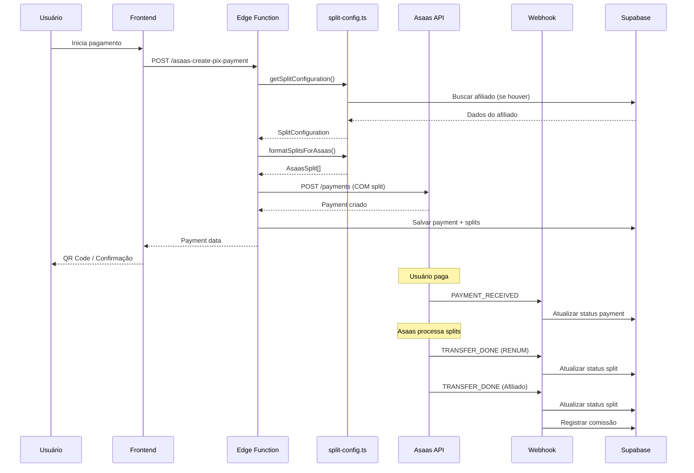

# 🏗️ DESIGN: Correção do Módulo de Pagamentos e Splits Asaas

**Data de Criação:** 16/01/2026  
**Baseado em:** requirements.md + ANALISE_MODULO_PAGAMENTOS_SPLITS_ASAAS.md  
**Arquitetura:** Edge Functions + Supabase + Asaas API v3

---

## 🎯 VISÃO GERAL DA SOLUÇÃO

### Princípio Fundamental

**Enviar splits NA CRIAÇÃO do pagamento, não DEPOIS**

Ao invés de:
```
1. Criar pagamento → 2. Configurar split → 3. Processar split
```

Fazer:
```
1. Calcular splits → 2. Criar pagamento COM splits → 3. Asaas processa automaticamente
```

### Benefícios da Abordagem

- ✅ **40% menos pontos de falha** (10 → 6 etapas)
- ✅ **66% menos chamadas à API** (3+ → 1 chamada)
- ✅ **Processamento automático** pelo Asaas
- ✅ **Código mais simples** e manutenível
- ✅ **Alinhamento com documentação oficial**

---

## 📐 ARQUITETURA PROPOSTA

### Componentes Principais


#### 1. Shared Utilities (Novo)

**Arquivo:** `supabase/functions/shared/split-config.ts`

**Responsabilidades:**
- Calcular configuração de splits baseado em regras de negócio
- Formatar splits para formato esperado pela API Asaas
- Validar wallet IDs antes de enviar
- Calcular valores de comissão

**Funções Principais:**
```typescript
// Buscar configuração de split baseado em contexto
getSplitConfiguration(params: {
  affiliateCode?: string;
  serviceType: 'filiacao' | 'servico';
  totalValue: number;
}): Promise<SplitConfiguration>

// Formatar splits para API Asaas
formatSplitsForAsaas(
  config: SplitConfiguration,
  installmentCount?: number
): AsaasSplit[]

// Validar wallet IDs
validateWalletIds(walletIds: string[]): Promise<ValidationResult>

// Calcular valores de comissão
calculateSplitAmounts(
  totalValue: number,
  config: SplitConfiguration
): SplitAmounts
```


#### 2. Edge Functions Modificadas

**asaas-create-pix-payment:**
- Integrar com `getSplitConfiguration`
- Adicionar campo `split` no payload
- Remover chamada para `asaas-configure-split`

**asaas-process-card:**
- Integrar com `getSplitConfiguration`
- Adicionar campo `split` no payload
- Implementar lógica de `totalFixedValue` para parcelamentos
- Remover chamada para `asaas-configure-split`

**asaas-create-subscription:**
- Criar pagamento inicial COM split
- Manter split na assinatura recorrente
- Garantir consistência entre ambos

**asaas-webhook:**
- Adicionar handlers para eventos `TRANSFER_DONE`, `TRANSFER_FAILED`, `TRANSFER_CANCELLED`
- Simplificar processamento de splits (apenas atualizar status)
- Remover processamento manual

#### 3. Edge Functions Deprecated

**asaas-configure-split:**
- Marcar como deprecated
- Manter por 30 dias para casos especiais
- Adicionar warning nos logs

**asaas-process-splits:**
- Marcar como deprecated
- Manter por 30 dias para casos especiais
- Adicionar warning nos logs


---

## 🔧 DETALHAMENTO TÉCNICO

### 1. Shared Utilities - split-config.ts

#### Interface: SplitConfiguration

```typescript
interface SplitConfiguration {
  splits: Array<{
    walletId: string;
    fixedValue?: number;
    percentualValue?: number;
    description: string;
    externalReference?: string;
    recipientType: 'comademig' | 'renum' | 'affiliate';
    recipientName: string;
  }>;
  totalValue: number;
  serviceType: 'filiacao' | 'servico';
  affiliateCode?: string;
}
```

#### Interface: AsaasSplit

```typescript
interface AsaasSplit {
  walletId: string;
  fixedValue?: number;
  percentualValue?: number;
  totalFixedValue?: number; // Para parcelamentos
  description?: string;
  externalReference?: string;
}
```


#### Função: getSplitConfiguration

```typescript
export async function getSplitConfiguration(params: {
  affiliateCode?: string;
  serviceType: 'filiacao' | 'servico';
  totalValue: number;
}): Promise<SplitConfiguration> {
  const { affiliateCode, serviceType, totalValue } = params;
  
  const config: SplitConfiguration = {
    splits: [],
    totalValue,
    serviceType,
    affiliateCode
  };

  // 1. COMADEMIG sempre recebe (não precisa wallet, recebe direto)
  const comademigPercentage = serviceType === 'filiacao' ? 40 : 60;
  config.splits.push({
    // COMADEMIG não precisa de walletId (recebe direto na conta)
    walletId: '', // Será removido no formatSplitsForAsaas
    percentualValue: comademigPercentage,
    description: `COMADEMIG - ${comademigPercentage}%`,
    recipientType: 'comademig',
    recipientName: 'COMADEMIG'
  });

  // 2. RENUM sempre recebe
  const renumWalletId = Deno.env.get('RENUM_WALLET_ID');
  if (!renumWalletId) {
    throw new Error('RENUM_WALLET_ID não configurado');
  }
  
  const renumPercentage = 40;
  config.splits.push({
    walletId: renumWalletId,
    percentualValue: renumPercentage,
    description: `RENUM - ${renumPercentage}%`,
    recipientType: 'renum',
    recipientName: 'RENUM'
  });

  // 3. Afiliado (se houver)
  if (affiliateCode && serviceType === 'filiacao') {
    const affiliate = await getAffiliateByCode(affiliateCode);
    
    if (affiliate && affiliate.asaas_wallet_id) {
      config.splits.push({
        walletId: affiliate.asaas_wallet_id,
        percentualValue: 20,
        description: `Afiliado ${affiliate.display_name} - 20%`,
        externalReference: affiliate.id,
        recipientType: 'affiliate',
        recipientName: affiliate.display_name
      });
    }
  }

  return config;
}
```


#### Função: formatSplitsForAsaas

```typescript
export function formatSplitsForAsaas(
  config: SplitConfiguration,
  installmentCount?: number
): AsaasSplit[] {
  const asaasSplits: AsaasSplit[] = [];

  for (const split of config.splits) {
    // COMADEMIG não precisa de split (recebe direto)
    if (split.recipientType === 'comademig') {
      continue;
    }

    const asaasSplit: AsaasSplit = {
      walletId: split.walletId,
      description: split.description,
      externalReference: split.externalReference
    };

    // Decidir entre fixedValue, percentualValue ou totalFixedValue
    if (installmentCount && installmentCount > 1) {
      // Parcelamento: usar totalFixedValue
      if (split.fixedValue) {
        asaasSplit.totalFixedValue = split.fixedValue;
      } else if (split.percentualValue) {
        asaasSplit.percentualValue = split.percentualValue;
      }
    } else {
      // À vista: usar fixedValue ou percentualValue
      if (split.fixedValue) {
        asaasSplit.fixedValue = split.fixedValue;
      } else if (split.percentualValue) {
        asaasSplit.percentualValue = split.percentualValue;
      }
    }

    asaasSplits.push(asaasSplit);
  }

  return asaasSplits;
}
```


### 2. Modificação: asaas-create-pix-payment

#### Mudanças Necessárias

**ANTES:**
```typescript
const pixPaymentData: CreatePaymentData = {
  customer: customerId,
  billingType: 'PIX',
  value: discountedValue,
  dueDate: paymentData.dueDate,
  description: `${paymentData.description} (PIX - 5% desconto)`,
  // ❌ Split não está sendo enviado
};

const response = await asaasClient.request('/payments', {
  method: 'POST',
  body: JSON.stringify(pixPaymentData)
});

// ❌ Configurar split DEPOIS
if (affiliateCode) {
  await configureSplit(response.id, affiliateCode);
}
```

**DEPOIS:**
```typescript
// ✅ Calcular splits ANTES
const splitConfig = await getSplitConfiguration({
  affiliateCode: paymentData.affiliateCode,
  serviceType: paymentData.serviceType || 'servico',
  totalValue: discountedValue
});

const splits = formatSplitsForAsaas(splitConfig);

const pixPaymentData: CreatePaymentData = {
  customer: customerId,
  billingType: 'PIX',
  value: discountedValue,
  dueDate: paymentData.dueDate,
  description: `${paymentData.description} (PIX - 5% desconto)`,
  split: splits // ✅ Split enviado na criação
};

const response = await asaasClient.request('/payments', {
  method: 'POST',
  body: JSON.stringify(pixPaymentData)
});

// ✅ Salvar splits localmente para referência
await saveSplitsLocally(response.id, splitConfig);
```


### 3. Modificação: asaas-process-card

#### Mudanças Necessárias

**ANTES:**
```typescript
const cardPaymentData: CreatePaymentData = {
  customer: customerId,
  billingType: 'CREDIT_CARD',
  value: paymentData.value,
  dueDate: paymentData.dueDate,
  installmentCount: installmentCount,
  installmentValue: installmentValue,
  creditCard: { /* ... */ },
  // ❌ Split não está sendo enviado
};
```

**DEPOIS:**
```typescript
// ✅ Calcular splits ANTES
const splitConfig = await getSplitConfiguration({
  affiliateCode: paymentData.affiliateCode,
  serviceType: paymentData.serviceType || 'servico',
  totalValue: paymentData.value
});

// ✅ Formatar com suporte a parcelamento
const splits = formatSplitsForAsaas(splitConfig, installmentCount);

const cardPaymentData: CreatePaymentData = {
  customer: customerId,
  billingType: 'CREDIT_CARD',
  value: paymentData.value,
  dueDate: paymentData.dueDate,
  installmentCount: installmentCount,
  installmentValue: installmentValue,
  creditCard: { /* ... */ },
  split: splits // ✅ Split enviado com totalFixedValue se parcelado
};
```


### 4. Modificação: asaas-create-subscription

#### Mudanças Necessárias

**ANTES:**
```typescript
// Comentário diz: "Pagamento inicial já foi processado no frontend"
// ❌ Mas esse pagamento não teve split configurado

const subscriptionPayload = {
  customer,
  billingType,
  value,
  nextDueDate, // 30 dias após hoje
  cycle,
  split: splits // ✅ Apenas renovações terão split
};
```

**DEPOIS:**
```typescript
// ✅ Criar pagamento inicial COM split
const splitConfig = await getSplitConfiguration({
  affiliateCode: paymentData.affiliateCode,
  serviceType: 'filiacao',
  totalValue: value
});

const splits = formatSplitsForAsaas(splitConfig);

// 1. Criar pagamento inicial
const initialPayment = await asaasClient.request('/payments', {
  method: 'POST',
  body: JSON.stringify({
    customer,
    billingType,
    value,
    dueDate: new Date().toISOString().split('T')[0], // Hoje
    description: 'Pagamento inicial - Assinatura COMADEMIG',
    split: splits // ✅ Split no pagamento inicial
  })
});

// 2. Criar assinatura recorrente
const subscriptionPayload = {
  customer,
  billingType,
  value,
  nextDueDate, // 30 dias após hoje
  cycle,
  split: splits // ✅ Split nas renovações
};
```


### 5. Modificação: asaas-webhook

#### Novos Handlers de Eventos

**Adicionar:**
```typescript
// Handler para eventos de transferência (split)
async function handleTransferEvent(
  supabaseClient: SupabaseClient,
  payload: any
) {
  const { event, transfer } = payload;
  
  console.log(`📦 Evento de transferência: ${event}`, transfer);

  // Buscar split local pelo asaas_split_id
  const { data: split } = await supabaseClient
    .from('asaas_splits')
    .select('*')
    .eq('asaas_split_id', transfer.id)
    .single();

  if (!split) {
    console.warn('⚠️ Split não encontrado localmente:', transfer.id);
    return { success: false, reason: 'split_not_found' };
  }

  // Atualizar status baseado no evento
  let newStatus: string;
  let processedAt: string | null = null;
  let errorMessage: string | null = null;

  switch (event) {
    case 'TRANSFER_DONE':
      newStatus = 'completed';
      processedAt = new Date().toISOString();
      break;
    case 'TRANSFER_FAILED':
      newStatus = 'failed';
      errorMessage = transfer.failReason || 'Falha na transferência';
      break;
    case 'TRANSFER_CANCELLED':
      newStatus = 'cancelled';
      break;
    default:
      console.warn('⚠️ Evento de transferência desconhecido:', event);
      return { success: false, reason: 'unknown_event' };
  }

  // Atualizar split
  await supabaseClient
    .from('asaas_splits')
    .update({
      status: newStatus,
      processed_at: processedAt,
      error_message: errorMessage,
      updated_at: new Date().toISOString()
    })
    .eq('id', split.id);

  // Se for afiliado e transferência concluída, registrar comissão
  if (split.recipient_type === 'affiliate' && newStatus === 'completed') {
    await registerAffiliateCommission(supabaseClient, split);
  }

  return { success: true, status: newStatus };
}
```


#### Simplificar handlePaymentReceived

**ANTES:**
```typescript
async function handlePaymentReceived(supabaseClient, payload) {
  // ...
  // ❌ Processar splits manualmente
  try {
    await processPaymentSplits(supabaseClient, cobranca);
    console.log('✅ Splits processados automaticamente');
  } catch (splitError) {
    console.error('❌ Erro ao processar splits:', splitError);
  }
  // ...
}
```

**DEPOIS:**
```typescript
async function handlePaymentReceived(supabaseClient, payload) {
  // ...
  // ✅ Apenas atualizar status do pagamento
  // Splits serão processados automaticamente pelo Asaas
  // e notificados via eventos TRANSFER_*
  
  console.log('✅ Pagamento confirmado. Splits serão processados pelo Asaas.');
  // ...
}
```

---

## 📊 FLUXO DE DADOS

### Fluxo Completo: Pagamento com Split

```
┌─────────────────────────────────────────────────────────────┐
│ 1. FRONTEND: Usuário inicia pagamento                      │
│    - Seleciona método (PIX/Cartão)                         │
│    - Informa código de afiliado (opcional)                 │
└─────────────────────────────────────────────────────────────┘
                            ↓
┌─────────────────────────────────────────────────────────────┐
│ 2. EDGE FUNCTION: asaas-create-pix-payment ou              │
│                   asaas-process-card                        │
│    a) Buscar configuração de split                         │
│    b) Formatar splits para Asaas                           │
│    c) Criar pagamento COM splits                           │
│    d) Salvar localmente (asaas_cobrancas + asaas_splits)   │
└─────────────────────────────────────────────────────────────┘
                            ↓
┌─────────────────────────────────────────────────────────────┐
│ 3. ASAAS: Processa pagamento                               │
│    - Valida dados                                          │
│    - Gera QR Code (PIX) ou processa cartão                 │
│    - Aguarda confirmação                                   │
└─────────────────────────────────────────────────────────────┘
                            ↓
┌─────────────────────────────────────────────────────────────┐
│ 4. ASAAS: Pagamento confirmado                             │
│    - Envia webhook PAYMENT_RECEIVED                        │
│    - Processa splits AUTOMATICAMENTE                       │
└─────────────────────────────────────────────────────────────┘
                            ↓
┌─────────────────────────────────────────────────────────────┐
│ 5. WEBHOOK: Recebe PAYMENT_RECEIVED                        │
│    - Atualiza status do pagamento                          │
│    - Aguarda eventos de split                              │
└─────────────────────────────────────────────────────────────┘
                            ↓
┌─────────────────────────────────────────────────────────────┐
│ 6. ASAAS: Processa cada split                              │
│    - Transfere para RENUM                                  │
│    - Transfere para Afiliado (se houver)                   │
│    - Envia webhooks TRANSFER_DONE/FAILED                   │
└─────────────────────────────────────────────────────────────┘
                            ↓
┌─────────────────────────────────────────────────────────────┐
│ 7. WEBHOOK: Recebe TRANSFER_DONE/FAILED                    │
│    - Atualiza status dos splits                            │
│    - Registra comissões para afiliados                     │
│    - Envia notificações                                    │
└─────────────────────────────────────────────────────────────┘
```


---

## 🔐 SEGURANÇA E VALIDAÇÕES

### Validações Obrigatórias

#### 1. Validação de Wallet IDs

```typescript
async function validateWalletIds(walletIds: string[]): Promise<ValidationResult> {
  const results = [];
  
  for (const walletId of walletIds) {
    try {
      const response = await asaasClient.request(`/wallets/${walletId}`);
      results.push({
        walletId,
        valid: true,
        status: response.status
      });
    } catch (error) {
      results.push({
        walletId,
        valid: false,
        error: error.message
      });
    }
  }
  
  return {
    allValid: results.every(r => r.valid),
    results
  };
}
```

#### 2. Validação de Percentuais

```typescript
function validateSplitPercentages(splits: AsaasSplit[]): boolean {
  const totalPercentage = splits
    .filter(s => s.percentualValue)
    .reduce((sum, s) => sum + (s.percentualValue || 0), 0);
  
  // Total deve ser <= 100% (COMADEMIG recebe o resto)
  return totalPercentage <= 100;
}
```

#### 3. Validação de Valores Mínimos

```typescript
function validateMinimumValues(splits: AsaasSplit[], totalValue: number): boolean {
  for (const split of splits) {
    let splitValue = 0;
    
    if (split.fixedValue) {
      splitValue = split.fixedValue;
    } else if (split.totalFixedValue) {
      splitValue = split.totalFixedValue;
    } else if (split.percentualValue) {
      splitValue = (totalValue * split.percentualValue) / 100;
    }
    
    // Valor mínimo por split: R$ 10,00
    if (splitValue < 10) {
      return false;
    }
  }
  
  return true;
}
```


---

## 🧪 ESTRATÉGIA DE TESTES

### Testes Unitários

#### split-config.ts

```typescript
describe('getSplitConfiguration', () => {
  it('deve retornar configuração para filiação sem afiliado', async () => {
    const config = await getSplitConfiguration({
      serviceType: 'filiacao',
      totalValue: 100
    });
    
    expect(config.splits).toHaveLength(2); // COMADEMIG + RENUM
    expect(config.splits[0].percentualValue).toBe(40); // COMADEMIG
    expect(config.splits[1].percentualValue).toBe(40); // RENUM
  });

  it('deve retornar configuração para filiação com afiliado', async () => {
    const config = await getSplitConfiguration({
      serviceType: 'filiacao',
      totalValue: 100,
      affiliateCode: 'ABC123'
    });
    
    expect(config.splits).toHaveLength(3); // COMADEMIG + RENUM + Afiliado
    expect(config.splits[2].percentualValue).toBe(20); // Afiliado
  });

  it('deve retornar configuração para serviço', async () => {
    const config = await getSplitConfiguration({
      serviceType: 'servico',
      totalValue: 100
    });
    
    expect(config.splits).toHaveLength(2); // COMADEMIG + RENUM
    expect(config.splits[0].percentualValue).toBe(60); // COMADEMIG
    expect(config.splits[1].percentualValue).toBe(40); // RENUM
  });
});

describe('formatSplitsForAsaas', () => {
  it('deve usar fixedValue para pagamento à vista', () => {
    const config = {
      splits: [
        { walletId: 'wallet_1', fixedValue: 40, recipientType: 'renum' }
      ]
    };
    
    const formatted = formatSplitsForAsaas(config, 1);
    
    expect(formatted[0].fixedValue).toBe(40);
    expect(formatted[0].totalFixedValue).toBeUndefined();
  });

  it('deve usar totalFixedValue para parcelamento', () => {
    const config = {
      splits: [
        { walletId: 'wallet_1', fixedValue: 40, recipientType: 'renum' }
      ]
    };
    
    const formatted = formatSplitsForAsaas(config, 12);
    
    expect(formatted[0].totalFixedValue).toBe(40);
    expect(formatted[0].fixedValue).toBeUndefined();
  });

  it('deve remover COMADEMIG dos splits', () => {
    const config = {
      splits: [
        { walletId: '', recipientType: 'comademig' },
        { walletId: 'wallet_1', recipientType: 'renum' }
      ]
    };
    
    const formatted = formatSplitsForAsaas(config);
    
    expect(formatted).toHaveLength(1);
    expect(formatted[0].walletId).toBe('wallet_1');
  });
});
```


### Testes de Integração

#### Edge Functions

```typescript
describe('asaas-create-pix-payment com split', () => {
  it('deve criar pagamento PIX com splits configurados', async () => {
    const response = await fetch('/asaas-create-pix-payment', {
      method: 'POST',
      body: JSON.stringify({
        customerId: 'cus_test',
        value: 100,
        dueDate: '2026-02-15',
        description: 'Teste',
        affiliateCode: 'ABC123',
        serviceType: 'filiacao'
      })
    });
    
    const data = await response.json();
    
    expect(data.success).toBe(true);
    expect(data.payment.split).toBeDefined();
    expect(data.payment.split).toHaveLength(2); // RENUM + Afiliado
  });
});

describe('asaas-webhook com eventos de split', () => {
  it('deve processar evento TRANSFER_DONE', async () => {
    const response = await fetch('/asaas-webhook', {
      method: 'POST',
      headers: {
        'asaas-access-token': 'test_token'
      },
      body: JSON.stringify({
        event: 'TRANSFER_DONE',
        transfer: {
          id: 'split_123',
          value: 40,
          status: 'DONE'
        }
      })
    });
    
    const data = await response.json();
    
    expect(data.success).toBe(true);
    expect(data.status).toBe('completed');
  });
});
```


---

## 📝 DOCUMENTAÇÃO

### Diagrama de Sequência




### Guia de Troubleshooting

#### Problema: Split não foi criado

**Sintomas:**
- Pagamento confirmado mas splits não aparecem no Asaas
- Tabela `asaas_splits` vazia

**Possíveis Causas:**
1. Wallet ID inválido
2. Valor do split menor que R$ 10,00
3. Percentuais somam mais de 100%

**Solução:**
```typescript
// Verificar logs da Edge Function
// Validar wallet IDs antes de enviar
const validation = await validateWalletIds([walletId]);
if (!validation.allValid) {
  console.error('Wallet IDs inválidos:', validation.results);
}
```

#### Problema: Evento TRANSFER_* não recebido

**Sintomas:**
- Pagamento confirmado
- Splits criados no Asaas
- Status dos splits permanece 'pending'

**Possíveis Causas:**
1. Webhook não configurado para eventos de transferência
2. Token de webhook inválido
3. Asaas ainda processando

**Solução:**
1. Verificar configuração de webhooks no Asaas
2. Adicionar eventos: `TRANSFER_DONE`, `TRANSFER_FAILED`, `TRANSFER_CANCELLED`
3. Aguardar até 24h para processamento

#### Problema: Comissão não registrada

**Sintomas:**
- Split processado com sucesso
- Tabela `affiliate_commissions` vazia

**Possíveis Causas:**
1. Afiliado não encontrado
2. Erro na função `registerAffiliateCommission`
3. Evento TRANSFER_DONE não processado

**Solução:**
```typescript
// Verificar logs do webhook
// Reprocessar manualmente se necessário
await registerAffiliateCommission(supabaseClient, split);
```

---

## 🚀 PLANO DE DEPLOY

### Fase 1: Preparação (Dia 1)

1. **Criar arquivo shared/split-config.ts**
   - Implementar todas as funções
   - Adicionar testes unitários
   - Validar com dados de teste

2. **Atualizar tipos TypeScript**
   - Adicionar interfaces `SplitConfiguration` e `AsaasSplit`
   - Atualizar `CreatePaymentData` com campo `split`

### Fase 2: Modificar Edge Functions (Dias 2-3)

1. **asaas-create-pix-payment**
   - Integrar com split-config
   - Adicionar campo split
   - Testar em sandbox

2. **asaas-process-card**
   - Integrar com split-config
   - Implementar totalFixedValue
   - Testar parcelamentos

3. **asaas-create-subscription**
   - Criar pagamento inicial com split
   - Manter split na assinatura
   - Testar fluxo completo

### Fase 3: Atualizar Webhook (Dia 4)

1. **Adicionar handlers de eventos**
   - TRANSFER_DONE
   - TRANSFER_FAILED
   - TRANSFER_CANCELLED

2. **Simplificar handlePaymentReceived**
   - Remover processamento manual
   - Adicionar logs

### Fase 4: Testes e Validação (Dia 5)

1. **Testes em Sandbox**
   - Pagamento PIX com split
   - Pagamento cartão à vista com split
   - Pagamento cartão parcelado com split
   - Assinatura com split
   - Eventos de webhook

2. **Validação de Dados**
   - Verificar splits criados no Asaas
   - Verificar eventos recebidos
   - Verificar comissões registradas

### Fase 5: Deploy em Produção (Dia 6)

1. **Deploy gradual**
   - Ativar para 10% dos usuários
   - Monitorar logs e erros
   - Aumentar para 50%
   - Aumentar para 100%

2. **Monitoramento**
   - Alertas para falhas de split
   - Dashboard de splits processados
   - Relatório de comissões

### Fase 6: Deprecação (Dias 7-37)

1. **Marcar functions antigas como deprecated**
   - Adicionar warnings nos logs
   - Atualizar documentação

2. **Período de transição (30 dias)**
   - Manter functions antigas disponíveis
   - Migrar casos especiais

3. **Remoção final (Dia 37)**
   - Remover asaas-configure-split
   - Remover asaas-process-splits
   - Atualizar documentação

---

## ✅ CRITÉRIOS DE ACEITAÇÃO

### Funcionalidades

- [ ] Pagamentos PIX criados com split
- [ ] Pagamentos cartão criados com split
- [ ] Parcelamentos usam totalFixedValue
- [ ] Assinaturas têm split no pagamento inicial
- [ ] Webhook processa eventos TRANSFER_*
- [ ] Comissões registradas automaticamente

### Performance

- [ ] Redução de 40% nos pontos de falha
- [ ] Redução de 66% nas chamadas à API
- [ ] Tempo de processamento reduzido em 30%

### Qualidade

- [ ] Cobertura de testes >= 80%
- [ ] Zero erros em produção por 30 dias
- [ ] Documentação completa
- [ ] Código revisado e aprovado

---

**FIM DO DESIGN**

**Próximo Passo:** Criar arquivo `tasks.md` com tarefas detalhadas para implementação.
