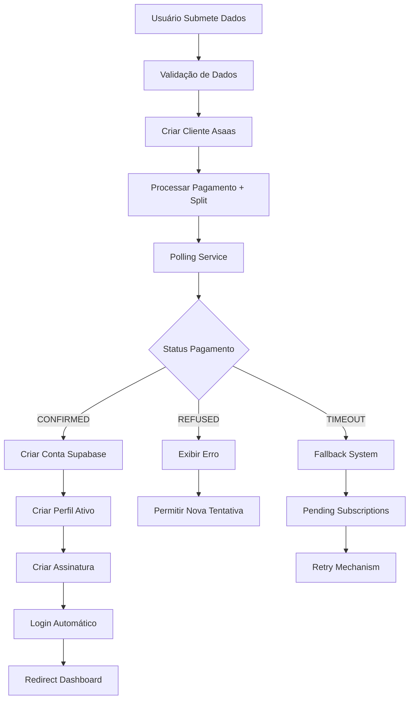
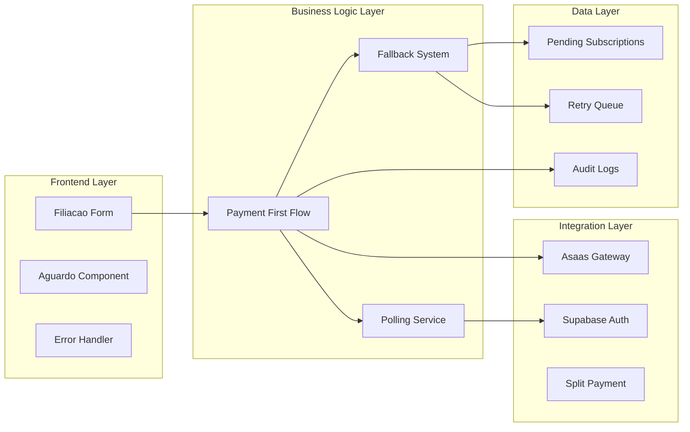
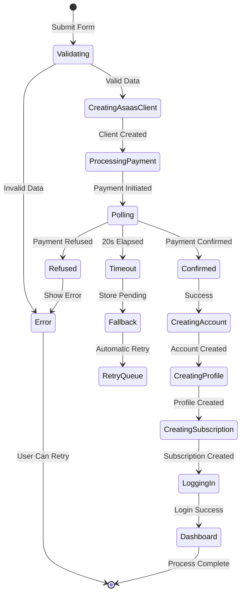

# Design Document - Inversão do Fluxo de Registro (Pagamento → Conta)

## Overview

A inversão do fluxo de registro representa uma refatoração arquitetural crítica que resolve problemas fundamentais de segurança no sistema COMADEMIG. O novo design processa e confirma pagamentos ANTES de criar contas de usuário, eliminando race conditions e garantindo que apenas usuários que efetivamente pagaram tenham acesso ao sistema.

### Problema Atual

O fluxo existente cria contas Supabase imediatamente após validação de dados, resultando em:
- Usuários logados com pagamentos pendentes
- Contas "lixo" no banco de dados
- Necessidade de RLS complexo para controlar acesso
- Vulnerabilidades de segurança onde usuários não pagantes podem acessar funcionalidades

### Solução Proposta

O novo fluxo inverte a ordem das operações:
1. **Validação** → 2. **Pagamento** → 3. **Confirmação** → 4. **Conta** → 5. **Acesso**

Esta abordagem garante que contas só existam para usuários que efetivamente pagaram, simplificando drasticamente a segurança e eliminando estados inconsistentes.

## Architecture

### High-Level Architecture



### Component Architecture



### State Flow Diagram



## Components and Interfaces

### Core Components

#### 1. PaymentFirstFlow Service

```typescript
interface PaymentFirstFlowService {
  processRegistration(data: RegistrationData): Promise<RegistrationResult>
  validateData(data: RegistrationData): ValidationResult
  createAsaasClient(data: UserData): Promise<AsaasClient>
  processPayment(client: AsaasClient, plan: SubscriptionPlan): Promise<Payment>
  waitForConfirmation(paymentId: string): Promise<PaymentStatus>
  createUserAccount(data: UserData): Promise<SupabaseUser>
  createUserProfile(user: SupabaseUser, data: UserData): Promise<Profile>
  createSubscription(profile: Profile, payment: Payment): Promise<Subscription>
  handleFailure(error: ProcessingError, context: ProcessingContext): Promise<void>
}
```

#### 2. PollingService

```typescript
interface PollingService {
  pollPaymentStatus(paymentId: string, options: PollingOptions): Promise<PaymentStatus>
  startPolling(paymentId: string): Promise<PaymentStatus>
  stopPolling(paymentId: string): void
  getPollingStatus(paymentId: string): PollingStatus
}

interface PollingOptions {
  maxAttempts: number // 15 attempts (1s intervals for 15s total)
  intervalMs: number // 1000ms fixed interval
  timeoutMs: number // 15000ms total timeout
}
```

#### 3. FallbackSystem

```typescript
interface FallbackSystem {
  storePendingSubscription(data: PendingSubscriptionData): Promise<void>
  processPendingSubscriptions(): Promise<ProcessingResult[]>
  retryFailedProcess(pendingId: string): Promise<RetryResult>
  notifyAdministrators(error: CriticalError): Promise<void>
  manualCompletion(pendingId: string, adminId: string): Promise<CompletionResult>
}
```

#### 4. SplitPaymentService

```typescript
interface SplitPaymentService {
  calculateSplit(amount: number, affiliateId?: string): SplitConfiguration
  applySplitToPayment(payment: Payment, split: SplitConfiguration): Promise<void>
  setupRecurringSplit(subscription: Subscription, split: SplitConfiguration): Promise<void>
  trackCommission(affiliateId: string, amount: number, subscriptionId: string): Promise<void>
}
```

### Data Models

#### PendingSubscription

```typescript
interface PendingSubscription {
  id: string
  asaas_payment_id: string
  user_data: RegistrationData
  payment_data: PaymentData
  affiliate_id?: string
  status: 'pending' | 'processing' | 'failed' | 'completed'
  attempts: number
  last_attempt_at?: Date
  error_log?: string[]
  created_at: Date
  updated_at: Date
}
```

#### ProcessingContext

```typescript
interface ProcessingContext {
  step: ProcessingStep
  user_data: RegistrationData
  asaas_client_id?: string
  payment_id?: string
  supabase_user_id?: string
  profile_id?: string
  subscription_id?: string
  affiliate_id?: string
  error_history: ProcessingError[]
  started_at: Date
}
```

#### RegistrationResult

```typescript
interface RegistrationResult {
  success: boolean
  user_id?: string
  subscription_id?: string
  redirect_url?: string
  error?: {
    code: string
    message: string
    retryable: boolean
    context?: any
  }
  processing_time_ms: number
  steps_completed: ProcessingStep[]
}
```

## Data Models

### Database Schema Changes

#### New Tables

```sql
-- Tabela para armazenar assinaturas pendentes
CREATE TABLE pending_subscriptions (
  id UUID PRIMARY KEY DEFAULT gen_random_uuid(),
  asaas_payment_id TEXT NOT NULL UNIQUE,
  user_data JSONB NOT NULL,
  payment_data JSONB NOT NULL,
  affiliate_id UUID REFERENCES profiles(id),
  status TEXT NOT NULL DEFAULT 'pending' CHECK (status IN ('pending', 'processing', 'failed', 'completed')),
  attempts INTEGER NOT NULL DEFAULT 0,
  last_attempt_at TIMESTAMPTZ,
  error_log JSONB DEFAULT '[]'::jsonb,
  created_at TIMESTAMPTZ NOT NULL DEFAULT NOW(),
  updated_at TIMESTAMPTZ NOT NULL DEFAULT NOW()
);

-- Tabela para armazenar contas pendentes
CREATE TABLE pending_completions (
  id UUID PRIMARY KEY DEFAULT gen_random_uuid(),
  email TEXT NOT NULL UNIQUE,
  password_hash TEXT NOT NULL,
  full_name TEXT NOT NULL,
  cpf TEXT NOT NULL,
  phone TEXT NOT NULL,
  customer_id TEXT NOT NULL,
  payment_id TEXT NOT NULL,
  subscription_id TEXT NOT NULL,
  member_type_id INTEGER NOT NULL,
  affiliate_code TEXT,
  profile_data JSONB NOT NULL,
  retry_count INTEGER DEFAULT 0,
  last_error TEXT,
  created_at TIMESTAMPTZ DEFAULT NOW(),
  processed_at TIMESTAMPTZ,
  status TEXT DEFAULT 'pending' CHECK (status IN ('pending', 'processing', 'completed', 'failed'))
);
```

#### Indexes for Performance

```sql
-- Índices para otimizar consultas
CREATE INDEX idx_pending_subscriptions_status ON pending_subscriptions(status);
CREATE INDEX idx_pending_subscriptions_payment_id ON pending_subscriptions(asaas_payment_id);
CREATE INDEX idx_pending_completions_email ON pending_completions(email);
CREATE INDEX idx_pending_completions_status ON pending_completions(status);
```

### Modified Tables

```sql
-- Adicionar campos de auditoria à tabela profiles
ALTER TABLE profiles ADD COLUMN IF NOT EXISTS payment_confirmed_at TIMESTAMPTZ;
ALTER TABLE profiles ADD COLUMN IF NOT EXISTS registration_flow_version TEXT DEFAULT 'v1';

-- Adicionar campos de rastreamento à tabela user_subscriptions  
ALTER TABLE user_subscriptions ADD COLUMN IF NOT EXISTS asaas_payment_id TEXT;
ALTER TABLE user_subscriptions ADD COLUMN IF NOT EXISTS processing_context JSONB;
```

## Error Handling

### Error Classification

```typescript
enum ErrorType {
  VALIDATION_ERROR = 'validation_error',
  ASAAS_CLIENT_ERROR = 'asaas_client_error', 
  PAYMENT_PROCESSING_ERROR = 'payment_processing_error',
  PAYMENT_REFUSED = 'payment_refused',
  POLLING_TIMEOUT = 'polling_timeout',
  SUPABASE_AUTH_ERROR = 'supabase_auth_error',
  PROFILE_CREATION_ERROR = 'profile_creation_error',
  SUBSCRIPTION_CREATION_ERROR = 'subscription_creation_error',
  SPLIT_PAYMENT_ERROR = 'split_payment_error',
  SYSTEM_ERROR = 'system_error'
}

interface ProcessingError {
  type: ErrorType
  message: string
  retryable: boolean
  context: any
  timestamp: Date
  step: ProcessingStep
}
```

### Error Recovery Strategies

#### 1. Immediate Retry (Transient Errors)
- Network timeouts
- Temporary API unavailability
- Rate limiting

#### 2. Delayed Retry (Resource Conflicts)
- Database locks
- External service overload
- Temporary account issues

#### 3. Manual Intervention (Business Logic Errors)
- Invalid payment methods
- Account verification issues
- Policy violations

#### 4. User Retry (User-Correctable Errors)
- Invalid data
- Insufficient funds
- Expired cards

### Fallback Mechanisms

```typescript
class FallbackHandler {
  async handlePaymentConfirmedButAccountFailed(context: ProcessingContext): Promise<void> {
    // Armazenar em pending_subscriptions para retry automático
    await this.storePendingSubscription({
      asaas_payment_id: context.payment_id!,
      user_data: context.user_data,
      payment_data: context.payment_data,
      affiliate_id: context.affiliate_id,
      status: 'pending'
    })
    
    // Agendar retry imediato
    await this.scheduleRetry(context.payment_id!, 0)
  }
  
  async handlePartialCompletion(context: ProcessingContext): Promise<void> {
    // Identificar ponto de falha e continuar de onde parou
    const lastCompletedStep = context.steps_completed.slice(-1)[0]
    
    switch (lastCompletedStep) {
      case 'ACCOUNT_CREATED':
        await this.continueFromProfile(context)
        break
      case 'PROFILE_CREATED':
        await this.continueFromSubscription(context)
        break
      // ... outros casos
    }
  }
}
```

## Testing Strategy

### Dual Testing Approach

O sistema utilizará uma abordagem dupla de testes para garantir cobertura completa:

#### Unit Tests
- Testes específicos para cada componente isoladamente
- Validação de casos edge e condições de erro
- Mocking de dependências externas (Asaas, Supabase)
- Testes de integração entre componentes relacionados

#### Property-Based Tests
- Validação de propriedades universais através de dados gerados aleatoriamente
- Cada propriedade executará mínimo 100 iterações
- Testes configurados com tags referenciando propriedades do design
- Cobertura abrangente de cenários através de randomização

### Property-Based Testing Configuration

Utilizaremos **fast-check** para TypeScript/JavaScript com configuração mínima de 100 iterações por teste. Cada teste será tagado com formato:
**Feature: payment-first-flow, Property {number}: {property_text}**

### Test Environment Setup

```typescript
// Configuração de ambiente de teste
const testConfig = {
  asaas: {
    baseUrl: 'https://sandbox.asaas.com/api/v3',
    apiKey: process.env.ASAAS_TEST_API_KEY
  },
  supabase: {
    url: process.env.SUPABASE_TEST_URL,
    anonKey: process.env.SUPABASE_TEST_ANON_KEY,
    serviceKey: process.env.SUPABASE_TEST_SERVICE_KEY
  },
  polling: {
    maxAttempts: 15, // Reduzido para testes
    intervalMs: 100, // Acelerado para testes
    timeoutMs: 1500
  }
}
```

## Correctness Properties

*A property is a characteristic or behavior that should hold true across all valid executions of a system-essentially, a formal statement about what the system should do. Properties serve as the bridge between human-readable specifications and machine-verifiable correctness guarantees.*

### Core Invariant Properties

**Property 1: Payment-First Invariant**
*For any* user account in the system, that account should only exist if there is a corresponding confirmed payment record
**Validates: Requirements 1.5, 3.5, 5.2**

**Property 2: Processing Order Invariant**
*For any* successful registration flow, the Asaas client creation should always occur before Supabase account creation
**Validates: Requirements 1.2**

**Property 3: Data Validation Priority**
*For any* registration attempt, data validation should always complete before any external API calls are made
**Validates: Requirements 1.1**

### Payment Processing Properties

**Property 4: Split Payment Consistency**
*For any* payment with a valid affiliate, the payment should include the correct split configuration for that affiliate
**Validates: Requirements 1.3, 6.1, 6.4**

**Property 5: Polling Behavior Consistency**
*For any* created payment, the polling service should be initiated and follow the configured timing intervals
**Validates: Requirements 1.4, 2.1**

**Property 6: Status Response Immediacy**
*For any* payment status that is either 'CONFIRMED' or 'REFUSED', the polling service should return the result immediately without waiting for the next interval
**Validates: Requirements 2.2, 2.3**

**Property 7: Timeout Consistency**
*For any* polling session that runs for the configured timeout period without receiving a definitive status, the service should return a timeout result
**Validates: Requirements 2.4**

### Account Creation Properties

**Property 8: Conditional Account Creation**
*For any* confirmed payment, a Supabase account should be created with the corresponding user data
**Validates: Requirements 3.1**

**Property 9: Profile Status Consistency**
*For any* created user profile, the initial status should always be 'ativo'
**Validates: Requirements 3.2**

**Property 10: Subscription Creation Chain**
*For any* created user profile, a corresponding subscription with split payment configuration should be created
**Validates: Requirements 3.3**

**Property 11: Automatic Login Flow**
*For any* successfully created subscription, an automatic login should be performed for the user
**Validates: Requirements 3.4**

### Fallback System Properties

**Property 12: Failure Recovery Storage**
*For any* process that fails after payment confirmation, the relevant data should be stored in the pending subscriptions table
**Validates: Requirements 4.1**

**Property 13: Automatic Retry Initiation**
*For any* record in pending subscriptions, the retry mechanism should attempt automatic completion
**Validates: Requirements 4.2**

**Property 14: Administrative Escalation**
*For any* retry process that exhausts all automatic attempts, administrators should be notified
**Validates: Requirements 4.3**

**Property 15: Manual Completion Capability**
*For any* pending subscription record, administrative manual completion should be possible
**Validates: Requirements 4.4**

### Error Handling Properties

**Property 16: Refused Payment Feedback**
*For any* payment that is refused, a specific error message should be displayed to the user
**Validates: Requirements 5.1**

**Property 17: Retry Capability Preservation**
*For any* failed payment attempt, the user should be able to retry with the same data
**Validates: Requirements 5.3**

**Property 18: Escalation After Multiple Failures**
*For any* user who experiences multiple consecutive payment failures, support contact information should be suggested
**Validates: Requirements 5.4**

**Property 19: Temporary Data Cleanup**
*For any* definitively failed registration attempt, temporary data should be cleaned up
**Validates: Requirements 5.5**

### Affiliate System Properties

**Property 20: Recurring Split Configuration**
*For any* created subscription with an affiliate, recurring split payments should be configured
**Validates: Requirements 6.2**

**Property 21: Commission Calculation Accuracy**
*For any* valid affiliate and payment amount, the commission calculation should follow the defined percentage rules
**Validates: Requirements 6.3**

**Property 22: Commission Traceability**
*For any* processed commission, complete traceability information should be maintained
**Validates: Requirements 6.5**

### User Experience Properties

**Property 23: Progress Indication**
*For any* submitted payment, a waiting screen with progress indication should be displayed
**Validates: Requirements 7.1, 7.2**

**Property 24: Real-time Status Updates**
*For any* active polling session, visual status updates should be provided to the user
**Validates: Requirements 7.3**

**Property 25: Automatic Redirection**
*For any* successfully completed registration process, automatic redirection to the dashboard should occur
**Validates: Requirements 7.4**

**Property 26: Cancellation Control**
*For any* registration process in the waiting phase, user cancellation should be possible
**Validates: Requirements 7.5**

### Monitoring and Audit Properties

**Property 27: Comprehensive Logging**
*For any* executed process step, detailed logs should be recorded
**Validates: Requirements 8.1**

**Property 28: Error Context Capture**
*For any* error that occurs, complete context information should be captured
**Validates: Requirements 8.2**

**Property 29: Performance Metrics Collection**
*For any* completed registration process, performance metrics should be recorded
**Validates: Requirements 8.3**

**Property 30: Audit Trail Completeness**
*For any* registration process, a complete audit trail should be available for review
**Validates: Requirements 8.4**

### Migration and Compatibility Properties

**Property 31: Backward Compatibility**
*For any* existing user data, the new flow should maintain compatibility
**Validates: Requirements 9.1**

**Property 32: Existing User Non-Regression**
*For any* existing user login, the system should function normally
**Validates: Requirements 9.2**

**Property 33: Pending Process Completion**
*For any* existing pending process, manual completion should be possible
**Validates: Requirements 9.3**

### Performance Properties

**Property 34: Processing Time Bounds**
*For any* normal registration process, completion should occur within 25 seconds
**Validates: Requirements 10.1**

**Property 35: Polling Optimization**
*For any* polling session, the intervals should follow the optimized exponential backoff pattern
**Validates: Requirements 2.5, 10.2**

**Property 36: Graceful Timeout Handling**
*For any* timeout scenario, the system should fail gracefully without leaving inconsistent state
**Validates: Requirements 10.3**

**Property 37: Load Responsiveness**
*For any* system under normal load, responsiveness should be maintained
**Validates: Requirements 10.4**

**Property 38: API Call Optimization**
*For any* registration process, the number of external API calls should be minimized for optimal latency
**Validates: Requirements 10.5**

## Implementation Architecture

### Edge Functions Required

#### 1. process-payment-first-registration
- **Purpose**: Main orchestrator for the new registration flow
- **Triggers**: HTTP POST from frontend
- **Dependencies**: Asaas API, Supabase Auth, Split Payment Service
- **Timeout**: 25 seconds
- **Retry**: Not applicable (handled internally)

#### 2. poll-payment-status
- **Purpose**: Poll Asaas API for payment status updates
- **Triggers**: Called by main registration function
- **Dependencies**: Asaas API
- **Timeout**: 15 seconds total (15 attempts × 1s each)
- **Retry**: Fixed 1-second intervals

#### 3. process-pending-subscriptions
- **Purpose**: Process failed registrations stored in pending table
- **Triggers**: Cron job (every 5 minutes)
- **Dependencies**: Asaas API, Supabase Auth, Split Payment Service
- **Timeout**: 5 minutes
- **Retry**: Up to 3 attempts per pending record

#### 4. process-pending-completions
- **Purpose**: Process failed account creations stored in pending table
- **Triggers**: Cron job (every 5 minutes)
- **Dependencies**: Supabase Auth
- **Timeout**: 5 minutes
- **Retry**: Up to 3 attempts per pending record

#### 5. notify-admin-failures
- **Purpose**: Send notifications for critical failures requiring manual intervention
- **Triggers**: Called by process-pending-subscriptions
- **Dependencies**: Email service, Slack webhook
- **Timeout**: 30 seconds
- **Retry**: Up to 2 attempts

### Frontend Components Updates

#### 1. FiliacaoForm Component
- Add payment-first flow integration
- Remove immediate account creation logic
- Add progress tracking state management
- Implement error handling for new error types

#### 2. AguardandoConfirmacao Component (New)
- Real-time progress indication
- Polling status display
- Cancellation capability
- Error state handling
- Automatic redirection on success

#### 3. Error Handling Components
- Specific error messages for payment refusal
- Retry capability for recoverable errors
- Support contact escalation for persistent failures

### Database Migration Strategy

#### Phase 1: Add New Tables
```sql
-- Create new tables without affecting existing functionality
-- Add indexes for performance
-- Set up RLS policies for new tables
```

#### Phase 2: Add Tracking Fields
```sql
-- Add audit fields to existing tables
-- Add payment tracking to subscriptions
-- Maintain backward compatibility
```

#### Phase 3: Deploy New Flow
```sql
-- Deploy Edge Functions
-- Update frontend to use new flow
-- Monitor both flows in parallel
```

#### Phase 4: Migration and Cleanup
```sql
-- Migrate existing pending processes
-- Remove old flow code
-- Clean up unused fields/tables
```

## Security Considerations

### Authentication Security
- No Supabase accounts created until payment confirmed
- Eliminates unauthorized access to system resources
- Reduces attack surface for account enumeration

### Data Protection
- Sensitive payment data stored temporarily in encrypted format
- Automatic cleanup of failed registration attempts
- Audit trails for all payment processing activities

### API Security
- Rate limiting on registration endpoints
- Input validation and sanitization
- Secure handling of Asaas webhook signatures

### Split Payment Security
- Validation of affiliate relationships before applying splits
- Audit trail for all commission calculations
- Protection against split manipulation attacks

## Monitoring and Observability

### Key Metrics
- Registration success rate
- Average processing time
- Payment confirmation rate
- Fallback system utilization
- Error distribution by type

### Alerting Thresholds
- Registration success rate < 95%
- Average processing time > 20 seconds
- Pending subscriptions queue > 10 items
- Critical errors requiring manual intervention

### Dashboard Requirements
- Real-time registration flow monitoring
- Payment status distribution
- Performance metrics visualization
- Error trend analysis
- Affiliate commission tracking

## Rollback Strategy

### Immediate Rollback Capability
- Feature flag to switch back to old flow
- Database compatibility maintained during transition
- Existing user functionality unaffected

### Data Consistency During Rollback
- Pending subscriptions processed before rollback
- No data loss during transition
- Audit trail maintained for troubleshooting

### Rollback Testing
- Comprehensive testing of rollback scenarios
- Validation of data integrity post-rollback
- Performance impact assessment