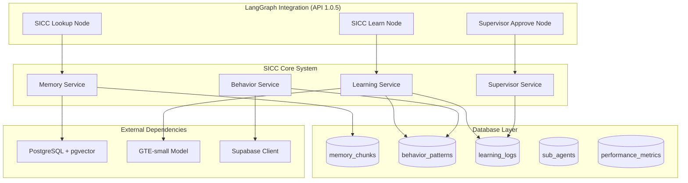

# Design Document: Sistema de Inteligência Corporativa Contínua (SICC)

## Overview

O Sistema de Inteligência Corporativa Contínua (SICC) é uma arquitetura de aprendizado automático que transforma o agente conversacional em um sistema adaptativo e inteligente. O SICC utiliza embeddings vetoriais, análise de padrões comportamentais e aprovação supervisionada para criar um agente que aprende continuamente com as interações e melhora sua performance ao longo do tempo.

A arquitetura é baseada em cinco componentes principais: armazenamento vetorial de memórias, identificação de padrões, sistema de aprovação, aplicação inteligente e métricas de performance. O sistema integra-se transparentemente ao LangGraph existente através de três novos nodes especializados.

## Architecture



### Data Flow

1. **Ingestion Phase**: Conversas são processadas pelo Memory Service, que extrai fragmentos relevantes e gera embeddings usando GTE-small
2. **Learning Phase**: Learning Service analisa padrões em conversas similares e identifica comportamentos recorrentes
3. **Approval Phase**: Supervisor Service valida padrões baseado em confidence threshold (70%) e aprova/rejeita aprendizados
4. **Application Phase**: Behavior Service aplica padrões aprovados em novas conversas, personalizando respostas
5. **Monitoring Phase**: Performance metrics são coletadas continuamente para avaliar eficácia do sistema

## Components and Interfaces

### Memory Service (`memory_service.py`)

**Responsabilidade**: Gerenciar armazenamento e recuperação de memórias vetorizadas

```python
class MemoryService:
    async def store_memory(self, conversation_id: str, content: str, metadata: dict) -> str:
        """Armazena fragmento de conversa como embedding vetorial"""
        
    async def search_similar(self, query: str, limit: int = 5, filters: dict = None) -> List[Memory]:
        """Busca memórias similares usando pgvector"""
        
    async def get_relevant_context(self, conversation_id: str, current_message: str) -> List[Memory]:
        """Recupera contexto relevante para conversa atual"""
        
    async def cleanup_old_memories(self, retention_days: int = 90) -> int:
        """Remove memórias antigas baseado em estratégia de retenção"""
```

**Interfaces**:
- Input: Texto de conversas, queries de busca, filtros de metadados
- Output: Embeddings vetoriais, memórias similares, contexto relevante
- Dependencies: PostgreSQL + pgvector, sentence-transformers GTE-small

### Learning Service (`learning_service.py`)

**Responsabilidade**: Identificar padrões comportamentais em conversas

```python
class LearningService:
    async def analyze_conversation_patterns(self, conversations: List[Conversation]) -> List[Pattern]:
        """Analisa conversas para identificar padrões recorrentes"""
        
    async def calculate_confidence_score(self, pattern: Pattern, occurrences: List[Conversation]) -> float:
        """Calcula confidence score baseado em frequência e consistência"""
        
    async def extract_response_template(self, pattern: Pattern) -> ResponseTemplate:
        """Extrai template de resposta do padrão identificado"""
        
    async def categorize_pattern(self, pattern: Pattern) -> PatternCategory:
        """Categoriza padrão por tipo: discovery, sales, support, general"""
```

**Interfaces**:
- Input: Lista de conversas, padrões identificados
- Output: Padrões comportamentais, confidence scores, templates de resposta
- Dependencies: Supabase client, análise de texto, machine learning

### Behavior Service (`behavior_service.py`)

**Responsabilidade**: Aplicar padrões aprendidos em conversas ativas

```python
class BehaviorService:
    async def find_applicable_patterns(self, message: str, context: dict) -> List[ApplicablePattern]:
        """Busca padrões aplicáveis à mensagem atual"""
        
    async def apply_pattern(self, pattern: ApplicablePattern, context: dict) -> str:
        """Aplica padrão e gera resposta personalizada"""
        
    async def prioritize_patterns(self, patterns: List[ApplicablePattern]) -> List[ApplicablePattern]:
        """Prioriza padrões por confidence score"""
        
    async def adapt_response(self, template: str, context: dict) -> str:
        """Adapta template de resposta ao contexto específico"""
```

**Interfaces**:
- Input: Mensagens de usuário, contexto de conversa, padrões disponíveis
- Output: Respostas personalizadas, padrões aplicados
- Dependencies: Behavior patterns database, template engine

### Supervisor Service (`supervisor_service.py`)

**Responsabilidade**: Validar e aprovar aprendizados automaticamente

```python
class SupervisorService:
    async def evaluate_learning(self, learning_log: LearningLog) -> ApprovalDecision:
        """Avalia aprendizado e decide aprovação/rejeição"""
        
    async def validate_pattern_conflicts(self, new_pattern: Pattern, existing_patterns: List[Pattern]) -> bool:
        """Valida se novo padrão conflita com existentes"""
        
    async def auto_approve(self, confidence_score: float, threshold: float = 0.7) -> bool:
        """Aprova automaticamente baseado em threshold"""
        
    async def log_decision(self, decision: ApprovalDecision, reason: str) -> None:
        """Registra decisão de aprovação/rejeição"""
```

**Interfaces**:
- Input: Learning logs, padrões novos e existentes, confidence scores
- Output: Decisões de aprovação, logs de validação
- Dependencies: Learning logs database, pattern validation algorithms

### LangGraph Integration (API 1.0.5)

**Responsabilidade**: Integrar SICC transparentemente ao StateGraph existente

**SICC Lookup Node** (`sicc_lookup.py`):
```python
from langgraph.checkpoint import BaseCheckpointSaver, CheckpointTuple
from langgraph.serde.jsonplus import JsonPlusSerializer

class SICCLookupNode:
    async def __call__(self, state: AgentState) -> AgentState:
        """Busca memórias relevantes usando Memory Service"""
        
    def get_checkpoint_serializer(self) -> JsonPlusSerializer:
        """Retorna serializer compatível com LangGraph 1.0.5"""
```

**SICC Learn Node** (`sicc_learn.py`):
```python
class SICCLearnNode:
    async def __call__(self, state: AgentState) -> AgentState:
        """Analisa conversa finalizada para identificar padrões"""
        
    async def process_checkpoint_tuple(self, checkpoint: CheckpointTuple) -> None:
        """Processa checkpoint para extração de padrões"""
```

**Supervisor Approve Node** (`supervisor_approve.py`):
```python
class SupervisorApproveNode:
    async def __call__(self, state: AgentState) -> AgentState:
        """Valida e aprova aprendizados automaticamente"""
        
    def integrate_with_checkpointer(self, checkpointer: BaseCheckpointSaver) -> None:
        """Integra com checkpointer Supabase existente"""
```

**Interfaces**:
- Input: AgentState do LangGraph, CheckpointTuple para persistência
- Output: AgentState modificado com contexto SICC
- Dependencies: BaseCheckpointSaver, JsonPlusSerializer, Memory/Learning/Supervisor Services

## Data Models

### Memory Chunks Table

```sql
CREATE TABLE memory_chunks (
    id UUID PRIMARY KEY DEFAULT gen_random_uuid(),
    conversation_id UUID NOT NULL,
    content TEXT NOT NULL,
    embedding VECTOR(384) NOT NULL,
    metadata JSONB DEFAULT '{}',
    relevance_score FLOAT DEFAULT 0.0,
    created_at TIMESTAMPTZ DEFAULT NOW(),
    updated_at TIMESTAMPTZ DEFAULT NOW(),
    deleted_at TIMESTAMPTZ NULL
);

CREATE INDEX idx_memory_chunks_embedding ON memory_chunks USING ivfflat (embedding vector_cosine_ops);
CREATE INDEX idx_memory_chunks_conversation ON memory_chunks(conversation_id) WHERE deleted_at IS NULL;
CREATE INDEX idx_memory_chunks_metadata ON memory_chunks USING GIN(metadata) WHERE deleted_at IS NULL;
```

### Behavior Patterns Table

```sql
CREATE TABLE behavior_patterns (
    id UUID PRIMARY KEY DEFAULT gen_random_uuid(),
    pattern_name VARCHAR(255) NOT NULL,
    pattern_type VARCHAR(50) NOT NULL CHECK (pattern_type IN ('discovery', 'sales', 'support', 'general')),
    confidence_score FLOAT NOT NULL CHECK (confidence_score >= 0 AND confidence_score <= 1),
    response_template TEXT NOT NULL,
    application_conditions JSONB DEFAULT '{}',
    usage_count INTEGER DEFAULT 0,
    success_rate FLOAT DEFAULT 0.0,
    sub_agent_id UUID REFERENCES sub_agents(id),
    is_active BOOLEAN DEFAULT true,
    created_at TIMESTAMPTZ DEFAULT NOW(),
    updated_at TIMESTAMPTZ DEFAULT NOW(),
    deleted_at TIMESTAMPTZ NULL
);

CREATE INDEX idx_behavior_patterns_type ON behavior_patterns(pattern_type) WHERE deleted_at IS NULL AND is_active = true;
CREATE INDEX idx_behavior_patterns_confidence ON behavior_patterns(confidence_score DESC) WHERE deleted_at IS NULL AND is_active = true;
```

### Learning Logs Table

```sql
CREATE TABLE learning_logs (
    id UUID PRIMARY KEY DEFAULT gen_random_uuid(),
    pattern_data JSONB NOT NULL,
    confidence_score FLOAT NOT NULL,
    status VARCHAR(20) NOT NULL DEFAULT 'pending' CHECK (status IN ('pending', 'approved', 'rejected')),
    approval_reason TEXT,
    approved_by VARCHAR(50) DEFAULT 'supervisor_auto',
    approved_at TIMESTAMPTZ NULL,
    created_at TIMESTAMPTZ DEFAULT NOW(),
    updated_at TIMESTAMPTZ DEFAULT NOW()
);

CREATE INDEX idx_learning_logs_status ON learning_logs(status, created_at DESC);
CREATE INDEX idx_learning_logs_confidence ON learning_logs(confidence_score DESC) WHERE status = 'pending';
```

### Sub Agents Table

```sql
CREATE TABLE sub_agents (
    id UUID PRIMARY KEY DEFAULT gen_random_uuid(),
    agent_name VARCHAR(100) NOT NULL UNIQUE,
    domain VARCHAR(50) NOT NULL CHECK (domain IN ('discovery', 'sales', 'support')),
    learning_threshold FLOAT DEFAULT 0.7,
    max_patterns INTEGER DEFAULT 100,
    configuration JSONB DEFAULT '{}',
    is_active BOOLEAN DEFAULT true,
    created_at TIMESTAMPTZ DEFAULT NOW(),
    updated_at TIMESTAMPTZ DEFAULT NOW(),
    deleted_at TIMESTAMPTZ NULL
);

CREATE INDEX idx_sub_agents_domain ON sub_agents(domain) WHERE deleted_at IS NULL AND is_active = true;
```

### Performance Metrics Table

```sql
CREATE TABLE agent_performance_metrics (
    id UUID PRIMARY KEY DEFAULT gen_random_uuid(),
    metric_type VARCHAR(50) NOT NULL,
    metric_value FLOAT NOT NULL,
    sub_agent_id UUID REFERENCES sub_agents(id),
    pattern_id UUID REFERENCES behavior_patterns(id),
    measurement_date DATE NOT NULL DEFAULT CURRENT_DATE,
    metadata JSONB DEFAULT '{}',
    created_at TIMESTAMPTZ DEFAULT NOW()
);

CREATE INDEX idx_performance_metrics_type_date ON agent_performance_metrics(metric_type, measurement_date DESC);
CREATE INDEX idx_performance_metrics_agent ON agent_performance_metrics(sub_agent_id, measurement_date DESC);
```

## Correctness Properties

*A property is a characteristic or behavior that should hold true across all valid executions of a system-essentially, a formal statement about what the system should do. Properties serve as the bridge between human-readable specifications and machine-verifiable correctness guarantees.*

### Property 1: Complete Conversation Processing
*For any* valid conversation, processing should generate embeddings of exactly 384 dimensions and store them in memory_chunks with appropriate metadata
**Validates: Requirements 1.1, 1.2**

### Property 2: Relevant Memory Retrieval
*For any* new conversation, the system should retrieve contextually relevant memories using pgvector similarity search
**Validates: Requirements 1.3**

### Property 3: Memory Retention Strategy
*For any* memory storage operation that exceeds capacity limits, the system should apply relevance-based retention without data loss
**Validates: Requirements 1.5**

### Property 4: Pattern Detection Accuracy
*For any* set of similar conversations, the Learning Service should identify behavioral patterns with consistent confidence scoring
**Validates: Requirements 2.1, 2.2**

### Property 5: Pattern Categorization
*For any* identified pattern, the system should correctly categorize it as discovery, sales, support, or general based on content analysis
**Validates: Requirements 2.4**

### Property 6: Threshold-Based Approval
*For any* learning log, the Supervisor should approve patterns with confidence >= 70% and reject those below threshold
**Validates: Requirements 3.2, 3.3**

### Property 7: Conflict-Free Pattern Integration
*For any* new pattern, the Supervisor should validate non-conflict with existing behaviors before approval
**Validates: Requirements 3.4**

### Property 8: Pattern Application Workflow
*For any* incoming message, the Behavior Service should find applicable patterns and apply the highest confidence template
**Validates: Requirements 4.1, 4.2**

### Property 9: Multi-Pattern Prioritization
*For any* scenario with multiple applicable patterns, the system should prioritize by confidence score and apply the most relevant
**Validates: Requirements 4.3**

### Property 10: Context-Adaptive Responses
*For any* pattern application, the response should be adapted to the specific conversation context
**Validates: Requirements 4.4**

### Property 11: Usage Tracking
*For any* applied pattern, the system should record usage metrics for efficacy analysis
**Validates: Requirements 4.5**

### Property 12: Sub-Agent Specialization
*For any* pattern identification, the system should associate it with the appropriate specialized sub-agent
**Validates: Requirements 5.3**

### Property 13: Configurable Thresholds
*For any* sub-agent, the system should support independent confidence threshold configuration
**Validates: Requirements 5.4**

### Property 14: Performance Metrics Collection
*For any* pattern application, the system should measure and record response time and effectiveness metrics
**Validates: Requirements 6.2**

### Property 15: LangGraph Integration Compatibility
*For any* existing StateGraph execution, adding SICC nodes should not break the original conversation flow
**Validates: Requirements 7.1**

### Property 16: Memory Lookup Integration
*For any* message processed through StateGraph, the SICC_Lookup_Node should retrieve relevant memories without blocking
**Validates: Requirements 7.2**

### Property 17: Learning Node Processing
*For any* completed conversation, the SICC_Learn_Node should analyze for new patterns without affecting response time
**Validates: Requirements 7.3**

### Property 18: Efficient Vectorial Search
*For any* similarity search, the system should return top-k most similar memories in sub-second performance using pgvector
**Validates: Requirements 8.2, 8.3**

### Property 19: Metadata-Filtered Search
*For any* search query with metadata filters, the system should return only results matching both similarity and filter criteria
**Validates: Requirements 8.5**

### Property 20: Standardized Embedding Generation
*For any* text input, the system should generate normalized 384-dimension embeddings using GTE-small model
**Validates: Requirements 9.2, 9.3**

### Property 21: Asynchronous Processing
*For any* embedding generation request, the system should process asynchronously without blocking conversation flow
**Validates: Requirements 9.4**

### Property 22: Pattern Detection Accuracy Threshold
*For any* pattern detection operation, the system should maintain accuracy above 85% in identifying valid behavioral patterns
**Validates: Requirements 10.4**

## Error Handling

### Memory Service Error Handling

**Embedding Generation Failures**:
- Retry with exponential backoff (max 3 attempts)
- Fallback to basic text storage if embedding fails
- Log failure details for debugging
- Continue conversation flow without blocking

**Vector Search Failures**:
- Return empty results gracefully
- Log search parameters and error
- Fallback to keyword-based search if available
- Maintain conversation continuity

**Storage Failures**:
- Queue memory for later persistence
- Use in-memory cache as temporary storage
- Alert monitoring system
- Retry storage operation asynchronously

### Learning Service Error Handling

**Pattern Analysis Failures**:
- Skip problematic conversations
- Log analysis errors with context
- Continue with available data
- Maintain partial pattern detection

**Confidence Calculation Errors**:
- Use conservative default confidence (0.5)
- Log calculation parameters
- Flag pattern for manual review
- Continue learning process

### Behavior Service Error Handling

**Pattern Application Failures**:
- Fallback to default response templates
- Log application context and error
- Continue conversation without SICC enhancement
- Track failure metrics for improvement

**Template Rendering Errors**:
- Use original pattern template
- Log rendering parameters
- Provide generic response if needed
- Maintain conversation flow

### Supervisor Service Error Handling

**Approval Process Failures**:
- Default to manual review queue
- Log approval context and error
- Maintain learning log integrity
- Alert administrators for review

**Conflict Detection Failures**:
- Default to rejection for safety
- Log conflict analysis details
- Queue for manual validation
- Maintain system stability

## Testing Strategy

### Unit Testing Approach

**Memory Service Tests**:
- Test embedding generation with various text inputs
- Validate vector storage and retrieval operations
- Test similarity search accuracy with known datasets
- Verify metadata filtering functionality
- Test retention strategy with capacity limits

**Learning Service Tests**:
- Test pattern detection with synthetic conversation sets
- Validate confidence score calculations
- Test pattern categorization accuracy
- Verify template extraction functionality
- Test edge cases with minimal data

**Behavior Service Tests**:
- Test pattern matching with various message types
- Validate response template application
- Test prioritization logic with multiple patterns
- Verify context adaptation functionality
- Test usage tracking accuracy

**Supervisor Service Tests**:
- Test approval logic with various confidence scores
- Validate conflict detection algorithms
- Test threshold-based decision making
- Verify logging and audit trail functionality
- Test edge cases with boundary conditions

### Property-Based Testing Configuration

**Testing Framework**: pytest with hypothesis for property-based testing
**Minimum Iterations**: 100 per property test
**Test Data Generation**: Synthetic conversations, embeddings, and patterns

**Property Test Examples**:

```python
@given(conversation_text=text(min_size=10, max_size=1000))
def test_embedding_generation_property(conversation_text):
    """Feature: sicc-sistema-inteligencia-corporativa, Property 20: Standardized Embedding Generation"""
    embedding = memory_service.generate_embedding(conversation_text)
    assert len(embedding) == 384
    assert all(-1 <= dim <= 1 for dim in embedding)  # Normalized
    assert sum(dim**2 for dim in embedding) == pytest.approx(1.0, rel=1e-6)  # Unit vector

@given(patterns=lists(pattern_data(), min_size=2, max_size=10))
def test_pattern_prioritization_property(patterns):
    """Feature: sicc-sistema-inteligencia-corporativa, Property 9: Multi-Pattern Prioritization"""
    sorted_patterns = behavior_service.prioritize_patterns(patterns)
    confidence_scores = [p.confidence_score for p in sorted_patterns]
    assert confidence_scores == sorted(confidence_scores, reverse=True)

@given(confidence_score=floats(min_value=0.0, max_value=1.0))
def test_threshold_approval_property(confidence_score):
    """Feature: sicc-sistema-inteligencia-corporativa, Property 6: Threshold-Based Approval"""
    decision = supervisor_service.auto_approve(confidence_score, threshold=0.7)
    if confidence_score >= 0.7:
        assert decision is True
    else:
        assert decision is False
```

### Integration Testing

**SICC-LangGraph Integration**:
- Test complete conversation flow with SICC nodes
- Validate state persistence with checkpointer
- Test performance impact on existing flows
- Verify error handling doesn't break StateGraph

**Database Integration**:
- Test all CRUD operations on SICC tables
- Validate pgvector extension functionality
- Test concurrent access patterns
- Verify data consistency across services

**End-to-End Learning Validation**:
- Process 10 similar conversations
- Verify pattern detection and approval
- Test pattern application in subsequent conversation
- Measure learning effectiveness and accuracy

### Performance Testing

**Vector Search Performance**:
- Benchmark search times with various dataset sizes
- Test concurrent search operations
- Validate sub-second response requirements
- Monitor memory usage during operations

**Learning Pipeline Performance**:
- Test pattern detection with large conversation datasets
- Measure approval processing times
- Validate asynchronous processing doesn't block conversations
- Monitor resource utilization during learning

**Scalability Testing**:
- Test system behavior with increasing memory storage
- Validate performance with growing pattern databases
- Test concurrent learning and application operations
- Monitor system stability under load