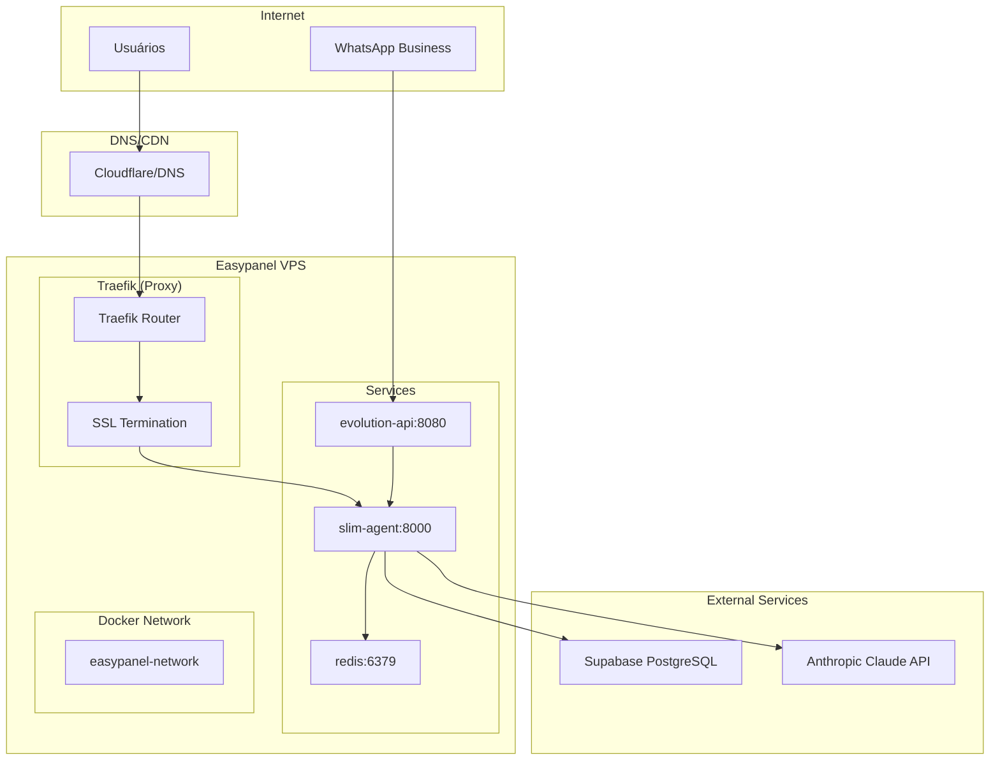
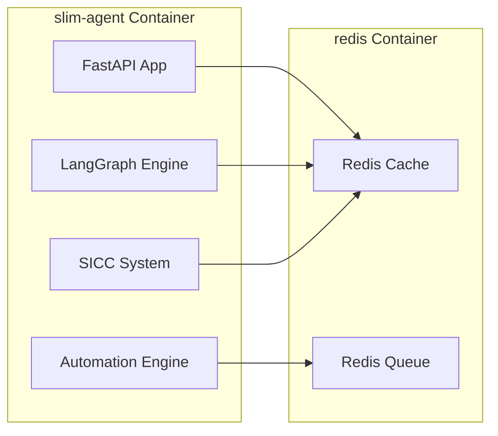

# Design - Sprint 4: Deploy Easypanel

## Overview

Este documento descreve a arquitetura e estratégia de deploy do backend Slim Quality no Easypanel, incluindo containerização Docker, configuração de infraestrutura, networking, segurança e monitoramento.

## Architecture

### Arquitetura de Deploy



### Container Architecture



## Components and Interfaces

### 1. Docker Images

#### Agent Backend Image
```dockerfile
# Base: Python 3.11 slim
# Size: ~500MB optimized
# Layers:
#   - System dependencies
#   - Python dependencies
#   - Application code
#   - Non-root user setup
```

**Interfaces:**
- **HTTP API**: Port 8000 (FastAPI)
- **Health Check**: GET /health
- **Metrics**: GET /metrics (Prometheus format)
- **Docs**: GET /docs (Swagger UI)

#### Redis Image
```dockerfile
# Base: redis:7-alpine
# Size: ~30MB
# Configuration:
#   - Persistence enabled
#   - Memory optimization
#   - Security hardening
```

**Interfaces:**
- **Redis Protocol**: Port 6379
- **Internal Network**: redis://redis:6379

### 2. Easypanel Services

#### Service: slim-agent
```yaml
name: slim-agent
image: registry.easypanel.host/slim-agent:latest
port: 8000
env:
  - CLAUDE_API_KEY=${CLAUDE_API_KEY}
  - SUPABASE_URL=${SUPABASE_URL}
  - SUPABASE_SERVICE_KEY=${SUPABASE_SERVICE_KEY}
  - REDIS_URL=redis://redis:6379
  - ENVIRONMENT=production
healthcheck:
  path: /health
  interval: 30s
  timeout: 10s
  retries: 3
resources:
  memory: 1GB
  cpu: 0.5
restart: always
```

#### Service: redis
```yaml
name: redis
image: redis:7-alpine
port: 6379
volumes:
  - redis-data:/data
command: redis-server --appendonly yes
resources:
  memory: 256MB
  cpu: 0.2
restart: always
```

### 3. Network Configuration

#### Internal Network
- **Name**: easypanel-network
- **Type**: Bridge
- **Subnet**: 172.20.0.0/16
- **Services Communication**: Internal DNS resolution

#### External Access
- **Domain**: api.slimquality.com.br
- **Protocol**: HTTPS only (HTTP → HTTPS redirect)
- **SSL**: Let's Encrypt automatic
- **Proxy**: Traefik routing

### 4. Environment Variables

#### Production Environment
```bash
# Anthropic Claude
CLAUDE_API_KEY=sk-ant-xxx

# Supabase
SUPABASE_URL=https://vtynmmtuvxreiwcxxlma.supabase.co
SUPABASE_SERVICE_KEY=eyJhbGciOiJIUzI1NiIsInR5cCI6IkpXVCJ9...
SUPABASE_ANON_KEY=eyJhbGciOiJIUzI1NiIsInR5cCI6IkpXVCJ9...

# Evolution API
EVOLUTION_URL=https://slimquality-evolution-api.wpjtfd.easypanel.host
EVOLUTION_API_KEY=xxx

# Redis
REDIS_URL=redis://redis:6379

# Application
ENVIRONMENT=production
LOG_LEVEL=info
DEBUG=false

# Security
SECRET_KEY=xxx
WEBHOOK_SECRET=xxx
```

## Data Models

### 1. Health Check Response
```python
class HealthResponse(BaseModel):
    status: Literal["healthy", "unhealthy"]
    timestamp: datetime
    version: str
    services: Dict[str, ServiceHealth]
    uptime: int  # seconds

class ServiceHealth(BaseModel):
    status: Literal["up", "down", "degraded"]
    response_time: float  # milliseconds
    last_check: datetime
    error: Optional[str] = None
```

### 2. Deployment Configuration
```python
class DeploymentConfig(BaseModel):
    image_tag: str
    environment: Literal["production", "staging"]
    replicas: int = 1
    resources: ResourceLimits
    env_vars: Dict[str, str]
    health_check: HealthCheckConfig

class ResourceLimits(BaseModel):
    memory: str  # "1GB"
    cpu: str     # "0.5"
    
class HealthCheckConfig(BaseModel):
    path: str = "/health"
    interval: int = 30  # seconds
    timeout: int = 10   # seconds
    retries: int = 3
```

### 3. Webhook Payload
```python
class WebhookPayload(BaseModel):
    event: str
    timestamp: datetime
    data: Dict[str, Any]
    signature: str
    
class WebhookResponse(BaseModel):
    status: Literal["success", "error"]
    message: str
    processed_at: datetime
```

## Correctness Properties

*Uma propriedade é uma característica ou comportamento que deve ser verdadeiro em todas as execuções válidas do sistema - essencialmente, uma declaração formal sobre o que o sistema deve fazer.*

### Property 1: Container Health Consistency
*Para qualquer* container em execução, se o health check retorna "healthy", então todos os serviços dependentes devem estar acessíveis e funcionais.
**Validates: Requirements 7.1, 7.2, 7.3, 7.4**

### Property 2: Environment Variable Completeness
*Para qualquer* deploy em produção, todas as variáveis de ambiente obrigatórias devem estar presentes e com valores válidos antes da inicialização.
**Validates: Requirements 4.1, 4.2, 4.3, 4.4, 4.5, 4.6**

### Property 3: SSL Certificate Validity
*Para qualquer* acesso HTTPS ao domínio, o certificado SSL deve ser válido, não expirado e emitido por autoridade confiável.
**Validates: Requirements 5.2, 5.3, 5.4**

### Property 4: Webhook Signature Verification
*Para qualquer* webhook recebido, a assinatura HMAC deve ser validada antes do processamento do payload.
**Validates: Requirements 6.2, 10.2**

### Property 5: Service Restart Resilience
*Para qualquer* falha de container, o sistema deve reiniciar automaticamente e retornar ao estado funcional em menos de 60 segundos.
**Validates: Requirements 3.5, 11.3**

### Property 6: Log Sanitization
*Para qualquer* log gerado, dados sensíveis (API keys, tokens, senhas) devem ser automaticamente sanitizados ou omitidos.
**Validates: Requirements 8.5, 10.4**

### Property 7: Performance Response Time
*Para qualquer* request ao endpoint /health, a resposta deve ser retornada em menos de 200ms sob condições normais.
**Validates: Requirements 9.1**

### Property 8: Network Isolation
*Para qualquer* comunicação entre containers, apenas portas e protocolos explicitamente configurados devem ser acessíveis.
**Validates: Requirements 3.3, 10.3**

### Property 9: Resource Limit Enforcement
*Para qualquer* container em execução, o uso de CPU e memória deve respeitar os limites configurados no Easypanel.
**Validates: Requirements 3.6, 9.5**

### Property 10: Rollback Consistency
*Para qualquer* operação de rollback, o sistema deve retornar ao estado funcional da versão anterior em menos de 2 minutos.
**Validates: Requirements 15.3, 15.4**

### Property 11: DNS Resolution Consistency
*Para qualquer* request ao domínio api.slimquality.com.br, a resolução DNS deve apontar para o IP correto do VPS.
**Validates: Requirements 5.1**

### Property 12: Redis Persistence
*Para qualquer* reinicialização do container Redis, dados persistidos devem ser mantidos e acessíveis após o restart.
**Validates: Requirements 11.1**

### Property 13: Webhook Processing Time
*Para qualquer* webhook válido recebido, o processamento deve ser concluído em menos de 5 segundos.
**Validates: Requirements 6.3, 9.2**

### Property 14: Service Discovery
*Para qualquer* container no network interno, outros containers devem ser acessíveis via nome do serviço (ex: redis://redis:6379).
**Validates: Requirements 3.3, 4.4**

### Property 15: Monitoring Alert Accuracy
*Para qualquer* métrica que excede threshold configurado, um alerta deve ser gerado dentro de 1 minuto da detecção.
**Validates: Requirements 12.1, 12.2, 12.3, 12.5**

## Error Handling

### 1. Container Startup Failures
```python
# Estratégia: Retry com backoff exponencial
# Timeout: 5 minutos máximo
# Logs: Structured logging com contexto completo
# Recovery: Rollback automático se falhar 3 vezes

async def handle_startup_failure(error: Exception, attempt: int):
    logger.error("Container startup failed", 
                error=str(error), 
                attempt=attempt,
                max_attempts=3)
    
    if attempt >= 3:
        await trigger_rollback()
        raise DeploymentError("Startup failed after 3 attempts")
    
    await asyncio.sleep(2 ** attempt)  # Exponential backoff
```

### 2. Health Check Failures
```python
# Estratégia: Circuit breaker pattern
# Threshold: 3 falhas consecutivas
# Recovery: Automatic restart + notification

class HealthCheckCircuitBreaker:
    def __init__(self):
        self.failure_count = 0
        self.last_failure = None
        self.state = "closed"  # closed, open, half-open
    
    async def check_health(self):
        if self.state == "open":
            if time.time() - self.last_failure > 60:  # 1 min cooldown
                self.state = "half-open"
            else:
                raise ServiceUnavailable("Circuit breaker open")
```

### 3. Webhook Processing Errors
```python
# Estratégia: Dead letter queue + retry
# Retries: 3 tentativas com backoff
# Timeout: 30 segundos por tentativa

async def process_webhook_with_retry(payload: WebhookPayload):
    for attempt in range(3):
        try:
            return await process_webhook(payload)
        except Exception as e:
            if attempt == 2:  # Last attempt
                await send_to_dead_letter_queue(payload, e)
                raise
            await asyncio.sleep(2 ** attempt)
```

### 4. External Service Failures
```python
# Estratégia: Graceful degradation
# Fallback: Cache ou modo offline
# Monitoring: Alert imediato

async def call_external_service(service: str, request: dict):
    try:
        return await make_request(service, request)
    except TimeoutError:
        logger.warning(f"{service} timeout, using cache")
        return await get_from_cache(request)
    except ConnectionError:
        logger.error(f"{service} unavailable")
        await send_alert(f"{service} down")
        raise ServiceUnavailable(f"{service} temporarily unavailable")
```

## Testing Strategy

### 1. Pre-Deploy Testing

#### Local Docker Testing
```bash
# Build e test local
docker-compose up --build
curl http://localhost:8000/health
docker-compose down
```

#### Integration Testing
```python
# Test com services reais
async def test_full_integration():
    # Test Supabase connection
    assert await test_supabase_connection()
    
    # Test Redis connection  
    assert await test_redis_connection()
    
    # Test webhook processing
    assert await test_webhook_flow()
    
    # Test SICC loading
    assert await test_sicc_initialization()
```

### 2. Production Smoke Tests

#### Health Check Validation
```python
async def test_production_health():
    response = await client.get("https://api.slimquality.com.br/health")
    assert response.status_code == 200
    
    health_data = response.json()
    assert health_data["status"] == "healthy"
    assert all(service["status"] == "up" for service in health_data["services"].values())
```

#### SSL Certificate Validation
```python
async def test_ssl_certificate():
    import ssl
    import socket
    
    context = ssl.create_default_context()
    with socket.create_connection(("api.slimquality.com.br", 443)) as sock:
        with context.wrap_socket(sock, server_hostname="api.slimquality.com.br") as ssock:
            cert = ssock.getpeercert()
            assert cert["subject"][0][0][1] == "api.slimquality.com.br"
            assert cert["issuer"][0][0][1] == "Let's Encrypt"
```

#### Webhook End-to-End Test
```python
async def test_webhook_e2e():
    # Simulate Evolution API webhook
    webhook_payload = {
        "event": "message.received",
        "data": {"message": "test", "from": "+5511999999999"}
    }
    
    response = await client.post("/webhook/evolution", json=webhook_payload)
    assert response.status_code == 200
    
    # Verify processing
    assert response.json()["status"] == "success"
```

### 3. Performance Testing

#### Load Testing
```python
import asyncio
import aiohttp

async def load_test_health_endpoint():
    async with aiohttp.ClientSession() as session:
        tasks = []
        for _ in range(100):  # 100 concurrent requests
            task = session.get("https://api.slimquality.com.br/health")
            tasks.append(task)
        
        responses = await asyncio.gather(*tasks)
        
        # All should be 200 OK
        assert all(r.status == 200 for r in responses)
        
        # Average response time < 200ms
        avg_time = sum(r.elapsed.total_seconds() for r in responses) / len(responses)
        assert avg_time < 0.2
```

### 4. Monitoring Tests

#### Resource Usage Validation
```python
async def test_resource_usage():
    # Get container stats from Easypanel API
    stats = await get_container_stats("slim-agent")
    
    # Memory usage < 1GB
    assert stats["memory_usage"] < 1024 * 1024 * 1024
    
    # CPU usage < 80%
    assert stats["cpu_percent"] < 80
```

### 5. Security Testing

#### Environment Variables Security
```python
async def test_env_vars_security():
    # Ensure no secrets in logs
    logs = await get_container_logs("slim-agent")
    
    sensitive_patterns = [
        r"sk-ant-\w+",  # Claude API key
        r"eyJ[A-Za-z0-9-_]+\.",  # JWT tokens
        r"password",
        r"secret"
    ]
    
    for pattern in sensitive_patterns:
        assert not re.search(pattern, logs, re.IGNORECASE)
```

## Deployment Strategy

### 1. Build Pipeline

```bash
#!/bin/bash
# scripts/build.sh

set -e

echo "Building slim-agent Docker image..."

# Build image
docker build -t slim-agent:latest -f agent/Dockerfile agent/

# Tag for registry
docker tag slim-agent:latest registry.easypanel.host/slim-agent:latest
docker tag slim-agent:latest registry.easypanel.host/slim-agent:$(date +%Y%m%d-%H%M%S)

echo "Build completed successfully"
```

### 2. Push Pipeline

```bash
#!/bin/bash
# scripts/push.sh

set -e

echo "Pushing images to registry..."

# Push latest
docker push registry.easypanel.host/slim-agent:latest

# Push versioned
docker push registry.easypanel.host/slim-agent:$(date +%Y%m%d-%H%M%S)

echo "Push completed successfully"
```

### 3. Deploy Pipeline

```bash
#!/bin/bash
# scripts/deploy.sh

set -e

echo "Deploying to Easypanel..."

# Update service with new image
curl -X POST "https://easypanel.host/api/services/slim-agent/deploy" \
  -H "Authorization: Bearer $EASYPANEL_TOKEN" \
  -H "Content-Type: application/json" \
  -d '{"image": "registry.easypanel.host/slim-agent:latest"}'

# Wait for deployment
sleep 30

# Verify health
curl -f https://api.slimquality.com.br/health

echo "Deployment completed successfully"
```

### 4. Rollback Strategy

```bash
#!/bin/bash
# scripts/rollback.sh

set -e

PREVIOUS_VERSION=${1:-"previous"}

echo "Rolling back to version: $PREVIOUS_VERSION"

# Deploy previous version
curl -X POST "https://easypanel.host/api/services/slim-agent/deploy" \
  -H "Authorization: Bearer $EASYPANEL_TOKEN" \
  -H "Content-Type: application/json" \
  -d "{\"image\": \"registry.easypanel.host/slim-agent:$PREVIOUS_VERSION\"}"

# Verify rollback
sleep 30
curl -f https://api.slimquality.com.br/health

echo "Rollback completed successfully"
```

## Security Considerations

### 1. Container Security
- **Non-root user**: Container runs as user 'app' (UID 1000)
- **Read-only filesystem**: Except for /tmp and /var/log
- **No privileged mode**: Standard container permissions
- **Minimal base image**: Python 3.11 slim (security patches)

### 2. Network Security
- **Internal network**: Containers communicate via private network
- **SSL termination**: Traefik handles SSL/TLS
- **No direct exposure**: Only port 8000 exposed via proxy
- **Firewall rules**: VPS firewall configured for minimal access

### 3. Secrets Management
- **Environment variables**: Stored in Easypanel vault
- **No hardcoded secrets**: All sensitive data via ENV vars
- **Rotation policy**: Regular rotation of API keys
- **Access control**: Limited access to production secrets

### 4. Monitoring and Alerting
- **Security logs**: All authentication attempts logged
- **Anomaly detection**: Unusual traffic patterns
- **Vulnerability scanning**: Regular image scanning
- **Incident response**: Automated alerts for security events