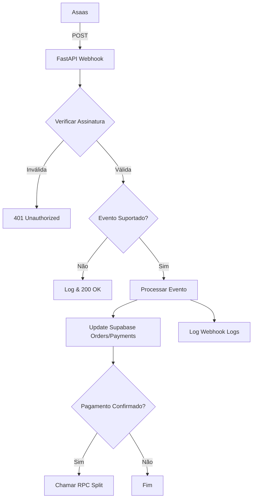

# Design: Webhook Asaas (FastAPI)

## 🏗️ Arquitetura Técnica

### 1. Novo Router
- Arquivo: `agent/src/api/webhooks_asaas.py`
- Utilizar `fastapi.APIRouter` com prefixo `/api/webhooks`.

### 2. Fluxo de Dados

### 3. Segurança (Assinatura)
- Algoritmo: HMAC-SHA256.
- Chave: `ASAAS_WEBHOOK_TOKEN` ou `ASAAS_WEBHOOK_SECRET`.
- Comparação: `hmac.compare_digest`.

### 4. Dependências
- `supabase-py`: Para interações com o banco.
- `structlog`: Para logging padronizado.

### 5. Alterações Previstas
- `agent/src/api/main.py`: Inclusão do novo router.
- `agent/src/services/asaas_webhook_service.py` (Opcional): Lógica de negócio separada da rota.
