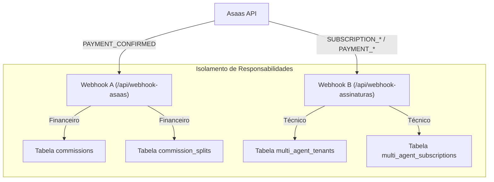

# Design Técnico: Checkout e Webhook de Assinaturas IA

## 🏗️ Arquitetura de Webhooks Duplos

O Asaas será configurado com dois endpoints para garantir que a lógica financeira e a lógica de acesso técnico não interfiram uma na outra.

## 🛠️ Detalhes da Implementação

### 1. Isolamento de Responsabilidades
- **Webhook A**: Mantém a lógica complexa de cálculo de rede multinível. Ele ignora se o produto é digital ou físico; sua única preocupação é: "Houve um pagamento confirmado? Quem ganha comissão?".
- **Webhook B**: É um handler leve. Ele identifica o `asaas_subscription_id` e atualiza o status do Agente. Se o pagamento for de uma assinatura, ele renova o acesso por +30 dias.

### 2. Fluxo de Comissão Recorrente
No Asaas, cada mensalidade de uma assinatura gera um objeto `Payment` vinculado a um `Subscription`.
- O Webhook A receberá um `PAYMENT_CONFIRMED` para cada mensalidade.
- Como o `externalReference` (Order ID) é replicado da assinatura para os pagamentos, o Webhook A conseguirá localizar o pedido original e replicar a comissão para os mesmos afiliados.

### 3. Alterações no Checkout
- **SKU Validation**: O sistema deve forçar o preço de R$ 397,00 e o SKU `COL-707D80` quando o modal for aberto via Ferramentas IA.
- **API Asaas**: Ao enviar o POST para `/api/checkout`, um campo `isSubscription: true` deve ser adicionado para que o backend chame o endpoint `/subscriptions` do Asaas.

## 📡 Fluxo de Dados (Assinatura)
1.  **Frontend**: Chama `/api/checkout` com SKU `COL-707D80`.
2.  **Backend (Vercel)**: Identifica categoria digital, cria Assinatura no Asaas.
3.  **Asaas**: Notifica ambos os Webhooks no sucesso.
4.  **DB (Supabase)**: 
    - `commissions`: Nova linha de comissão (Recorrente).
    - `multi_agent_tenants`: Status = 'active', expires_at = +30 dias.
