# 📋 DOCUMENTAÇÃO TÉCNICA COMPLETA - PAYMENT FIRST FLOW COMADEMIG

**Data:** 03 de fevereiro de 2026  
**Versão:** 1.0  
**Projeto:** COMADEMIG  
**Objetivo:** Documentar implementação completa do Payment First Flow para adaptação no Slim Quality

---

## 🎯 VISÃO GERAL

### O que é o Payment First Flow?

O Payment First Flow é uma implementação que permite ao usuário **processar o pagamento ANTES de criar a conta**, invertendo o fluxo tradicional de cadastro → pagamento para pagamento → cadastro.

### Diferenças Fundamentais

| Aspecto | Fluxo Tradicional | Payment First Flow |
|---------|-------------------|-------------------|
| **Ordem** | 1. Criar conta<br>2. Login<br>3. Pagamento | 1. Pagamento<br>2. Criar conta<br>3. Auto-login |
| **Estado do usuário** | Logado durante pagamento | Não logado durante pagamento |
| **Validação** | Dados já validados no perfil | Validação em tempo real no formulário |
| **Experiência** | Múltiplas etapas | Etapa única |
| **Abandono** | Alto (múltiplas etapas) | Baixo (pagamento imediato) |

---

## 🏗️ ARQUITETURA GERAL

### Componentes Principais

```
┌─────────────────────────────────────────────────────────────┐
│                    PAYMENT FIRST FLOW                      │
├─────────────────────────────────────────────────────────────┤
│                                                             │
│  ┌─────────────────┐    ┌──────────────────────────────┐   │
│  │   FRONTEND      │    │        BACKEND               │   │
│  │                 │    │                              │   │
│  │ • Filiacao.tsx  │◄──►│ • asaas-process-card         │   │
│  │ • PaymentForm   │    │ • asaas-create-subscription  │   │
│  │ • ProcessStatus │    │ • asaas-webhook              │   │
│  │ • Feature Flag  │    │ • split-config               │   │
│  └─────────────────┘    └──────────────────────────────┘   │
│           │                           │                    │
│           ▼                           ▼                    │
│  ┌─────────────────┐    ┌──────────────────────────────┐   │
│  │    DATABASE     │    │        ASAAS API             │   │
│  │                 │    │                              │   │
│  │ • user_subscr.  │    │ • Customer Creation          │   │
│  │ • asaas_cobr.   │    │ • Payment Processing         │   │
│  │ • pending_comp. │    │ • Subscription Management    │   │
│  │ • profiles      │    │ • Webhook Events             │   │
│  └─────────────────┘    └──────────────────────────────┘   │
└─────────────────────────────────────────────────────────────┘
```

---

## 📊 ESTRUTURA DO BANCO DE DADOS

### Tabelas Críticas para Payment First

#### 1. `user_subscriptions`
```sql
CREATE TABLE user_subscriptions (
  id UUID PRIMARY KEY DEFAULT gen_random_uuid(),
  user_id UUID REFERENCES auth.users(id),
  member_type_id UUID REFERENCES member_types(id),
  subscription_plan_id UUID REFERENCES subscription_plans(id),
  asaas_subscription_id TEXT,
  asaas_customer_id TEXT,
  status TEXT DEFAULT 'pending',
  start_date TIMESTAMP WITH TIME ZONE,
  end_date TIMESTAMP WITH TIME ZONE,
  auto_renew BOOLEAN DEFAULT true,
  created_at TIMESTAMP WITH TIME ZONE DEFAULT NOW(),
  updated_at TIMESTAMP WITH TIME ZONE DEFAULT NOW()
);
```

#### 2. `asaas_cobrancas`
```sql
CREATE TABLE asaas_cobrancas (
  id UUID PRIMARY KEY DEFAULT gen_random_uuid(),
  user_id UUID REFERENCES auth.users(id),
  asaas_id TEXT UNIQUE NOT NULL,
  asaas_customer_id TEXT,
  asaas_subscription_id TEXT,
  billing_type TEXT NOT NULL,
  value DECIMAL(10,2) NOT NULL,
  status TEXT NOT NULL,
  due_date DATE,
  payment_date TIMESTAMP WITH TIME ZONE,
  description TEXT,
  external_reference TEXT,
  service_type TEXT,
  affiliate_id UUID REFERENCES affiliates(id),
  split_data JSONB,
  webhook_data JSONB,
  created_at TIMESTAMP WITH TIME ZONE DEFAULT NOW(),
  updated_at TIMESTAMP WITH TIME ZONE DEFAULT NOW()
);
```

#### 3. `pending_completions`
```sql
CREATE TABLE pending_completions (
  id UUID PRIMARY KEY DEFAULT gen_random_uuid(),
  payment_id TEXT NOT NULL,
  user_data JSONB NOT NULL,
  member_type_id UUID REFERENCES member_types(id),
  subscription_plan_id UUID REFERENCES subscription_plans(id),
  affiliate_info JSONB,
  status TEXT DEFAULT 'pending',
  completion_attempts INTEGER DEFAULT 0,
  last_attempt_at TIMESTAMP WITH TIME ZONE,
  completed_at TIMESTAMP WITH TIME ZONE,
  error_details JSONB,
  created_at TIMESTAMP WITH TIME ZONE DEFAULT NOW(),
  updated_at TIMESTAMP WITH TIME ZONE DEFAULT NOW()
);
```

### Políticas RLS Importantes

```sql
-- user_subscriptions
CREATE POLICY "Users can view own subscriptions" ON user_subscriptions
  FOR SELECT USING (auth.uid() = user_id);

CREATE POLICY "Service role can manage all subscriptions" ON user_subscriptions
  FOR ALL USING (auth.jwt() ->> 'role' = 'service_role');

-- asaas_cobrancas  
CREATE POLICY "Users can view own charges" ON asaas_cobrancas
  FOR SELECT USING (auth.uid() = user_id);

CREATE POLICY "Service role can manage all charges" ON asaas_cobrancas
  FOR ALL USING (auth.jwt() ->> 'role' = 'service_role');

-- pending_completions
CREATE POLICY "Service role only" ON pending_completions
  FOR ALL USING (auth.jwt() ->> 'role' = 'service_role');
```

---

## 🔧 EDGE FUNCTIONS DETALHADAS

### 1. `asaas-process-card` - Processamento de Cartão

**Arquivo:** `supabase/functions/asaas-process-card/index.ts`

#### Fluxo de Execução:
```typescript
1. Validar dados de entrada
2. Criar/buscar customer no Asaas
3. Processar pagamento com cartão
4. Configurar splits (COMADEMIG + RENUM + Afiliado)
5. Salvar dados temporários em pending_completions
6. Retornar resultado para frontend
```

#### Código Principal:
```typescript
export async function processCardPayment(request: {
  userData: FiliacaoPaymentData;
  memberTypeId: string;
  subscriptionPlanId: string;
  affiliateInfo?: any;
  usePaymentFirstFlow: boolean;
}) {
  // 1. Validar entrada
  if (!request.userData.creditCard) {
    throw new Error('Dados do cartão são obrigatórios');
  }

  // 2. Criar customer no Asaas
  const customerData = {
    name: request.userData.nome_completo,
    cpfCnpj: request.userData.cpf.replace(/\D/g, ''),
    email: request.userData.email,
    phone: request.userData.telefone?.replace(/\D/g, ''),
    address: request.userData.endereco,
    addressNumber: request.userData.numero,
    complement: request.userData.complemento,
    province: request.userData.bairro,
    city: request.userData.cidade,
    state: request.userData.estado,
    postalCode: request.userData.cep?.replace(/\D/g, ''),
    externalReference: `filiacao_${Date.now()}`
  };

  const customer = await createAsaasCustomer(customerData);

  // 3. Configurar split
  const splitConfig = await getSplitConfiguration({
    affiliateCode: request.affiliateInfo?.referral_code,
    serviceType: 'filiacao',
    totalValue: planValue
  });

  // 4. Processar pagamento
  const paymentData = {
    customer: customer.id,
    billingType: 'CREDIT_CARD' as BillingType,
    value: planValue,
    dueDate: new Date().toISOString().split('T')[0],
    description: `Filiação COMADEMIG - ${memberType.name}`,
    externalReference: `filiacao_${memberTypeId}_${Date.now()}`,
    creditCard: request.userData.creditCard,
    creditCardHolderInfo: request.userData.creditCardHolderInfo,
    remoteIp: request.userData.remoteIp,
    split: formatSplitsForAsaas(splitConfig)
  };

  const payment = await createAsaasPayment(paymentData);

  // 5. Salvar dados temporários se Payment First
  if (request.usePaymentFirstFlow) {
    await savePendingCompletion({
      payment_id: payment.id,
      user_data: request.userData,
      member_type_id: request.memberTypeId,
      subscription_plan_id: request.subscriptionPlanId,
      affiliate_info: request.affiliateInfo
    });
  }

  return {
    success: true,
    paymentId: payment.id,
    customerId: customer.id,
    status: payment.status
  };
}
```

### 2. `asaas-create-subscription` - Criação de Assinatura

**Arquivo:** `supabase/functions/asaas-create-subscription/index.ts`

#### Responsabilidades:
- Criar assinatura recorrente no Asaas
- Configurar ciclo de cobrança (mensal/semestral/anual)
- Aplicar splits automáticos
- Sincronizar com banco local

#### Código Principal:
```typescript
export async function createSubscription(request: {
  customerId: string;
  planId: string;
  memberTypeId: string;
  affiliateInfo?: any;
}) {
  // 1. Buscar dados do plano
  const { data: plan } = await supabase
    .from('subscription_plans')
    .select('*, member_types(*)')
    .eq('id', request.planId)
    .single();

  // 2. Mapear ciclo de cobrança
  const cycleMap = {
    'mensal': 'MONTHLY',
    'monthly': 'MONTHLY', 
    'semestral': 'SEMIANNUALLY',
    'anual': 'ANNUALLY',
    'annual': 'ANNUALLY'
  };

  // 3. Configurar split
  const splitConfig = await getSplitConfiguration({
    affiliateCode: request.affiliateInfo?.referral_code,
    serviceType: 'filiacao',
    totalValue: plan.value
  });

  // 4. Criar assinatura no Asaas
  const subscriptionData = {
    customer: request.customerId,
    billingType: 'CREDIT_CARD' as BillingType,
    value: plan.value,
    nextDueDate: getNextDueDate(plan.recurrence),
    cycle: cycleMap[plan.recurrence.toLowerCase()],
    description: `Assinatura COMADEMIG - ${plan.member_types.name}`,
    externalReference: `subscription_${request.planId}_${Date.now()}`,
    split: formatSplitsForAsaas(splitConfig)
  };

  const subscription = await createAsaasSubscription(subscriptionData);

  // 5. Salvar no banco local
  await supabase
    .from('user_subscriptions')
    .insert({
      user_id: request.userId,
      member_type_id: request.memberTypeId,
      subscription_plan_id: request.planId,
      asaas_subscription_id: subscription.id,
      asaas_customer_id: request.customerId,
      status: 'active',
      start_date: new Date().toISOString(),
      end_date: getEndDate(plan.recurrence),
      auto_renew: true
    });

  return subscription;
}
```

### 3. `asaas-webhook` - Processamento de Webhooks

**Arquivo:** `supabase/functions/asaas-webhook/index.ts`

#### Eventos Críticos para Payment First:
- `PAYMENT_CONFIRMED` - Pagamento confirmado
- `PAYMENT_RECEIVED` - Pagamento recebido
- `SUBSCRIPTION_CREATED` - Assinatura criada

#### Código Principal:
```typescript
export async function processWebhook(payload: WebhookPayload) {
  const { event, payment } = payload;

  // Validar assinatura do webhook
  await validateWebhookSignature(payload);

  switch (event) {
    case 'PAYMENT_CONFIRMED':
    case 'PAYMENT_RECEIVED':
      await handlePaymentConfirmed(payment);
      break;
      
    case 'PAYMENT_OVERDUE':
      await handlePaymentOverdue(payment);
      break;
      
    case 'SUBSCRIPTION_CREATED':
      await handleSubscriptionCreated(payload.subscription);
      break;
  }
}

async function handlePaymentConfirmed(payment: AsaasPayment) {
  // 1. Atualizar status no banco
  await supabase
    .from('asaas_cobrancas')
    .update({
      status: payment.status,
      payment_date: payment.paymentDate,
      webhook_data: payment,
      updated_at: new Date().toISOString()
    })
    .eq('asaas_id', payment.id);

  // 2. Se Payment First, completar criação da conta
  const { data: pendingCompletion } = await supabase
    .from('pending_completions')
    .select('*')
    .eq('payment_id', payment.id)
    .eq('status', 'pending')
    .single();

  if (pendingCompletion) {
    await completeAccountCreation(pendingCompletion);
  }

  // 3. Processar comissões de afiliados
  if (payment.split && payment.split.length > 0) {
    await processAffiliateCommissions(payment);
  }
}

async function completeAccountCreation(pending: any) {
  try {
    // 1. Criar usuário no Supabase Auth
    const { data: user, error: authError } = await supabaseAdmin.auth.admin.createUser({
      email: pending.user_data.email,
      password: pending.user_data.password,
      email_confirm: true,
      user_metadata: {
        nome_completo: pending.user_data.nome_completo,
        created_via_payment_first: true
      }
    });

    if (authError) throw authError;

    // 2. Criar perfil
    await supabase
      .from('profiles')
      .insert({
        id: user.user.id,
        nome_completo: pending.user_data.nome_completo,
        cpf: pending.user_data.cpf,
        telefone: pending.user_data.telefone,
        cep: pending.user_data.cep,
        endereco: pending.user_data.endereco,
        numero: pending.user_data.numero,
        complemento: pending.user_data.complemento,
        bairro: pending.user_data.bairro,
        cidade: pending.user_data.cidade,
        estado: pending.user_data.estado,
        member_type_id: pending.member_type_id
      });

    // 3. Criar assinatura
    await supabase
      .from('user_subscriptions')
      .insert({
        user_id: user.user.id,
        member_type_id: pending.member_type_id,
        subscription_plan_id: pending.subscription_plan_id,
        asaas_customer_id: pending.user_data.asaas_customer_id,
        status: 'active',
        start_date: new Date().toISOString()
      });

    // 4. Marcar como concluído
    await supabase
      .from('pending_completions')
      .update({
        status: 'completed',
        completed_at: new Date().toISOString()
      })
      .eq('id', pending.id);

    console.log('✅ Conta criada com sucesso via Payment First:', user.user.email);

  } catch (error) {
    console.error('❌ Erro ao completar criação da conta:', error);
    
    // Incrementar tentativas
    await supabase
      .from('pending_completions')
      .update({
        completion_attempts: pending.completion_attempts + 1,
        last_attempt_at: new Date().toISOString(),
        error_details: { error: error.message }
      })
      .eq('id', pending.id);
  }
}
```

---

## 🎨 COMPONENTES FRONTEND

### 1. `Filiacao.tsx` - Página Principal

**Arquivo:** `src/pages/Filiacao.tsx`

#### Responsabilidades:
- Detectar se deve usar Payment First Flow
- Gerenciar estado da filiação
- Coordenar componentes filhos

#### Código Principal:
```typescript
export default function Filiacao() {
  const { user } = useAuth();
  const { shouldUsePaymentFirstFlow } = usePaymentFirstFlowFeature();
  
  // Decidir qual fluxo usar
  const usePaymentFirst = shouldUsePaymentFirstFlow(user?.email);
  
  const handlePaymentSuccess = (result: { paymentId?: string; userId?: string }) => {
    if (usePaymentFirst) {
      // Payment First: mostrar status de processamento
      setCurrentStep('processing');
      setPaymentResult(result);
    } else {
      // Fluxo tradicional: redirecionar para dashboard
      navigate('/dashboard');
    }
  };

  return (
    <div className="container mx-auto px-4 py-8">
      {currentStep === 'selection' && (
        <MemberTypeSelection
          onSelect={setSelectedMemberType}
          affiliateInfo={affiliateInfo}
        />
      )}
      
      {currentStep === 'payment' && selectedMemberType && (
        <PaymentFormEnhanced
          selectedMemberType={selectedMemberType}
          affiliateInfo={affiliateInfo}
          onSuccess={handlePaymentSuccess}
          onError={handlePaymentError}
          onCancel={() => setCurrentStep('selection')}
          usePaymentFirstFlow={usePaymentFirst}
        />
      )}
      
      {currentStep === 'processing' && paymentResult?.paymentId && (
        <PaymentProcessingStatus
          paymentId={paymentResult.paymentId}
          onComplete={handleProcessingComplete}
          onError={handleProcessingError}
        />
      )}
    </div>
  );
}
```

### 2. `PaymentFormEnhanced.tsx` - Formulário de Pagamento

**Arquivo:** `src/components/payments/PaymentFormEnhanced.tsx`

#### Diferenças no Payment First:
- Coleta TODOS os dados necessários (não assume usuário logado)
- Validação em tempo real mais rigorosa
- Campos de senha obrigatórios
- Tratamento especial para usuários logados

#### Código Principal:
```typescript
export default function PaymentFormEnhanced({
  selectedMemberType,
  affiliateInfo,
  onSuccess,
  onError,
  onCancel,
  usePaymentFirstFlow = false
}: PaymentFormEnhancedProps) {
  const { user } = useAuth();
  
  // Schema de validação dinâmico
  const schema = createPaymentFormSchema(!!user);
  
  const onSubmit = async (data: PaymentFormData) => {
    try {
      let filiacaoData: FiliacaoPaymentData;
      
      if (user) {
        // Usuário logado: combinar dados do perfil com formulário
        filiacaoData = {
          nome_completo: userProfile?.nome_completo || user.user_metadata?.nome_completo,
          email: user.email,
          cpf: data.cpf || userProfile?.cpf,
          telefone: data.telefone || userProfile?.telefone,
          // ... outros campos
        };
      } else {
        // Usuário não logado: usar dados do formulário
        filiacaoData = {
          nome_completo: data.nome_completo!,
          email: data.email!,
          cpf: data.cpf!,
          telefone: data.telefone!,
          password: data.password, // Apenas para Payment First
          // ... outros campos
        };
      }

      // Adicionar dados do cartão
      if (data.payment_method === 'credit_card') {
        filiacaoData.creditCard = {
          holderName: data.card_holder_name,
          number: data.card_number!.replace(/\s/g, ''),
          expiryMonth: data.card_expiry_month!,
          expiryYear: data.card_expiry_year!,
          ccv: data.card_ccv!,
        };

        filiacaoData.creditCardHolderInfo = {
          name: data.nome_completo || filiacaoData.nome_completo,
          email: data.email || filiacaoData.email,
          cpfCnpj: (data.cpf || filiacaoData.cpf).replace(/\D/g, ''),
          postalCode: (data.cep || filiacaoData.cep).replace(/\D/g, ''),
          addressNumber: data.numero || filiacaoData.numero || 'S/N',
          phone: (data.telefone || filiacaoData.telefone).replace(/\D/g, ''),
        };
      }

      const result = await processarFiliacaoComPagamento(filiacaoData);
      onSuccess(result);
      
    } catch (error) {
      onError(error);
    }
  };

  return (
    <form onSubmit={handleSubmit(onSubmit)}>
      {/* Dados pessoais - APENAS para usuários NÃO logados */}
      {!user && (
        <Card>
          <CardHeader>
            <CardTitle>Dados Pessoais</CardTitle>
          </CardHeader>
          <CardContent>
            {/* Campos de dados pessoais */}
          </CardContent>
        </Card>
      )}

      {/* Senha - APENAS para usuários NÃO logados */}
      {!user && (
        <Card>
          <CardHeader>
            <CardTitle>Criar Senha de Acesso</CardTitle>
          </CardHeader>
          <CardContent>
            {/* Campos de senha */}
          </CardContent>
        </Card>
      )}

      {/* Dados do cartão - SEMPRE */}
      <Card>
        <CardHeader>
          <CardTitle>Método de Pagamento</CardTitle>
        </CardHeader>
        <CardContent>
          {/* Campos do cartão */}
        </CardContent>
      </Card>
    </form>
  );
}
```

### 3. `PaymentProcessingStatus.tsx` - Status de Processamento

**Arquivo:** `src/components/payments/PaymentProcessingStatus.tsx`

#### Responsabilidades:
- Mostrar progresso do processamento
- Fazer polling do status do pagamento
- Exibir etapas: Pagamento → Criação da Conta → Conclusão

#### Código Principal:
```typescript
export default function PaymentProcessingStatus({
  paymentId,
  onComplete,
  onError
}: PaymentProcessingStatusProps) {
  const [currentStep, setCurrentStep] = useState(0);
  const [isPolling, setIsPolling] = useState(true);

  const steps = [
    {
      id: 'payment',
      label: 'Processando Pagamento',
      status: 'processing',
      icon: <CreditCard className="h-5 w-5" />,
      description: 'Validando dados do cartão e processando cobrança'
    },
    {
      id: 'account',
      label: 'Criando Conta',
      status: 'pending',
      icon: <UserPlus className="h-5 w-5" />,
      description: 'Criando sua conta e configurando perfil'
    },
    {
      id: 'complete',
      label: 'Concluído',
      status: 'pending',
      icon: <CheckCircle className="h-5 w-5" />,
      description: 'Filiação finalizada com sucesso'
    }
  ];

  // Polling do status
  useEffect(() => {
    if (!isPolling || !paymentId) return;

    const pollPaymentStatus = async () => {
      try {
        const response = await fetch('/functions/v1/poll-payment-status-frontend', {
          method: 'POST',
          headers: { 'Content-Type': 'application/json' },
          body: JSON.stringify({ paymentId })
        });

        const result = await response.json();

        if (result.status === 'completed') {
          setIsPolling(false);
          setTimeout(() => onComplete({ success: true, userId: result.userId }), 2000);
        } else if (result.status === 'failed') {
          setIsPolling(false);
          onError(result.error || 'Erro no processamento');
        }

      } catch (err) {
        console.error('Erro no polling:', err);
      }
    };

    const interval = setInterval(pollPaymentStatus, 3000);
    pollPaymentStatus(); // Primeira verificação imediata

    return () => clearInterval(interval);
  }, [isPolling, paymentId, onComplete, onError]);

  return (
    <Card className="max-w-2xl mx-auto">
      <CardHeader>
        <CardTitle className="flex items-center gap-2">
          <Loader2 className="h-6 w-6 animate-spin text-blue-600" />
          Processando sua Filiação
        </CardTitle>
      </CardHeader>
      <CardContent>
        <Alert className="border-blue-200 bg-blue-50">
          <Clock className="h-4 w-4 text-blue-600" />
          <AlertDescription>
            <strong>Não feche esta página!</strong> Seu pagamento está sendo processado.
          </AlertDescription>
        </Alert>

        {/* Progresso das etapas */}
        <div className="space-y-4 mt-6">
          {steps.map((step, index) => (
            <div key={step.id} className="flex items-start gap-4">
              <div className="flex-shrink-0 mt-1">
                {getStepStatusIcon(step)}
              </div>
              <div className="flex-1">
                <h3 className="font-medium">{step.label}</h3>
                <p className="text-sm text-gray-600">{step.description}</p>
              </div>
            </div>
          ))}
        </div>
      </CardContent>
    </Card>
  );
}
```

### 4. `usePaymentFirstFlowFeature.ts` - Feature Flag

**Arquivo:** `src/hooks/usePaymentFirstFlowFeature.ts`

#### Responsabilidades:
- Controlar ativação gradual do Payment First
- Permitir override para desenvolvimento
- Distribuição consistente baseada em email

#### Código Principal:
```typescript
export function usePaymentFirstFlowFeature() {
  const [config, setConfig] = useState<PaymentFirstFlowConfig>({
    enabled: false,
    rolloutPercentage: 0
  });

  const shouldUsePaymentFirstFlow = (userEmail?: string): boolean => {
    // 1. Verificar forças
    if (config.forceDisabled) return false;
    if (config.forceEnabled) return true;
    
    // 2. Verificar se habilitado
    if (!config.enabled) return false;
    
    // 3. Verificar rollout percentage
    if (config.rolloutPercentage >= 100) return true;
    if (config.rolloutPercentage === 0) return false;
    
    // 4. Distribuição baseada em hash do email
    if (userEmail) {
      const hash = simpleHash(userEmail);
      const userPercentage = hash % 100;
      return userPercentage < config.rolloutPercentage;
    }
    
    // 5. Fallback random para não logados
    return Math.random() * 100 < config.rolloutPercentage;
  };

  return {
    config,
    shouldUsePaymentFirstFlow,
    enableForDevelopment: () => {
      localStorage.setItem('payment_first_flow_override', JSON.stringify({ forceEnabled: true }));
    },
    disableForDevelopment: () => {
      localStorage.setItem('payment_first_flow_override', JSON.stringify({ forceDisabled: true }));
    }
  };
}
```

---

## 💰 SISTEMA DE SPLITS

### Configuração de Split

**Arquivo:** `supabase/functions/shared/split-config.ts`

#### Regras de Split:

| Cenário | COMADEMIG | RENUM | Afiliado |
|---------|-----------|-------|----------|
| **Filiação COM afiliado** | 40% | 40% | 20% |
| **Filiação SEM afiliado** | 50% | 50% | - |
| **Outros serviços COM afiliado** | 40% | 40% | 20% |
| **Outros serviços SEM afiliado** | 60% | 40% | - |

#### Código Principal:
```typescript
export async function getSplitConfiguration(params: GetSplitConfigParams): Promise<SplitConfigurationResult> {
  const { affiliateCode, serviceType, totalValue } = params;
  
  const RENUM_WALLET_ID = Deno.env.get('RENUM_WALLET_ID');
  if (!RENUM_WALLET_ID) {
    throw new Error('RENUM_WALLET_ID não configurada');
  }

  const splits: SplitConfig[] = [];
  let hasAffiliate = false;
  let affiliateInfo = undefined;

  // Verificar afiliado
  if (affiliateCode) {
    const { data: affiliate } = await supabaseClient
      .from('affiliates')
      .select('id, display_name, asaas_wallet_id, status')
      .eq('referral_code', affiliateCode)
      .eq('status', 'active')
      .single();

    if (affiliate?.asaas_wallet_id) {
      hasAffiliate = true;
      affiliateInfo = {
        id: affiliate.id,
        name: affiliate.display_name,
        walletId: affiliate.asaas_wallet_id
      };
    }
  }

  // Configurar splits baseado no cenário
  if (hasAffiliate) {
    if (serviceType === 'filiacao') {
      // Filiação COM afiliado: 40% + 40% + 20%
      splits.push(
        { walletId: '', percentualValue: 40.00, recipientType: 'comademig', recipientName: 'COMADEMIG' },
        { walletId: RENUM_WALLET_ID, percentualValue: 40.00, recipientType: 'renum', recipientName: 'RENUM' },
        { walletId: affiliateInfo.walletId, percentualValue: 20.00, recipientType: 'affiliate', recipientName: affiliateInfo.name }
      );
    } else {
      // Outros serviços COM afiliado: 40% + 40% + 20%
      splits.push(
        { walletId: '', percentualValue: 40.00, recipientType: 'comademig', recipientName: 'COMADEMIG' },
        { walletId: RENUM_WALLET_ID, percentualValue: 40.00, recipientType: 'renum', recipientName: 'RENUM' },
        { walletId: affiliateInfo.walletId, percentualValue: 20.00, recipientType: 'affiliate', recipientName: affiliateInfo.name }
      );
    }
  } else {
    if (serviceType === 'filiacao') {
      // Filiação SEM afiliado: 50% + 50%
      splits.push(
        { walletId: '', percentualValue: 50.00, recipientType: 'comademig', recipientName: 'COMADEMIG' },
        { walletId: RENUM_WALLET_ID, percentualValue: 50.00, recipientType: 'renum', recipientName: 'RENUM' }
      );
    } else {
      // Outros serviços SEM afiliado: 60% + 40%
      splits.push(
        { walletId: '', percentualValue: 60.00, recipientType: 'comademig', recipientName: 'COMADEMIG' },
        { walletId: RENUM_WALLET_ID, percentualValue: 40.00, recipientType: 'renum', recipientName: 'RENUM' }
      );
    }
  }

  return { splits, hasAffiliate, affiliateInfo };
}
```

---

## 🔄 FLUXO COMPLETO PAYMENT FIRST

### Sequência de Eventos:

```mermaid
sequenceDiagram
    participant U as Usuário
    participant F as Frontend
    participant E as Edge Functions
    participant A as Asaas API
    participant D as Database
    participant W as Webhook

    U->>F: Acessa página de filiação
    F->>F: Verifica feature flag
    F->>U: Mostra formulário Payment First
    
    U->>F: Preenche dados + cartão
    F->>E: POST /asaas-process-card
    
    E->>A: Criar customer
    A->>E: Customer criado
    
    E->>A: Processar pagamento
    A->>E: Pagamento processado
    
    E->>D: Salvar em pending_completions
    E->>F: Retorna paymentId
    
    F->>U: Mostra tela de processamento
    F->>E: Polling status (a cada 3s)
    
    A->>W: Webhook PAYMENT_CONFIRMED
    W->>E: POST /asaas-webhook
    
    E->>D: Criar usuário no Auth
    E->>D: Criar perfil
    E->>D: Criar assinatura
    E->>D: Marcar pending como completed
    
    E->>F: Status = completed
    F->>U: Redireciona para dashboard
```



### Estados do Sistema:

1. **Inicial**: Usuário não logado, formulário vazio
2. **Preenchimento**: Dados sendo inseridos com validação em tempo real
3. **Processamento**: Pagamento sendo processado no Asaas
4. **Pendente**: Aguardando webhook de confirmação
5. **Criação**: Criando conta e perfil do usuário
6. **Concluído**: Usuário logado automaticamente no dashboard

---

## 🚨 PONTOS CRÍTICOS E TRATAMENTO DE ERROS

### 1. Falhas de Pagamento

**Cenários:**
- Cartão recusado
- Dados inválidos
- Limite insuficiente

**Tratamento:**
```typescript
// No PaymentFormEnhanced.tsx
catch (error: any) {
  const errorMessage = error?.message || 'Erro ao processar filiação';
  
  if (errorMessage.includes('cartão recusado') || errorMessage.includes('card_declined')) {
    toast.error('Cartão recusado. Verifique os dados ou tente outro cartão.');
  } else if (errorMessage.includes('dados inválidos')) {
    toast.error('Alguns dados informados são inválidos. Verifique os campos e tente novamente.');
  } else {
    toast.error('Erro ao processar filiação. Tente novamente ou entre em contato com o suporte.');
  }
  
  onError(error);
}
```

### 2. Falhas na Criação da Conta

**Cenários:**
- Email já existe
- Erro no Supabase Auth
- Falha na criação do perfil

**Tratamento:**
```typescript
// No asaas-webhook/index.ts
async function completeAccountCreation(pending: any) {
  try {
    // Tentar criar usuário
    const { data: user, error: authError } = await supabaseAdmin.auth.admin.createUser({
      email: pending.user_data.email,
      password: pending.user_data.password,
      email_confirm: true
    });

    if (authError) {
      if (authError.message.includes('already registered')) {
        // Email já existe - tentar fazer login automático
        await handleExistingUser(pending);
      } else {
        throw authError;
      }
    }

  } catch (error) {
    // Incrementar tentativas e agendar retry
    await supabase
      .from('pending_completions')
      .update({
        completion_attempts: pending.completion_attempts + 1,
        last_attempt_at: new Date().toISOString(),
        error_details: { error: error.message }
      })
      .eq('id', pending.id);

    // Se muitas tentativas, marcar como failed
    if (pending.completion_attempts >= 3) {
      await markAsFailed(pending.id, error.message);
    }
  }
}
```

### 3. Timeout no Processamento

**Cenários:**
- Webhook não chega
- Processamento muito lento
- Falha de rede

**Tratamento:**
```typescript
// No PaymentProcessingStatus.tsx
useEffect(() => {
  const timeout = setTimeout(() => {
    if (isPolling) {
      setError('Tempo limite excedido. Entre em contato com o suporte.');
      onError('Timeout');
    }
  }, 300000); // 5 minutos

  return () => clearTimeout(timeout);
}, [isPolling]);
```

### 4. Dados Inconsistentes

**Cenários:**
- CPF inválido
- CEP não encontrado
- Telefone inválido

**Tratamento:**
```typescript
// Validação em tempo real no formulário
const validateCPFRealTime = (cpf: string) => {
  const validation = fieldValidations.validateCPFField(cpf);
  setCpfValidationMessage(validation.message);
  
  if (!validation.isValid) {
    // Bloquear submit
    setFormValid(false);
  }
};
```

---

## 🔧 ADAPTAÇÃO PARA SLIM QUALITY

### Principais Diferenças:

| Aspecto | COMADEMIG | SLIM QUALITY |
|---------|-----------|--------------|
| **Usuário** | Pode estar logado ou não | **SEMPRE logado** |
| **Dados pessoais** | Coleta no formulário | **Já disponíveis no perfil** |
| **Senha** | Necessária para não logados | **Não necessária** |
| **Validação** | Tempo real no formulário | **Validação prévia do perfil** |
| **Criação de conta** | Via webhook após pagamento | **Conta já existe** |

### Adaptações Necessárias:

#### 1. **Simplificar PaymentFormEnhanced**
```typescript
// Slim Quality - sempre usuário logado
export default function PaymentFormEnhanced({
  selectedPlan,
  onSuccess,
  onError
}: PaymentFormEnhancedProps) {
  const { user } = useAuth(); // SEMPRE presente
  
  // Não precisa de campos de dados pessoais
  // Não precisa de campos de senha
  // Focar apenas em dados do cartão
  
  const onSubmit = async (data: PaymentFormData) => {
    // Usar dados do perfil existente
    const filiacaoData = {
      nome_completo: user.user_metadata.nome_completo,
      email: user.email,
      cpf: userProfile.cpf,
      telefone: userProfile.telefone,
      // ... outros dados do perfil
      
      // Apenas dados do cartão do formulário
      creditCard: {
        holderName: data.card_holder_name,
        number: data.card_number,
        expiryMonth: data.card_expiry_month,
        expiryYear: data.card_expiry_year,
        ccv: data.card_ccv,
      }
    };
    
    // Processar pagamento
    const result = await processPayment(filiacaoData);
    onSuccess(result);
  };
}
```

#### 2. **Simplificar Edge Functions**
```typescript
// Slim Quality - não precisa criar conta
export async function processCardPayment(request: {
  userId: string; // SEMPRE presente
  userData: PaymentData;
  planId: string;
}) {
  // 1. Buscar dados do usuário existente
  const { data: userProfile } = await supabase
    .from('profiles')
    .select('*')
    .eq('id', request.userId)
    .single();

  // 2. Criar customer no Asaas usando dados do perfil
  const customerData = {
    name: userProfile.nome_completo,
    cpfCnpj: userProfile.cpf,
    email: userProfile.email,
    // ... outros dados do perfil
  };

  // 3. Processar pagamento
  const payment = await createAsaasPayment({
    customer: customer.id,
    // ... dados do pagamento
  });

  // 4. Atualizar assinatura diretamente (não precisa de pending_completions)
  await supabase
    .from('user_subscriptions')
    .insert({
      user_id: request.userId,
      plan_id: request.planId,
      asaas_payment_id: payment.id,
      status: 'active'
    });

  return {
    success: true,
    paymentId: payment.id
  };
}
```

#### 3. **Simplificar Webhook**
```typescript
// Slim Quality - não precisa criar conta
async function handlePaymentConfirmed(payment: AsaasPayment) {
  // 1. Atualizar status do pagamento
  await supabase
    .from('payments')
    .update({ status: payment.status })
    .eq('asaas_id', payment.id);

  // 2. Ativar assinatura (usuário já existe)
  await supabase
    .from('user_subscriptions')
    .update({ 
      status: 'active',
      activated_at: new Date().toISOString()
    })
    .eq('asaas_payment_id', payment.id);

  // 3. Processar comissões (se aplicável)
  await processCommissions(payment);
  
  // NÃO precisa criar conta nem perfil
}
```

#### 4. **Remover PaymentProcessingStatus**
```typescript
// Slim Quality - processamento mais simples
// Pode usar apenas um loading state no formulário
// Não precisa de tela separada de processamento
// Webhook é mais rápido (não cria conta)

const onSubmit = async (data) => {
  setIsProcessing(true);
  
  try {
    const result = await processPayment(data);
    
    // Aguardar confirmação (mais rápido que COMADEMIG)
    await waitForConfirmation(result.paymentId);
    
    // Redirecionar diretamente
    navigate('/dashboard');
    
  } catch (error) {
    setError(error.message);
  } finally {
    setIsProcessing(false);
  }
};
```

### Tabelas Necessárias no Slim Quality:

```sql
-- Simplificadas (sem pending_completions)
CREATE TABLE user_subscriptions (
  id UUID PRIMARY KEY DEFAULT gen_random_uuid(),
  user_id UUID REFERENCES auth.users(id), -- SEMPRE presente
  plan_id UUID REFERENCES plans(id),
  asaas_payment_id TEXT,
  asaas_customer_id TEXT,
  status TEXT DEFAULT 'pending',
  activated_at TIMESTAMP WITH TIME ZONE,
  created_at TIMESTAMP WITH TIME ZONE DEFAULT NOW()
);

CREATE TABLE payments (
  id UUID PRIMARY KEY DEFAULT gen_random_uuid(),
  user_id UUID REFERENCES auth.users(id), -- SEMPRE presente
  asaas_id TEXT UNIQUE NOT NULL,
  amount DECIMAL(10,2) NOT NULL,
  status TEXT NOT NULL,
  plan_id UUID REFERENCES plans(id),
  created_at TIMESTAMP WITH TIME ZONE DEFAULT NOW()
);

-- NÃO precisa de pending_completions
-- NÃO precisa de campos de senha temporária
-- NÃO precisa de validação de email
```

---

## 📈 MÉTRICAS E MONITORAMENTO

### KPIs do Payment First Flow:

1. **Taxa de Conversão**
   - Usuários que iniciam vs completam pagamento
   - Comparação com fluxo tradicional

2. **Tempo de Processamento**
   - Tempo médio do pagamento até criação da conta
   - Tempo de resposta dos webhooks

3. **Taxa de Erro**
   - Falhas de pagamento
   - Falhas na criação de conta
   - Timeouts

4. **Abandono**
   - Onde os usuários abandonam o processo
   - Comparação entre fluxos

### Queries de Monitoramento:

```sql
-- Taxa de conversão Payment First
SELECT 
  COUNT(*) FILTER (WHERE status = 'completed') as completed,
  COUNT(*) FILTER (WHERE status = 'pending') as pending,
  COUNT(*) FILTER (WHERE status = 'failed') as failed,
  ROUND(
    COUNT(*) FILTER (WHERE status = 'completed') * 100.0 / COUNT(*), 2
  ) as conversion_rate
FROM pending_completions
WHERE created_at >= NOW() - INTERVAL '7 days';

-- Tempo médio de processamento
SELECT 
  AVG(EXTRACT(EPOCH FROM (completed_at - created_at))) as avg_processing_time_seconds
FROM pending_completions 
WHERE status = 'completed'
AND created_at >= NOW() - INTERVAL '7 days';

-- Principais erros
SELECT 
  error_details->>'error' as error_message,
  COUNT(*) as occurrences
FROM pending_completions 
WHERE status = 'failed'
AND created_at >= NOW() - INTERVAL '7 days'
GROUP BY error_details->>'error'
ORDER BY occurrences DESC;
```

---

## 🔒 SEGURANÇA E COMPLIANCE

### Dados Sensíveis:

1. **Dados do Cartão**
   - Nunca armazenados no banco
   - Enviados diretamente para Asaas
   - Logs não contêm dados do cartão

2. **Senhas Temporárias**
   - Armazenadas em `pending_completions`
   - Removidas após criação da conta
   - Hash bcrypt antes do armazenamento

3. **Dados Pessoais**
   - Criptografados em `pending_completions`
   - Removidos após processamento
   - Conformidade com LGPD

### Validações de Segurança:

```typescript
// Validação de webhook
async function validateWebhookSignature(payload: any, signature: string) {
  const webhookToken = Deno.env.get('ASAAS_WEBHOOK_TOKEN');
  const expectedSignature = await crypto.subtle.digest(
    'SHA-256',
    new TextEncoder().encode(JSON.stringify(payload) + webhookToken)
  );
  
  if (signature !== expectedSignature) {
    throw new Error('Assinatura do webhook inválida');
  }
}

// Sanitização de dados
function sanitizeUserData(data: any) {
  return {
    nome_completo: data.nome_completo?.trim().substring(0, 100),
    cpf: data.cpf?.replace(/\D/g, '').substring(0, 11),
    telefone: data.telefone?.replace(/\D/g, '').substring(0, 15),
    email: data.email?.toLowerCase().trim().substring(0, 255),
    // ... outros campos
  };
}
```

---

## 🚀 DEPLOY E CONFIGURAÇÃO

### Variáveis de Ambiente:

```bash
# Asaas
ASAAS_API_KEY=your_api_key
ASAAS_WEBHOOK_TOKEN=your_webhook_token
RENUM_WALLET_ID=your_renum_wallet_id

# Payment First Feature Flag
VITE_PAYMENT_FIRST_FLOW_ENABLED=false
VITE_PAYMENT_FIRST_FLOW_PERCENTAGE=0
VITE_PAYMENT_FIRST_FLOW_FORCE_ENABLED=false
VITE_PAYMENT_FIRST_FLOW_FORCE_DISABLED=false

# Supabase
SUPABASE_URL=your_supabase_url
SUPABASE_SERVICE_ROLE_KEY=your_service_role_key
```

### Ativação Gradual:

```bash
# Fase 1: Desenvolvimento (0% usuários)
VITE_PAYMENT_FIRST_FLOW_ENABLED=true
VITE_PAYMENT_FIRST_FLOW_PERCENTAGE=0
VITE_PAYMENT_FIRST_FLOW_FORCE_ENABLED=false

# Fase 2: Beta (10% usuários)
VITE_PAYMENT_FIRST_FLOW_ENABLED=true
VITE_PAYMENT_FIRST_FLOW_PERCENTAGE=10

# Fase 3: Rollout (50% usuários)
VITE_PAYMENT_FIRST_FLOW_PERCENTAGE=50

# Fase 4: Completo (100% usuários)
VITE_PAYMENT_FIRST_FLOW_PERCENTAGE=100
```

---

## 📝 CONCLUSÃO

### Benefícios do Payment First Flow:

1. **Menor Abandono**: Pagamento imediato reduz desistência
2. **Melhor UX**: Processo em etapa única
3. **Maior Conversão**: Menos fricção no funil
4. **Validação Prévia**: Dados validados antes do pagamento

### Complexidades Adicionais:

1. **Gerenciamento de Estado**: Dados temporários em `pending_completions`
2. **Tratamento de Erros**: Múltiplos pontos de falha
3. **Sincronização**: Dependência de webhooks
4. **Rollback**: Necessário para falhas após pagamento

### Adaptação para Slim Quality:

O Slim Quality terá implementação **mais simples** pois:
- ✅ Usuário sempre logado (não precisa criar conta)
- ✅ Dados já validados (não precisa coletar)
- ✅ Processo mais rápido (menos etapas)
- ✅ Menos pontos de falha (sem criação de conta)

### Próximos Passos:

1. **Análise**: Revisar esta documentação
2. **Adaptação**: Modificar código para Slim Quality
3. **Testes**: Implementar em ambiente de desenvolvimento
4. **Validação**: Testar fluxo completo
5. **Deploy**: Ativação gradual em produção

---

**Documento criado em:** 03/02/2026  
**Autor:** Kiro AI  
**Revisão:** v1.0  
**Status:** Completo e pronto para implementação