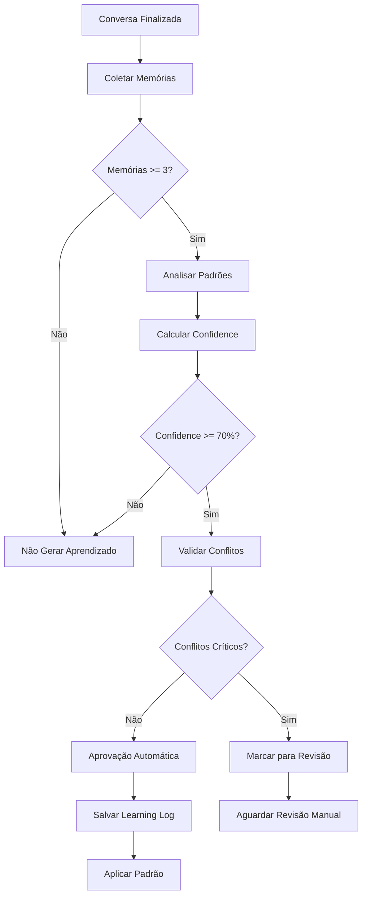

# 📊 CRITÉRIOS DE APRENDIZADO DO SICC - ANÁLISE COMPLETA

**Sistema de Inteligência Corporativa Contínua - Slim Quality**

---

## 🎯 VISÃO GERAL

O Sistema SICC (Sistema de Inteligência Corporativa Contínua) é responsável por identificar padrões comportamentais em conversas e gerar aprendizados automaticamente. Este documento detalha **exatamente quando uma conversa se torna um novo aprendizado** no sistema.

### **Objetivo do SICC:**
- Analisar conversas em tempo real
- Identificar padrões recorrentes de comportamento
- Gerar aprendizados automáticos para melhorar respostas
- Aplicar conhecimento adquirido em futuras interações

---

## 🔧 CONFIGURAÇÕES PRINCIPAIS

### **Parâmetros Críticos do Sistema:**

```python
# Configurações do LearningService
self.min_pattern_frequency = 3          # Mínimo de ocorrências para considerar padrão
self.min_confidence_threshold = 0.7     # Mínimo de confiança para aprovação automática  
self.analysis_window_days = 30          # Janela de análise em dias
self.max_patterns_per_analysis = 50     # Máximo de padrões por análise
```

### **Parâmetros do SupervisorService:**

```python
# Configurações de aprovação automática
self.default_threshold = 0.7            # Threshold padrão de aprovação
self.conflict_severity_threshold = 0.2  # Limite de severidade de conflitos
```

---

## 📋 CRITÉRIOS OBRIGATÓRIOS PARA APRENDIZADO

Para que uma conversa se torne um aprendizado, **TODOS** os critérios abaixo devem ser atendidos:

### **1. 🔢 FREQUÊNCIA MÍNIMA**
- **Requisito:** Mínimo **3 ocorrências** do mesmo padrão
- **Lógica:** `len(type_memories) >= self.min_pattern_frequency`
- **Exemplo:** Uma resposta sobre "dores nas costas" precisa aparecer pelo menos 3 vezes

### **2. 📊 CONFIDENCE SCORE**
- **Requisito:** Mínimo **70% de confiança**
- **Cálculo:** `confidence = min(0.9, len(type_memories) / 10.0)`
- **Exemplo:** 7 ocorrências = 70% confidence (aprovado)

### **3. ⏰ JANELA TEMPORAL**
- **Requisito:** Padrões dos **últimos 30 dias**
- **Lógica:** `cutoff_date = datetime.utcnow() - timedelta(days=30)`
- **Motivo:** Focar em comportamentos recentes e relevantes

### **4. 🎯 CONSISTÊNCIA**
- **Requisito:** Respostas similares entre si
- **Método:** Análise de palavras-chave e frases comuns
- **Validação:** Similaridade Jaccard entre conteúdos

### **5. ⚖️ AUSÊNCIA DE CONFLITOS**
- **Requisito:** Não conflitar com padrões existentes
- **Limite:** Similaridade < 70% com triggers existentes
- **Validação:** SupervisorService.validate_pattern_conflicts()

### **6. ✅ APROVAÇÃO AUTOMÁTICA**
- **Requisito:** Passar pela validação do SupervisorService
- **Método:** `auto_approve(confidence_score, threshold)`
- **Resultado:** `confidence_score >= threshold`

---

## 🔍 PROCESSO DETALHADO DE ANÁLISE

### **ETAPA 1: Coleta de Memórias**
```python
# Buscar memórias da conversa nos últimos X dias
memories = await self._get_conversation_memories(conversation_id, limit_days)

# Validação mínima
if len(memories) < self.min_pattern_frequency:
    return []  # Não há memórias suficientes
```

### **ETAPA 2: Categorização de Respostas**
O sistema identifica tipos de resposta:

| Tipo | Palavras-chave | Exemplo |
|------|----------------|---------|
| `question_response` | pergunta, questão, dúvida | "Sobre sua dúvida..." |
| `explanation` | explicação, explicar, como | "Vou explicar como funciona..." |
| `problem_solving` | problema, erro, falha | "Para resolver esse problema..." |
| `suggestion` | sugestão, recomendação, sugiro | "Sugiro que você..." |
| `confirmation` | confirmação, confirmar, ok | "Confirmado, pode prosseguir..." |
| `general_response` | Outros casos | Resposta geral |

### **ETAPA 3: Cálculo de Confidence**
```python
# Para cada tipo de resposta com frequência suficiente
for response_type, type_memories in response_types.items():
    if len(type_memories) >= self.min_pattern_frequency:
        # Calcular confiança baseada na frequência
        confidence = min(0.9, len(type_memories) / 10.0)
        
        # Criar padrão se confidence suficiente
        if confidence >= 0.3:  # Filtro mínimo
            pattern = Pattern(...)
```

### **ETAPA 4: Validação de Conflitos**
```python
# Verificar similaridade com padrões existentes
for existing in existing_patterns:
    similarity = self._calculate_similarity(new_trigger, existing_trigger)
    
    if similarity > 0.7:  # Conflito detectado
        conflict = ConflictDetail(
            type="trigger_similarity",
            severity=similarity,
            description="Trigger similar ao padrão existente"
        )
```

### **ETAPA 5: Aprovação Final**
```python
# SupervisorService decide aprovação
should_approve = await supervisor_service.auto_approve(
    confidence_score=pattern.confidence,
    threshold=0.7
)

if should_approve:
    # Criar learning_log
    learning_log = LearningLog(
        pattern_id=pattern.id,
        confidence_score=confidence_score,
        status="approved"
    )
```

---

## 📊 EXEMPLOS PRÁTICOS

### ✅ **CENÁRIO QUE VIRA APRENDIZADO**

**Situação:** Cliente pergunta sobre dores nas costas

**Dados coletados:**
- **Ocorrências:** 8 vezes nos últimos 20 dias
- **Confidence calculado:** 80% (8 ÷ 10)
- **Similaridade:** Respostas consistentes sobre colchão magnético
- **Conflitos:** Nenhum padrão similar existente

**Resultado:** ✅ **APROVADO AUTOMATICAMENTE**

```json
{
  "pattern_id": "pat_001",
  "pattern_type": "problem_solving",
  "trigger": "Cliente menciona dores nas costas",
  "action": "Recomendar colchão magnético com foco terapêutico",
  "confidence": 0.8,
  "frequency": 8,
  "status": "approved"
}
```

### ❌ **CENÁRIO QUE NÃO VIRA APRENDIZADO**

**Situação:** Cliente pergunta sobre entrega

**Dados coletados:**
- **Ocorrências:** 2 vezes nos últimos 10 dias
- **Confidence calculado:** 20% (2 ÷ 10)
- **Motivo da rejeição:** Frequência insuficiente (< 3) E confidence baixo (< 70%)

**Resultado:** ❌ **REJEITADO AUTOMATICAMENTE**

### ⚠️ **CENÁRIO QUE PRECISA REVISÃO MANUAL**

**Situação:** Cliente pergunta sobre preços

**Dados coletados:**
- **Ocorrências:** 6 vezes nos últimos 15 dias
- **Confidence calculado:** 60% (6 ÷ 10)
- **Conflito detectado:** Similaridade 75% com padrão existente sobre "valores"

**Resultado:** ⚠️ **NEEDS_REVIEW** (conflito crítico)

---

## 🗄️ ESTRUTURA DO BANCO DE DADOS

### **Tabela: `learning_logs`**
```sql
CREATE TABLE learning_logs (
    id UUID PRIMARY KEY DEFAULT gen_random_uuid(),
    pattern_id UUID NOT NULL,
    learning_type VARCHAR(50) NOT NULL,
    description TEXT NOT NULL,
    confidence_score FLOAT NOT NULL CHECK (confidence_score >= 0 AND confidence_score <= 1),
    evidence JSONB NOT NULL DEFAULT '[]',
    proposed_changes JSONB NOT NULL DEFAULT '{}',
    status VARCHAR(20) NOT NULL DEFAULT 'pending' CHECK (status IN ('pending', 'approved', 'rejected')),
    approval_reason TEXT,
    approved_by VARCHAR(50) DEFAULT 'supervisor_auto',
    approved_at TIMESTAMPTZ NULL,
    created_at TIMESTAMPTZ DEFAULT NOW(),
    updated_at TIMESTAMPTZ DEFAULT NOW()
);
```

### **Tabela: `behavior_patterns`**
```sql
CREATE TABLE behavior_patterns (
    id UUID PRIMARY KEY DEFAULT gen_random_uuid(),
    pattern_type VARCHAR(50) NOT NULL,
    trigger_condition TEXT NOT NULL,
    action_template TEXT NOT NULL,
    confidence_score FLOAT NOT NULL CHECK (confidence_score >= 0 AND confidence_score <= 1),
    usage_count INTEGER DEFAULT 0,
    success_rate FLOAT DEFAULT 0.0,
    metadata JSONB DEFAULT '{}',
    is_active BOOLEAN DEFAULT true,
    created_at TIMESTAMPTZ DEFAULT NOW(),
    updated_at TIMESTAMPTZ DEFAULT NOW()
);
```

### **Tabela: `memory_chunks`**
```sql
CREATE TABLE memory_chunks (
    id UUID PRIMARY KEY DEFAULT gen_random_uuid(),
    conversation_id UUID NOT NULL,
    content TEXT NOT NULL,
    embedding vector(384),
    metadata JSONB DEFAULT '{}',
    relevance_score FLOAT DEFAULT 0.0,
    created_at TIMESTAMPTZ DEFAULT NOW()
);
```

---

## 📈 QUERIES PARA MONITORAMENTO

### **1. Ver Aprendizados Recentes**
```sql
SELECT 
    id,
    learning_type,
    description,
    confidence_score,
    status,
    approved_by,
    created_at,
    approved_at
FROM learning_logs 
WHERE created_at >= NOW() - INTERVAL '7 days'
ORDER BY created_at DESC;
```

### **2. Padrões Mais Utilizados**
```sql
SELECT 
    id,
    pattern_type,
    trigger_condition,
    confidence_score,
    usage_count,
    success_rate,
    created_at
FROM behavior_patterns 
WHERE is_active = true
  AND confidence_score >= 0.7
ORDER BY usage_count DESC
LIMIT 10;
```

### **3. Métricas de Performance**
```sql
SELECT 
    metric_type,
    metric_value,
    measurement_date,
    metadata
FROM agent_performance_metrics 
WHERE metric_type IN (
    'patterns_identified_daily',
    'patterns_approved_daily',
    'patterns_rejected_daily',
    'patterns_applied_daily'
)
AND measurement_date >= CURRENT_DATE - INTERVAL '30 days'
ORDER BY measurement_date DESC, metric_type;
```

### **4. Análise de Confidence**
```sql
-- Distribuição de confidence scores
SELECT 
    CASE 
        WHEN confidence_score >= 0.9 THEN 'Muito Alto (90%+)'
        WHEN confidence_score >= 0.7 THEN 'Alto (70-89%)'
        WHEN confidence_score >= 0.5 THEN 'Médio (50-69%)'
        ELSE 'Baixo (<50%)'
    END as confidence_range,
    COUNT(*) as total_patterns,
    AVG(usage_count) as avg_usage
FROM behavior_patterns 
WHERE is_active = true
GROUP BY confidence_range
ORDER BY MIN(confidence_score) DESC;
```

---

## 🔧 CONFIGURAÇÕES AVANÇADAS

### **Ajustar Sensibilidade do Sistema:**

```python
# Para sistema mais conservador (menos aprendizados)
self.min_pattern_frequency = 5      # Aumentar para 5 ocorrências
self.min_confidence_threshold = 0.8 # Aumentar para 80%

# Para sistema mais liberal (mais aprendizados)
self.min_pattern_frequency = 2      # Diminuir para 2 ocorrências  
self.min_confidence_threshold = 0.6 # Diminuir para 60%
```

### **Ajustar Janela Temporal:**

```python
# Análise mais recente (últimos 15 dias)
self.analysis_window_days = 15

# Análise mais ampla (últimos 60 dias)
self.analysis_window_days = 60
```

---

## 🚨 TROUBLESHOOTING

### **Problema: Muitos aprendizados sendo criados**
**Solução:**
- Aumentar `min_pattern_frequency` para 4 ou 5
- Aumentar `min_confidence_threshold` para 0.8
- Diminuir `analysis_window_days` para 15

### **Problema: Poucos aprendizados sendo criados**
**Solução:**
- Diminuir `min_pattern_frequency` para 2
- Diminuir `min_confidence_threshold` para 0.6
- Aumentar `analysis_window_days` para 45

### **Problema: Conflitos frequentes**
**Solução:**
- Diminuir `conflict_severity_threshold` para 0.1
- Revisar padrões existentes para remover duplicatas
- Implementar merge automático de padrões similares

---

## 📊 MÉTRICAS DE SUCESSO

### **KPIs do Sistema de Aprendizado:**

| Métrica | Meta | Descrição |
|---------|------|-----------|
| **Taxa de Aprovação** | 70-80% | % de padrões aprovados automaticamente |
| **Confidence Médio** | > 0.75 | Confidence médio dos padrões aprovados |
| **Tempo de Análise** | < 5 min | Tempo para processar uma conversa |
| **Taxa de Conflitos** | < 10% | % de padrões com conflitos detectados |
| **Aplicação de Padrões** | > 60% | % de padrões efetivamente utilizados |

### **Monitoramento Contínuo:**
```sql
-- Dashboard de métricas diárias
SELECT 
    DATE(created_at) as data,
    COUNT(*) as total_aprendizados,
    COUNT(*) FILTER (WHERE status = 'approved') as aprovados,
    COUNT(*) FILTER (WHERE status = 'rejected') as rejeitados,
    AVG(confidence_score) as confidence_medio
FROM learning_logs 
WHERE created_at >= NOW() - INTERVAL '30 days'
GROUP BY DATE(created_at)
ORDER BY data DESC;
```

---

## 🔄 FLUXO COMPLETO DE APRENDIZADO



---

## 📚 REFERÊNCIAS TÉCNICAS

### **Arquivos Principais:**
- `agent/src/services/sicc/learning_service.py` - Lógica de aprendizado
- `agent/src/services/sicc/supervisor_service.py` - Aprovação automática
- `agent/src/services/sicc/sicc_service.py` - Orquestrador principal
- `agent/src/services/sicc/memory_service.py` - Gestão de memórias

### **Migrations Relacionadas:**
- `20251228174600_create_learning_logs.sql`
- `20251228174500_create_behavior_patterns.sql`
- `20251228174400_create_memory_chunks.sql`

### **Testes de Propriedade:**
- `agent/tests/test_supervisor_properties_simple.py`
- `agent/tests/test_supervisor_conflict_properties.py`

---

## 📞 SUPORTE

Para dúvidas sobre os critérios de aprendizado:

1. **Consultar logs:** `learning_logs` table no Supabase
2. **Verificar métricas:** `agent_performance_metrics` table
3. **Analisar padrões:** `behavior_patterns` table
4. **Revisar memórias:** `memory_chunks` table

**Documento atualizado em:** Janeiro 2025  
**Versão:** 1.0  
**Autor:** Sistema SICC - Slim Quality