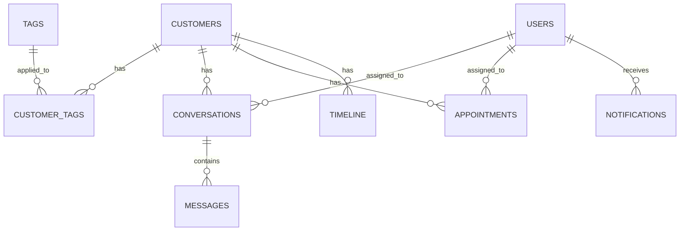

# SISTEMA CRM - DOCUMENTAÇÃO TÉCNICA COMPLETA

## 📋 Índice

1. [Arquitetura Geral](#1-arquitetura-geral)
2. [Database Schema](#2-database-schema)
3. [Serviços Backend](#3-serviços-backend)
4. [APIs REST](#4-apis-rest)
5. [Segurança](#5-segurança)
6. [Integração N8N](#6-integração-n8n)
7. [Testes](#7-testes)
8. [Deploy](#8-deploy)

---

## 1. Arquitetura Geral

### 1.1 Visão Geral do Sistema

O Sistema CRM (Customer Relationship Management) da Slim Quality é uma solução completa para gestão de relacionamento com clientes, integrada ao ecossistema de vendas e afiliados.

**Principais Funcionalidades:**
- Gestão completa de clientes
- Sistema de conversas multicanal
- Agendamento de compromissos
- Timeline automática de eventos
- Sistema de notificações
- Gestão de tags inteligentes
- Integração com N8N/BIA

### 1.2 Stack Tecnológica

**Backend:**
- Node.js 18+
- TypeScript 5.x
- Express.js 4.x
- Supabase (PostgreSQL + Auth)

**Banco de Dados:**
- PostgreSQL 15.x (via Supabase)
- Row Level Security (RLS)
- Migrations versionadas

**Testes:**
- Vitest (unit + integration)
- Cobertura > 80%

**Segurança:**
- JWT Authentication
- Role-based Access Control
- Input Validation (Zod)
- Rate Limiting

### 1.3 Estrutura de Pastas

```
src/
├── services/crm/              # Lógica de negócio
│   ├── customer.service.ts    # Gestão de clientes
│   ├── conversation.service.ts # Sistema de conversas
│   ├── appointment.service.ts  # Agendamentos
│   ├── timeline.service.ts    # Timeline de eventos
│   ├── notification.service.ts # Notificações
│   └── tag.service.ts         # Sistema de tags
│
├── api/
│   ├── controllers/           # Controllers REST
│   │   ├── customer.controller.ts
│   │   ├── conversation.controller.ts
│   │   ├── appointment.controller.ts
│   │   ├── admin.controller.ts
│   │   └── webhook.controller.ts
│   └── routes/               # Definição de rotas
│       ├── customer.routes.ts
│       ├── conversation.routes.ts
│       └── appointment.routes.ts
│
├── types/                    # TypeScript types
│   └── customer.types.ts
│
└── utils/                    # Utilitários
    ├── validators.ts
    └── logger.ts

supabase/
└── migrations/               # Database migrations
    ├── 20250125000010_create_crm_customers.sql
    ├── 20250125000011_create_crm_tags.sql
    ├── 20250125000012_create_crm_timeline.sql
    ├── 20250125000013_create_crm_conversations.sql
    └── 20250125000014_create_crm_appointments.sql

tests/
├── unit/                     # Testes unitários
│   └── services/
└── integration/              # Testes de integração
    └── api/
```

---

## 2. Database Schema

### 2.1 Tabelas Principais

#### 2.1.1 Customers (Clientes)
```sql
CREATE TABLE crm_customers (
  id UUID PRIMARY KEY DEFAULT gen_random_uuid(),
  name VARCHAR(255) NOT NULL,
  email VARCHAR(255) UNIQUE,
  phone VARCHAR(20),
  whatsapp VARCHAR(20),
  document VARCHAR(20),
  birth_date DATE,
  gender VARCHAR(10),
  address JSONB,
  preferences JSONB DEFAULT '{}',
  health_conditions TEXT[],
  source VARCHAR(50),
  referral_code VARCHAR(20),
  status VARCHAR(20) DEFAULT 'active',
  notes TEXT,
  created_at TIMESTAMPTZ DEFAULT NOW(),
  updated_at TIMESTAMPTZ DEFAULT NOW(),
  deleted_at TIMESTAMPTZ
);
```

#### 2.1.2 Tags (Sistema de Tags)
```sql
CREATE TABLE crm_tags (
  id UUID PRIMARY KEY DEFAULT gen_random_uuid(),
  name VARCHAR(100) NOT NULL UNIQUE,
  color VARCHAR(7) DEFAULT '#3B82F6',
  description TEXT,
  category VARCHAR(50),
  auto_apply_rules JSONB DEFAULT '[]',
  created_at TIMESTAMPTZ DEFAULT NOW()
);

CREATE TABLE crm_customer_tags (
  customer_id UUID REFERENCES crm_customers(id) ON DELETE CASCADE,
  tag_id UUID REFERENCES crm_tags(id) ON DELETE CASCADE,
  applied_at TIMESTAMPTZ DEFAULT NOW(),
  applied_by UUID REFERENCES auth.users(id),
  PRIMARY KEY (customer_id, tag_id)
);
```

#### 2.1.3 Conversations (Conversas)
```sql
CREATE TABLE crm_conversations (
  id UUID PRIMARY KEY DEFAULT gen_random_uuid(),
  customer_id UUID REFERENCES crm_customers(id) ON DELETE CASCADE,
  channel VARCHAR(20) NOT NULL,
  subject VARCHAR(255),
  status VARCHAR(20) DEFAULT 'open',
  priority VARCHAR(10) DEFAULT 'medium',
  assigned_to UUID REFERENCES auth.users(id),
  metadata JSONB DEFAULT '{}',
  created_at TIMESTAMPTZ DEFAULT NOW(),
  updated_at TIMESTAMPTZ DEFAULT NOW(),
  closed_at TIMESTAMPTZ
);

CREATE TABLE crm_messages (
  id UUID PRIMARY KEY DEFAULT gen_random_uuid(),
  conversation_id UUID REFERENCES crm_conversations(id) ON DELETE CASCADE,
  sender_type VARCHAR(10) NOT NULL,
  sender_id UUID,
  content TEXT NOT NULL,
  message_type VARCHAR(20) DEFAULT 'text',
  metadata JSONB DEFAULT '{}',
  created_at TIMESTAMPTZ DEFAULT NOW()
);
```

#### 2.1.4 Appointments (Agendamentos)
```sql
CREATE TABLE crm_appointments (
  id UUID PRIMARY KEY DEFAULT gen_random_uuid(),
  customer_id UUID REFERENCES crm_customers(id) ON DELETE CASCADE,
  assigned_to UUID REFERENCES auth.users(id),
  title VARCHAR(255) NOT NULL,
  description TEXT,
  appointment_type VARCHAR(50),
  scheduled_at TIMESTAMPTZ NOT NULL,
  duration_minutes INTEGER DEFAULT 60,
  status VARCHAR(20) DEFAULT 'scheduled',
  location VARCHAR(255),
  meeting_url VARCHAR(500),
  reminder_sent BOOLEAN DEFAULT FALSE,
  notes TEXT,
  created_at TIMESTAMPTZ DEFAULT NOW(),
  updated_at TIMESTAMPTZ DEFAULT NOW()
);
```

#### 2.1.5 Timeline (Linha do Tempo)
```sql
CREATE TABLE crm_timeline (
  id UUID PRIMARY KEY DEFAULT gen_random_uuid(),
  customer_id UUID REFERENCES crm_customers(id) ON DELETE CASCADE,
  event_type VARCHAR(50) NOT NULL,
  title VARCHAR(255) NOT NULL,
  description TEXT,
  metadata JSONB DEFAULT '{}',
  created_by UUID REFERENCES auth.users(id),
  created_at TIMESTAMPTZ DEFAULT NOW()
);
```

#### 2.1.6 Notifications (Notificações)
```sql
CREATE TABLE crm_notifications (
  id UUID PRIMARY KEY DEFAULT gen_random_uuid(),
  user_id UUID REFERENCES auth.users(id) ON DELETE CASCADE,
  type VARCHAR(50) NOT NULL,
  title VARCHAR(255) NOT NULL,
  message TEXT NOT NULL,
  data JSONB DEFAULT '{}',
  read BOOLEAN DEFAULT FALSE,
  created_at TIMESTAMPTZ DEFAULT NOW(),
  read_at TIMESTAMPTZ
);
```

### 2.2 Índices de Performance

```sql
-- Customers
CREATE INDEX idx_crm_customers_email ON crm_customers(email) WHERE deleted_at IS NULL;
CREATE INDEX idx_crm_customers_phone ON crm_customers(phone) WHERE deleted_at IS NULL;
CREATE INDEX idx_crm_customers_status ON crm_customers(status) WHERE deleted_at IS NULL;
CREATE INDEX idx_crm_customers_source ON crm_customers(source) WHERE deleted_at IS NULL;

-- Conversations
CREATE INDEX idx_crm_conversations_customer ON crm_conversations(customer_id);
CREATE INDEX idx_crm_conversations_status ON crm_conversations(status);
CREATE INDEX idx_crm_conversations_assigned ON crm_conversations(assigned_to);

-- Appointments
CREATE INDEX idx_crm_appointments_customer ON crm_appointments(customer_id);
CREATE INDEX idx_crm_appointments_scheduled ON crm_appointments(scheduled_at);
CREATE INDEX idx_crm_appointments_assigned ON crm_appointments(assigned_to);

-- Timeline
CREATE INDEX idx_crm_timeline_customer ON crm_timeline(customer_id);
CREATE INDEX idx_crm_timeline_created ON crm_timeline(created_at);
```

### 2.3 Relacionamentos



---

## 3. Serviços Backend

### 3.1 CustomerService

**Responsabilidades:**
- CRUD completo de clientes
- Busca avançada com filtros
- Gestão de tags
- Validação de dados

**Métodos Principais:**
```typescript
class CustomerService {
  // Busca com filtros avançados
  async findMany(filters: CustomerFilters): Promise<Customer[]>
  
  // Criar cliente com validação
  async create(data: CreateCustomerData): Promise<Customer>
  
  // Atualizar com merge inteligente
  async update(id: string, data: UpdateCustomerData): Promise<Customer>
  
  // Busca por email/telefone
  async findByContact(email?: string, phone?: string): Promise<Customer | null>
  
  // Gestão de tags
  async addTag(customerId: string, tagId: string): Promise<void>
  async removeTag(customerId: string, tagId: string): Promise<void>
  
  // Soft delete
  async delete(id: string): Promise<void>
}
```

### 3.2 ConversationService

**Responsabilidades:**
- Gestão de conversas multicanal
- Sistema de mensagens
- Atribuição automática
- Métricas de atendimento

**Métodos Principais:**
```typescript
class ConversationService {
  // Criar conversa com primeira mensagem
  async create(data: CreateConversationData): Promise<Conversation>
  
  // Adicionar mensagem
  async addMessage(conversationId: string, message: MessageData): Promise<Message>
  
  // Atribuir a usuário
  async assign(conversationId: string, userId: string): Promise<void>
  
  // Buscar conversas do usuário
  async findByUser(userId: string, filters?: ConversationFilters): Promise<Conversation[]>
  
  // Fechar conversa
  async close(conversationId: string, reason?: string): Promise<void>
  
  // Métricas de atendimento
  async getMetrics(filters: MetricsFilters): Promise<ConversationMetrics>
}
```

### 3.3 AppointmentService

**Responsabilidades:**
- Agendamento de compromissos
- Verificação de conflitos
- Sistema de lembretes
- Calendário de disponibilidade

**Métodos Principais:**
```typescript
class AppointmentService {
  // Criar agendamento com verificação de conflito
  async create(data: CreateAppointmentData): Promise<Appointment>
  
  // Verificar disponibilidade
  async checkAvailability(userId: string, date: Date, duration: number): Promise<boolean>
  
  // Buscar por período
  async findByDateRange(start: Date, end: Date, userId?: string): Promise<Appointment[]>
  
  // Reagendar
  async reschedule(id: string, newDate: Date): Promise<Appointment>
  
  // Cancelar
  async cancel(id: string, reason?: string): Promise<void>
  
  // Enviar lembretes
  async sendReminders(): Promise<void>
}
```

### 3.4 TimelineService

**Responsabilidades:**
- Registro automático de eventos
- Notas manuais
- Exportação de histórico
- Análise de jornada do cliente

**Métodos Principais:**
```typescript
class TimelineService {
  // Registrar evento automático
  async logEvent(customerId: string, event: TimelineEvent): Promise<void>
  
  // Adicionar nota manual
  async addNote(customerId: string, note: string, userId: string): Promise<TimelineEntry>
  
  // Buscar timeline do cliente
  async getCustomerTimeline(customerId: string, filters?: TimelineFilters): Promise<TimelineEntry[]>
  
  // Exportar histórico
  async exportTimeline(customerId: string, format: 'json' | 'csv'): Promise<string>
}
```

### 3.5 NotificationService

**Responsabilidades:**
- Notificações em tempo real
- Preferências do usuário
- Múltiplos canais de entrega
- Histórico de notificações

**Métodos Principais:**
```typescript
class NotificationService {
  // Enviar notificação
  async send(userId: string, notification: NotificationData): Promise<void>
  
  // Marcar como lida
  async markAsRead(notificationId: string): Promise<void>
  
  // Buscar não lidas
  async getUnread(userId: string): Promise<Notification[]>
  
  // Configurar preferências
  async updatePreferences(userId: string, preferences: NotificationPreferences): Promise<void>
}
```

### 3.6 TagService

**Responsabilidades:**
- Gestão de tags
- Aplicação automática por regras
- Estatísticas de uso
- Categorização inteligente

**Métodos Principais:**
```typescript
class TagService {
  // Criar tag com regras
  async create(data: CreateTagData): Promise<Tag>
  
  // Aplicar regras automáticas
  async applyAutoRules(customerId: string): Promise<string[]>
  
  // Estatísticas de uso
  async getUsageStats(): Promise<TagStats[]>
  
  // Sugerir tags
  async suggestTags(customerId: string): Promise<Tag[]>
}
```

---

## 4. APIs REST

### 4.1 Endpoints de Clientes

#### GET /api/customers
**Descrição:** Lista clientes com filtros avançados

**Query Parameters:**
```typescript
{
  page?: number;           // Página (default: 1)
  limit?: number;          // Itens por página (default: 20)
  search?: string;         // Busca por nome/email/telefone
  status?: string;         // Filtro por status
  source?: string;         // Filtro por origem
  tags?: string[];         // Filtro por tags
  created_after?: string;  // Data de criação (ISO)
  created_before?: string; // Data de criação (ISO)
}
```

**Response:**
```json
{
  "data": [
    {
      "id": "uuid",
      "name": "João Silva",
      "email": "joao@email.com",
      "phone": "+5511999999999",
      "whatsapp": "+5511999999999",
      "status": "active",
      "source": "website",
      "tags": [
        {
          "id": "uuid",
          "name": "VIP",
          "color": "#FFD700"
        }
      ],
      "created_at": "2025-01-25T10:00:00Z",
      "updated_at": "2025-01-25T10:00:00Z"
    }
  ],
  "pagination": {
    "page": 1,
    "limit": 20,
    "total": 150,
    "pages": 8
  }
}
```

#### POST /api/customers
**Descrição:** Criar novo cliente

**Request Body:**
```json
{
  "name": "João Silva",
  "email": "joao@email.com",
  "phone": "+5511999999999",
  "whatsapp": "+5511999999999",
  "document": "12345678901",
  "birth_date": "1990-01-15",
  "gender": "male",
  "address": {
    "street": "Rua das Flores, 123",
    "city": "São Paulo",
    "state": "SP",
    "zip_code": "01234-567"
  },
  "health_conditions": ["insônia", "dores nas costas"],
  "source": "website",
  "referral_code": "ABC123",
  "notes": "Cliente interessado em colchão magnético"
}
```

#### GET /api/customers/:id
**Descrição:** Buscar cliente por ID

**Response:**
```json
{
  "id": "uuid",
  "name": "João Silva",
  "email": "joao@email.com",
  "phone": "+5511999999999",
  "whatsapp": "+5511999999999",
  "document": "12345678901",
  "birth_date": "1990-01-15",
  "gender": "male",
  "address": {
    "street": "Rua das Flores, 123",
    "city": "São Paulo",
    "state": "SP",
    "zip_code": "01234-567"
  },
  "preferences": {
    "contact_method": "whatsapp",
    "best_time": "morning"
  },
  "health_conditions": ["insônia", "dores nas costas"],
  "source": "website",
  "referral_code": "ABC123",
  "status": "active",
  "notes": "Cliente interessado em colchão magnético",
  "tags": [],
  "created_at": "2025-01-25T10:00:00Z",
  "updated_at": "2025-01-25T10:00:00Z"
}
```

#### PUT /api/customers/:id
**Descrição:** Atualizar cliente

**Request Body:** (campos opcionais)
```json
{
  "name": "João Silva Santos",
  "preferences": {
    "contact_method": "email",
    "best_time": "afternoon"
  },
  "notes": "Cliente comprou colchão Queen"
}
```

#### DELETE /api/customers/:id
**Descrição:** Excluir cliente (soft delete)

**Response:**
```json
{
  "message": "Cliente excluído com sucesso"
}
```

### 4.2 Endpoints de Conversas

#### GET /api/conversations
**Descrição:** Lista conversas do usuário

**Query Parameters:**
```typescript
{
  status?: 'open' | 'closed' | 'pending';
  channel?: 'whatsapp' | 'email' | 'phone' | 'chat' | 'sms';
  priority?: 'low' | 'medium' | 'high' | 'urgent';
  assigned_to?: string;  // User ID
  customer_id?: string;
  page?: number;
  limit?: number;
}
```

#### POST /api/conversations
**Descrição:** Criar nova conversa

**Request Body:**
```json
{
  "customer_id": "uuid",
  "channel": "whatsapp",
  "subject": "Dúvida sobre produto",
  "priority": "medium",
  "initial_message": {
    "content": "Olá, tenho interesse no colchão magnético",
    "sender_type": "customer"
  }
}
```

#### POST /api/conversations/:id/messages
**Descrição:** Adicionar mensagem à conversa

**Request Body:**
```json
{
  "content": "Obrigado pelo contato! Como posso ajudar?",
  "sender_type": "agent",
  "message_type": "text"
}
```

#### PUT /api/conversations/:id/assign
**Descrição:** Atribuir conversa a usuário

**Request Body:**
```json
{
  "user_id": "uuid"
}
```

### 4.3 Endpoints de Agendamentos

#### GET /api/appointments
**Descrição:** Lista agendamentos

**Query Parameters:**
```typescript
{
  start_date?: string;     // ISO date
  end_date?: string;       // ISO date
  assigned_to?: string;    // User ID
  customer_id?: string;
  status?: 'scheduled' | 'completed' | 'cancelled' | 'no_show';
  type?: string;
}
```

#### POST /api/appointments
**Descrição:** Criar agendamento

**Request Body:**
```json
{
  "customer_id": "uuid",
  "assigned_to": "uuid",
  "title": "Consulta sobre colchão magnético",
  "description": "Primeira consulta para entender necessidades",
  "appointment_type": "consultation",
  "scheduled_at": "2025-01-26T14:00:00Z",
  "duration_minutes": 60,
  "location": "Escritório SP",
  "meeting_url": "https://meet.google.com/abc-def-ghi"
}
```

#### GET /api/appointments/availability
**Descrição:** Verificar disponibilidade

**Query Parameters:**
```typescript
{
  user_id: string;
  date: string;        // ISO date
  duration: number;    // minutes
}
```

**Response:**
```json
{
  "available": true,
  "conflicts": []
}
```

### 4.4 Endpoints Administrativos

#### GET /api/admin/dashboard
**Descrição:** Métricas do dashboard

**Response:**
```json
{
  "customers": {
    "total": 1250,
    "new_this_month": 85,
    "active": 1180
  },
  "conversations": {
    "open": 23,
    "pending": 8,
    "avg_response_time": "2h 15m"
  },
  "appointments": {
    "today": 12,
    "this_week": 45,
    "completion_rate": 0.92
  }
}
```

#### GET /api/admin/reports/customers
**Descrição:** Relatório de clientes

**Query Parameters:**
```typescript
{
  period?: 'week' | 'month' | 'quarter' | 'year';
  start_date?: string;
  end_date?: string;
  format?: 'json' | 'csv';
}
```

### 4.5 Webhook Endpoints

#### POST /api/webhook/n8n
**Descrição:** Receber dados do N8N/BIA

**Headers:**
```
X-N8N-Signature: sha256=...
Content-Type: application/json
```

**Request Body:**
```json
{
  "type": "customer_interaction",
  "customer": {
    "name": "Maria Santos",
    "phone": "+5511888888888",
    "email": "maria@email.com"
  },
  "conversation": {
    "channel": "whatsapp",
    "messages": [
      {
        "content": "Tenho interesse no colchão",
        "timestamp": "2025-01-25T10:00:00Z",
        "sender": "customer"
      }
    ]
  },
  "metadata": {
    "source": "landing_page",
    "utm_campaign": "google_ads"
  }
}
```

---

## 5. Segurança

### 5.1 Autenticação JWT

**Implementação:**
- Tokens JWT via Supabase Auth
- Refresh tokens automáticos
- Expiração configurável (24h)

**Middleware de Autenticação:**
```typescript
export const authenticateToken = async (req: Request, res: Response, next: NextFunction) => {
  const token = req.headers.authorization?.replace('Bearer ', '');
  
  if (!token) {
    return res.status(401).json({ error: 'Token não fornecido' });
  }
  
  try {
    const { data: { user }, error } = await supabase.auth.getUser(token);
    
    if (error || !user) {
      return res.status(401).json({ error: 'Token inválido' });
    }
    
    req.user = user;
    next();
  } catch (error) {
    return res.status(401).json({ error: 'Erro na autenticação' });
  }
};
```

### 5.2 Autorização por Roles

**Roles Disponíveis:**
- `admin` - Acesso total
- `manager` - Gestão de equipe e relatórios
- `agent` - Atendimento e CRM básico
- `viewer` - Apenas visualização

**Middleware de Autorização:**
```typescript
export const requireRole = (roles: string[]) => {
  return async (req: Request, res: Response, next: NextFunction) => {
    const userRole = await getUserRole(req.user.id);
    
    if (!roles.includes(userRole)) {
      return res.status(403).json({ error: 'Acesso negado' });
    }
    
    next();
  };
};
```

### 5.3 Validação de Entrada

**Usando Zod para validação:**
```typescript
const CreateCustomerSchema = z.object({
  name: z.string().min(2).max(255),
  email: z.string().email().optional(),
  phone: z.string().regex(/^\+?[1-9]\d{1,14}$/).optional(),
  document: z.string().min(11).max(14).optional(),
  birth_date: z.string().date().optional(),
  gender: z.enum(['male', 'female', 'other']).optional(),
  health_conditions: z.array(z.string()).optional(),
  source: z.string().max(50).optional()
});

// Uso no controller
const result = CreateCustomerSchema.safeParse(req.body);
if (!result.success) {
  return res.status(400).json({ 
    error: 'Dados inválidos',
    details: result.error.issues 
  });
}
```

### 5.4 Rate Limiting

**Configuração por endpoint:**
```typescript
import rateLimit from 'express-rate-limit';

// Rate limit geral
const generalLimiter = rateLimit({
  windowMs: 15 * 60 * 1000, // 15 minutos
  max: 100, // 100 requests por IP
  message: 'Muitas requisições. Tente novamente em 15 minutos.'
});

// Rate limit para webhooks
const webhookLimiter = rateLimit({
  windowMs: 1 * 60 * 1000, // 1 minuto
  max: 10, // 10 requests por minuto
  message: 'Rate limit excedido para webhooks'
});

app.use('/api/', generalLimiter);
app.use('/api/webhook/', webhookLimiter);
```

### 5.5 Row Level Security (RLS)

**Políticas implementadas:**

```sql
-- Clientes: usuários veem apenas clientes atribuídos ou todos (se admin)
CREATE POLICY "Users can view assigned customers"
  ON crm_customers FOR SELECT
  USING (
    auth.uid() IN (
      SELECT user_id FROM user_roles WHERE role IN ('admin', 'manager')
    ) OR
    id IN (
      SELECT customer_id FROM crm_conversations WHERE assigned_to = auth.uid()
    )
  );

-- Conversas: agentes veem apenas conversas atribuídas
CREATE POLICY "Agents view assigned conversations"
  ON crm_conversations FOR SELECT
  USING (
    assigned_to = auth.uid() OR
    auth.uid() IN (
      SELECT user_id FROM user_roles WHERE role IN ('admin', 'manager')
    )
  );
```

### 5.6 Segurança de Webhooks

**Validação de assinatura N8N:**
```typescript
const validateN8NSignature = (payload: string, signature: string): boolean => {
  const expectedSignature = crypto
    .createHmac('sha256', process.env.N8N_WEBHOOK_SECRET!)
    .update(payload)
    .digest('hex');
    
  return `sha256=${expectedSignature}` === signature;
};
```

---

## 6. Integração N8N

### 6.1 Visão Geral

O sistema CRM integra com N8N (BIA - Bot Inteligente de Atendimento) para:
- Receber interações de clientes
- Criar/atualizar registros automaticamente
- Sincronizar conversas multicanal
- Processar leads qualificados

### 6.2 Webhook Endpoint

**URL:** `POST /api/webhook/n8n`

**Autenticação:** Assinatura HMAC SHA-256

**Headers Obrigatórios:**
```
X-N8N-Signature: sha256=<hash>
Content-Type: application/json
```

### 6.3 Tipos de Payload

#### 6.3.1 Interação de Cliente
```json
{
  "type": "customer_interaction",
  "timestamp": "2025-01-25T10:00:00Z",
  "customer": {
    "name": "João Silva",
    "phone": "+5511999999999",
    "email": "joao@email.com",
    "whatsapp": "+5511999999999"
  },
  "conversation": {
    "channel": "whatsapp",
    "subject": "Interesse em colchão magnético",
    "messages": [
      {
        "content": "Olá, tenho interesse no colchão magnético",
        "timestamp": "2025-01-25T10:00:00Z",
        "sender": "customer",
        "message_type": "text"
      },
      {
        "content": "Olá! Que bom que tem interesse. Qual seu principal problema de saúde?",
        "timestamp": "2025-01-25T10:01:00Z",
        "sender": "bot",
        "message_type": "text"
      }
    ]
  },
  "metadata": {
    "source": "landing_page",
    "utm_campaign": "google_ads",
    "utm_source": "google",
    "referral_code": "ABC123",
    "session_id": "sess_123456"
  }
}
```

#### 6.3.2 Lead Qualificado
```json
{
  "type": "qualified_lead",
  "timestamp": "2025-01-25T10:30:00Z",
  "customer": {
    "name": "Maria Santos",
    "phone": "+5511888888888",
    "email": "maria@email.com",
    "health_conditions": ["insônia", "dores nas costas"],
    "preferences": {
      "contact_method": "whatsapp",
      "best_time": "morning"
    }
  },
  "qualification": {
    "score": 85,
    "interest_level": "high",
    "budget_range": "3000-4000",
    "urgency": "medium",
    "recommended_product": "colchao_queen"
  },
  "conversation_summary": "Cliente com insônia há 2 anos, já tentou outros tratamentos. Orçamento de R$ 3.500. Prefere contato pela manhã.",
  "next_action": "schedule_consultation"
}
```

#### 6.3.3 Agendamento Solicitado
```json
{
  "type": "appointment_request",
  "timestamp": "2025-01-25T11:00:00Z",
  "customer": {
    "phone": "+5511777777777",
    "name": "Carlos Oliveira"
  },
  "appointment": {
    "type": "consultation",
    "preferred_date": "2025-01-26",
    "preferred_time": "14:00",
    "duration_minutes": 60,
    "notes": "Cliente quer saber mais sobre tecnologia magnética"
  }
}
```

### 6.4 Processamento Automático

**Fluxo de Processamento:**

1. **Validação de Assinatura**
   - Verificar header `X-N8N-Signature`
   - Validar HMAC SHA-256

2. **Identificação/Criação de Cliente**
   - Buscar por telefone ou email
   - Criar novo se não existir
   - Atualizar dados se existir

3. **Processamento por Tipo**
   - `customer_interaction`: Criar/atualizar conversa
   - `qualified_lead`: Aplicar tags, criar timeline
   - `appointment_request`: Criar agendamento

4. **Notificações**
   - Notificar agentes sobre novos leads
   - Alertar sobre agendamentos solicitados

### 6.5 Configuração N8N

**Variáveis de Ambiente:**
```bash
# Webhook
N8N_WEBHOOK_SECRET=sua-chave-secreta-aqui
N8N_WEBHOOK_URL=https://api.slimquality.com.br/api/webhook/n8n

# Autenticação (se N8N precisar chamar APIs)
SUPABASE_SERVICE_KEY=sua-service-key-aqui
```

**Exemplo de Workflow N8N:**
```json
{
  "nodes": [
    {
      "name": "WhatsApp Trigger",
      "type": "n8n-nodes-base.webhook",
      "parameters": {
        "path": "whatsapp-message"
      }
    },
    {
      "name": "Process Message",
      "type": "n8n-nodes-base.function",
      "parameters": {
        "functionCode": "// Processar mensagem do WhatsApp\nconst message = items[0].json;\nreturn [{\n  json: {\n    type: 'customer_interaction',\n    customer: {\n      name: message.contact.name,\n      phone: message.from,\n      whatsapp: message.from\n    },\n    conversation: {\n      channel: 'whatsapp',\n      messages: [{\n        content: message.body,\n        sender: 'customer',\n        timestamp: new Date().toISOString()\n      }]\n    }\n  }\n}];"
      }
    },
    {
      "name": "Send to CRM",
      "type": "n8n-nodes-base.httpRequest",
      "parameters": {
        "url": "https://api.slimquality.com.br/api/webhook/n8n",
        "method": "POST",
        "headers": {
          "X-N8N-Signature": "={{ $crypto.createHmac('sha256', 'SECRET').update($json).digest('hex') }}"
        }
      }
    }
  ]
}
```

---

## 7. Testes

### 7.1 Estrutura de Testes

**Tipos de Teste:**
- **Unit Tests:** Testam serviços isoladamente
- **Integration Tests:** Testam APIs completas
- **Database Tests:** Testam migrations e integridade

**Cobertura Atual:** > 80%

### 7.2 Executar Testes

```bash
# Todos os testes
npm run test

# Apenas unit tests
npm run test:unit

# Apenas integration tests
npm run test:integration

# Com cobertura
npm run test:coverage

# Watch mode (desenvolvimento)
npm run test:watch
```

### 7.3 Configuração de Teste

**Arquivo:** `vitest.config.ts`
```typescript
import { defineConfig } from 'vitest/config';

export default defineConfig({
  test: {
    environment: 'node',
    globals: true,
    coverage: {
      provider: 'v8',
      reporter: ['text', 'json', 'html'],
      exclude: [
        'node_modules/',
        'dist/',
        'tests/',
        '**/*.d.ts'
      ]
    }
  }
});
```

### 7.4 Exemplos de Testes

#### 7.4.1 Teste Unitário (CustomerService)
```typescript
import { describe, it, expect, beforeEach, vi } from 'vitest';
import { CustomerService } from '@/services/crm/customer.service';

describe('CustomerService', () => {
  let customerService: CustomerService;

  beforeEach(() => {
    customerService = new CustomerService();
  });

  describe('create', () => {
    it('deve criar cliente com dados válidos', async () => {
      const customerData = {
        name: 'João Silva',
        email: 'joao@email.com',
        phone: '+5511999999999'
      };

      const result = await customerService.create(customerData);

      expect(result).toMatchObject({
        name: 'João Silva',
        email: 'joao@email.com',
        phone: '+5511999999999',
        status: 'active'
      });
      expect(result.id).toBeDefined();
      expect(result.created_at).toBeDefined();
    });

    it('deve rejeitar email inválido', async () => {
      const customerData = {
        name: 'João Silva',
        email: 'email-invalido',
        phone: '+5511999999999'
      };

      await expect(customerService.create(customerData))
        .rejects.toThrow('Email inválido');
    });
  });
});
```

#### 7.4.2 Teste de Integração (API)
```typescript
import { describe, it, expect, beforeAll, afterAll } from 'vitest';
import request from 'supertest';
import { app } from '@/app';
import { createTestUser, getAuthToken } from '@/tests/helpers';

describe('Customer API', () => {
  let authToken: string;

  beforeAll(async () => {
    const user = await createTestUser();
    authToken = await getAuthToken(user.id);
  });

  describe('POST /api/customers', () => {
    it('deve criar cliente com sucesso', async () => {
      const customerData = {
        name: 'João Silva',
        email: 'joao@test.com',
        phone: '+5511999999999'
      };

      const response = await request(app)
        .post('/api/customers')
        .set('Authorization', `Bearer ${authToken}`)
        .send(customerData)
        .expect(201);

      expect(response.body).toMatchObject({
        name: 'João Silva',
        email: 'joao@test.com',
        phone: '+5511999999999',
        status: 'active'
      });
    });

    it('deve retornar 400 para dados inválidos', async () => {
      const invalidData = {
        name: 'A', // muito curto
        email: 'email-invalido'
      };

      await request(app)
        .post('/api/customers')
        .set('Authorization', `Bearer ${authToken}`)
        .send(invalidData)
        .expect(400);
    });
  });
});
```

### 7.5 Helpers de Teste

**Arquivo:** `tests/helpers/index.ts`
```typescript
import { supabase } from '@/config/database';

export const createTestUser = async () => {
  const { data, error } = await supabase.auth.signUp({
    email: `test-${Date.now()}@test.com`,
    password: 'test123456'
  });
  
  if (error) throw error;
  return data.user!;
};

export const getAuthToken = async (userId: string) => {
  const { data, error } = await supabase.auth.admin.generateLink({
    type: 'magiclink',
    email: `user-${userId}@test.com`
  });
  
  if (error) throw error;
  return data.properties.access_token;
};

export const cleanupTestData = async () => {
  // Limpar dados de teste após execução
  await supabase.from('crm_customers').delete().like('email', '%@test.com');
};
```

---

## 8. Deploy

### 8.1 Pré-requisitos

**Infraestrutura:**
- Supabase Project configurado
- Variáveis de ambiente definidas
- Node.js 18+ no servidor
- PostgreSQL 15+ (via Supabase)

### 8.2 Variáveis de Ambiente

**Arquivo:** `.env.production`
```bash
# Supabase
SUPABASE_URL=https://seu-projeto.supabase.co
SUPABASE_ANON_KEY=sua-chave-publica
SUPABASE_SERVICE_KEY=sua-chave-privada

# N8N Integration
N8N_WEBHOOK_SECRET=sua-chave-secreta-webhook
N8N_API_URL=https://n8n.slimquality.com.br

# App Configuration
NODE_ENV=production
PORT=3000
API_BASE_URL=https://api.slimquality.com.br

# Security
JWT_SECRET=sua-chave-jwt-super-secreta
RATE_LIMIT_WINDOW_MS=900000
RATE_LIMIT_MAX_REQUESTS=100

# Logging
LOG_LEVEL=info
LOG_FORMAT=json
```

### 8.3 Scripts de Deploy

**Arquivo:** `package.json`
```json
{
  "scripts": {
    "build": "tsc",
    "start": "node dist/server.js",
    "deploy:migrations": "supabase db push --linked",
    "deploy:functions": "supabase functions deploy --no-verify-jwt",
    "deploy:full": "npm run build && npm run deploy:migrations && npm start"
  }
}
```

### 8.4 Migrations de Banco

**Executar migrations:**
```bash
# Conectar ao projeto Supabase
supabase link --project-ref seu-projeto-id

# Aplicar migrations
supabase db push

# Verificar status
supabase db diff
```

### 8.5 Dockerfile (Opcional)

```dockerfile
FROM node:18-alpine

WORKDIR /app

# Copiar package files
COPY package*.json ./
RUN npm ci --only=production

# Copiar código
COPY dist/ ./dist/
COPY .env.production ./.env

EXPOSE 3000

CMD ["npm", "start"]
```

### 8.6 Health Check

**Endpoint:** `GET /api/health`

**Response:**
```json
{
  "status": "healthy",
  "timestamp": "2025-01-25T10:00:00Z",
  "version": "1.0.0",
  "services": {
    "database": "connected",
    "supabase": "connected",
    "n8n": "connected"
  },
  "uptime": "2d 5h 30m"
}
```

### 8.7 Monitoramento

**Métricas Importantes:**
- Response time das APIs
- Taxa de erro (< 1%)
- Uso de memória
- Conexões de banco
- Rate limit hits

**Logs Estruturados:**
```json
{
  "timestamp": "2025-01-25T10:00:00Z",
  "level": "info",
  "service": "crm-api",
  "module": "CustomerService",
  "action": "create_customer",
  "customer_id": "uuid",
  "duration_ms": 150,
  "success": true
}
```

### 8.8 Backup e Recovery

**Backup Automático (Supabase):**
- Backups diários automáticos
- Retenção de 7 dias (plano gratuito)
- Point-in-time recovery disponível

**Backup Manual:**
```bash
# Exportar schema
supabase db dump --schema-only > schema.sql

# Exportar dados
supabase db dump --data-only > data.sql

# Backup completo
supabase db dump > backup_completo.sql
```

---

## 📞 Suporte e Contato

**Documentação Técnica:** Este documento  
**Repositório:** [GitHub - Slim Quality Backend]  
**Ambiente de Desenvolvimento:** Supabase Dashboard  
**Monitoramento:** [URL do monitoramento]  

**Equipe Técnica:**
- **Backend:** Kiro AI + Equipe de Desenvolvimento
- **DevOps:** [Nome do responsável]
- **QA:** [Nome do responsável]

---

**Última Atualização:** 25 de Janeiro de 2025  
**Versão:** 1.0.0  
**Status:** Produção